# PWA Push Notifications - Implementation Plan

> **Project:** arijitk.in (Astro 6.4.2 blog on GitHub Pages)
> **Stack:** Astro + Supabase (REST API) + @vite-pwa/astro + GitHub Actions
> **Goal:** When a new blog post is deployed, subscribed users receive a native push notification.

---

## Table of Contents

1. [Architecture Overview](#1-architecture-overview)
2. [Flow Diagrams](#2-flow-diagrams)
3. [Supabase Schema & Functions](#3-supabase-schema--functions)
4. [Service Worker (injectManifest)](#4-service-worker-injectmanifest)
5. [Client-Side Components](#5-client-side-components)
6. [Supabase Edge Function](#6-supabase-edge-function)
7. [GitHub Actions Pipeline](#7-github-actions-pipeline)
8. [Environment Variables & Secrets](#8-environment-variables--secrets)
9. [File Change Summary](#9-file-change-summary)
10. [Implementation Order](#10-implementation-order)
11. [Risks & Edge Cases](#11-risks--edge-cases)

---

## 1. Architecture Overview

The system has **four actors**: the user's browser, the Supabase backend, the GitHub Actions CI/CD pipeline, and the browser's push service (e.g., Firebase Cloud Messaging for Chrome, Mozilla Push Service for Firefox).

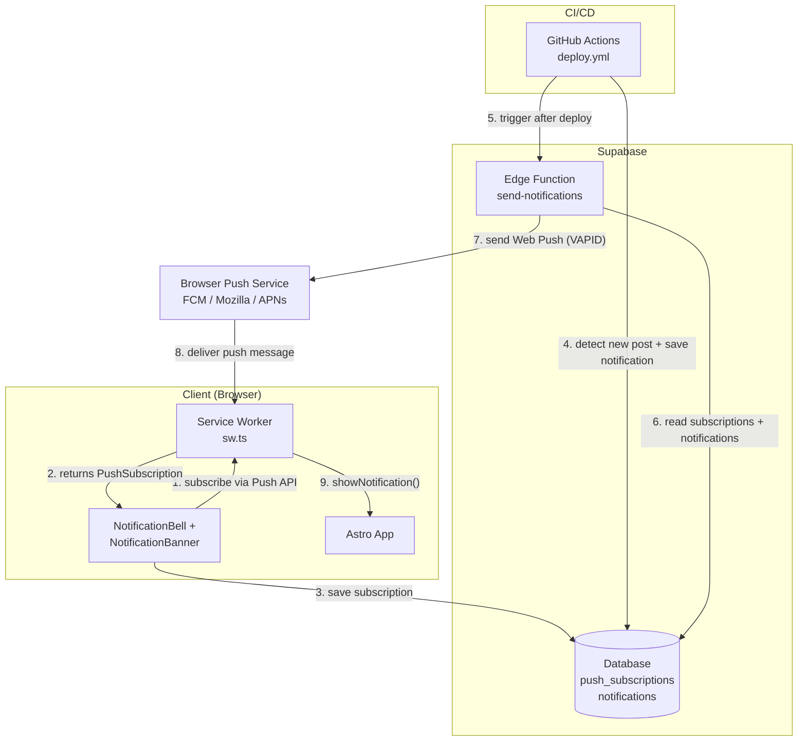

---

## 2. Flow Diagrams

### 2.1 User Subscription Flow

This happens when a user clicks the bell icon or the "Enable" button on the first-visit banner.

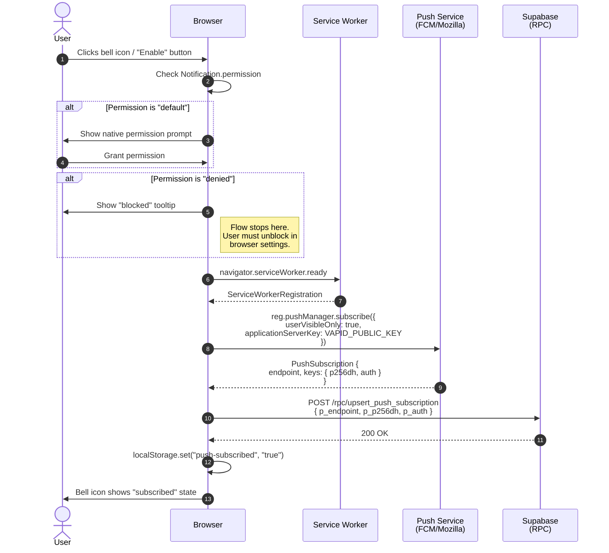

### 2.2 User Unsubscribe Flow

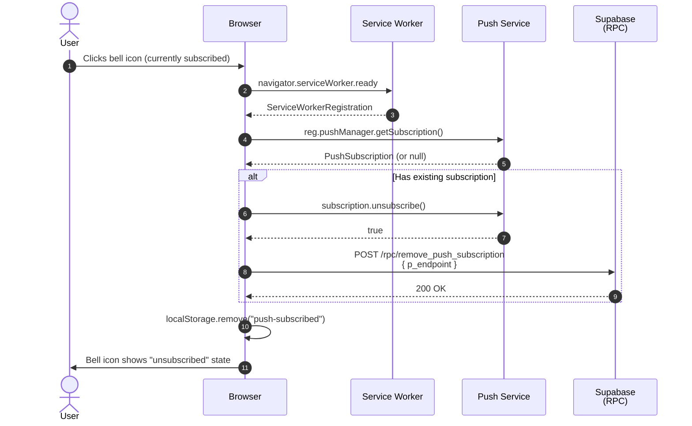

### 2.3 Deploy Pipeline Flow (New Post Detection + Notification)

This is the CI/CD pipeline that runs on every push to `master`.

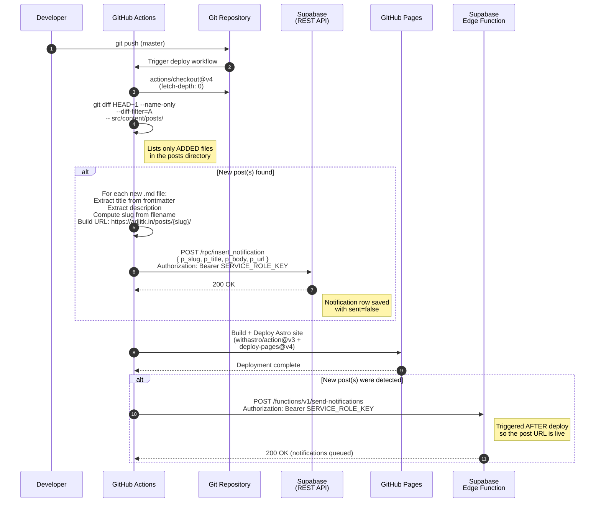

### 2.4 Edge Function: Send Notifications Flow

This is what happens inside the `send-notifications` Supabase Edge Function.

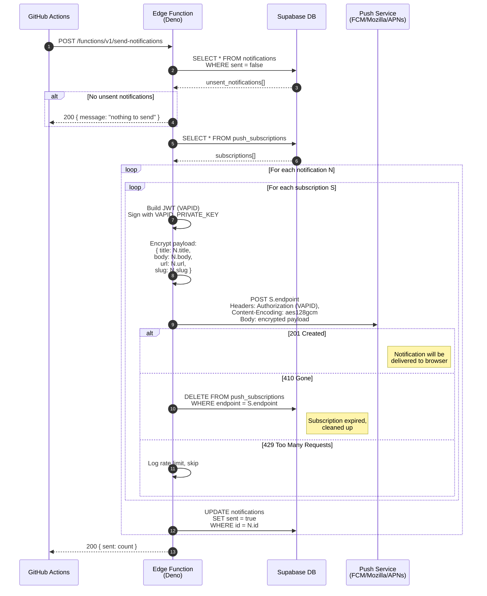

### 2.5 Push Delivery to User Flow

This is the final leg -- the push message arriving at the user's browser.

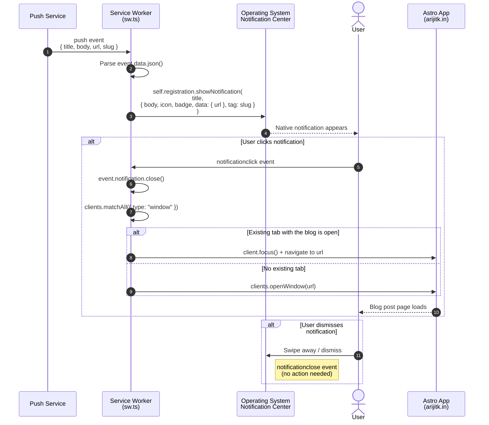

### 2.6 Complete End-to-End Flow

The full lifecycle from writing a post to a user reading it via notification.

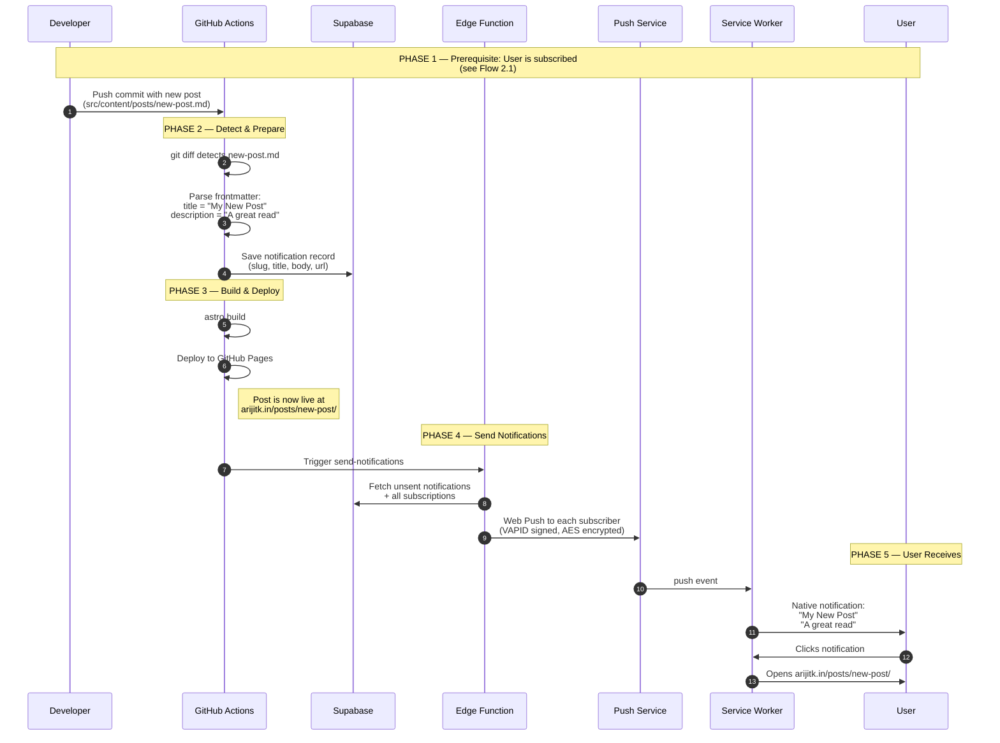

---

## 3. Supabase Schema & Functions

### 3.1 Tables

#### `push_subscriptions`

Stores each browser's push subscription data. One row per subscribed browser.

| Column | Type | Constraints | Description |
|--------|------|-------------|-------------|
| `id` | `uuid` | PK, default `gen_random_uuid()` | Unique subscription ID |
| `endpoint` | `text` | UNIQUE, NOT NULL | Push service URL (e.g., `https://fcm.googleapis.com/...`) |
| `p256dh` | `text` | NOT NULL | Client public key for payload encryption |
| `auth` | `text` | NOT NULL | Client auth secret for payload encryption |
| `created_at` | `timestamptz` | default `now()` | When the subscription was created |

#### `notifications`

Stores pending and sent notification payloads. One row per new blog post notification.

| Column | Type | Constraints | Description |
|--------|------|-------------|-------------|
| `id` | `uuid` | PK, default `gen_random_uuid()` | Unique notification ID |
| `slug` | `text` | NOT NULL | Post slug (e.g., `my-new-post`) |
| `title` | `text` | NOT NULL | Notification title (from post frontmatter) |
| `body` | `text` | NOT NULL | Notification body (post description) |
| `url` | `text` | NOT NULL | Full URL to the post |
| `sent` | `boolean` | default `false` | Whether the notification has been sent |
| `created_at` | `timestamptz` | default `now()` | When the record was created |

### 3.2 Row Level Security (RLS)

```sql
-- push_subscriptions: public can insert (subscribe) and delete (unsubscribe)
ALTER TABLE push_subscriptions ENABLE ROW LEVEL SECURITY;
CREATE POLICY "Anyone can subscribe"
  ON push_subscriptions FOR INSERT WITH CHECK (true);
CREATE POLICY "Anyone can delete own subscription"
  ON push_subscriptions FOR DELETE USING (true);

-- notifications: only service_role can read/write (no public policies)
ALTER TABLE notifications ENABLE ROW LEVEL SECURITY;
-- (No policies = locked to service_role key only)
```

### 3.3 RPC Functions

Three server-side functions callable via Supabase REST API:

```sql
-- 1. Upsert a push subscription (called by client on subscribe)
CREATE OR REPLACE FUNCTION upsert_push_subscription(
  p_endpoint text,
  p_p256dh text,
  p_auth text
) RETURNS void
LANGUAGE plpgsql SECURITY DEFINER AS $$
BEGIN
  INSERT INTO push_subscriptions (endpoint, p256dh, auth)
  VALUES (p_endpoint, p_p256dh, p_auth)
  ON CONFLICT (endpoint) DO UPDATE
    SET p256dh = EXCLUDED.p256dh,
        auth   = EXCLUDED.auth;
END;
$$;

-- 2. Remove a push subscription (called by client on unsubscribe)
CREATE OR REPLACE FUNCTION remove_push_subscription(
  p_endpoint text
) RETURNS void
LANGUAGE plpgsql SECURITY DEFINER AS $$
BEGIN
  DELETE FROM push_subscriptions WHERE endpoint = p_endpoint;
END;
$$;

-- 3. Insert a notification record (called by CI pipeline)
CREATE OR REPLACE FUNCTION insert_notification(
  p_slug text,
  p_title text,
  p_body text,
  p_url text
) RETURNS void
LANGUAGE plpgsql SECURITY DEFINER AS $$
BEGIN
  INSERT INTO notifications (slug, title, body, url)
  VALUES (p_slug, p_title, p_body, p_url);
END;
$$;
```

### 3.4 Entity Relationship

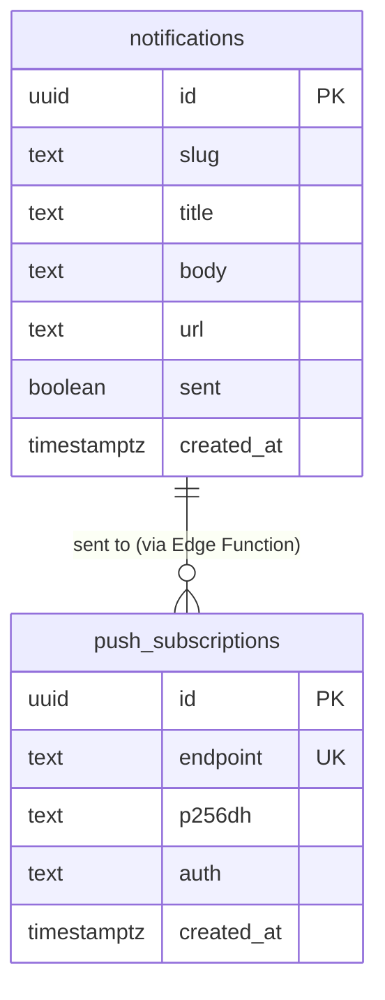

---

## 4. Service Worker (injectManifest)

### 4.1 Why Switch from `generateSW` to `injectManifest`

The current setup uses `generateSW`, where Workbox auto-generates the entire service worker. This approach does not allow custom event listeners (like `push` and `notificationclick`). Switching to `injectManifest` means:

- We write our own service worker file (`src/sw.ts`)
- Workbox injects the precache manifest into it at build time
- We have full control to add push notification handlers
- We manually configure runtime caching strategies (same as before, just in code)

### 4.2 `astro.config.mjs` Changes

Current (generateSW):
```js
AstroPWA({
  registerType: "autoUpdate",
  workbox: {
    skipWaiting: true,
    clientsClaim: true,
    cleanupOutdatedCaches: true,
    navigationPreload: true,
    navigateFallback: null,
    globPatterns: ["**/*.{css,js,svg,png,ico,txt,xml}"],
    additionalManifestEntries: [
      { url: "/offline", revision: commitHash },
    ],
    runtimeCaching: [ /* ... */ ],
  },
})
```

New (injectManifest):
```js
AstroPWA({
  registerType: "autoUpdate",
  strategies: "injectManifest",
  srcDir: "src",
  filename: "sw.ts",
  injectManifest: {
    globPatterns: ["**/*.{css,js,svg,png,ico,txt,xml}"],
    // Workbox will inject the precache manifest into self.__WB_MANIFEST
  },
  manifest: { /* ... unchanged ... */ },
  devOptions: { enabled: false },
})
```

Also add to `env.schema`:
```js
PUBLIC_VAPID_KEY: envField.string({ context: "client", access: "public" }),
```

### 4.3 `src/sw.ts` — Custom Service Worker

```
src/sw.ts
├── Workbox Precaching (self.__WB_MANIFEST)
├── Runtime Caching Routes
│   ├── NavigationRoute → NetworkFirst (with /offline fallback)
│   ├── Google Fonts CSS → CacheFirst
│   ├── Google Fonts files → CacheFirst
│   └── jsDelivr CDN → CacheFirst
├── Push Event Listener
│   └── Parse JSON payload → showNotification()
├── Notification Click Listener
│   └── Focus existing tab or open new window
└── Message Listener
    └── SKIP_WAITING handler
```

The service worker handles three concerns:

1. **Caching** — Same strategies as the current `generateSW` config, just expressed in code
2. **Push** — Listens for push events, displays native notifications
3. **Navigation** — Handles notification clicks to open/focus the correct page

---

## 5. Client-Side Components

### 5.1 Component Architecture

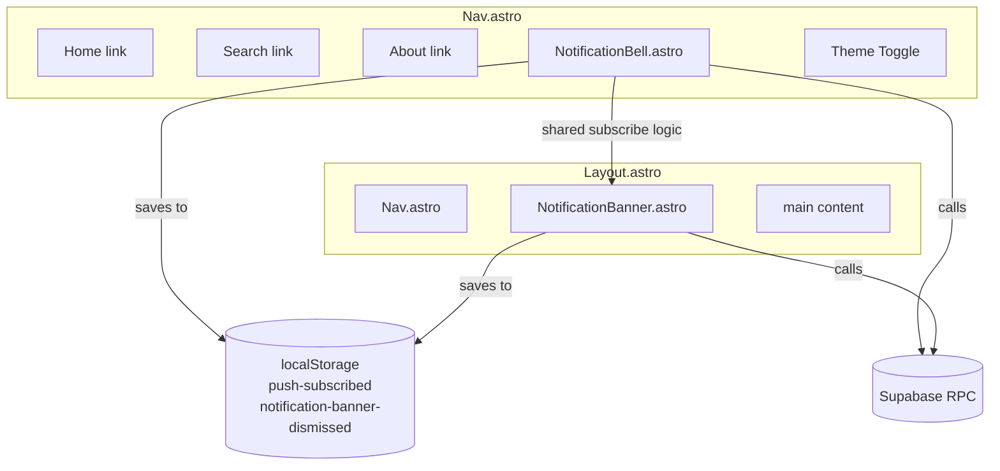

### 5.2 `NotificationBell.astro`

**Location:** `src/components/NotificationBell.astro`

**Behavior:**

| State | Visual | Click Action |
|-------|--------|-------------|
| Not subscribed | Bell outline (muted) | Start subscribe flow |
| Subscribed | Bell with dot/filled (active color) | Unsubscribe |
| Unsupported | Hidden | N/A |
| Permission denied | Bell with slash (disabled) | Show tooltip: "Notifications blocked" |

**Technical Details:**

- Reads `PUBLIC_VAPID_KEY` and `PUBLIC_SUPABASE_URL` / `PUBLIC_SUPABASE_ANON_KEY` from env
- On mount: checks `localStorage("push-subscribed")` for quick UI, then verifies with `pushManager.getSubscription()` for accuracy
- Subscribe: `Notification.requestPermission()` -> `pushManager.subscribe()` -> Supabase RPC `upsert_push_subscription`
- Unsubscribe: `subscription.unsubscribe()` -> Supabase RPC `remove_push_subscription`
- Works with Astro View Transitions (`astro:page-load` event)

### 5.3 `NotificationBanner.astro`

**Location:** `src/components/NotificationBanner.astro`

**Behavior:**

- Shows on first visit if `localStorage("notification-banner-dismissed")` is not set
- Auto-hides if `Notification.permission === "granted"` or push is already subscribed
- Has an "Enable notifications" button (triggers same flow as bell) and a dismiss "x"
- Dismissing sets `localStorage("notification-banner-dismissed") = "true"`
- Styled as a subtle top bar below the nav, matching the blog's design language

**State Machine:**

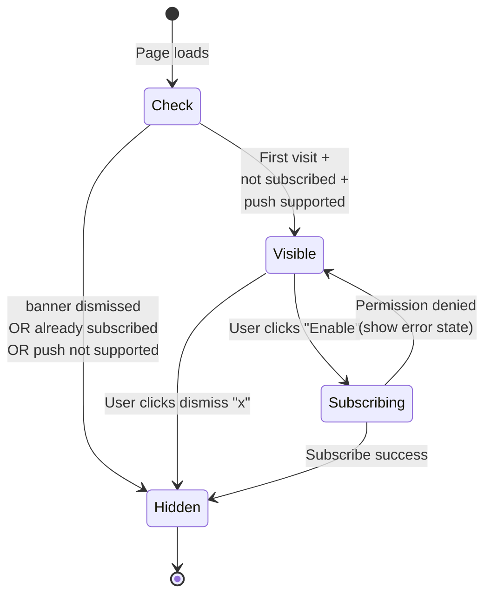

### 5.4 Nav.astro Modification

Add the bell icon between the About link and the theme toggle:

```diff
  <li>
    <a href="/about" ...>About</a>
  </li>
+ <li>
+   <NotificationBell />
+ </li>
  <li>
    <button id="theme-toggle" ...>
```

### 5.5 Layout.astro Modification

Add the notification banner after the nav:

```diff
  <Nav />
+ <NotificationBanner />
  <main id="main-content">
```

The existing service worker registration script in `Layout.astro` (lines 119-154) remains as-is since it already registers `/sw.js` and handles `SKIP_WAITING`.

---

## 6. Supabase Edge Function

### 6.1 File Location

```
supabase/
├── config.toml
└── functions/
    └── send-notifications/
        └── index.ts
```

### 6.2 `send-notifications/index.ts` — Pseudocode

```
FUNCTION handler(request):
  1. Verify Authorization header (service_role key or custom auth)

  2. QUERY: SELECT * FROM notifications WHERE sent = false
     → If none, return { message: "nothing to send" }

  3. QUERY: SELECT * FROM push_subscriptions
     → If none, mark all notifications as sent, return

  4. FOR each unsent notification N:
       FOR each subscription S:
         a. Build VAPID JWT:
            - Header: { alg: "ES256", typ: "JWT" }
            - Payload: { aud: origin(S.endpoint), exp: now + 12h, sub: VAPID_SUBJECT }
            - Sign with VAPID_PRIVATE_KEY (ECDSA P-256)

         b. Encrypt notification payload using:
            - S.p256dh (client public key)
            - S.auth (client auth secret)
            - AES-128-GCM (RFC 8291)

         c. POST to S.endpoint:
            Headers:
              Authorization: vapid t=<JWT>, k=<VAPID_PUBLIC_KEY>
              Content-Type: application/octet-stream
              Content-Encoding: aes128gcm
              TTL: 86400
            Body: encrypted payload

         d. Handle response:
            - 201: Success, push accepted
            - 410: Subscription expired → DELETE from push_subscriptions
            - 404: Subscription invalid → DELETE from push_subscriptions
            - 429: Rate limited → log warning, continue

       UPDATE notifications SET sent = true WHERE id = N.id

  5. Return { sent: count }
```

### 6.3 Dependencies & Libraries

In Deno (Supabase Edge Functions runtime), there is no `web-push` npm package available. Options:

| Approach | Pros | Cons |
|----------|------|------|
| **`web-push` via npm compat** | Well-tested library | May have Node.js-specific deps |
| **Manual VAPID + encryption** | No deps, uses Web Crypto API | More code to write |
| **`@block65/webcrypto-web-push`** | Designed for Web Crypto API (Deno/CF Workers compatible) | Newer, less battle-tested |

**Recommended:** Use `web-push` via Deno's npm compatibility (`npm:web-push`) or use a lightweight Deno-native implementation with Web Crypto API.

### 6.4 Edge Function Secrets

Set via Supabase CLI or dashboard:

```bash
supabase secrets set VAPID_PUBLIC_KEY="BPx..."
supabase secrets set VAPID_PRIVATE_KEY="abc..."
supabase secrets set VAPID_SUBJECT="mailto:your@email.com"
```

`SUPABASE_URL` and `SUPABASE_SERVICE_ROLE_KEY` are auto-injected by the Edge Functions runtime.

---

## 7. GitHub Actions Pipeline

### 7.1 Updated `deploy.yml` Structure

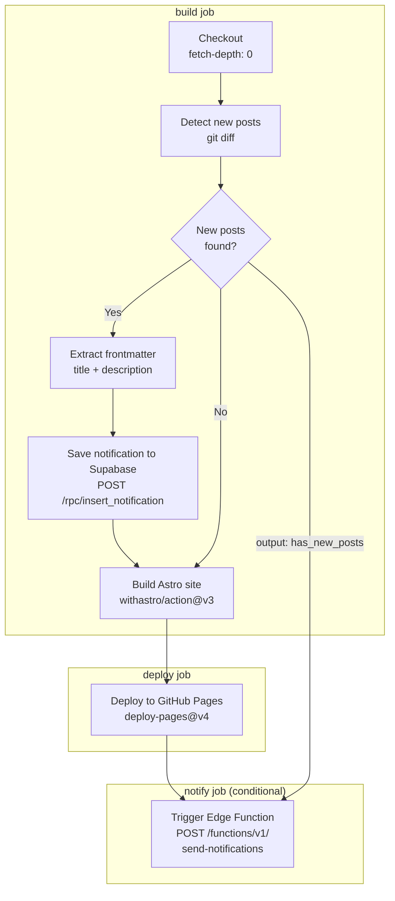

### 7.2 Key Changes to `deploy.yml`

1. **Add `fetch-depth: 0`** to checkout step (need git history for `git diff`)
2. **New step: "Detect new blog posts"** — runs `git diff` to find added files in `src/content/posts/`
3. **New step: "Prepare notification data"** — parses frontmatter and POSTs to Supabase
4. **New job: "notify"** — runs after deploy, calls the Edge Function
5. **New secrets needed:** `SUPABASE_SERVICE_ROLE_KEY`, `PUBLIC_VAPID_KEY`
6. **Output passing:** The `build` job outputs `has_new_posts` so the `notify` job can conditionally run

### 7.3 Frontmatter Parsing in CI

The pipeline needs to extract `title` and `description` from markdown frontmatter like:

```yaml
---
title: "My New Post"
description: "A great read about interesting things"
date: 2026-01-15
---
```

This is done via simple `grep` + `sed` in the shell:

```bash
TITLE=$(grep '^title:' "$file" | head -1 | sed 's/^title: *//' | tr -d '"')
DESC=$(grep '^description:' "$file" | head -1 | sed 's/^description: *//' | tr -d '"')
SLUG=$(basename "$file" .md)
```

### 7.4 Edge Case: Multiple New Posts in One Push

If a developer pushes a commit that adds 3 new posts at once, the pipeline creates 3 separate notification records. The Edge Function sends all 3 as separate push notifications. Each notification has a unique `tag` (the slug), so they won't collapse into one.

### 7.5 Edge Case: Squash Merges / Force Pushes

`git diff HEAD~1` only compares against the immediate parent commit. For squash merges that include multiple commits worth of changes, this still works because the diff shows all files added in the squash. For force pushes or rebases, the diff base may be wrong. A more robust approach would be to store the last-deployed SHA in Supabase and diff against that, but `HEAD~1` is sufficient for a standard PR merge workflow.

---

## 8. Environment Variables & Secrets

### 8.1 Complete Variable Map

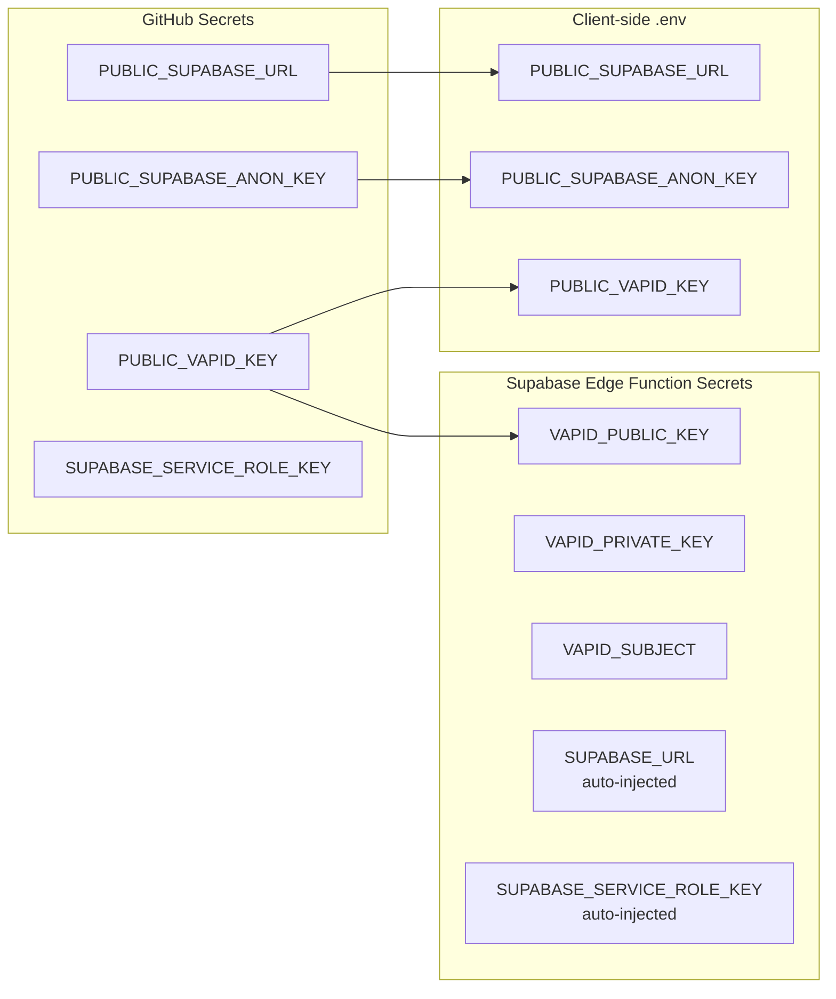

### 8.2 Variable Details

| Variable | Value Example | Used By | Sensitive? |
|----------|--------------|---------|------------|
| `PUBLIC_SUPABASE_URL` | `https://xxx.supabase.co` | Client, CI | No |
| `PUBLIC_SUPABASE_ANON_KEY` | `eyJ...` | Client | No (public key) |
| `PUBLIC_VAPID_KEY` | `BPx...` (base64url) | Client, CI, Edge Fn | No (public key) |
| `VAPID_PRIVATE_KEY` | `abc...` (base64url) | Edge Fn only | **Yes** |
| `VAPID_SUBJECT` | `mailto:arijit@arijitk.in` | Edge Fn only | No |
| `SUPABASE_SERVICE_ROLE_KEY` | `eyJ...` | CI, Edge Fn | **Yes** |

### 8.3 Generating VAPID Keys

Run once locally:

```bash
npx web-push generate-vapid-keys
```

Output:
```
Public Key:  BPxyz... (this goes in PUBLIC_VAPID_KEY)
Private Key: abc123... (this goes in VAPID_PRIVATE_KEY)
```

Store these permanently. If you regenerate them, all existing subscriptions become invalid and users must re-subscribe.

---

## 9. File Change Summary

### 9.1 New Files

| File | Purpose |
|------|---------|
| `src/sw.ts` | Custom service worker with precaching + push handlers |
| `src/components/NotificationBell.astro` | Bell icon subscribe/unsubscribe button |
| `src/components/NotificationBanner.astro` | First-visit opt-in banner |
| `supabase/config.toml` | Supabase project configuration |
| `supabase/functions/send-notifications/index.ts` | Edge Function: send Web Push to all subscribers |
| `supabase/migrations/001_push_notifications.sql` | Database schema (tables, RLS, RPC functions) |

### 9.2 Modified Files

| File | Changes |
|------|---------|
| `astro.config.mjs` | Switch to `injectManifest`, add `PUBLIC_VAPID_KEY` to env schema |
| `src/components/Nav.astro` | Add `NotificationBell` component |
| `src/components/Layout.astro` | Add `NotificationBanner` component |
| `.github/workflows/deploy.yml` | Add post detection, notification save, Edge Function trigger steps |
| `.env.example` | Add `PUBLIC_VAPID_KEY` |
| `package.json` | Potentially add `workbox-*` peer deps if not auto-resolved |

### 9.3 Dependency Impact

The `@vite-pwa/astro` plugin already includes workbox libraries. Switching to `injectManifest` uses the same workbox packages but imports them directly in `src/sw.ts`. No new npm dependencies should be needed for the client side.

For the Supabase Edge Function, `web-push` (or a Deno-native alternative) is imported directly in the function file — it's not a project-level dependency.

---

## 10. Implementation Order

Step-by-step execution plan with dependencies:

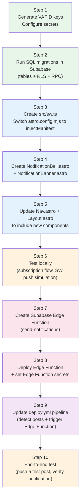

### Step Details

| Step | Effort | Description |
|------|--------|-------------|
| 1 | 5 min | Run `npx web-push generate-vapid-keys`. Add keys to GitHub Secrets + local `.env` |
| 2 | 10 min | Run SQL in Supabase SQL Editor (or via migration). Verify tables and RPC functions exist |
| 3 | 30 min | Create `src/sw.ts`. Modify `astro.config.mjs` to use `injectManifest`. Verify build succeeds and caching still works |
| 4 | 45 min | Build the bell icon and banner components with full subscribe/unsubscribe logic |
| 5 | 10 min | Wire components into Nav and Layout |
| 6 | 15 min | Run `bun dev`, test subscription in browser, use Chrome DevTools > Application > Push to simulate a push event |
| 7 | 45 min | Write the Deno Edge Function with VAPID signing and payload encryption |
| 8 | 10 min | Deploy via `supabase functions deploy send-notifications`. Set secrets via `supabase secrets set` |
| 9 | 20 min | Update `deploy.yml` with new steps and job. Test with a dry-run push |
| 10 | 15 min | Add a test post, push to master, verify the full pipeline works end-to-end |

**Total estimated effort: ~3.5 hours**

---

## 11. Risks & Edge Cases

### 11.1 Browser Support

| Browser | Push API | Notes |
|---------|----------|-------|
| Chrome (Desktop) | Full support | Uses FCM |
| Chrome (Android) | Full support | Uses FCM |
| Firefox (Desktop) | Full support | Uses Mozilla Push Service |
| Firefox (Android) | Full support | Uses Mozilla Push Service |
| Edge (Desktop) | Full support | Uses FCM (Chromium-based) |
| Safari (macOS 16+) | Supported | Uses APNs |
| Safari (iOS 16.4+) | Partial | Only works if site is "Added to Home Screen" (installed as PWA) |
| Safari (iOS < 16.4) | Not supported | No Push API available |

The `NotificationBell` component should hide itself on unsupported browsers using feature detection:

```js
const pushSupported = 'serviceWorker' in navigator
  && 'PushManager' in window
  && 'Notification' in window;
```

### 11.2 Subscription Lifecycle

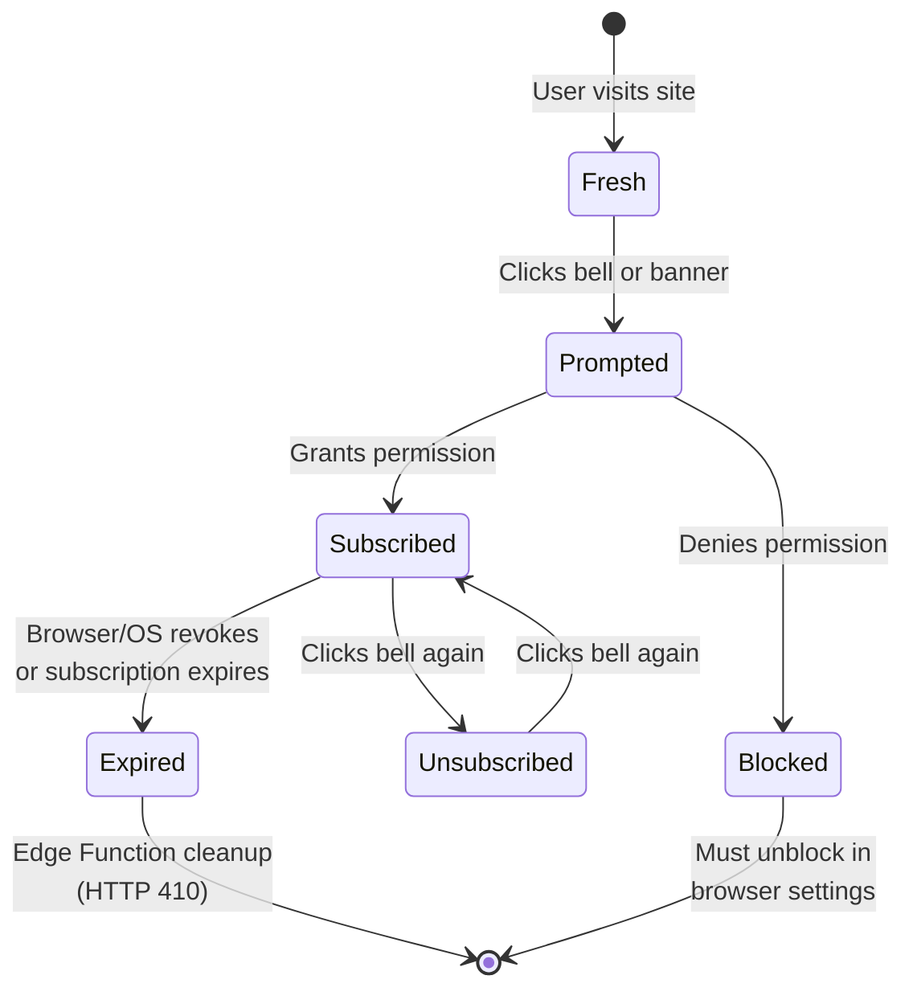

### 11.3 Failure Scenarios

| Scenario | Impact | Mitigation |
|----------|--------|------------|
| Edge Function fails | Notifications not sent | Unsent notifications remain `sent=false`; can be retried manually |
| Supabase is down during deploy | Notification record not saved | Pipeline step fails but deploy continues; no notification for that post |
| VAPID keys regenerated | All existing subscriptions invalidated | Never regenerate keys; if needed, all users must re-subscribe |
| User clears browser data | Subscription lost client-side | Stale subscription remains in DB until Edge Function gets 410 and cleans it |
| Push service rate-limits | Some notifications delayed | Edge Function logs the error; push service will retry delivery |
| Multiple deploys in quick succession | Multiple notifications for same post | Use `slug` as unique tag in `showNotification()` — duplicates collapse |

### 11.4 Privacy Considerations

- Push subscriptions contain no personally identifiable information (no email, no name)
- The `endpoint` URL is opaque and managed by the browser vendor's push service
- The notification payload is end-to-end encrypted (AES-128-GCM between Edge Function and browser)
- No tracking of who reads which notification
- Users can unsubscribe at any time via the bell icon or browser settings

### 11.5 Performance Impact

- **Service worker size:** Adding push handlers adds ~2KB to the SW file (negligible)
- **Page load:** The bell icon and banner are lightweight Astro components (no JS framework overhead)
- **Build time:** `injectManifest` is slightly faster than `generateSW` since it only injects the manifest rather than generating the entire SW

---

## Appendix: Quick Reference Commands

```bash
# Generate VAPID keys
npx web-push generate-vapid-keys

# Deploy Supabase Edge Function
supabase functions deploy send-notifications

# Set Edge Function secrets
supabase secrets set VAPID_PUBLIC_KEY="..."
supabase secrets set VAPID_PRIVATE_KEY="..."
supabase secrets set VAPID_SUBJECT="mailto:you@example.com"

# Test Edge Function locally
supabase functions serve send-notifications --env-file .env

# Simulate a push event (Chrome DevTools)
# Application tab > Service Workers > Push (enter JSON payload)

# Check existing subscriptions in Supabase
# SQL: SELECT count(*) FROM push_subscriptions;

# Check pending notifications
# SQL: SELECT * FROM notifications WHERE sent = false;

# Retry unsent notifications
# SQL: UPDATE notifications SET sent = false WHERE ...;
# Then re-trigger the Edge Function
```
