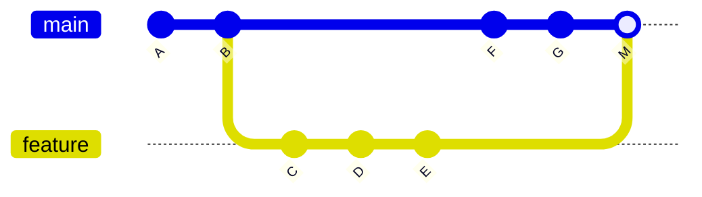

## Understanding how your commits come together — and why it matters.

---

## Table of Contents

1. [The Three Strategies at a Glance](#1-the-three-strategies-at-a-glance)
2. [Merge Commit (Three-Way Merge)](#2-merge-commit-three-way-merge)
3. [Fast-Forward Merge](#3-fast-forward-merge)
4. [Rebase](#4-rebase)
5. [Side-by-Side Comparison](#5-side-by-side-comparison)
6. [Interactive Rebase — The Power Tool](#6-interactive-rebase--the-power-tool)
7. [Squash Merge — The Middle Ground](#7-squash-merge--the-middle-ground)
8. [When and Why to Use Each](#8-when-and-why-to-use-each)
9. [The Golden Rules](#9-the-golden-rules)

---

## 1. The Three Strategies at a Glance

When you want to integrate changes from one branch into another, Git gives you fundamentally different strategies. Each produces a different commit history, and choosing the right one affects readability, traceability, and collaboration.

| Strategy | Command | Preserves Branch History? | Creates Extra Commit? | Rewrites History? |
|---|---|---|---|---|
| **Merge Commit** | `git merge feature` | Yes | Yes (merge commit) | No |
| **Fast-Forward** | `git merge --ff-only feature` | No | No | No |
| **Rebase** | `git rebase main` | No | No | Yes |

---

## 2. Merge Commit (Three-Way Merge)

A merge commit is created when Git combines two branches that have **diverged** — both branches have commits the other doesn't. Git finds the common ancestor, compares both tips against it, and creates a new **merge commit** with two parents.



### Command

```bash
git checkout main
git merge feature
```

### Before Merge

```
          C---D---E   (feature)
         /
A---B---F---G         (main)
```

Both `main` and `feature` have progressed independently since they diverged at commit `B`.

### After Merge

```
          C---D---E
         /         \
A---B---F---G---M     (main)
```

Commit `M` is the **merge commit**. It has **two parents**: `G` (from main) and `E` (from feature). The feature branch topology is fully preserved.

### Pros

- **Complete history** — You can always see exactly when a branch was created, what it contained, and when it was merged.
- **Non-destructive** — No existing commits are modified. Safe for shared/public branches.
- **Traceable** — `git log --merges` shows every integration point. Great for auditing.
- **Conflict resolution is contained** — Conflicts are resolved once in the merge commit.

### Cons

- **Noisy history** — Frequent merges create a tangled web of criss-crossing lines in `git log --graph`.
- **Extra commits** — Every merge adds a commit that carries no "real" code change.
- **Harder to bisect** — `git bisect` can get confused navigating merge commits.

---

## 3. Fast-Forward Merge

A fast-forward merge happens when the target branch has **no new commits** since the feature branch was created. Git simply moves the branch pointer forward — no merge commit is created.

### Command

```bash
git checkout main
git merge feature          # Git auto-detects FF possibility
# or explicitly:
git merge --ff-only feature  # Fails if FF is not possible
```

### Before Merge

```
A---B---C         (main)
         \
          D---E   (feature)
```

`main` has not moved since `feature` was branched off at `C`.

### After Merge (Fast-Forward)

```
A---B---C---D---E   (main, feature)
```

The `main` pointer simply jumps forward to `E`. The history is perfectly linear — as if the feature work was done directly on `main`.

### Pros

- **Clean, linear history** — No merge commits cluttering the log.
- **Simple to read** — `git log` shows a straight line of commits.
- **Easy to bisect** — `git bisect` works flawlessly on a linear history.
- **No conflict** — If FF is possible, there are zero conflicts by definition.

### Cons

- **No record of the branch** — You lose the information that these commits were developed on a separate branch.
- **Requires no divergence** — Only works when the target branch is strictly behind. If anyone else pushed to `main`, this won't work.
- **Can't always be used** — In active teams, `main` almost always has new commits, making FF impossible without a rebase first.

### When Fast-Forward Is Not Possible

```
          D---E       (feature)
         /
A---B---C---F---G     (main)
```

Here, `main` has moved forward (`F`, `G`) since `feature` branched off. A fast-forward is impossible — Git must create a merge commit or you must rebase first.

---

## 4. Rebase

Rebase **replays** your branch's commits on top of the target branch, one by one. It rewrites commit hashes, creating brand-new commits with the same changes but different ancestry.

### Command

```bash
git checkout feature
git rebase main
# Then fast-forward main:
git checkout main
git merge feature   # This will now be a fast-forward
```

### Before Rebase

```
          C---D---E   (feature)
         /
A---B---F---G         (main)
```

### After Rebase

```
                  C'--D'--E'   (feature)
                 /
A---B---F---G                  (main)
```

The original commits `C`, `D`, `E` are gone. New commits `C'`, `D'`, `E'` have the same diffs but sit on top of `G`. Their **hashes are different** because their parent changed.

### After Fast-Forward Merge

```
A---B---F---G---C'--D'--E'   (main, feature)
```

The end result is a perfectly linear history with no merge commit.

### Pros

- **Cleanest possible history** — A straight line of meaningful commits.
- **Easy to review** — Each commit stands on its own, making code review simpler.
- **Bisect-friendly** — Linear history makes debugging with `git bisect` trivial.
- **Eliminates "merge bubbles"** — No criss-cross patterns in the graph.

### Cons

- **Rewrites history** — Commits get new hashes. **Dangerous on shared branches.**
- **Conflicts multiply** — You may have to resolve conflicts for each replayed commit rather than once.
- **Force-push required** — After rebasing a pushed branch, you need `git push --force-with-lease`, which can confuse collaborators.
- **Lost context** — The original branch point and merge point are erased from history.

### The Danger Zone

```bash
# NEVER do this on a shared branch:
git checkout main
git rebase feature    # Rewrites main's history — breaks everyone!
```

Rebasing rewrites history. If other people have based work on the old commits, their branches will diverge from the rewritten history, causing chaos.

---

## 5. Side-by-Side Comparison

### Same Feature, Three Strategies

**Starting point:**

```
          C---D       (feature)
         /
A---B---E---F         (main)
```

**After `git merge feature` (Merge Commit):**

```
          C---D
         /     \
A---B---E---F---M     (main)
```

**After `git rebase main` + `git merge feature` (Rebase + FF):**

```
A---B---E---F---C'--D'   (main)
```

**After `git merge --squash feature` (Squash Merge):**

```
A---B---E---F---S         (main)
```

Where `S` is a single commit containing all changes from `C` and `D` combined.

### Comparison Table

| Aspect | Merge Commit | Fast-Forward | Rebase + FF | Squash Merge |
|---|---|---|---|---|
| **History Shape** | Non-linear (branching) | Linear | Linear | Linear |
| **Commit Count** | All + 1 merge commit | All original commits | All (new hashes) | 1 squashed commit |
| **Branch Context** | Preserved | Lost | Lost | Lost |
| **Safety** | Safe for all branches | Safe for all branches | Unsafe on shared branches | Safe for all branches |
| **Conflict Resolution** | Once | N/A | Per commit | Once |
| **`git bisect`** | Harder | Easy | Easy | Coarse (1 commit) |
| **Code Review** | Good | Good | Best | Coarse |

---

## 6. Interactive Rebase — The Power Tool

Interactive rebase lets you rewrite, reorder, squash, or drop commits before integrating.

### Command

```bash
git rebase -i main
```

This opens an editor:

```
pick a1b2c3d Add user model
pick e4f5g6h Fix typo in user model
pick i7j8k9l Add user validation
pick m0n1o2p WIP - debugging
```

You can change the commands:

```
pick   a1b2c3d Add user model
squash e4f5g6h Fix typo in user model      # Merge into previous commit
pick   i7j8k9l Add user validation
drop   m0n1o2p WIP - debugging              # Remove this commit entirely
```

### Result

```
# Before:
A---B---C---D---E   (feature, 4 messy commits)

# After interactive rebase:
A---X---Y           (feature, 2 clean commits)
```

Interactive rebase is invaluable for cleaning up your work **before** sharing it, turning a messy stream-of-consciousness into a logical, reviewable sequence.

---

## 7. Squash Merge — The Middle Ground

A squash merge condenses all commits from a branch into a **single commit** on the target branch. It doesn't create a merge commit — it creates a regular commit.

### Command

```bash
git checkout main
git merge --squash feature
git commit -m "Add user authentication feature"
```

### Before

```
          C---D---E   (feature)
         /
A---B---F---G         (main)
```

### After

```
A---B---F---G---S     (main)
```

`S` contains all the changes from `C`, `D`, and `E` but as a single commit.

### Pros

- **Clean main branch** — One commit per feature, easy to scan.
- **Safe** — No history rewriting on shared branches.
- **Good for noisy branches** — Hides "WIP", "fix typo", "oops" commits.

### Cons

- **Lost granularity** — Individual commits from the feature branch are gone. Can't bisect within the feature.
- **Lost attribution** — If multiple people worked on the branch, only the squash committer shows up.
- **Branch becomes stale** — After squash merge, the feature branch's commits aren't recognized as merged, causing Git to think the branch still has unmerged work.

---

## 8. When and Why to Use Each

### Use Merge Commit When...

- You're merging a **long-lived feature branch** or release branch and want a clear record.
- You're working in a **regulated environment** where audit trails matter.
- You're integrating **shared branches** (e.g., merging `release` into `main`) — never rewrite shared history.
- Multiple people contributed to the branch and you want to **preserve attribution**.

```bash
# Example: merging a release branch
git checkout main
git merge --no-ff release/v2.1
```

> Use `--no-ff` to force a merge commit even when fast-forward is possible, preserving the branch topology.

### Use Fast-Forward When...

- You're the **only person** working on a small branch.
- The branch has **1–2 commits** and main hasn't moved.
- You want the **simplest possible history**.
- You're working in a **trunk-based development** model with very short-lived branches.

```bash
# Example: merging a quick fix
git checkout main
git merge --ff-only hotfix/typo
```

### Use Rebase When...

- You want to **update your feature branch** with the latest changes from main before merging.
- You're preparing a branch for a **clean pull request** — rebasing produces a tidy diff.
- You're working on a **personal branch** that no one else has pulled.
- Your team follows a **"rebase before merge"** workflow.

```bash
# Example: updating feature branch before PR
git checkout feature/auth
git rebase main
git push --force-with-lease
```

### Use Squash Merge When...

- Your feature branch is full of **WIP and fixup commits**.
- You want **one commit per feature** on `main` for a clean, scannable log.
- The individual commits don't add value for future debugging.
- You're merging a **pull request** where the granularity doesn't matter.

```
# Example: squash merging a PR
git checkout main
git merge --squash feature/signup-form
git commit -m "feat: add signup form with validation"
```

### Decision Flowchart

```
Is the branch shared by others?
├── YES → Use MERGE COMMIT (never rewrite shared history)
└── NO
    ├── Does main have new commits since your branch?
    │   ├── NO → Use FAST-FORWARD
    │   └── YES
    │       ├── Do you want to preserve individual commits?
    │       │   ├── YES → REBASE then FAST-FORWARD
    │       │   └── NO → SQUASH MERGE
    │       └── Do you need an audit trail of the branch?
    │           ├── YES → MERGE COMMIT (--no-ff)
    │           └── NO → REBASE or SQUASH
    └── Is your commit history messy?
        ├── YES → INTERACTIVE REBASE to clean up, then merge
        └── NO → REBASE then FAST-FORWARD
```

---

## 9. The Golden Rules

1. **Never rebase a public/shared branch.** If others have pulled it, rewriting history will cause conflicts for everyone.

2. **Rebase local, merge shared.** Use rebase to keep your personal branches up to date. Use merge commits to integrate shared work.

3. **Use `--force-with-lease`, never `--force`.** If you must force-push after a rebase, `--force-with-lease` ensures you don't overwrite someone else's work.

4. **Clean up before sharing.** Use interactive rebase (`git rebase -i`) to squash fixup commits and write meaningful messages before opening a PR.

5. **Be consistent.** Pick a strategy as a team and stick with it. Mixed strategies lead to an unreadable history.

6. **When in doubt, merge.** A merge commit is always safe. It never rewrites history and always preserves context.

### Quick Reference

```bash
# Safe merge with history
git merge --no-ff feature

# Fast-forward only (fails if not possible)
git merge --ff-only feature

# Rebase feature onto latest main
git checkout feature && git rebase main

# Interactive rebase to clean up last 5 commits
git rebase -i HEAD~5

# Squash merge
git merge --squash feature && git commit

# Safe force-push after rebase
git push --force-with-lease
```

---

**Choose the strategy that serves your team's workflow, not just your preference.** A clean history is valuable, but so is a safe and traceable one. The best teams know when each tool is the right one.
