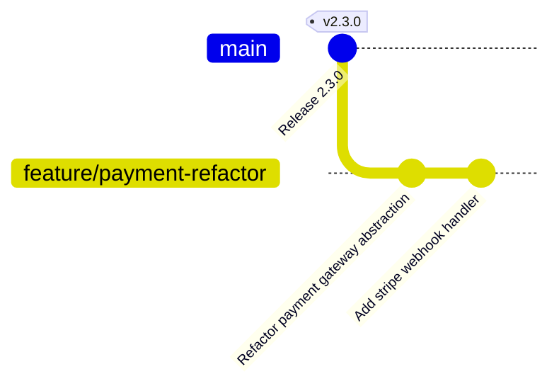
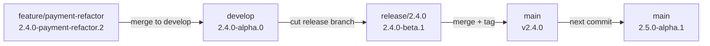
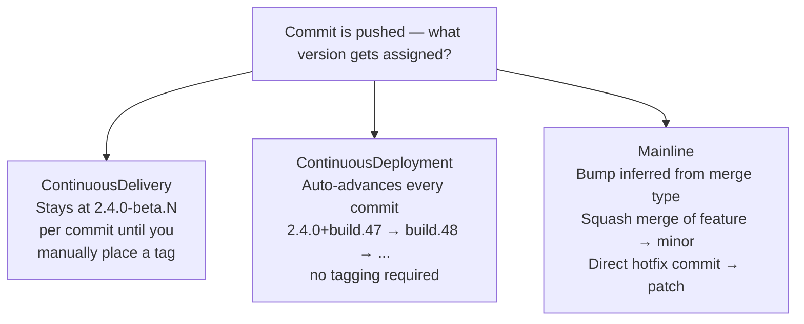
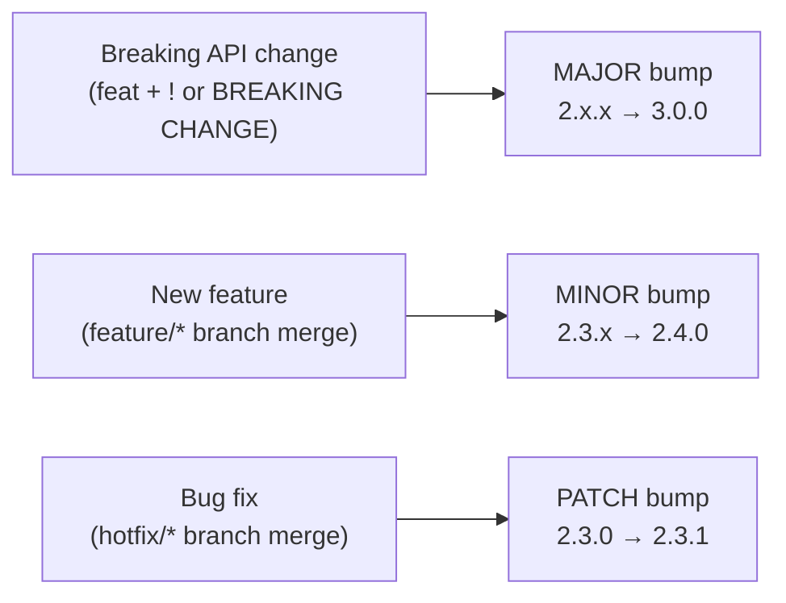
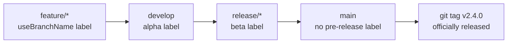
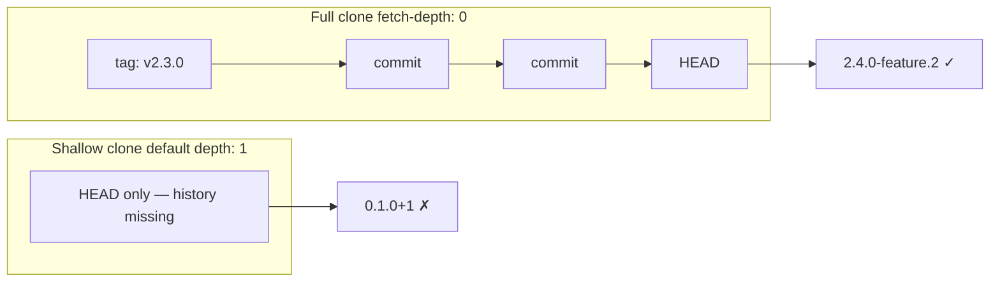

## Stop hand-editing version numbers. Let your Git history decide.

---

## Table of Contents

1. [What Is GitVersion?](#1-what-is-gitversion)
2. [How It Works — The Core Idea](#2-how-it-works--the-core-idea)
3. [Modes — Continuous Delivery vs Continuous Deployment vs MainLine](#3-modes--continuous-delivery-vs-continuous-deployment-vs-mainline)
4. [What You Get](#4-what-you-get)
5. [Where GitVersion Shines](#5-where-gitversion-shines)
6. [Where GitVersion Gets in the Way](#6-where-gitversion-gets-in-the-way)
7. [GitVersion vs Manual Tagging](#7-gitversion-vs-manual-tagging)
8. [Quick Setup](#8-quick-setup)
9. [Verdict — Should You Use It?](#9-verdict--should-you-use-it)

---

## 1. What Is GitVersion?

GitVersion is an open-source tool that **calculates a semantic version number by reading your Git history** — branches, tags, merge commits, and commit messages — instead of relying on a file you manually keep updated.

You run it in CI (or locally) and it outputs a version like `3.4.1-beta.7` based purely on where you are in the commit graph relative to the last tagged release.

It understands popular branching strategies out of the box:

- **GitFlow** (`main`, `develop`, `release/*`, `hotfix/*`, `feature/*`)
- **GitHub Flow** (`main`, short-lived feature branches)
- **Trunk-Based Development** (`main` only)

The project lives at [gitversion.net](https://gitversion.net) and integrates natively with MSBuild, GitHub Actions, Azure DevOps, TeamCity, and most other CI systems.

---

## 2. How It Works — The Core Idea

GitVersion walks your commit graph backwards to find two things:

1. **The last reachable tag** that looks like a semantic version (e.g. `v2.3.0`).
2. **The distance** — how many commits exist between that tag and `HEAD`.

From those two inputs, it applies a set of rules driven by branch names and commit messages to bump the appropriate version component and append a pre-release label.

### A concrete example



Running `gitversion` on `feature/payment-refactor` at `HEAD` produces:

```
2.4.0-payment-refactor.2
```

- **2.4.0** — next minor bump (feature branches bump minor by default)
- **payment-refactor** — pre-release label derived from the branch name
- **2** — number of commits on this branch since the branch point

Once you merge that feature to `develop` and create a `release/2.4.0` branch, the label changes to `2.4.0-beta.1`. When you merge release to `main` and tag it `v2.4.0`, the next commit on `main` immediately becomes `2.5.0-alpha.1` — without anyone touching a version file.



---

## 3. Modes — Continuous Delivery vs Continuous Deployment vs MainLine

GitVersion ships with three built-in versioning modes. The mode you choose changes when version numbers advance.

| Mode | When version bumps | Best fit |
|---|---|---|
| **ContinuousDelivery** | On tag (manual release gate) | GitFlow, scheduled releases |
| **ContinuousDeployment** | On every commit (build number increments) | Frequent releases, every green build ships |
| **Mainline** | Inferred from merge commits into `main` | Trunk-based, no release branches |



### ContinuousDelivery

The version stays at `2.4.0-beta.N` on your release branch, where `N` is the commit count. You increment N with every commit but the base version `2.4.0` only becomes "official" when you place the `v2.4.0` tag. Suitable when a human gates the release.

### ContinuousDeployment

Every commit on `main` is deployable and gets a unique version like `2.4.0+build.47`. No tagging needed to produce a new version — the build number is enough to distinguish artefacts.

### Mainline

The most aggressive mode. GitVersion infers version bumps from how branches are merged into `main`. A squash merge of a feature branch counts as a minor bump. A hotfix direct commit counts as a patch. Zero manual tags required after the initial baseline.

---

## 4. What You Get

When you run `gitversion /output json`, you receive a JSON payload with every version component pre-computed:

```json
{
  "Major": 2,
  "Minor": 4,
  "Patch": 0,
  "PreReleaseTag": "beta",
  "PreReleaseNumber": 3,
  "SemVer": "2.4.0-beta.3",
  "AssemblySemVer": "2.4.0.0",
  "InformationalVersion": "2.4.0-beta.3+Branch.release-2.4.0.Sha.a1b2c3d4e5",
  "NuGetVersionV2": "2.4.0-beta0003",
  "FullSemVer": "2.4.0-beta.3"
}
```

CI pipelines can consume individual fields to stamp artefacts, Docker image tags, NuGet packages, npm packages, and changelogs — all from a single source of truth.

---

## 5. Where GitVersion Shines

### Libraries and packages with public consumers

When you publish a NuGet package, npm module, or any artefact that other projects take as a dependency, version numbers carry **semantic meaning** for your consumers. GitVersion enforces that meaning automatically. You can't forget.



### GitFlow shops with scheduled releases

GitVersion was essentially designed around GitFlow. Every branch type in GitFlow maps to a pre-release label. If your team already follows GitFlow discipline, GitVersion is almost zero overhead.



### Multi-team monorepos tagging shared components

If different teams own different packages in a monorepo and use consistent branch naming, GitVersion can produce independent version numbers per directory (with its `override` configuration). Each package gets an accurate pre-release version without a dedicated versioning pipeline.

### Audit and traceability requirements

The `InformationalVersion` field embeds the full branch name and commit SHA into the compiled binary. In regulated environments (finance, medical devices, aerospace) this is invaluable for linking a deployed artefact back to an exact commit — no spreadsheet needed.

### Avoiding version drift in long-lived projects

In projects that have been alive for years, version files (`AssemblyInfo.cs`, `package.json`, `pyproject.toml`) get stale. People forget to bump them, or bump them twice in the same sprint, or conflict-resolve them in the wrong direction. GitVersion eliminates the version file entirely for artefact versioning.

---

## 6. Where GitVersion Gets in the Way

### Trunk-Based Development teams that don't do semver releases

If your deployment pipeline is "every merge to `main` ships to prod via a CI/CD pipeline," and downstream consumers reference your service by URL rather than package version, GitVersion adds complexity without benefit. You already have build IDs from your CI system. Layering GitVersion on top of that means maintaining a `GitVersion.yml` config, ensuring tags exist on `main`, and debugging why the version calculated in CI differs from local — for a number that nobody looks at.

### Small projects and single-developer repos

The setup cost is non-trivial. You need to install GitVersion, author a `GitVersion.yml`, make sure your CI agent does a full (non-shallow) clone, and understand why the version is wrong when your config drifts. For a side project or internal tool where a simple `v1.2.3` git tag is sufficient, this overhead rarely pays off.

### Shallow clones in CI

This is the most common pain point. Almost every hosted CI service (GitHub Actions, Azure Pipelines, GitLab CI) performs a **shallow clone** by default (`--depth=1`) for speed. GitVersion needs the full commit history to walk back to the last tag. If you forget to set `fetch-depth: 0` in your workflow, GitVersion either throws an error or silently produces a wrong version like `0.1.0+1` regardless of your actual release history.



```yaml
# GitHub Actions — you must add this
- uses: actions/checkout@v4
  with:
    fetch-depth: 0   # ← GitVersion breaks without this
```

### Complex GitFlow histories with lots of merges

In long-running GitFlow repos with many `release` and `hotfix` branches, GitVersion can get confused about which tag to use as the base. The version it calculates may be counter-intuitive. Debugging requires understanding the exact algorithm GitVersion uses — `git log --graph` becomes your best friend, and the fix is often manually adding a `[assembly: AssemblyInformationalVersion]`-style override or an explicit `next-version` entry in `GitVersion.yml`.

### Teams that manually manage SemVer with intent

Some teams use version numbers as product communication, not just artefact identifiers. "We are releasing 3.0 because this is a major product milestone" — even though there are no breaking API changes. GitVersion is strictly mechanical: breaking changes in code bump major, everything else follows the rules. If your versioning carries business meaning that doesn't map to API surface changes, GitVersion's automatic bumps will fight you.

### Microservices with independent deployment cadences

In a microservices estate, each service typically has its own repo and deploys independently. GitVersion works fine per-repo, but if teams want a unified release number across services (e.g. "platform v4.2"), GitVersion cannot help — that's an orchestration problem, not a Git history problem.

---

## 7. GitVersion vs Manual Tagging

You don't need GitVersion to do semantic versioning. A simple tagging discipline — `git tag v2.4.0` on `main` after every release — covers 80% of the same ground for 10% of the complexity.

| | GitVersion | Manual Tags |
|---|---|---|
| **Effort** | Initial config + CI setup | Tag on release, nothing else |
| **Pre-release labels** | Automatic per branch | Manual (or small script) |
| **Build metadata** | Automatic (SHA, branch) | Manual |
| **Wrong version risk** | Config drift, shallow clone | Forgetting to tag |
| **Transparency** | Opaque — need to know the tool | Obvious — just read the tags |
| **Best for** | Libraries, packages, GitFlow | Services, trunk-based, simple projects |

The honest answer: for services, manual tags are fine. For libraries and packages, GitVersion earns its complexity.

---

## 8. Quick Setup

### Install

```bash
# .NET global tool
dotnet tool install --global GitVersion.Tool

# Or via npm
npm install -g gitversion
```

### Minimal `GitVersion.yml`

```yaml
mode: ContinuousDelivery
branches:
  main:
    regex: ^main$
    tag: ''
    increment: Patch
  develop:
    regex: ^develop$
    tag: alpha
    increment: Minor
  release:
    regex: ^releases?[/-]
    tag: beta
    increment: None
  feature:
    regex: ^features?[/-]
    tag: useBranchName
    increment: Minor
  hotfix:
    regex: ^hotfix(es)?[/-]
    tag: beta
    increment: Patch
```

### GitHub Actions

```yaml
- uses: actions/checkout@v4
  with:
    fetch-depth: 0

- name: Install GitVersion
  uses: gittools/actions/gitversion/setup@v1
  with:
    versionSpec: '6.x'

- name: Determine Version
  id: gitversion
  uses: gittools/actions/gitversion/execute@v1

- name: Build
  run: dotnet build -p:Version=${{ steps.gitversion.outputs.semVer }}
```

### Azure DevOps

```yaml
- task: gitversion/setup@3
  inputs:
    versionSpec: '6.x'

- task: gitversion/execute@3
  name: GitVersion

- script: dotnet pack -p:PackageVersion=$(GitVersion.NuGetVersionV2)
```

---

## 9. Verdict — Should You Use It?

**Yes, use GitVersion if:**

- You publish versioned packages (NuGet, npm, Maven, PyPI) that others depend on.
- Your team follows GitFlow or a structured branching model with release branches.
- You need audit-grade traceability (SHA + branch embedded in artefacts).
- You have a mid-to-large team where manual version bumping causes merge conflicts or drift.

**Skip GitVersion if:**

- You deploy services (not libraries) and version numbers are internal build identifiers.
- You use trunk-based development and every commit is a potential release.
- Your project is small enough that `git tag v1.2.3` takes five seconds.
- Your CI uses shallow clones and you don't want the overhead of configuring full clones everywhere.
- Your version numbering carries business/product meaning that doesn't map to API semantics.

The tool is genuinely powerful and saves real pain at scale — but it is a power tool. Reaching for it on a project that doesn't need it will leave you debugging `GitVersion.yml` instead of shipping. Match the tool to the problem: structured versioning for structured release processes, simple tags for everything else.
