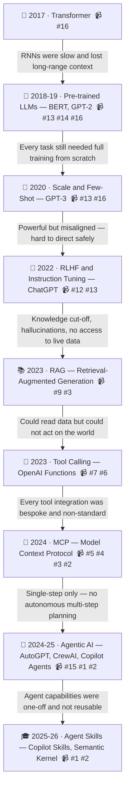

## 📄 YouTube Video Playlist

This blog contains a curated list of AI/LLM videos:

| # | Title |
|---|-------|
| 1 | [What AI Agent Skills Are and How They Work](https://www.youtube.com/watch?v=Lg-meK5IU8Q) |
| 2 | [MCP vs Skills: Which Is Right for Your AI Agent and LLMs?](https://www.youtube.com/watch?v=goU9VIXA8II) |
| 3 | [MCP vs. RAG: How AI Agents & LLMs Connect to Data](https://www.youtube.com/watch?v=X95MFcYH1_s) |
| 4 | [CLI vs MCP: How AI Agents Choose the Right Tool for the Job](https://www.youtube.com/watch?v=g9JIUM0MHgQ) |
| 5 | [MCP vs API: Simplifying AI Agent Integration with External Data](https://www.youtube.com/watch?v=7j1t3UZA1TY) |
| 6 | [AI Tool Calling via Natural Language: LLMs, APIs & Docker in Action](https://www.youtube.com/watch?v=gosZ_vqXkMI) |
| 7 | [What is Tool Calling? Connecting LLMs to Your Data](https://www.youtube.com/watch?v=h8gMhXYAv1k) |
| 8 | [Knowledge Distillation: How LLMs train each other](https://www.youtube.com/watch?v=jrJKRYAdh7I) |
| 9 | [RAG vs. Fine Tuning](https://www.youtube.com/watch?v=00Q0G84kq3M) |
| 10 | [What is a Context Window? Unlocking LLM Secrets](https://www.youtube.com/watch?v=-QVoIxEpFkM) |
| 11 | [What is Mixture of Experts?](https://www.youtube.com/watch?v=sYDlVVyJYn4) |
| 12 | [Fine Tuning LLM Explained Simply](https://www.youtube.com/watch?v=ezdIOLbUSWg) |
| 13 | [What are Generative AI models?](https://www.youtube.com/watch?v=hfIUstzHs9A) |
| 14 | [What is generative AI and how does it work? – The Turing Lectures](https://www.youtube.com/watch?v=_6R7Ym6Vy_I) |
| 15 | [Generative vs Agentic AI: Shaping the Future of AI Collaboration](https://www.youtube.com/watch?v=EDb37y_MhRw) |
| 16 | [AI, Machine Learning, Deep Learning and Generative AI Explained](https://www.youtube.com/watch?v=qYNweeDHiyU) |


## 🗺️ AI / LLM Evolution — Why Each Discovery Happened

Every breakthrough below was triggered by a frustration the previous one left behind. The arrow between each milestone *is* the problem that forced the next step.



| # | Milestone | ✅ Problem It Solved | ❌ Problem It Left Behind | 📹 Videos |
|---|-----------|----------------------|--------------------------|----------|
| 1 | **2017 · Transformer** — *Attention Is All You Need* | RNNs couldn't parallelise and lost context over long sequences | Every downstream task still needed a full model trained from scratch | [#16](https://www.youtube.com/watch?v=qYNweeDHiyU) |
| 2 | **2018–19 · Pre-trained LLMs** — BERT, GPT-2 | Train once on massive data, fine-tune cheaply per task — transfer learning unlocked | Models predicted tokens but couldn't reliably follow instructions or user intent | [#13](https://www.youtube.com/watch?v=hfIUstzHs9A) [#14](https://www.youtube.com/watch?v=_6R7Ym6Vy_I) [#16](https://www.youtube.com/watch?v=qYNweeDHiyU) |
| 3 | **2020 · GPT-3** — Scale and Few-Shot Learning | Emergent reasoning; tasks solved with just a few examples in the prompt — no fine-tuning needed | Extremely capable but unpredictable and misaligned — unsafe to deploy as-is | [#13](https://www.youtube.com/watch?v=hfIUstzHs9A) [#16](https://www.youtube.com/watch?v=qYNweeDHiyU) |
| 4 | **2022 · RLHF + Instruction Tuning** — InstructGPT, ChatGPT | Human feedback shaped models to follow intent safely and consistently | Hard knowledge cut-off date; hallucinations on unknown facts; no access to live or private data | [#12](https://www.youtube.com/watch?v=ezdIOLbUSWg) [#13](https://www.youtube.com/watch?v=hfIUstzHs9A) |
| 5 | **2023 · RAG** — Retrieval-Augmented Generation | Inject real-time or private documents at query time — no retraining required | LLMs could read and reason over data but still couldn't take actions in the real world | [#9](https://www.youtube.com/watch?v=00Q0G84kq3M) [#3](https://www.youtube.com/watch?v=X95MFcYH1_s) |
| 6 | **2023 · Tool / Function Calling** — OpenAI Functions, LangChain | LLMs call APIs, run code, query databases — bridging language to action | Every tool had to be wired manually with custom code; no shared standard, hard to scale | [#7](https://www.youtube.com/watch?v=h8gMhXYAv1k) [#6](https://www.youtube.com/watch?v=gosZ_vqXkMI) |
| 7 | **2024 · MCP** — Model Context Protocol | Open standard so any LLM can connect to any tool or data source with zero custom glue | Interactions were still single-step; no model for autonomous multi-turn planning or looping | [#5](https://www.youtube.com/watch?v=7j1t3UZA1TY) [#4](https://www.youtube.com/watch?v=g9JIUM0MHgQ) [#3](https://www.youtube.com/watch?v=X95MFcYH1_s) [#2](https://www.youtube.com/watch?v=goU9VIXA8II) |
| 8 | **2024–25 · Agentic AI** — AutoGPT, CrewAI, Copilot Agents | LLMs plan, loop, delegate to sub-agents and execute long multi-step tasks autonomously | Agent logic was monolithic and bespoke — built once per use-case, not reusable across agents | [#15](https://www.youtube.com/watch?v=EDb37y_MhRw) [#1](https://www.youtube.com/watch?v=Lg-meK5IU8Q) [#2](https://www.youtube.com/watch?v=goU9VIXA8II) |
| 9 | **2025–26 · Agent Skills** — Copilot Skills, Semantic Kernel | Package domain knowledge, tools and workflows as plug-in capabilities any agent can reuse | *(Current frontier — watch this space)* | [#1](https://www.youtube.com/watch?v=Lg-meK5IU8Q) [#2](https://www.youtube.com/watch?v=goU9VIXA8II) |


## 🎓 Curriculum Task

**Question to answer:**
> *How does the number of MCP tool calls impact/hamper the context window?*

---

### 📚 Suggested Study Path

**Step 1 — Foundation (Watch first)**
- [ ] 🎬 [What is a Context Window? Unlocking LLM Secrets](https://www.youtube.com/watch?v=-QVoIxEpFkM)
- [ ] 🎬 [What is Tool Calling? Connecting LLMs to Your Data](https://www.youtube.com/watch?v=h8gMhXYAv1k)

**Step 2 — MCP Specifics**
- [ ] 🎬 [MCP vs API: Simplifying AI Agent Integration](https://www.youtube.com/watch?v=7j1t3UZA1TY)
- [ ] 🎬 [MCP vs Skills: Which Is Right for Your AI Agent?](https://www.youtube.com/watch?v=goU9VIXA8II)
- [ ] 🎬 [CLI vs MCP: How AI Agents Choose the Right Tool](https://www.youtube.com/watch?v=g9JIUM0MHgQ)

**Step 3 — Advanced Context**
- [ ] 🎬 [AI Tool Calling via Natural Language: LLMs, APIs & Docker](https://www.youtube.com/watch?v=gosZ_vqXkMI)
- [ ] 🎬 [MCP vs. RAG: How AI Agents & LLMs Connect to Data](https://www.youtube.com/watch?v=X95MFcYH1_s)

---

### 🧠 Key Concepts to Understand

```
Context Window
│
├── Fixed token budget (e.g. 128K, 200K tokens)
│
├── Each MCP Tool Call consumes tokens:
│   ├── Tool DEFINITION (schema/description)  → added at system level
│   ├── Tool CALL request  (LLM output)        → output tokens
│   └── Tool RESULT (server response)          → input tokens
│
└── Problem with many MCP tools:
    ├── 🔴 More tools registered = larger system prompt
    ├── 🔴 Each call+result eats into remaining context
    ├── 🔴 Multi-hop chains (tool → tool → tool) multiply usage
    └── 🔴 Long tool results (e.g. big JSON/DB dumps) spike token use
```

### 📝 Research Question Breakdown

| Sub-Question | Where to Find Answer |
|---|---|
| What is a token/context window? | [#10](https://www.youtube.com/watch?v=-QVoIxEpFkM) |
| How are tool schemas stored in context? | [#7](https://www.youtube.com/watch?v=h8gMhXYAv1k) |
| How do MCP tool results fill context? | [#5](https://www.youtube.com/watch?v=7j1t3UZA1TY) [#6](https://www.youtube.com/watch?v=gosZ_vqXkMI) |
| What happens when context is full? | [#10](https://www.youtube.com/watch?v=-QVoIxEpFkM) |
| How to optimize (RAG vs MCP)? | [#3](https://www.youtube.com/watch?v=X95MFcYH1_s) [#9](https://www.youtube.com/watch?v=00Q0G84kq3M) |

### 🎯 Expected Answer Summary (to verify after study)
> Every MCP tool call injects **3 token blocks** into the context window: ①tool schema definitions, ②the call arguments, ③the tool response. With many tools or long chains, this rapidly consumes the fixed token budget → the LLM truncates older context, loses memory of earlier conversation/results, and performance degrades or errors occur.
