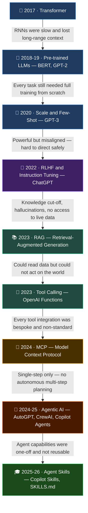

## 🙋 Who Is This For?

If you spent the last couple of years heads-down in an exam, a job, a family situation — basically anything that kept you away from tech news — you may have surfaced to find that everyone around you is suddenly talking about AI in a completely different language. **You are not alone.**

This post started with a conversation with a close relative of mine. She had spent the last few years locked into serious exam preparation — the kind where you genuinely disconnect from everything else. When she came out the other side, she asked me a simple question: *"What's going on with all this AI stuff?"* She's curious, and capable — she just hadn't had the bandwidth to follow along while it was happening.

I started searching suitable courses and playlists for het, and that's when I noticed the problem. Every resource I found assumed you'd been watching the space for months or years. The AI development moved so fast that even well-intentioned beginner content from 2023 already feels like it drops you in the middle of a story.

The problem isn't that you're behind. The problem is that most AI courses and playlists were created *alongside* the development as it happened. That means they assume you've been following along. They go deep fast. They're full of jargon that makes perfect sense if you've watched fifty prior videos — and zero sense if you haven't.

This post is my attempt to fix that. It's built for someone who just needs a clear map of *what happened, in what order, and why it mattered* — before diving into any deep course.

You'll find:
- **A curated playlist** of short, beginner-friendly videos that each explain one concept cleanly
- **A visual timeline** of how AI evolved, and *why* each breakthrough was necessary
- **A curriculum** if you want to go one level deeper on a specific topic

No prior knowledge assumed. Start anywhere that catches your interest.

---

## ▶️ YouTube Video Playlist

This blog contains a curated list of AI/LLM videos:

| # | Title |
|---|-------|
| 1 | [AI, Machine Learning, Deep Learning and Generative AI Explained](https://www.youtube.com/watch?v=qYNweeDHiyU) |
| 2 | [Generative vs Agentic AI: Shaping the Future of AI Collaboration](https://www.youtube.com/watch?v=EDb37y_MhRw) |
| 3 | [What is generative AI and how does it work? – The Turing Lectures](https://www.youtube.com/watch?v=_6R7Ym6Vy_I) |
| 4 | [What are Generative AI models?](https://www.youtube.com/watch?v=hfIUstzHs9A) |
| 5 | [Fine Tuning LLM Explained Simply](https://www.youtube.com/watch?v=ezdIOLbUSWg) |
| 6 | [What is Mixture of Experts?](https://www.youtube.com/watch?v=sYDlVVyJYn4) |
| 7 | [What is a Context Window? Unlocking LLM Secrets](https://www.youtube.com/watch?v=-QVoIxEpFkM) |
| 8 | [RAG vs. Fine Tuning](https://www.youtube.com/watch?v=00Q0G84kq3M) |
| 9 | [Knowledge Distillation: How LLMs train each other](https://www.youtube.com/watch?v=jrJKRYAdh7I) |
| 10 | [What is Tool Calling? Connecting LLMs to Your Data](https://www.youtube.com/watch?v=h8gMhXYAv1k) |
| 11 | [AI Tool Calling via Natural Language: LLMs, APIs & Docker in Action](https://www.youtube.com/watch?v=gosZ_vqXkMI) |
| 12 | [MCP vs API: Simplifying AI Agent Integration with External Data](https://www.youtube.com/watch?v=7j1t3UZA1TY) |
| 13 | [CLI vs MCP: How AI Agents Choose the Right Tool for the Job](https://www.youtube.com/watch?v=g9JIUM0MHgQ) |
| 14 | [MCP vs. RAG: How AI Agents & LLMs Connect to Data](https://www.youtube.com/watch?v=X95MFcYH1_s) |
| 15 | [MCP vs Skills: Which Is Right for Your AI Agent and LLMs?](https://www.youtube.com/watch?v=goU9VIXA8II) |
| 16 | [What AI Agent Skills Are and How They Work](https://www.youtube.com/watch?v=Lg-meK5IU8Q) |


## 🗺️ AI / LLM Evolution — Why Each Discovery Happened

Every breakthrough below was triggered by a frustration the previous one left behind. The arrow between each milestone *is* the problem that forced the next step.



| # | Milestone | ✅ Problem It Solved | ❌ Problem It Left Behind |
|---|-----------|----------------------|--------------------------|
| 1 | **2017 · Transformer** — *Attention Is All You Need* | RNNs couldn't parallelise and lost context over long sequences | Every downstream task still needed a full model trained from scratch |
| 2 | **2018–19 · Pre-trained LLMs** — BERT, GPT-2 | Train once on massive data, fine-tune cheaply per task — transfer learning unlocked | Models predicted tokens but couldn't reliably follow instructions or user intent |
| 3 | **2020 · GPT-3** — Scale and Few-Shot Learning | Emergent reasoning; tasks solved with just a few examples in the prompt — no fine-tuning needed | Extremely capable but unpredictable and misaligned — unsafe to deploy as-is |
| 4 | **2022 · RLHF + Instruction Tuning** — InstructGPT, ChatGPT | Human feedback shaped models to follow intent safely and consistently | Hard knowledge cut-off date; hallucinations on unknown facts; no access to live or private data |
| 5 | **2023 · RAG** — Retrieval-Augmented Generation | Inject real-time or private documents at query time — no retraining required | LLMs could read and reason over data but still couldn't take actions in the real world |
| 6 | **2023 · Tool / Function Calling** — OpenAI Functions, LangChain | LLMs call APIs, run code, query databases — bridging language to action | Every tool had to be wired manually with custom code; no shared standard, hard to scale |
| 7 | **2024 · MCP** — Model Context Protocol | Open standard so any LLM can connect to any tool or data source with zero custom glue | Interactions were still single-step; no model for autonomous multi-turn planning or looping |
| 8 | **2024–25 · Agentic AI** — AutoGPT, CrewAI, Copilot Agents | LLMs plan, loop, delegate to sub-agents and execute long multi-step tasks autonomously | Agent logic was monolithic and bespoke — built once per use-case, not reusable across agents |
| 9 | **2025–26 · Agent Skills** — Copilot Skills, Semantic Kernel | Package domain knowledge, tools and workflows as plug-in capabilities any agent can reuse | *(Current frontier — watch this space)* |


## 🎓 Curriculum Task

**Question to answer:**
> *How does the number of MCP tool calls impact/hamper the context window?*

---

### 📚 Suggested Study Path

**Step 1 — Foundation (Watch first)**
- [ ] 🎬 [What is a Context Window? Unlocking LLM Secrets](https://www.youtube.com/watch?v=-QVoIxEpFkM)
- [ ] 🎬 [What is Tool Calling? Connecting LLMs to Your Data](https://www.youtube.com/watch?v=h8gMhXYAv1k)

**Step 2 — MCP Specifics**
- [ ] 🎬 [MCP vs API: Simplifying AI Agent Integration](https://www.youtube.com/watch?v=7j1t3UZA1TY)
- [ ] 🎬 [MCP vs Skills: Which Is Right for Your AI Agent?](https://www.youtube.com/watch?v=goU9VIXA8II)
- [ ] 🎬 [CLI vs MCP: How AI Agents Choose the Right Tool](https://www.youtube.com/watch?v=g9JIUM0MHgQ)

**Step 3 — Advanced Context**
- [ ] 🎬 [AI Tool Calling via Natural Language: LLMs, APIs & Docker](https://www.youtube.com/watch?v=gosZ_vqXkMI)
- [ ] 🎬 [MCP vs. RAG: How AI Agents & LLMs Connect to Data](https://www.youtube.com/watch?v=X95MFcYH1_s)

---

### 🧠 Key Concepts to Understand

```
Context Window
│
├── Fixed token budget (e.g. 128K, 200K tokens)
│
├── Each MCP Tool Call consumes tokens:
│   ├── Tool DEFINITION (schema/description)  → added at system level
│   ├── Tool CALL request  (LLM output)        → output tokens
│   └── Tool RESULT (server response)          → input tokens
│
└── Problem with many MCP tools:
    ├── 🔴 More tools registered = larger system prompt
    ├── 🔴 Each call+result eats into remaining context
    ├── 🔴 Multi-hop chains (tool → tool → tool) multiply usage
    └── 🔴 Long tool results (e.g. big JSON/DB dumps) spike token use
```

### 📝 Research Question Breakdown

| Sub-Question | Where to Find Answer |
|---|---|
| What is a token/context window? | [#7](https://www.youtube.com/watch?v=-QVoIxEpFkM) |
| How are tool schemas stored in context? | [#10](https://www.youtube.com/watch?v=h8gMhXYAv1k) |
| How do MCP tool results fill context? | [#11](https://www.youtube.com/watch?v=gosZ_vqXkMI) [#12](https://www.youtube.com/watch?v=7j1t3UZA1TY) |
| What happens when context is full? | [#7](https://www.youtube.com/watch?v=-QVoIxEpFkM) |
| How to optimize (RAG vs MCP)? | [#8](https://www.youtube.com/watch?v=00Q0G84kq3M) [#14](https://www.youtube.com/watch?v=X95MFcYH1_s) |

### 🎯 Expected Answer Summary (to verify after study)
> Every MCP tool call injects **3 token blocks** into the context window: ①tool schema definitions, ②the call arguments, ③the tool response. With many tools or long chains, this rapidly consumes the fixed token budget → the LLM truncates older context, loses memory of earlier conversation/results, and performance degrades or errors occur.
