import PlaceLink from '../../components/PlaceLink.astro'

export const stateColor = {
  WB: "#22c55e",
  AS: "#3b82f6",
  ML: "#a855f7",
  AP: "#ef4444",
}

---

## Index

1. [Overview & Route](#overview--route)
2. [Scram 440 — Fuel Planning](#scram-440--fuel-planning)
3. [Permits & Documents](#permits--documents)
4. [Best Time to Go](#best-time-to-go)
5. [Phase 1 — Travel: Kolkata → Meghalaya](#phase-1--travel-kolkata--meghalaya)
6. [Phase 2 — WFH Base: Meghalaya Research](#phase-2--wfh-base-meghalaya-research)
7. [Phase 3 — Travel: Tawang, Kaziranga & Anini](#phase-3--travel-tawang-kaziranga--anini)
8. [Logistics & Tips](#logistics--tips)
9. [Packing List](#packing-list)

---

## Overview & Route

<figure>
  
  <figcaption>Royal Enfield Scram 440 — ~5,500 km across West Bengal, Assam, Meghalaya and Arunachal Pradesh.</figcaption>
</figure>

**Bike:** Royal Enfield Scram 440
**Starting point:** Kolkata

**States covered:** West Bengal · Assam · Meghalaya · Arunachal Pradesh

**Key stops:** <PlaceLink name="Shillong" state="Meghalaya" /> · <PlaceLink name="Cherrapunji" state="Meghalaya" /> · <PlaceLink name="Dawki" state="Meghalaya" /> · <PlaceLink name="Sela Pass" state="Arunachal Pradesh" /> (4,170m) · <PlaceLink name="Tawang" state="Arunachal Pradesh" /> · <PlaceLink name="Kaziranga" state="Assam" /> · <PlaceLink name="Majuli" state="Assam" /> · <PlaceLink name="Anini" state="Arunachal Pradesh" />

**Total distance:** ~5,500 km | **Total days:** ~33

**Leave structure:**

| Block | Duration | Days | Mode |
|---|---|---|---|
| Phase 1 travel | 7 days (Sat–Fri) | Days 1–7 | Leave (Mon–Fri) + weekends |
| Weekend 1 | 2 days (Sat–Sun) | Days 8–9 | No work — root bridge + Mawlynnong + Dawki overnight |
| **WFH week** | **5 days (Mon–Fri)** | **Days 10–14** | **Work from Shillong, 10 AM–6 PM. No riding during work hours.** |
| Weekend 2 | 2 days (Sat–Sun) | Days 15–16 | No work — Krang Suri + Dawki + travel to Guwahati |
| Phase 3 travel | ~17 days | Days 17–33 | Leave (Mon–Fri) + weekends |

### Route Diagram

```mermaid
flowchart LR
    %% ─── MAIN ROUTE ────────────────────────────────────────────────
    KOL["1. Kolkata\nD1 · West Bengal"]
        -->|"D1"| SIL["2. Siliguri\nD1–2 · West Bengal\nDooars gateway · momos · NH junction"]
    SIL -->|"D2"| GHY["3. Guwahati\nD2–4 · Assam\nKamakhya · Umananda · Brahmaputra · apply ILP"]
    GHY -->|"D4"| SHL["4. Shillong · WFH base\nD4–5 · D10–14 · Meghalaya\nShillong Peak · Elephant Falls · Don Bosco Museum · Laitlum Canyon"]
    SHL -->|"D6"| CHR["5. Cherrapunji\nD6–8 · Meghalaya\nNohkalikai · Seven Sisters · Mawsmai Cave · Arwah Cave · Wei Sawdong · Root Bridge trek D8"]
    CHR -->|"D9"| DWK["6. Dawki\nD9 · D15 · Meghalaya\nUmngot crystal river · Shnongpdeng cliff jump · riverside camp"]
    DWK -->|"D16"| GHY
    GHY -->|"D17"| TEZ["7. Tezpur\nD17 · Assam\nAgnigarh Hill · Da Parbatia ruins · Nameri NP buffer"]
    TEZ -->|"D18"| BHL["8. Bhalukpong · ILP check\nD18 · Arunachal P.\nKameng river · last plains fuel"]
    BHL -->|"D18"| BOM["9. Bomdila\nD18 · D22 · Arunachal P.\nGontse Gang monasteries · apple orchards · valley views"]
    BOM -->|"D18"| DIR["10. Dirang\nD18 · Arunachal P.\nSangti Valley cranes · Dirang Hot Spring · Dzong"]
    DIR -->|"D19"| SEL["11. Sela Pass · 4170m\nD19 · Arunachal P.\nSela Lake · prayer flags · Jaswant Garh memorial · Nuranang Falls"]
    SEL -->|"D19"| TWG["12. Tawang\nD19–22 · Arunachal P.\nMonastery · Urgelling · War Memorial · Madhuri Lake · PT Tso · Bum La · Gongkar La"]
    TWG -->|"D22 · return\nSela Tunnel"| BOM
    BOM -->|"D23"| KZR["13. Kaziranga NP\nD23–24 · Assam\nCentral Range · Eastern Range · Western Range · rhino · tiger · elephant"]
    KZR -->|"D25"| MAJ["14. Majuli\nD25–26 · Assam\nKamalabari Satra · Auniati Satra · village cycling · Brahmaputra sunrise"]
    MAJ -->|"D26"| SIV["15. Sivasagar\nD26 · Assam\nRang Ghar · Talatal Ghar · Shiva Dol · Kareng Ghar"]
    SIV -->|"D26"| DBR["16. Dibrugarh\nD26–27 · Assam\nAnini supplies · cash · jerry can · offline maps"]
    DBR -->|"D27"| ROI["17. Roing\nD27 · Arunachal P.\nMehao Lake · last ATM · road conditions intel"]
    ROI -->|"D28"| MAY["18. Mayudia Pass · 2655m\nD28 · Arunachal P.\noak–rhododendron forest · autumn colour · CRPF post"]
    MAY -->|"D28"| ANI["19. Anini\nD28–30 · Arunachal P.\nDri River cane bridges · Idu Mishmi homestay · Dibang Wildlife Sanctuary boundary"]

    %% ─── ⚡ OPTIONAL — no extra days needed ────────────────────────
    SIL -.->|"⚡ +overnight"| JLD(["⚡ Jaldapara NP\nWB Dooars"])
    GHY -.->|"⚡ D17 +2hrs"| POB(["⚡ Pobitora WLS\nAssam"])
    SHL -.->|"⚡ D10–14 AM"| MWP(["⚡ Mawphlang Forest\nMeghalaya"])
    CHR -.->|"⚡ D6"| KYN(["⚡ Kynrem Falls\nMeghalaya"])
    DWK -.->|"⚡ D16"| NAR(["⚡ Nartiang Monoliths\nMeghalaya"])
    BOM -.->|"⚡ D18"| THB(["⚡ Thembang Village\nArunachal P."])
    TWG -.->|"⚡ D20–21"| GNK(["⚡ Gongkar La ~4500m\nArunachal P."])
    TWG -.->|"⚡ D21"| ZEM(["⚡ Zemithang Valley\nArunachal P."])
    DBR -.->|"⚡ D27"| DIG(["⚡ Digboi + Dehing Patkai\nAssam"])

    %% ─── ➕ EXTENSIONS — requires extra days ───────────────────────
    SIL -.->|"➕ +1–2d\nSikkim permit"| ZUL(["➕ Zuluk · Silk Route\nSikkim"])
    GHY -.->|"➕ +1 day"| MAN(["➕ Manas NP · UNESCO\nAssam"])

    %% ─── COLOUR CLASSES ────────────────────────────────────────────
    classDef wb   fill:#22c55e,stroke:#16a34a,color:#fff
    classDef as   fill:#3b82f6,stroke:#1d4ed8,color:#fff
    classDef ml   fill:#a855f7,stroke:#7e22ce,color:#fff
    classDef ap   fill:#ef4444,stroke:#b91c1c,color:#fff
    classDef opt  fill:#fef08a,stroke:#b45309,color:#1c1917
    classDef ext  fill:#e5e7eb,stroke:#6b7280,color:#374151

    class KOL,SIL wb
    class GHY,TEZ,KZR,MAJ,SIV,DBR as
    class CHR ml
    class BHL,BOM,DIR,SEL,TWG,ROI,MAY,ANI ap
    class JLD,POB,MWP,KYN,NAR,THB,GNK,ZEM,DIG opt
    class ZUL,MAN ext

    style SHL fill:#fb923c,stroke:#ea580c,color:#fff
    style DWK fill:#fb923c,stroke:#ea580c,color:#fff
    style ANI fill:#ef4444,stroke:#b91c1c,color:#fff
```

**Legend:** 🟢 West Bengal &nbsp;·&nbsp; 🔵 Assam &nbsp;·&nbsp; 🟣 Meghalaya &nbsp;·&nbsp; 🔴 Arunachal Pradesh &nbsp;·&nbsp; 🟠 WFH base &nbsp;·&nbsp; 🟡 ⚡ Optional / easy add &nbsp;·&nbsp; ⬜ ➕ Requires extra days &nbsp;·&nbsp; `D-n` = travel day &nbsp;·&nbsp; day range in node = days spent at that stop

> 🗺️ **[Open Full Route on Google Maps →](https://www.google.com/maps/dir/Kolkata,+West+Bengal/Siliguri,+West+Bengal/Guwahati,+Assam/Shillong,+Meghalaya/Cherrapunji,+Meghalaya/Dawki,+Meghalaya/Tezpur,+Assam/Bomdila,+Arunachal+Pradesh/Tawang,+Arunachal+Pradesh/Kaziranga+National+Park,+Assam/Jorhat,+Assam/Majuli,+Assam/Sivasagar,+Assam/Dibrugarh,+Assam/Roing,+Arunachal+Pradesh/Anini,+Arunachal+Pradesh/)** — 16 stops across West Bengal · Assam · Meghalaya · Arunachal Pradesh · ~5,500 km

---

## Scram 440 — Fuel Planning

**Royal Enfield Scram 440 specs:**

| Spec | Value |
|---|---|
| Engine | 443cc single-cylinder |
| Fuel tank | 13L |
| Reserve | ~2.5L |
| ARAI mileage | ~35 km/L (claimed) |
| Real-world highway (loaded, luggage) | ~26–30 km/L |
| Real-world hilly terrain | ~20–24 km/L |
| Extreme rough off-road (Roing–Anini) | ~16–20 km/L |

**Effective safe range** (refuel when ~2.5L reserve remains):

| Terrain | Est. mileage | Safe range before refuel |
|---|---|---|
| Flat NH highway | 28 km/L | 290–300 km |
| Hilly roads (Meghalaya/W. Arunachal) | 22 km/L | 225–240 km |
| Rough mountain (Roing–Anini) | 18 km/L | 185–200 km |

**Segment-by-segment fuel plan:**

| Segment | Distance | Terrain | Fuel stops needed | Critical notes |
|---|---|---|---|---|
| Kolkata → Siliguri | 570 km | Flat NH | Raiganj (~350 km) | Fill Kolkata + Raiganj |
| Siliguri → Guwahati | 430 km | Flat | Bongaigaon (~310 km) | Fill Siliguri + Bongaigaon |
| Guwahati → Shillong | 100 km | Hilly | None needed | Fill at Jorabat (last Assam pump before ML) |
| Shillong → Cherrapunji | 55 km | Hilly | None | Fill Police Bazaar, Shillong |
| Cherrapunji → Dawki | 85 km | Hilly | Pynursla (~35 km) | Fill Sohra before leaving |
| Dawki → Guwahati | 180 km | Hilly→flat | Jowai (~60 km) | Fill Dawki |
| Guwahati → Tezpur | 180 km | Flat | None needed | Easy |
| Tezpur → Dirang | 200 km | Flat→mountain | **Bhalukpong** (ILP entry, ~60 km) | **Fill at Bhalukpong (last plains pump)**, top-up Bomdila |
| Dirang → Tawang | 140 km | High mountain | **None on route** | **Fill full at Bomdila/Dirang. No pump until Tawang.** |
| Tawang → Bomdila | 165 km | Mountain | None on route | Tawang govt pump unreliable — fill if available, plan for worst |
| Bomdila → Kaziranga | 360 km | Mountain→flat | Tezpur (~230 km) | Fill Bomdila + Tezpur |
| Kaziranga → Dibrugarh | 150 km | Flat | None needed | Easy |
| Dibrugarh → Roing | 165 km | Flat→hilly | None needed | **Fill full at Roing — last reliable pump** |
| **Roing → Anini** | **228 km** | **Extreme rough** | **Hunli (~100 km, unreliable)** | **Fill Roing + carry 5L jerry can. Do not rely on Hunli or Anini pump.** |
| Anini → Dibrugarh | 393 km | Rough→flat | Hunli (if available) + Roing | Leave Anini with max fuel |

---

## Permits & Documents

| Permit | Required for | How to get | Fee |
|---|---|---|---|
| **Inner Line Permit (ILP)** | All of Arunachal Pradesh | **Primary:** [eilp.arunachal.gov.in](https://eilp.arunachal.gov.in) (Govt portal, launched Nov 2022) · **Backup:** [arunachalilp.com](https://arunachalilp.com) · **Offline:** Arunachal Bhawan, Guwahati (R.G. Baruah Road) | ₹300 (up to 3 days) · ₹500 (up to 14 days) |
| **Bum La Pass Local Permit** | Bum La only (separate from ILP) | DC + Brigadier's office, Tawang town — apply by 4–5 PM the evening before, ready next morning | ~₹100 |

<strong>📋 ILP Step-by-Step (eilp.arunachal.gov.in)</strong> 
1. Go to <a href="https://eilp.arunachal.gov.in">eilp.arunachal.gov.in</a> → click <em>Apply ILP</em> 
2. Verify mobile via OTP 
3. Fill personal details, travel dates, purpose 
4. <strong>List every district your route passes through</strong> — missing one district = invalid at that checkpost 
5. <strong>Select entry gate: Bhalukpong</strong> (for Tawang circuit) or Roing/Sadiya (for Dibang Valley/Anini) 
6. Upload photo: JPG, white background, <strong>strictly 20–50 KB</strong> (resize using compressjpeg.com if needed) 
7. Upload ID: JPG/PDF, 20–200 KB, English/Hindi script only (Aadhaar recommended) 
8. Pay online. Approval often same-day during working hours (Mon–Fri, 10 AM–4 PM) 
9. Download PDF. Save to phone photos — <strong>not just browser</strong>. No signal at checkposts. 
 
<strong>Apply at least 5 days before departure.</strong> If eilp.arunachal.gov.in is down, use <a href="https://arunachalilp.com">arunachalilp.com</a> as fallback. Apply individually, not as a group — one member's rejection stalls the whole group application.

**Documents to carry (all original + 3 photocopies):**
- Aadhaar / Voter ID
- Driving licence
- Vehicle RC book + insurance + PUC
- 6 passport photos (ILP, permits, hotels)
- ILP printout (carry always in AP)

---

## Best Time to Go

**October–November** is the sweet spot:
- Post-monsoon: roads dry, green landscape, waterfalls still flowing
- Sela Pass: open (Sela Tunnel also available since March 2024)
- Kaziranga: safaris running (opens ~Oct 15)
- Anini road: stable before pre-winter rains
- Meghalaya WFH bases: dry, cool, ideal working conditions

**Avoid June–September:** monsoon. Meghalaya roads dangerous, Sela Pass closes, Anini road washes out.

**November riding note for Tawang/Sela:** Pack for sub-zero morning temperatures. Sela Pass can be −5°C to −10°C at dawn in November. Riding gloves, thermal layers, and a windproof jacket over a down jacket are mandatory.

---

### Departure Date Analysis for Snow — <PlaceLink name="Tawang" state="Arunachal Pradesh" /> & <PlaceLink name="Anini" state="Arunachal Pradesh" />

This is a 33-day trip. Within Phase 3, **<PlaceLink name="Sela Pass" state="Arunachal Pradesh" /> + <PlaceLink name="Tawang" state="Arunachal Pradesh" /> fall on Day 19** and **<PlaceLink name="Roing" state="Arunachal Pradesh" /> → <PlaceLink name="Anini" state="Arunachal Pradesh" /> via <PlaceLink name="Mayudia Pass" state="Arunachal Pradesh" /> falls on Day 28**. Working backward from the snow windows of each destination gives the optimal Kolkata departure date.

**Snow windows by location:**

| Location | Altitude | First snow | Reliable snow | Road closure risk |
|---|---|---|---|---|
| <PlaceLink name="Sela Pass" state="Arunachal Pradesh" /> | 4,170m | Late October | November onwards | **Low** — <PlaceLink name="Sela Tunnel" state="Arunachal Pradesh" /> (opened Mar 2024) bypasses the pass even when closed |
| <PlaceLink name="Tawang" state="Arunachal Pradesh" /> town | 2,669m | Early–mid November | **Late November** (best window) | Low–medium. Dec–Jan: heavy snow, sub-zero nights |
| <PlaceLink name="Mayudia Pass" state="Arunachal Pradesh" /> (Roing–Anini road) | 2,655m | Late November | December | Medium. **December onward: Roing–Anini road becomes unreliable** |
| <PlaceLink name="Anini" state="Arunachal Pradesh" /> town | 1,968m | December | January | High if Mayudia is snowbound — town access cuts off |

**Trip timing matrix — Kolkata departure vs snow at key stops:**

| Depart Kolkata | Tawang (Day 19) | Anini / Mayudia (Day 28) | Snow at Tawang town | Snow at Mayudia | Anini road |
|:---:|:---:|:---:|:---:|:---:|:---:|
| Oct 22 | Nov 9 | Nov 18 | ❌ None | ❌ Clear | ✅ Stable |
| Oct 29 | Nov 16 | Nov 25 | ⚡ Possible flurries | ⚡ First frost | ✅ Stable |
| **Nov 1–3** | **Nov 19–21** | **Nov 28–30** | **✅ Reliable early snow** | **✅ Snow on pass** | **✅ Passable** |
| Nov 6–8 | Nov 24–26 | Dec 2–4 | ✅ Good snow | ✅ Heavy snow | ⚠️ Risky |
| Nov 12+ | Dec 1+ | Dec 9+ | ✅ Heavy snow | ✅ Heavy snow | ❌ Likely closed |

  <strong>🏔️ Recommended departure window: November 1–3 from Kolkata</strong>  
  This puts <PlaceLink name="Tawang" state="Arunachal Pradesh" /> around <strong>November 19–21</strong> — the earliest window where snow reliably settles on the monastery roof and <PlaceLink name="Sela Pass" state="Arunachal Pradesh" /> is fully white. It also puts <PlaceLink name="Anini" state="Arunachal Pradesh" /> / <PlaceLink name="Mayudia Pass" state="Arunachal Pradesh" /> around <strong>November 28–30</strong>, which is late November — Mayudia has its first snow but the Roing–Anini road is still passable. Any later and the Anini leg becomes a genuine gamble on road closure.  
  <strong>Sela Tunnel factor:</strong> The <PlaceLink name="Sela Tunnel" state="Arunachal Pradesh" /> (opened March 2024) bypasses the open pass at 3,000m even when the 4,170m pass road is snowbound. This removes what used to be the biggest closure risk on the Tawang circuit — so the main constraint now is the Roing–Anini road via Mayudia, not Sela.  
  <strong>Kaziranga:</strong> Opens ~October 15. A November 1 departure is perfectly fine — the park is early-season, uncrowded, and animals are still in the open grasslands.

**What to expect at each location with a November 1–3 departure:**

| Day | Location | Expected conditions |
|---|---|---|
| Day 19 (~Nov 19–21) | <PlaceLink name="Sela Pass" state="Arunachal Pradesh" /> (4,170m) | Snow on the road, <PlaceLink name="Sela Lake" state="Arunachal Pradesh" /> partially frozen. −5°C to 0°C. White all around. |
| Day 19 (~Nov 19–21) | <PlaceLink name="Tawang" state="Arunachal Pradesh" /> (2,669m) | First snowfall likely on or around this date. Monastery roof and mountain ridges white. Nights: −2°C to 0°C. |
| Day 20–21 (~Nov 20–22) | <PlaceLink name="Madhuri Lake" state="Arunachal Pradesh" /> / <PlaceLink name="PT Tso Lake" state="Arunachal Pradesh" /> | Partially or fully frozen surface. Snow on surrounding ridges. Extraordinary. |
| Day 28 (~Nov 28–30) | <PlaceLink name="Mayudia Pass" state="Arunachal Pradesh" /> (2,655m) | Light–moderate snow on the pass, deciduous forest in late-autumn color or early snow. Still rideable but pack for cold. |
| Day 28–29 (~Nov 28–30) | <PlaceLink name="Anini" state="Arunachal Pradesh" /> (1,968m) | No snow in town at this altitude. Surrounding 5,000m+ peaks fully white. Frost at night (0°C to 4°C). The high-mountain backdrop is winter. |

---

## Phase 1 — Travel: Kolkata → Meghalaya

### Day 1 — <PlaceLink name="Kolkata" /> → <PlaceLink name="Siliguri" />

**Distance:** 570 km | **Road:** NH12 | **Riding:** 9–10 hours

  <strong>⛽ Scram 440 Fuel Plan</strong> — Fill at Kolkata (start). Fill at <strong>Raiganj/Dalkhola (~370 km)</strong>. Arrive Siliguri with ~50 km reserve. Range each leg: ~290 km flat highway on 13L.

- **6:00 AM:** Depart Kolkata, NH12 via Dankuni Expressway.
- **8:30 AM:** Bardhaman (~180 km) — tea + paratha at a highway dhaba.
- **12:00 PM:** Raiganj / Dalkhola area (~370 km) — **fill fuel here.** Lunch stop. Assam–West Bengal plains stretch.
- **4:30 PM:** Enter Siliguri. Mahananda Wildlife Sanctuary flanks the final approach.
- **5:30 PM:** Check in near Sevoke Road / Hill Cart Road. Hotel Chancellor, Hotel Sinclairs, or budget guest houses.
- **Evening:** Siliguri's Hill Cart Road for dinner — momos, Bengali fish curry.

  <strong>🏔️ Offbeat Side Trip from Siliguri: Zuluk / Old Silk Route (Sikkim)</strong> 
  If you can absorb 1–2 extra days — outbound or on the return via Siliguri — the <strong>Zuluk–Nathang–Kupup circuit</strong> in Eastern Sikkim is arguably the finest offbeat bike ride in all of NE India. The route follows the original Silk Route mule track through Thambi View Point, Nathang Valley (4,000m), Old Baba Mandir, and Kupup Lake (Elephant Lake). Kangchenjunga views throughout. Almost exclusively done by bikers — no bus or cab tourist does this. <strong>Permits required:</strong> Sikkim Protected Area Permit (free, obtained at Rangpo/Mangan in minutes) + Restricted Area Permit for Zuluk (~₹100 online). Route: Siliguri → Rongli → Zuluk (overnight) → Nathang → Kupup → Gangtok or loop back (~130 km one way from Siliguri). If doing this on the return leg, restructure Day 32–33 to include a Siliguri → Zuluk overnight before the final Siliguri → Kolkata day.

---

### Day 2 — <PlaceLink name="Siliguri" /> → <PlaceLink name="Guwahati" state="Assam" />

**Distance:** 430 km | **Road:** NH27 | **Riding:** 7–8 hours

  <strong>🗺️ State Border Crossing:</strong> West Bengal → Assam near <strong>Golakganj / Dhubri</strong> (~310 km from Siliguri on NH27). Signs and checkposts confirm the crossing.

  <strong>⛽ Scram 440 Fuel Plan</strong> — Fill Siliguri. Fill at <strong>Bongaigaon (~310 km, Assam)</strong>. Arrive Guwahati comfortably.

- **6:00 AM:** Depart Siliguri. NH27 through the Dooars: tea gardens, forested hills, elephant crossings.
- **8:30 AM:** Cooch Behar (~80 km). Optional 30-min detour to the Cooch Behar Palace.
- **11:30 AM:** Cross into Assam. Brahmaputra plains open up.
- **1:00 PM:** Bongaigaon — **fill fuel.** Lunch at a local dhaba (Assamese thali: rice, dal, mustard fish).
- **5:30 PM:** Arrive Guwahati, south bank of the Brahmaputra.
- **Evening:** Brahmaputra riverfront (Uzan Bazar ghat). Sunset over the widest stretch of river you'll see anywhere in India.

---

### Day 3 — <PlaceLink name="Guwahati" state="Assam" /> — City Exploration

  <strong>📋 Action today:</strong> Apply for ILP online at <a href="https://eilp.arunachal.gov.in">eilp.arunachal.gov.in</a> (official Govt portal, Nov 2022). Backup: <a href="https://arunachalilp.com">arunachalilp.com</a>. Takes 1–2 days. You'll need it from Day 15 onwards. Upload Aadhaar + passport photo (JPG, white background, 20–50 KB exactly). Select entry gate: <strong>Bhalukpong</strong>.

- **7:00 AM:** <PlaceLink name="Kamakhya Temple" state="Assam" />. One of 51 Shakti Peethas, Nilachal Hill. Go early for shorter queue. Allow 2 hours.
- **10:00 AM:** <PlaceLink name="Umananda Island" state="Assam" /> — ferry from Kachari Ghat (15 min). Shiva temple, golden langur monkeys.
- **12:00 PM:** Lunch at Paradise Restaurant (Police Bazaar area) or Anand Bhavan for Assamese food.
- **2:00 PM:** Assam State Museum — NE India archaeology and tribal culture. 1.5 hours.
- **4:00 PM:** Brahmaputra cruise from Fancy Bazar ghat.
- **Dinner:** Gam's Restaurant or street food at Pan Bazaar (lakhi pitha, khar fish curry).

---

### Day 4 — <PlaceLink name="Guwahati"  state="Assam" /> → <PlaceLink name="Shillong" state="Meghalaya" />

**Distance:** 100 km | **Road:** NH6 | **Riding:** 3–4 hours

  <strong>🗺️ State Border Crossing:</strong> Assam → Meghalaya at <strong>Jorabat</strong> (~12 km south of Guwahati on NH6). You'll notice the road immediately starting to climb into the Khasi Hills.

  <strong>⛽ Scram 440 Fuel Plan</strong> — Fill at <strong>Jorabat or Guwahati outskirts</strong> (last Assam pumps before Meghalaya hills). Shillong has pumps, but prices are slightly higher in Meghalaya. Range: only 100 km, no concern.

- **8:00 AM:** Depart Guwahati on NH6.
- **10:00 AM:** **<PlaceLink name="Umiam Lake" state="Meghalaya" /> (Barapani)** — 15 km before Shillong. Pine-forested reservoir, stunning viewpoint. 30 min stop.
- **11:00 AM:** Arrive Shillong. Check in near Police Bazaar area.
- **2:30 PM:** Police Bazaar on foot — Khasi shawls, bamboo crafts, smoked meat. Try jadoh rice with pork at a local stall.
- **5:00 PM:** Ward's Lake. Peaceful 30-min walk, boating available.
- **7:00 PM:** Café culture — Dylan's Café (live music possible), ML05 Café in Laitumkhrah.

---

### Day 5 — <PlaceLink name="Shillong" state="Meghalaya" /> — Full Day Exploration

- **6:30 AM:** **<PlaceLink name="Shillong Peak" state="Meghalaya" />** (1,965m) — highest point in the city. Narrow bike road to the IAF-controlled summit viewpoint. Panoramic views before the morning cloud rolls in.
- **9:00 AM:** **<PlaceLink name="Elephant Falls" state="Meghalaya" />** (12 km) — three-tier waterfall, well-maintained steps. Entry ₹20.
- **11:00 AM:** **<PlaceLink name="Don Bosco Museum" state="Meghalaya" />** — 7 floors on NE India cultures. Best museum in the region. Allow 2 hours.
- **2:00 PM:** Lunch near Police Bazaar. Smoked pork with sticky rice.
- **4:00 PM:** **<PlaceLink name="Laitlum Canyon" state="Meghalaya" />** (24 km) — "End of the Hills." Deep V-shaped valleys, cloud-wrapped ridges, small cliff villages. Sunset here is extraordinary.

> **Offbeat alternative afternoon:** **<PlaceLink name="Mawphlang Sacred Forest" state="Meghalaya" />** (25 km from Shillong) — a 400-year-old Khasi sacred grove (*Law Lyngdoh*) where tribal custom forbids removing anything: not a leaf, not a stone, not a berry. The forest has been protected this way for centuries — by taboo, not by government. A custodian clan called the *nongkynmaw* guides you through. Biodiversity inside the grove vs. outside its boundary is visibly, startlingly different. Entry with guide ₹200–300. Allow 2 hours minimum. If doing this, skip Laitlum Canyon today and save it for the WFH Friday morning (Day 14) instead.

---

### Day 6 — <PlaceLink name="Shillong"  state="Meghalaya" /> → <PlaceLink name="Cherrapunji/Sohra" state="Meghalaya" />

**Distance:** 55 km | **Road:** via Mawkdok | **Riding:** 2 hours

  <strong>⛽ Scram 440 Fuel Plan</strong> — Fill at Police Bazaar, Shillong before leaving. One pump at Mawkdok area midway. Sohra market has a pump. 55 km is trivial.

- **8:00 AM:** Depart Shillong on winding hill road.
- **9:00 AM:** **<PlaceLink name="Mawkdok Dympep Valley" state="Meghalaya" />** — gorge disappears below you, clouds below the cliff edge. 20 min stop.
- **10:00 AM:** Arrive Sohra (Cherrapunji). Check in at Cherrapunjee Holiday Resort or Polo Orchid Resort (both overlook the gorge). Budget: NG Eco Homestay.
- **12:00 PM:** **<PlaceLink name="Nohkalikai Falls" state="Meghalaya" />** (340m drop, tallest plunge waterfall in India). Walk to the cliff edge.
- **1:30 PM:** **<PlaceLink name="Seven Sisters Falls" state="Meghalaya" />** — 7 streams down the same limestone cliff. Entry ₹20.
- **3:00 PM:** **<PlaceLink name="Eco Park" state="Meghalaya" />** — cliff-edge park overlooking Bangladesh plains and waterfalls.
- **3:45 PM:** **<PlaceLink name="Thangkharang Park & Kynrem Falls" state="Meghalaya" />** (12 km from Sohra on the road toward Shella) — another cliff-edge park overlooking Bangladesh, with a direct view of **Kynrem Falls** (305m, three-tier cascade). Far fewer visitors than Eco Park or Nohkalikai, and the falls are wider and more dramatic in wet season. Entry ₹20. 1 hr total.
- **5:00 PM:** **<PlaceLink name="Mawsmai Cave" state="Meghalaya" />** — 150m lit limestone cave. Entry ₹20.
- **Dinner:** Orange Roots or Jiva Grill in Sohra.

---

### Day 7 — <PlaceLink name="Cherrapunji" state="Meghalaya" /> — Waterfalls & Caves

- **7:00 AM:** **<PlaceLink name="Wei Sawdong Falls" state="Meghalaya" />** — 3-tier hidden waterfall, 30-min forest trek. Aquamarine pools. Swim if warm enough. Start early.
- **10:00 AM:** Breakfast, then **<PlaceLink name="Arwah Cave" state="Meghalaya" />** — fossil-embedded limestone passages, 65–70 million year old marine fossils. Entry ₹30.
- **1:00 PM:** Lunch at guesthouse.
- **2:30 PM:** **<PlaceLink name="Garden of Caves" state="Meghalaya" />** — caves + waterfalls trail in the gorge. Entry ₹20.
- **4:00 PM:** **<PlaceLink name="Dainthlen Falls" state="Meghalaya" />** — rocky gorge waterfall with a Khasi serpent legend. Short walk from road.
- **Evening:** Plan tomorrow's root bridge trek. Download offline trail map for Tyrna–Nongriat. Lay out gear: carry 2L water, snacks, phone fully charged, light daypack.

---

## Phase 2 — WFH Base: Meghalaya Research

### WFH Location Analysis

Three potential bases evaluated for WFH suitability:

  <strong>💡 WFH Base Decision (confirmed):</strong> <strong>Shillong</strong> is the only reliable choice for Monday–Friday WFH with full connectivity. Dawki and Shnongpdeng have patchy signal — good for a weekend, not for 5 days of committed work. The plan has been structured accordingly: WFH <strong>Days 10–14 (Mon–Fri) from Shillong</strong>, with Dawki as a Saturday trip (Day 15) after the work week ends.

#### Option A — Shillong *(Best connectivity)*

**Altitude:** 1,495–1,965m | **Climate type:** Subtropical highland (Cwb)

**Weather during WFH window (Oct–Nov):**

| | October | November |
|---|---|---|
| Max temp | 21.9°C | 19.3°C |
| Min temp | 14.2°C | 10.4°C |
| Rainfall | 197 mm | 24.7 mm — essentially dry |
| Rainy days | 8.4 days | 1.5 days |
| Sunshine hrs/day | 5.7 | 7.2 |
| Humidity (17:30) | 90% | 88% |

**Connectivity:**

| Provider | Signal | Speed | WFH suitability |
|---|---|---|---|
| **Jio** | 4G/5G in city areas (Police Bazaar, Laitumkhrah, Mawlai) | 20–80 Mbps | ✅ Video calls fine |
| **Airtel** | 4G throughout city | 15–50 Mbps | ✅ Video calls fine |
| **BSNL** | 4G, city-wide | 5–20 Mbps | ✅ Backup, slower |
| **Vi (Vodafone-Idea)** | 4G, patchy | 5–15 Mbps | ⚠️ Not recommended as primary |
| **Broadband** | Airtel Fiber + BSNL available at hotels | 50–200 Mbps | ✅ Best option if hotel has it |

**WiFi at stays:** Hotel Polo Towers, Centre Point, and most mid-range hotels have WiFi. Quality varies — confirm with hotel and ask for a room on an upper floor near the router.

**WFH verdict:** Shillong is a city with proper infrastructure. Multiple co-working cafés exist (Café Shillong Heritage, Dylan's, various others with tables). Best choice if your role involves daily video calls. Power cuts are rare and brief.

---

#### Option B — Cherrapunji/Sohra *(Good connectivity, scenic)*

**Altitude:** 1,430m | **Climate type:** Subtropical highland (Cwb)

**Weather during WFH window (Oct–Nov):**

| | October | November |
|---|---|---|
| Max temp | 24.0°C | 21.8°C |
| Min temp | 15.3°C | 11.4°C |
| Rainfall | 461 mm | 49.3 mm — mostly dry |
| Rainy days | 7.6 days | 1.6 days |
| Sunshine hrs/day | n/a | n/a |
| **Note** | Still some rain | **Post-monsoon dry season begins** |

> **Important:** Cherrapunji receives extremely high monsoon rainfall (average 11,777 mm/year). But October and November are the dry season — Oct rainfall drops to 461mm (about 15% of the annual total), and November falls to 49mm. Misty mornings are common even in dry season as cloud formations build off the escarpment.

**Connectivity:**

| Provider | Signal | Speed | WFH suitability |
|---|---|---|---|
| **Jio** | 4G in Sohra town | 10–30 Mbps | ✅ Adequate for most tasks |
| **Airtel** | 4G in Sohra town, patchy at cliff viewpoints | 10–25 Mbps | ✅ Adequate |
| **BSNL** | 4G, often most reliable in smaller towns | 5–15 Mbps | ✅ Good fallback |
| **At viewpoints / outside town** | 1–2 bars Jio | Variable | ⚠️ Don't rely for calls |

**WiFi at stays:** Cherrapunjee Holiday Resort and Polo Orchid Resort have WiFi. Speeds quoted as 10–25 Mbps in guest reviews. Connection quality drops during peak tourist season.

**Power:** Stable in Sohra town. Occasional load-shedding (30–60 min), manageable with a power bank. All resorts have generator backup.

**WFH verdict:** Good enough for a WFH week if your role allows async work and occasional video calls. **Avoid scheduling video calls in the morning** — mist reduces morale and light quality, though connectivity is unaffected. Afternoons are clearest.

---

#### Option C — Dawki / Shnongpdeng *(Scenic but connectivity limited)*

**Altitude:** ~200m (much lower — Umngot river valley) | **Climate type:** Tropical/subtropical lowland

**Weather during WFH window (Oct–Nov):**

| | October | November |
|---|---|---|
| Max temp | ~27–30°C (warm, lowland valley) | ~24–28°C |
| Min temp | ~18–20°C | ~15–18°C |
| Rainfall | Low — post-monsoon dry season | Very dry |
| Condition | Warm, humid, mostly sunny | Warm, clear, ideal |

> Dawki is significantly warmer than Shillong/Cherrapunji because it's at only ~200m altitude vs 1,400–1,500m. In November, expect comfortable T-shirt temperatures during the day — beautiful riding and outdoor working conditions.

**Connectivity:**

| Location | Provider | Signal | Notes |
|---|---|---|---|
| **Dawki town** | Jio | 4G, 2–3 bars | Usable for calls, sometimes drops |
| **Dawki town** | Airtel | 4G, 2–3 bars | Similar to Jio |
| **Dawki town** | BSNL | 4G | Often best in small towns — government offices depend on it |
| **Shnongpdeng riverside** | Jio | 1–3 bars, intermittent | Works for WhatsApp, email; video calls drop |
| **Shnongpdeng riverside** | Airtel | 1–2 bars | Patchy |
| **Shnongpdeng riverside** | BSNL | 2–3 bars | Most reliable at camp |
| **Mawlynnong village** | Jio/Airtel | 2–3 bars | Workable for light tasks |

**Hotspot speed (Jio in Dawki town):** Typically 5–15 Mbps download, 2–8 Mbps upload. Adequate for email, Slack/Teams text, and occasional calls but video calls may stutter.

**WiFi at stays:** Shnongpdeng campsites do not offer reliable WiFi. Some homestays in Dawki town have basic WiFi (~5 Mbps). Confirm before booking.

**Power:** Riverside camps run on generator or solar. Power available during generator hours (usually 6–10 PM). Charging during work hours requires carrying fully charged power banks (20,000 mAh essential).

  <strong>⚠️ Dawki WFH Warning:</strong> Do not schedule video calls or important client meetings from Shnongpdeng camp. Use Dawki town (3–4 km away) for anything requiring reliable signal. Work from camp only during async/offline hours, then ride to town for calls and uploads.

**WFH verdict:** Possible but requires planning around connectivity gaps. Best strategy: **stay in a Dawki town homestay (not riverside camp)** for weekdays, use Shnongpdeng only on weekends when offline.

---

### Confirmed WFH Plan — Days 10–14 (Mon–Fri), <PlaceLink name="Shillong" state="Meghalaya" />

| Day | Activity | WFH base | Connectivity | No-travel window |
|---|---|---|---|---|
| Day 8 (Sat) | Double Decker Root Bridge trek | Cherrapunji | Offline — no calls needed | — |
| Day 9 (Sun) | Cherrapunji → Mawlynnong → Dawki (overnight) | Dawki town | Jio/Airtel 4G | — |
| **Day 10 (Mon)** | **Early ride Dawki → Shillong (done by 8:30 AM) + WFH Day 1** | **Shillong hotel** | **Jio 4G/5G, 20–80 Mbps** | **10 AM–6 PM** |
| **Day 11 (Tue)** | **WFH Day 2 — morning ride to Umiam Lake (back by 8 AM)** | **Shillong hotel** | **Jio 4G/5G + hotel WiFi** | **10 AM–6 PM** |
| **Day 12 (Wed)** | **WFH Day 3 — morning ride to Shillong Peak (back by 8 AM)** | **Shillong hotel** | **Jio 4G/5G + hotel WiFi** | **10 AM–6 PM** |
| **Day 13 (Thu)** | **WFH Day 4 — morning ride to Mawphlang Sacred Forest (back by 9:15 AM)** | **Shillong hotel** | **Jio 4G/5G + hotel WiFi** | **10 AM–6 PM** |
| **Day 14 (Fri)** | **WFH Day 5 — morning ride to Laitlum Canyon (back by 8:45 AM)** | **Shillong hotel** | **Jio 4G/5G + hotel WiFi** | **10 AM–6 PM** |
| Day 15 (Sat) | Shillong → Krang Suri Falls → Dawki (overnight) | Dawki | Jio/Airtel 4G | — |
| Day 16 (Sun) | Dawki → Guwahati | Transit | — | — |

---

### Day 8 — <PlaceLink name="Double Decker Root Bridge" state="Meghalaya" /> Trek *(<PlaceLink name="Cherrapunji" state="Meghalaya" />, Meghalaya)*

**Full day off — most physically demanding day**

- **6:00 AM:** Drive 20 km to <PlaceLink name="Tyrna village" state="Meghalaya" />. Park bike safely.
- **6:30 AM:** Descend 3,500 stone steps through jungle. Dense rainforest, suspension bridges over streams.
- **9:00 AM:** **<PlaceLink name="Single Root Bridge" state="Meghalaya" />** en route. Rubber fig roots trained across a stream, load-bearing after generations of growth.
- **10:45 AM:** **<PlaceLink name="Double Decker Living Root Bridge" state="Meghalaya" />**, Nongriat village. Two bridges stacked, the upper one 150+ years old. Walk across. Entry ₹50.
- **12:00 PM:** Natural pools below Nongriat. Turquoise freshwater. Swim, rest.
- **2:00 PM:** Climb back. 3,500 steps upward — serious effort. Break every 500 steps.
- **4:00 PM:** Reach Tyrna. Drink something sweet immediately.
- **Evening:** Return to Cherrapunji. Early sleep.

---

### Day 9 *(Sun)* — <PlaceLink name="Cherrapunji" state="Meghalaya" /> → <PlaceLink name="Mawlynnong" state="Meghalaya" /> → <PlaceLink name="Dawki" state="Meghalaya" /> *(overnight — WFH base prep)*

**Distance:** 85 km | **Road:** Cherrapunji → Pynursla → Mawlynnong → Dawki | **Riding:** 4–5 hours | *Sunday — no work, no time restriction*

  <strong>⛽ Scram 440 Fuel Plan</strong> — Fill at Sohra market before leaving. One pump at <strong>Pynursla (~35 km)</strong>. Pump in Dawki town. 85 km total — no concern.

- **8:00 AM:** Depart Cherrapunji toward Pynursla.
- **10:30 AM:** **<PlaceLink name="Mawlynnong Village" state="Meghalaya" />** — Asia's cleanest village. Walk bamboo-dustbin streets, visit **<PlaceLink name="Riwai Living Root Bridge" state="Meghalaya" />** (5-min walk), climb bamboo skywalk. Entry ₹20.
- **1:00 PM:** Lunch in Mawlynnong.
- **2:00 PM:** Ride to Dawki. Steep winding descent — the Umngot river appears through the trees below.
- **3:00 PM:** Arrive **<PlaceLink name="Dawki" state="Meghalaya" />**. Check in at **Dawki town homestay** (not riverside camp — you need reliable signal for tomorrow morning).
- **4:30 PM:** **Boat on the <PlaceLink name="Umngot River" state="Meghalaya" />** — transparent water, riverbed visible 5m down. Boats float on air.
- **Evening:** Riverside. Campfire. Bangladesh hills across the water.
- **Before sleep:** Confirm Monday morning plan. Pre-book a Shillong hotel for the WFH week (check that it has desk + WiFi). Set an alarm for 6:00 AM.

  <strong>📋 WFH Setup Note:</strong> Tomorrow (Monday) you ride early to Shillong before 10 AM and start work on time. Book a proper hotel in <strong>Shillong</strong> for 5 nights (Mon–Fri). Hotel must have in-room WiFi. Good choices: <strong>Hotel Polo Towers</strong>, <strong>Centre Point Hotel</strong>, <strong>The Loft Executive Inn</strong>. On arrival test WiFi speed — need ≥10 Mbps upload for video calls. Jio 4G as backup hotspot.

---

## Phase 2 — WFH: Monday–Friday from <PlaceLink name="Shillong" state="Meghalaya" />

> **WFH Base: Shillong** — best connectivity in Meghalaya (Jio 4G/5G, 20–80 Mbps). Hotel WiFi as primary. No travel between **10 AM and 6 PM** on any working day. All riding is before 10 AM or after 6 PM (but after-work rides are limited by dark — sunset ~5:00–5:30 PM in November).

### Day 10 *(Mon)* — <PlaceLink name="Dawki" state="Meghalaya" /> → <PlaceLink name="Shillong" state="Meghalaya" /> + WFH Day 1

**Pre-work ride:** Dawki → Shillong (75 km, ~2 hrs) — **must complete before 10 AM**

  <strong>⛽ Scram 440 Fuel Plan</strong> — Fill at Dawki before leaving. 75 km to Shillong — no concern.

  <strong>🗺️ State Border:</strong> Meghalaya remains — no border crossing. Dawki → Shillong is entirely within Meghalaya.

- **6:00 AM:** Depart Dawki. NH206 north via Amlarem. Road is quiet at dawn — cool, misty, and fast.
- **8:00–8:30 AM:** Arrive Shillong. Check in to the pre-booked hotel.
- **8:30 AM:** Hot shower, breakfast at the hotel.
- **9:00 AM:** Set up workspace. **Test hotel WiFi** (run speedtest.net). If below 10 Mbps upload, switch to Jio 4G hotspot. Keep Airtel as tertiary.
- **9:30 AM:** Final prep — stand-ups, emails, calendar check.
- **10:00 AM – 6:00 PM: 🖥️ WORK. No riding.**
- **6:15 PM:** Short walk to <PlaceLink name="Ward's Lake" state="Meghalaya" /> (10 min on foot from Police Bazaar). The lake closes at 5:30 PM for entry but the road around it stays open — a calm perimeter walk through pine trees and colonial-era gardens.
- **7:00 PM:** <PlaceLink name="Police Bazaar" state="Shillong" /> street food walk — pick up smoked pork, jadoh (Khasi sticky rice with pork), or black sesame rice cakes from the stalls that set up after 6 PM. The bazaar is at its most atmospheric in the evening.
- **8:00 PM:** Dinner at <PlaceLink name="Trattoria Restaurant" state="Shillong" /> (continental and Indian, popular with locals and long-timers) or any of the Jail Road dhabas for authentic Khasi pork-rice thali.

---

### Day 11 *(Tue)* — WFH Day 2, <PlaceLink name="Shillong" state="Meghalaya" />

- **6:30 AM:** Quick ride to **<PlaceLink name="Umiam Lake" state="Meghalaya" />** (15 km, 25 min). 30 minutes at the lakeside — pine-scented air, still water, no tourists yet. Back by 8:00 AM.
- **8:00 AM:** Breakfast. Workspace ready.
- **10:00 AM – 6:00 PM: 🖥️ WORK. No riding.**
- **6:15 PM:** <PlaceLink name="Police Bazaar" state="Shillong" /> evening walk — the main commercial hub of Shillong, most alive between 6 PM and 9 PM. Pick up Khasi shawls, bamboo crafts, smoked meat, and pineapple from the roadside vendors. The <PlaceLink name="Khyndailad Market" state="Shillong" /> section has the densest street food.
- **7:30 PM:** <PlaceLink name="Café Shillong Heritage" state="Meghalaya" /> for coffee and cake — a Shillong institution on GS Road, British-era building, warm and unhurried. Closes around 9 PM.
- **8:30 PM:** Dinner at <PlaceLink name="Delhi Darbar Restaurant" state="Shillong" /> (reliable North Indian) or explore the Laitumkhrah area (10 min ride) for local Khasi and Chinese food.

---

### Day 12 *(Wed)* — WFH Day 3, <PlaceLink name="Shillong" state="Meghalaya" />

- **6:30 AM:** Ride to **<PlaceLink name="Shillong Peak" state="Meghalaya" />** (10 km, 20 min). 30 min at the IAF viewpoint — panoramic view of the whole city and hills. Back by 8:00 AM.
- **8:00 AM:** Breakfast. Workspace ready.
- **10:00 AM – 6:00 PM: 🖥️ WORK. No riding.**
- **6:15 PM:** <PlaceLink name="Laitumkhrah" state="Shillong" /> area — the neighbourhood with Shillong's best café and music scene, 10–15 min walk from the main hotels. Cool, tree-lined, full of small independent shops.
- **6:30 PM:** <PlaceLink name="Dylan's Cafe" state="Shillong" /> — named after Bob Dylan, decorated accordingly. Known for live acoustic performances (check on arrival if there's a set tonight — typically on evenings). Good food, WiFi works well if you have a late call to finish. Open until ~10 PM.
- **Alternatively:** <PlaceLink name="ML05 Cafe" state="Shillong" /> (same Laitumkhrah neighbourhood) — newer, modern, popular with young professionals and students from the colleges nearby. Quieter than Dylan's, better for work overflow.
- **8:30 PM:** Dinner in Laitumkhrah — <PlaceLink name="Kay's Kitchen" state="Shillong" /> for Khasi and local food, or any of the small street restaurants along the main road.

---

### Day 13 *(Thu)* — WFH Day 4, <PlaceLink name="Shillong" state="Meghalaya" />

- **6:00 AM:** Ride to **<PlaceLink name="Mawphlang Sacred Forest" state="Meghalaya" />** (25 km, ~40 min). This is the best use of a WFH morning — a 400-year-old tribal sacred grove maintained by Khasi custom, not government. The *nongkynmaw* custodian guides you in; nothing can be removed from inside. Take a local guide from the village (arrange the evening before, ~₹200). Forest walk: 1.5–2 hrs. Back in Shillong by 9:15 AM. *(Elephant Falls was already covered on Day 5 — no need to repeat.)*
- **9:15 AM:** Breakfast. Workspace ready.
- **10:00 AM – 6:00 PM: 🖥️ WORK. No riding.**
- **6:15 PM:** <PlaceLink name="Iewduh Bazar" state="Shillong" /> (also written Lewduh) — Shillong's largest traditional market, a 5-min walk from Police Bazaar. Operated by the Khasi tribe, matrilineal — most stalls run by women. Vegetables, dried fish, smoked meats, traditional dress, brooms made from forest grasses, local spirits. The evening crowd gives it a completely different character from the daytime tourist market. Open until about 7:30–8 PM.
- **7:30 PM:** Walk past <PlaceLink name="Don Bosco Square" state="Shillong" /> — the area around the museum has a pleasant open square, benches, and street vendors in the evening.
- **8:00 PM:** Dinner at <PlaceLink name="Shillong Club" state="Meghalaya" /> area or back near the hotel. Try <PlaceLink name="Cloud 9 Restaurant" state="Shillong" /> if you want a rooftop dinner — one of the higher-altitude dining spots in the city with a view.

---

### Day 14 *(Fri)* — WFH Day 5, <PlaceLink name="Shillong" state="Meghalaya" />

- **6:30 AM:** **<PlaceLink name="Laitlum Canyon" state="Meghalaya" />** (24 km, 40 min ride). Go at sunrise — the canyon in early light with clouds still in the valley below is exceptional. Back by 8:45 AM.
- **8:45 AM:** Breakfast. Workspace ready.
- **10:00 AM – 6:00 PM: 🖥️ WORK. No riding.**
- **6:15 PM:** <PlaceLink name="Bara Bazar" state="Shillong" /> area walk (5 min from Police Bazaar) — wholesale market, less touristy, interesting texture of the city at evening with workers packing up, local food vendors opening.
- **7:00 PM:** <PlaceLink name="Cloud 9 Restaurant" state="Shillong" /> — rooftop restaurant near Police Bazaar. Good view of the city at night, live music on weekends. For the last work-night in Shillong, worth a proper dinner.
- **Alternatively:** <PlaceLink name="Cafe Shillong Heritage" state="Meghalaya" /> (GS Road) if you prefer a quieter sit-down. Heritage building, desserts, quiet corner tables.
- **9:00 PM:** Pack for tomorrow's early departure. Fuel check on the Scram 440. Confirm hotel in Guwahati for Sunday night.

  <strong>📋 WFH week done.</strong> 5 full working days (Mon–Fri) completed from Shillong. Weekend starts tomorrow — two days of riding before Phase 3 begins Monday.

---

### Day 15 *(Sat)* — <PlaceLink name="Shillong" state="Meghalaya" /> → <PlaceLink name="Krang Suri Falls" state="Meghalaya" /> → <PlaceLink name="Dawki" state="Meghalaya" /> *(overnight)*

**Distance:** ~170 km | **Road:** Shillong → Amlarem → Krang Suri → Dawki | **Riding:** 5–6 hours | *Saturday — no work, full day riding*

  <strong>⛽ Scram 440 Fuel Plan</strong> — Fill Shillong before leaving. One pump at Amlarem (~80 km). Dawki town has a pump. Total 170 km — fill at Shillong + Amlarem, arrive Dawki with reserve.

- **7:00 AM:** Depart Shillong. NH6 south toward Amlarem.
- **9:30 AM:** **<PlaceLink name="Krang Suri Falls" state="Meghalaya" />** (~95 km). The most visually striking waterfall in Meghalaya — turquoise pool, dense jungle, no development. Swim. Weekday-quality emptiness on a Saturday morning if you arrive early. Entry ₹50.
- **12:30 PM:** Depart Krang Suri. Continue south to Dawki (~45 km, 1 hr).
- **1:30 PM:** **<PlaceLink name="Phe Phe Falls" state="Meghalaya" />** optional short detour near Amlarem/Syndai if not done previously — hidden 3-tier cascade, 20-min jungle walk. Free.
- **3:00 PM:** Arrive **<PlaceLink name="Dawki" state="Meghalaya" />**. Check in at riverside camp or Dawki town homestay.
- **4:00 PM:** **<PlaceLink name="Umngot River" state="Meghalaya" />** sunset boat ride — the transparent water in the late afternoon light is different from earlier in the day. Coracle ₹800–1,500.
- **Evening:** Cliff jumping at <PlaceLink name="Shnongpdeng" state="Meghalaya" /> if energy permits (guided, ₹300). Or sit by the river with a fire.
- **Overnight:** Dawki town homestay (better signal than riverside camps).

---

## Phase 3 — Travel: Tawang, Kaziranga & Anini

### Day 16 *(Sun)* — <PlaceLink name="Dawki" state="Meghalaya" /> → <PlaceLink name="Guwahati" state="Assam" />

**Distance:** 180 km | **Road:** Dawki → Amlarem → Jowai → Guwahati | **Riding:** 5–6 hours | *Sunday — no work*

  <strong>🗺️ State Border Crossing:</strong> Meghalaya → Assam at <strong>Badarpur/Lailad area</strong> on the Jowai–Guwahati stretch. Landscape flattens into Assam's Brahmaputra plains.

  <strong>⛽ Scram 440 Fuel Plan</strong> — Fill at Dawki before leaving. Fill at <strong>Jowai (~60 km)</strong>. Guwahati has plenty. 180 km total, two fills comfortable.

- **7:00 AM:** Depart Dawki. Route via Amlarem — forested, light traffic on Sunday morning.
- **9:00 AM:** **<PlaceLink name="Nartiang Monoliths" state="Meghalaya" />** (22 km before Jowai on the Dawki–Jowai road) — the largest concentration of prehistoric menhirs (standing stones) in Asia. Over 100 menhirs and dolmens erected by the Jaintia kings, some over 3m tall, standing in an open field beside a 16th-century Durga temple. No crowds, no ticket counter, no tour group. The Jaintia Hills carry a completely different tribal culture from the Khasi Hills. Entry free. Allow 30 min.
- **11:00 AM:** <PlaceLink name="Jowai" state="Meghalaya" /> (West Jaintia Hills HQ) — **fuel stop.** 30-min market explore.
- **11:45 AM:** **<PlaceLink name="Thadlaskein Lake" state="Meghalaya" />** (5 km from Jowai) — a sacred Jaintia lake with a solitary tall megalith rising from the water — placed there by a Jaintia king. Quiet, local, virtually no tourists. 15 min stop.
- **2:30 PM:** Arrive Guwahati. Check in.
- **Afternoon:** Cash withdrawal (ATMs reliable here — last good ATM before Tawang). Stock up on supplies. Confirm ILP status.

---

### Day 17 *(Mon)* — <PlaceLink name="Guwahati"  state="Assam" /> → <PlaceLink name="Tezpur" state="Assam" />

**Distance:** 180 km | **Road:** NH15/NH13 | **Riding:** 3.5–4 hours

  <strong>⛽ Scram 440 Fuel Plan</strong> — Fill Guwahati before departing. Tezpur has multiple pumps. 180 km flat — no concern.

  <strong>🦏 Optional Early Morning: <PlaceLink name="Pobitora Wildlife Sanctuary" state="Assam" /></strong> 
  53 km east of <PlaceLink name="Guwahati" state="Assam" /> on NH37. Has the world's highest density of Indian one-horned rhinos per km² — more concentrated than <PlaceLink name="Kaziranga National Park" state="Assam" /> per unit area. The 38 km² park is intimate; rhinos graze 20m from the jeep. Also excellent for Bengal florican (critically endangered) and migratory ducks in October. <strong>Jeep safari:</strong> 2 hrs, entry ₹50, jeep ~₹800. <strong>How:</strong> Depart <PlaceLink name="Guwahati" state="Assam" /> at 5:30 AM → morning safari at <PlaceLink name="Pobitora Wildlife Sanctuary" state="Assam" /> → back on highway by 10 AM → arrive <PlaceLink name="Tezpur" state="Assam" /> by 1:30 PM. Adds ~2 hours to the day. Even if you're doing <PlaceLink name="Kaziranga National Park" state="Assam" /> later (Day 24), <PlaceLink name="Pobitora Wildlife Sanctuary" state="Assam" /> is a different, far more intimate experience.

- **8:00 AM:** Depart Guwahati on NH15. Flat Assam plains, fast road.
- **12:00 PM:** Arrive **Tezpur** — gateway to Arunachal Pradesh, on the Brahmaputra's south bank.
- **1:00 PM:** Lunch in town.
- **2:30 PM:** **<PlaceLink name="Agnigarh Hill" state="Assam" />** — hilltop with Brahmaputra valley views and Mahabharata legend (Usha and Aniruddha).
- **3:30 PM:** **<PlaceLink name="Da Parbatia ruins" state="Assam" />** — 5th-century Gupta-period temple doorway. One of the oldest sculptural pieces in Assam.
- **5:30 PM:** **<PlaceLink name="Nameri National Park" state="Assam" />** vicinity (15 km away). Buffer zone birdwatching at dusk.
- **Evening:** Check in at Hotel Luit or Hotel Sripuria.

  <strong>🐯 Major Optional Extension: <PlaceLink name="Manas National Park" state="Assam" /> (UNESCO World Heritage Site)</strong> 
  <PlaceLink name="Manas National Park" state="Assam" /> is conspicuously absent from most NE itineraries, including this one. It is simultaneously a UNESCO WHS, Tiger Reserve, Elephant Reserve, and Biosphere Reserve — one of only two sites in India with all four designations (the other is <PlaceLink name="Sundarbans" state="West Bengal" />). It has the golden langur (found almost nowhere else on Earth), pygmy hog (world's smallest pig, critically endangered), hispid hare, and the same big-game as <PlaceLink name="Kaziranga National Park" state="Assam" /> but in dense Himalayan foothills forest and river gorge — a completely different ecosystem from Kaziranga's grassland.   
  Park gate (<PlaceLink name="Bhuiyanpara / Bansbari" state="Manas, Assam" /> range): ~125 km west of <PlaceLink name="Tezpur" state="Assam" />, ~200 km from <PlaceLink name="Guwahati" state="Assam" />. <strong>How to include without losing too much time:</strong> Day 17 — <PlaceLink name="Guwahati" state="Assam" /> → <PlaceLink name="Manas National Park" state="Assam" /> (200 km, overnight at Bansbari Lodge). Day 18 — morning safari at <PlaceLink name="Manas National Park" state="Assam" /> (golden langur sighting probability: high in October) → depart for <PlaceLink name="Tezpur" state="Assam" /> (125 km) by noon → push to <PlaceLink name="Bhalukpong" state="Arunachal Pradesh" /> entry same evening. This requires 1 extra leave day and pushes everything by 1 day, but <PlaceLink name="Manas National Park" state="Assam" /> is a wildlife experience that <PlaceLink name="Kaziranga National Park" state="Assam" /> doesn't replicate.

---

### Day 18 *(Tue)* — <PlaceLink name="Tezpur"  state="Assam" /> → <PlaceLink name="Dirang" state="Arunachal Pradesh" />

**Distance:** ~200 km | **Road:** NH13 | **Riding:** 6–7 hours | **Arunachal entry today**

  <strong>🗺️ State Border Crossing:</strong> Assam → Arunachal Pradesh at <strong>Bhalukpong</strong> (~60 km from Tezpur on NH13). ILP checkpost here — present your Inner Line Permit. Police register your bike number and name. Allow 20–30 min.

  <strong>⛽ Scram 440 Fuel Plan</strong> — Fill Tezpur (full tank). <strong>Fill again at Bhalukpong</strong> — this is the last plains-level pump before serious mountain roads begin. Fill once more at <strong>Bomdila (~80 km after Bhalukpong)</strong> — critical. Dirang (~45 km after Bomdila) may have a small pump; treat it as a bonus, not a guarantee.

- **6:30 AM:** Early start from Tezpur.
- **8:30 AM:** **<PlaceLink name="Bhalukpong" state="Arunachal Pradesh" />** — ILP check. **Fill fuel here.** Kameng River flows alongside.
- **10:00 AM – 12:00 PM:** Climb through Arunachal foothills. Road cut into hillside, increasingly dramatic views.
- **12:00 PM:** **<PlaceLink name="Bomdila" state="Arunachal Pradesh" />** (2,415m) — **fill fuel.** Three monasteries here (visit Upper or Middle Gontse Gang, 30 min). Apple orchards in season.
- **2:00 PM:** Lunch in Bomdila market. Momos, thukpa, pork.
- **3:00 PM:** **<PlaceLink name="Thembang Fortified Village" state="Arunachal Pradesh" />** — ~25 km south of Bomdila via a rough side road (excellent for the Scram 440). UNESCO Asia-Pacific Heritage Award-winning site: a complete Monpa tribe fortified village enclosed within intact medieval stone defensive walls and watchtowers, still inhabited. The concept — an entire living village inside a stone perimeter built for military defence — is unique in Arunachal Pradesh. Almost no tourists. Walk the perimeter wall, look into the traditional homes. Entry free. Allow 45 min including the diversion road. Return to NH13 and continue to Dirang.
- **5:00 PM:** Continue to **<PlaceLink name="Dirang" state="Arunachal Pradesh" />** (1,450m). Valley descent into the Dirang Chu river valley.
- **5:00 PM:** Arrive Dirang. Check in.
- **5:30 PM:** **<PlaceLink name="Dirang Hot Spring" state="Arunachal Pradesh" />** (2 km from town) — sulphurous natural hot water spring.
- **Evening:** Walk to **<PlaceLink name="Dirang Dzong" state="Arunachal Pradesh" />** — old stone fort village. Traditional Monpa stone-and-timber construction.

---

### Day 19 *(Wed)* — <PlaceLink name="Dirang"  state="Arunachal Pradesh" /> → <PlaceLink name="Sela Pass" state="Arunachal Pradesh" /> → <PlaceLink name="Tawang" state="Arunachal Pradesh" />

**Distance:** ~140 km | **Road:** NH13 | **Riding:** 5–6 hours | **Maximum altitude day**

  <strong>⚠️ Critical Fuel Warning:</strong> Fill completely at <strong>Bomdila or Dirang</strong> before this day. There is <strong>no petrol pump between Dirang and Tawang (140 km)</strong>. Sela Pass has nothing; Jang has no reliable pump. The government pump at Tawang is often out of stock or has long queues. The Scram 440 at ~20 km/L in mountain terrain uses ~7L for this 140 km stretch — you have ~6L remaining from a full 13L tank. Adequate, but carry a <strong>2L spare</strong> to be safe.

- **7:00 AM:** Depart Dirang before dawn. Start early — morning light at Sela is worth the effort.
- **7:30 AM:** **<PlaceLink name="Sangti Valley" state="Arunachal Pradesh" />** (12 km from Dirang) — open flat valley, black-necked cranes in winter (Oct–Mar). Brief stop.
- **9:00 AM:** Road begins aggressive climb toward Sela.
- **10:30 AM:** **<PlaceLink name="Sela Pass" state="Arunachal Pradesh" />** (4,170m / 13,680 ft). Summit marked by prayer flags and Sela Lake.
  - **<PlaceLink name="Sela Lake" state="Arunachal Pradesh" />:** Large alpine lake beside the road, often partially iced from late October.
 Turquoise-brown water, surrounded by lunar-brown tundra. No vegetation above the treeline.
  - Temperature at the pass: **−5°C to +5°C in October/November**. Wind chill makes it feel colder. Wear all your layers.
  - The pass was named after **Sela** — a Monpa girl who helped Indian soldier Jaswant Singh hold off the Chinese Army for 72 hours alone in 1962.
  - **Sela Tunnel** (inaugurated March 2024): passes 400m below the summit at 3,000m altitude. Take the old road going up to Tawang (for the view), use the tunnel on return.
- **11:30 AM:** Begin descent from Sela into rhododendron forest then temperate broadleaf.
- **12:30 PM:** **<PlaceLink name="Jaswant Garh War Memorial" state="Arunachal Pradesh" />** — memorial to Jaswant Singh Rawat who held his position here in 1962. The army maintains his room as if he is still on duty.
- **1:00 PM:** **<PlaceLink name="Jang town" state="Arunachal Pradesh" />** — lunch. Simple momo + rice restaurants.
- **1:30 PM:** **<PlaceLink name="Nuranang Falls" state="Arunachal Pradesh" /> (Jang Falls)** — 2 km east of Jang. Named after Noora, the second Monpa girl from the 1962 story. Wide curtain waterfall over a rocky gorge.
- **3:00 PM:** Arrive **Tawang** (2,669m). Check in at Hotel Tawang Heights or Hotel Sangay.
- **Evening:** Tawang market — Tibetan crafts, thangka paintings, prayer wheels, local honey, yak wool.
- **Dinner:** Momo, thukpa. Any local kitchen.

> **Bum La permit — apply today.** Go to Tawang DC office **by 4–5 PM this evening.** Bring: original ILP, original Aadhaar/Voter ID, vehicle registration number and driver's name. Final clearance comes from the Brigadier's office at Tawang War Memorial. Permit ready next morning ~9 AM. Note: Army convoy movement is weather-dependent — even with a valid permit, the Army can cancel on the day. Build a backup plan into Day 19.

---

### Day 20 *(Thu)* — <PlaceLink name="Tawang" state="Arunachal Pradesh" /> — Monastery & Memorials

- **7:00 AM:** **<PlaceLink name="Tawang Monastery" state="Arunachal Pradesh" /> (Galden Namgey Lhatse)** — largest in India, 2nd largest in the world after Potala (Lhasa). Founded 1681. Houses 500 monks. 8m gold-painted Buddha in the main hall. 400-year-old manuscripts in the library. Allow 2–3 hours. Go early for empty courtyards.
- **10:00 AM:** **<PlaceLink name="Urgelling Monastery" state="Arunachal Pradesh" />** — birthplace of the 6th Dalai Lama. Smaller, quieter, more intimate.
- **11:30 AM:** **<PlaceLink name="Gyangong Ani Gompa" state="Arunachal Pradesh" />** (5 km from Tawang town) — a Buddhist nunnery perched on a cliff ledge, housing 60–70 nuns. The building clings to the rock face in a way that recalls Bhutan's Paro Taktsang. Much quieter and more intimate than the main monastery. Virtually absent from any travel guide or blog. Entry free. 20-minute ride from town.
- **12:00 PM:** **<PlaceLink name="Tawang War Memorial" state="Arunachal Pradesh" />** — 2,420 Indian soldiers of the 1962 war. Inscribed names on the walls. Sound and light show at dusk.
- **2:00 PM:** Lunch in Tawang market.
- **3:30 PM:** **<PlaceLink name="PT Tso Lake" state="Arunachal Pradesh" /> (Pankang Teng Tso)** — 17 km from Tawang, ~4,000m. Alpine lake, army road. Carry ILP.
- **On the way to PT Tso:** **<PlaceLink name="Khedbari Lake" state="Arunachal Pradesh" />** — a smaller, quieter alpine lake about 12 km from Tawang on the same army road, en route to PT Tso. Almost no visitors; most people drive past without realising it's there. If PT Tso is crowded (rare but possible in October), Khedbari offers the same silence and Himalayan backdrop. No facilities. ILP covers it.
- **Evening:** Sound & Light show at the War Memorial at dusk.

---

### Day 21 *(Fri)* — <PlaceLink name="Tawang" state="Arunachal Pradesh" /> — <PlaceLink name="Madhuri Lake" state="Arunachal Pradesh" /> & <PlaceLink name="Bum La Pass" state="Arunachal Pradesh" />

**Two options depending on permit status:**

**If Bum La permit received:**
- **6:00 AM:** Depart with registered guide to **<PlaceLink name="Bum La Pass" state="Arunachal Pradesh" />** (4,793m, India-China border). 40 km rough military road. Chinese bunkers visible 200m across the LAC. Indian Army personnel at the gate.
- **1:00 PM:** Return to Tawang for lunch.
- **3:00 PM:** **Madhuri Lake (Sangetsar Tso)** — 35 km from Tawang. Alpine lake at 4,000m, ringed by snow peaks, yaks grazing.

**If no Bum La permit:**
- **8:00 AM:** Ride to **<PlaceLink name="Madhuri Lake" state="Arunachal Pradesh" /> (Sangetsar Tso)**. Two hours riding each way on mountain roads.
- **Midday:** At the lake. Silent, cold, high. One of the most beautiful places on this entire journey.
- **Afternoon:** **<PlaceLink name="Zemithang valley" state="Arunachal Pradesh" />** (80 km from Tawang, remote Monpa villages near Bhutan border).

**<PlaceLink name="Gongkar La" state="Arunachal Pradesh" /> — any Tawang day, no special permit needed:**

Gongkar La (~4,500m) requires only the standard ILP — no Bum La special permit, no registered guide, no army convoy. It is a completely independent option. The road is rough military track from Tawang town, ideal for the Scram 440. The pass gives sweeping views of the surrounding Himalayan ridgelines and sees almost no visitors. It fits as an afternoon extension on either the Bum La day (if you return early enough) or the Madhuri Lake day — or as a standalone morning ride on Day 20 or Day 22 if the schedule allows. Ask at your hotel or locally the evening before about current road conditions; army movement can temporarily close sections.

---

### Day 22 *(Sat)* — <PlaceLink name="Tawang"  state="Arunachal Pradesh" /> → <PlaceLink name="Bomdila" state="Arunachal Pradesh" /> — Return

**Distance:** 165 km | Via Sela Tunnel on return | **Riding:** 5–6 hours

  <strong>⛽ Scram 440 Fuel Plan</strong> — Fill at Tawang government pump (queue early, may be dry — fill whatever is available). Take the <strong>Sela Tunnel</strong> on the way back (saves 10 km, warmer and faster than the open pass road). Fill at <strong>Bomdila</strong> on arrival.

- **7:00 AM:** Depart Tawang. Final look at the monastery valley in morning light.
- **9:30 AM:** Sela Tunnel approach. Take the tunnel on return (1,555m + 980m twin-tube system at 3,000m altitude, opened March 2024).
- **12:30 PM:** Dirang. Tea stop.
- **2:30 PM:** Bomdila. **Fill fuel.** Check in.
- **Evening:** Bomdila Monastery (Lower Gontse Gang) — best of the three monasteries, valley views of the Kameng foothills.

---

### Day 23 *(Sun)* — <PlaceLink name="Bomdila"  state="Arunachal Pradesh" /> → <PlaceLink name="Kaziranga" state="Assam" />

**Distance:** ~360 km total | **Riding:** 7–8 hours

  <strong>🗺️ State Border Crossing:</strong> Arunachal Pradesh → Assam at <strong>Bhalukpong</strong> (same point as entry on Day 15). Show ILP at exit checkpoint.

  <strong>⛽ Scram 440 Fuel Plan</strong> — Fill Bomdila before departing. Fill at <strong>Tezpur (~130 km from Bomdila)</strong>. Kaziranga area has pumps at Bokakhat (~5 km from park gate).

- **6:00 AM:** Depart Bomdila. Descend through Bhalukpong to Assam plains.
- **9:00 AM:** Exit Arunachal at Bhalukpong.
- **12:00 PM:** Tezpur — **fuel stop** + lunch.
- **3:00 PM:** Arrive **Kaziranga** (Kohora gate area). Check in at Iora Resort, Infinity Kaziranga, or similar.
- **Afternoon:** Book morning jeep safari at the front desk. Central Range is best for rhinos.
- **Evening:** Walk the road near the park boundary at dusk. Elephants sometimes cross.

---

### Day 24 *(Mon)* — <PlaceLink name="Kaziranga National Park" state="Assam" />

**Two safaris — UNESCO World Heritage Site**

**Weather (October–November, Assam plains):**
- October: 28–32°C day, 18–22°C night, humidity moderate
- November: 23–27°C day, 12–16°C night, humidity drops — clearest skies

- **5:30 AM:** **Morning jeep safari — Central Range** (Kohora). Open grasslands, jhils, tall elephant grass. One-horned rhinos (2,400+ in the park), wild water buffalo, swamp deer, Indian elephants, fishing cats. Best chance of tiger at dawn.
- **9:00 AM:** Return. Breakfast.
- **10:30 AM:** **Eastern Range (Agaratoli)** — fewer tourists, more elephants, open grassland.
- **3:30 PM:** **Western Range (Bagori)** — large buffalo herds, sunset golden light over the grasslands.
- **Evening:** Rest. This park has the highest density of rhinos in the world in 430 km². Let that settle.

> **Note:** Kaziranga is closed during monsoon (roughly June–October 15). Confirm the exact opening date before planning. Best season: October 15–April.

---

### Day 25 *(Tue)* — <PlaceLink name="Kaziranga"  state="Assam" /> → <PlaceLink name="Majuli Island" state="Assam" />

**Distance:** ~95 km to Nimatighat + ferry | **Riding:** 2 hours + ferry

- **8:00 AM:** Ride east on NH27 to Jorhat (100 km).
- **10:00 AM:** Continue to **<PlaceLink name="Nimatighat" state="Assam" />** (17 km from Jorhat).
- **12:00 PM:** Board ferry to **<PlaceLink name="Majuli" state="Assam" />** — world's largest river island. Bike loaded onto flat-bottomed ferry. 1–1.5 hr crossing. The Brahmaputra at this point is overwhelming in scale.
- **1:30 PM:** Land on Majuli. Check in at a guesthouse in Garamur or Kamalabari.
- **2:30 PM:** **<PlaceLink name="Kamalabari Satra" state="Assam" />** — Vaishnavite monastery, Sattriya dance practice, ancient masked dance props.
- **5:00 PM:** Rent a cycle and ride through villages. Flat, green, water everywhere. Egrets in rice fields.
- **Evening:** Attend evening prayer at any satra — drumming, call-and-response singing.

---

### Day 26 *(Wed)* — <PlaceLink name="Majuli"  state="Assam" /> → <PlaceLink name="Jorhat" state="Assam" /> → <PlaceLink name="Dibrugarh" state="Assam" />

**Distance (Jorhat → Dibrugarh):** 55 km | **Riding:** 1.5 hours

- **7:00 AM:** Sunrise over the Brahmaputra from any riverbank.
- **9:00 AM:** **<PlaceLink name="Auniati Satra" state="Assam" />** — largest satra on Majuli, museum of Ahom-era artefacts, royal jewellery, manuscripts.
- **11:00 AM:** Head to Nimatighat. Noon ferry back.
- **1:00 PM:** Off ferry. **Do not go straight to Dibrugarh — Sivasagar is on the route.**

  <strong>⚠️ Critical stop: <PlaceLink name="Sivasagar" state="Assam" /> (Sibsagar) — Ahom Dynasty Capital</strong> 
  <PlaceLink name="Sivasagar" state="Assam" /> is 60 km from <PlaceLink name="Jorhat" state="Assam" /> on NH37 toward <PlaceLink name="Dibrugarh" state="Assam" /> — it is literally on your road home. Not stopping here would be like riding past Hampi and not looking. The Ahom kingdom ruled Assam for 600 years (1228–1826 AD) and never fell to the Mughals. These are their monuments:

- **2:30 PM:** Arrive **<PlaceLink name="Sivasagar" state="Assam" />**. The four key sites are within 5 km of each other:
  - **<PlaceLink name="Rang Ghar" state="Sivasagar, Assam" />** — 18th-century royal amphitheatre, India's oldest surviving sports pavilion. Built by Ahom king Pramatta Singha for polo and buffalo fights. The two-storey pavilion with its serpent-capped roof rises above a vast open ground. Extraordinary architecture, no crowds.
  - **<PlaceLink name="Talatal Ghar" state="Sivasagar, Assam" />** — the largest Ahom monument. A 7-storey structure with 3 storeys underground and two secret escape tunnels (one reaching the Brahmaputra bank km away). Built as a military base and royal retreat. Partially excavated; you can enter the underground chambers.
  - **<PlaceLink name="Shiva Dol" state="Sivasagar, Assam" />** — tallest Shiva temple dome in India (32m). Built in 1734 by Ahom queen Phuleswari. Standing beside a large temple tank (Sivasagar = "Siva's ocean"). Three temples in one compound: Shiva Dol, Vishnu Dol, Devi Dol.
  - **<PlaceLink name="Kareng Ghar" state="Sivasagar, Assam" />** — 4-storey fortified royal palace at Gargaon. Part of the same Ahom court complex.
- **5:30 PM:** Depart Sivasagar.
- **7:00 PM:** Arrive Dibrugarh. Check in at Hotel Gateway or Hotel Aroma.
- **Afternoon/Evening prep:**
  - Withdraw cash — last reliable ATM.
  - Full fuel tank.
  - 5L jerry can filled.
  - Download offline maps: entire Arunachal Pradesh, especially Roing–Anini.
  - Emergency food supplies for 2 days: biscuits, dry fruits, instant noodles, energy bars.
  - Confirm Anini Circuit House booking (contact Dibang Valley DC office in advance).

---

### Day 27 *(Thu)* — <PlaceLink name="Dibrugarh"  state="Assam" /> → <PlaceLink name="Roing" state="Arunachal Pradesh" />

**Distance:** ~165 km | **Road:** NH315 + Bogibeel Bridge | **Riding:** 4–5 hours

  <strong>🛢️ Optional Morning: <PlaceLink name="Digboi" state="Assam" /> — Asia's Oldest Oil Refinery + WWII History</strong> 
  70 km northeast of <PlaceLink name="Dibrugarh" state="Assam" /> (1 hr on NH37 toward <PlaceLink name="Tinsukia" state="Assam" /> then branch off). <strong><PlaceLink name="Digboi" state="Assam" /></strong> has the world's oldest continuously-operating oil well (drilled 1889, still producing) and a refinery that has run without interruption since. The town feels frozen in a British colonial time capsule — teak bungalows, wide avenues, the smell of crude, a cricket ground from 1895. Visit the <strong><PlaceLink name="Digboi Oil Museum" state="Assam" /></strong> (well-maintained, unusual exhibits), walk past the original well, and see the WWII War Cemetery (Assam–Burma campaign, 1944). Combine with <strong><PlaceLink name="Dehing Patkai Wildlife Sanctuary" state="Assam" /></strong> near <PlaceLink name="Margherita" state="Assam" /> (90 km from <PlaceLink name="Dibrugarh" state="Assam" />) — India's last lowland rainforest east of the Brahmaputra, home to Hoolock gibbons. If doing this, depart <PlaceLink name="Dibrugarh" state="Assam" /> at 6 AM, return by 11 AM, then depart for <PlaceLink name="Roing" state="Arunachal Pradesh" />.

  <strong>🗺️ State Border Crossing:</strong> Assam → Arunachal Pradesh at the <strong>Roing/Sadiya area</strong>. Cross the Brahmaputra at <strong>Bogibeel Bridge</strong> (India's longest rail-road bridge, 4.94 km, opened 2018) — then proceed to Roing checkpost. ILP required.

  <strong>⛽ Scram 440 Fuel Plan</strong> — Fill at Dibrugarh before leaving (full tank). <strong>Fill completely at Roing</strong> — this is the last reliable petrol pump before Anini (228 km of rough mountain road). After this, the next certain pump is back at Roing on return.

- **7:00 AM:** Depart Dibrugarh. Cross **<PlaceLink name="Bogibeel Bridge" state="Assam" />** over the Brahmaputra (the bridge is an engineering marvel — 4.94 km, opened 2018, strategic military route).
- **12:00 PM:** Arrive **Roing** (Lower Dibang Valley district HQ). **Fill fuel completely** — both tank and jerry can.
- **1:00 PM:** Lunch in Roing market.
- **2:00 PM:** **<PlaceLink name="Mehao Lake" state="Arunachal Pradesh" />** (25 km from Roing) — beautiful forest lake in Mehao Wildlife Sanctuary. Gayal, tigers, rare birds.
- **5:00 PM:** Return to Roing. Check in at Government Circuit House or local guesthouse.
- **Evening:** Talk to locals / Circuit House staff about **current road conditions on the Roing–Anini road** (landslides, washed sections, military convoy schedules). This information is current and critical.
- Withdraw cash. **No ATM in Anini.**

---

### Day 28 *(Fri)* — <PlaceLink name="Roing"  state="Arunachal Pradesh" /> → <PlaceLink name="Anini" state="Arunachal Pradesh" />

**Distance:** 228 km | **Road:** Extremely rough mountain track | **Riding:** 8–14 hours

  <strong>⚠️ Hardest day of the trip.</strong> The Roing–Anini road climbs through the Dibang Valley into one of the most remote corners of India. No mobile network from Hunli (~100 km) to Anini. Road conditions change with every season — landslides, washed-out bridges, deep river crossings after rain. Do this only with the Scram 440 and some off-road riding experience. Do not attempt in wet season (June–Sept). Start before 6 AM and do not ride after dark.  
  Full tank (13L) + 5L jerry can = 18L. At 18 km/L rough terrain: <strong>324 km range</strong> — sufficient for the 228 km to Anini and the first ~100 km of the return.

**Weather (Anini, Oct–Nov):**

| | October | November |
|---|---|---|
| Altitude | 1,968m | 1,968m |
| Est. max temp | 14–18°C | 10–14°C |
| Est. min temp | 5–10°C | 0–5°C |
| Rainfall | Moderate, some rain | Decreasing — mostly dry |
| Road conditions | Stable post-monsoon | Best window before winter |
| Snow risk | None in valley | Possible on higher passes |

- **5:30 AM:** Depart Roing before dawn. Goal: reach Anini before dark.
- **7:00 AM:** **<PlaceLink name="Mayudia Pass" state="Arunachal Pradesh" />** (~30 km from Roing, ~2,655m) — the Roing–Anini road climbs through dense old-growth oak, rhododendron, and magnolia forest to this forested pass. In October–November the deciduous canopy turns color — unusual in NE India. Small CRPF post at the top. Brief photo stop; the descent from Mayudia into the deep Dibang Valley is dramatic and confirms you are now in genuine frontier territory.
- **8:00 AM:** **<PlaceLink name="Hunli" state="Arunachal Pradesh" />** (~100 km) — last small settlement. Ask about road conditions ahead. Basic food if available. **Fill fuel here if a pump exists** (don't count on it — ask in Roing the night before).
- **Beyond Hunli:** No mobile network. Tell someone at Roing your plan and ETA.
- **Road:** Follows the **Dibang River** — one of India's most powerful rivers. Raw Himalayan terrain, bamboo forests, river crossings on variable bridge structures.
- **2:00–5:00 PM:** Arrive **Anini** (1,968m) — district HQ of Dibang Valley. Population ~4,500. Plateau between the Dri and Mathun rivers. Home of the **Idu Mishmi** tribe (own language, animist-Buddhist traditions, almost no outside influence).
- **Evening:** Check in at **Circuit House** (book ahead through Dibang Valley DC office). Caretaker may cook. Otherwise use your supplies.
- The **Dibang Wildlife Sanctuary** begins just north of town.

---

### Day 29 *(Sat)* — <PlaceLink name="Anini" state="Arunachal Pradesh" /> — Exploration

**Weather in Anini (November): 10–14°C day, 0–5°C night. Clear mornings, frost possible. Bring thermal layers for night.**

  <strong>📡 Network in Anini:</strong> BSNL may have weak signal in town (2 bars). Jio and Airtel: essentially none. Manage expectations — this is genuinely off-grid. Inform family/office before Day 25 that you will be unreachable for 2–3 days. Emergency contact: Dibang Valley DC office, Anini (+91-3801-222001 approx — verify).

- **7:00 AM:** Walk to the **<PlaceLink name="Dri River" state="Arunachal Pradesh" />** — glacier-fed, milky blue, roaring. Traditional **cane bridges** span it at certain points — some centuries old, still functional.
- **9:00 AM:** Visit **Idu Mishmi households** near the Circuit House if caretaker introduces you. Traditional bamboo home, central hearth, woven mats. Their language (Midu dialect) is spoken by fewer than 5,000 people on Earth.
- **Midday:** The town's daily rhythm — government offices open at 10, market stalls with basics, army presence visible.
- **2:00 PM:** Walk north toward **<PlaceLink name="Dibang Wildlife Sanctuary" state="Arunachal Pradesh" />** boundary. Red panda, Mishmi takin, musk deer, Asiatic black bear inhabit the sanctuary. Birdlife: Sclater's monal (one of the rarest pheasants in the world), Blyth's tragopan. You won't see large animals on a casual walk, but the habitat is extraordinary.
- **Evening:** Sit at the edge of the plateau. Mountains rising to 5,000m on every side. No noise. This is why you came.

---

### Day 30 *(Sun)* — <PlaceLink name="Anini"  state="Arunachal Pradesh" /> → <PlaceLink name="Roing" state="Arunachal Pradesh" /> → <PlaceLink name="Dibrugarh" state="Assam" />

**Distance:** ~393 km total | **Riding:** 10–14 hours

  <strong>🗺️ State Border Crossing:</strong> Arunachal Pradesh → Assam at <strong>Roing/Sadiya area</strong> on return. Show ILP at exit.

  <strong>⛽ Scram 440 Fuel Plan</strong> — Leave Anini with maximum fuel available (Anini pump if working, else your remaining 13L + any jerry can reserve). Fill at <strong>Hunli if pump exists</strong>. <strong>Fill completely at Roing</strong>. Dibrugarh: easy.

- **5:00 AM:** Start before dawn. Same road, now familiar.
- **9:30–11:00 AM:** Hunli. Tea. Fill if pump has fuel.
- **2:00–4:00 PM:** Reach Roing. **Fill fuel + food.** Relief of civilization.
- **4:00 PM:** Decision: stay Roing (closer, safe) or push to Dibrugarh (better facilities, more options).
- If pushing: ~3 more hours across Bogibeel Bridge to Dibrugarh.
- **Evening:** Hot shower. Real food. Charge everything.

---

### Day 31 *(Mon)* — <PlaceLink name="Dibrugarh"  state="Assam" /> → <PlaceLink name="Guwahati" state="Assam" />

**Distance:** ~490 km | **Road:** NH37 / NH27 | **Riding:** 8–9 hours

  <strong>⛽ Scram 440 Fuel Plan</strong> — Fill Dibrugarh before leaving (full tank). Fill at <strong>Numaligarh / Golaghat (~150 km)</strong>. Fill at <strong>Nagaon (~350 km)</strong>. Arrive Guwahati comfortably. This is the same NH37/NH27 corridor as Day 2 in reverse — flat, fast, familiar.

- **6:00 AM:** Depart Dibrugarh early. The Brahmaputra plains stretch ahead — wide, flat, and fast. This is recovery riding after the hardest days of the trip.
- **7:30 AM:** <PlaceLink name="Jorhat" state="Assam" /> (~55 km) — tea stop. The tea gardens line the road.
- **10:00 AM:** <PlaceLink name="Kaziranga" state="Assam" /> area (~150 km) — you already did the safaris on Day 21. Ride through without stopping, or pull over briefly at the highway boundary for a last look.
- **1:00 PM:** <PlaceLink name="Nagaon" state="Assam" /> (~350 km) — **fill fuel.** Lunch at a dhaba. Rice, dal, fried river fish.
- **5:30 PM:** Arrive <PlaceLink name="Guwahati" state="Assam" />. Check in near Paltan Bazaar. Hot shower. The city feels enormous after Anini.
- **Evening:** Last Assam meal — pork with bamboo shoot, khar fish curry, or duck in mustard. Fancy Bazar area has everything.

---

### Day 32 *(Tue)* — <PlaceLink name="Guwahati" state="Assam" /> → <PlaceLink name="Siliguri" />

**Distance:** ~430 km | **Road:** NH27 | **Riding:** 7–8 hours

  <strong>🗺️ State Border Crossing:</strong> Assam → West Bengal near <strong>Golakganj / Dhubri</strong> (~310 km from Guwahati on NH27). Same crossing as Day 2, now in reverse.

  <strong>⛽ Scram 440 Fuel Plan</strong> — Fill Guwahati before leaving. Fill at <strong>Bongaigaon (~200 km)</strong>. Fill at <strong>Cooch Behar area (~380 km)</strong> or Siliguri itself.

- **6:00 AM:** Depart Guwahati on NH27. Morning light over the Brahmaputra ghats for the last time.
- **9:00 AM:** <PlaceLink name="Bongaigaon" state="Assam" /> (~200 km) — **fill fuel.** Tea break.
- **11:30 AM:** Dhubri / Golakganj area — cross into West Bengal. Landscape shifts: from Assam's wetlands to North Bengal's tea gardens and Dooars forest.
- **1:30 PM:** <PlaceLink name="Cooch Behar" /> (~380 km) — lunch + fuel top-up. If time permits, 30-min detour to the <PlaceLink name="Cooch Behar Palace" /> — an unexpected Italianate palace in the middle of North Bengal.
- **4:30 PM:** Arrive <PlaceLink name="Siliguri" />. Check in at Hill Cart Road area (same as Day 1 outbound).
- **Evening:** Final night outside Kolkata. Siliguri's Hill Cart Road for momos and dinner.

---

### Day 33 *(Wed)* — <PlaceLink name="Siliguri" /> → <PlaceLink name="Kolkata" />

**Distance:** ~570 km | **Road:** NH12 | **Riding:** 9–10 hours | **Same road as Day 1, ridden in reverse**

  <strong>⛽ Scram 440 Fuel Plan</strong> — Fill Siliguri before leaving. Fill at <strong>Raiganj / Dalkhola (~220 km)</strong>. Fill at <strong>Bardhaman (~470 km)</strong> or earlier at any pump on NH12. Arrive Kolkata with comfortable reserve.

- **5:30 AM:** Depart Siliguri before dawn. The plains of West Bengal open up immediately as you leave the hills behind. Air gets warmer, flatter, denser.
- **8:30 AM:** <PlaceLink name="Raiganj / Dalkhola" /> (~220 km) — **fill fuel.** Breakfast at a highway dhaba — luchi with aloo, or paratha and chai.
- **12:00 PM:** <PlaceLink name="Bardhaman" /> (~470 km from Siliguri) — lunch stop. Fill fuel.
- **3:30–4:00 PM:** Enter Kolkata outskirts via Dankuni / Kona Expressway. Traffic builds from here.
- **5:00 PM:** **Home.** ~5,500 km. 30 days. Four states. One Scram 440.

### Fuel Summary Table

| Critical pump | Distance from | Notes |
|---|---|---|
| Jorabat (last Assam pump) | ~12 km before Meghalaya border | Fill before entering Meghalaya hills |
| Sohra/Cherrapunji market | In town | Fill before Dawki stretch |
| Bhalukpong (AP entry) | 60 km from Tezpur | Fill here — last plains pump |
| Bomdila | 80 km from Bhalukpong | Fill here — no pump until Tawang (140 km) |
| Tawang govt pump | In town | Unreliable — queue early or plan without it |
| Roing | 165 km from Dibrugarh | **Fill full + jerry can — last pump before Anini (228 km)** |

### Mobile Network by Region

| Area | Jio | Airtel | BSNL | Notes |
|---|---|---|---|---|
| Kolkata / West Bengal | ✅ 4G/5G | ✅ 4G/5G | ✅ | No issues |
| Siliguri / NH12 | ✅ 4G | ✅ 4G | ✅ | Good coverage |
| Assam (Guwahati, NH27) | ✅ 4G | ✅ 4G | ✅ | Excellent |
| Shillong city | ✅ 4G/5G | ✅ 4G | ✅ | Excellent for WFH |
| Cherrapunji (in town) | ✅ 4G | ✅ 4G | ✅ | Good |
| Dawki town | ✅ 4G (2–3 bars) | ✅ (2–3 bars) | ✅ | Adequate for WFH in town |
| Shnongpdeng riverside | ⚠️ 1–3 bars | ⚠️ 1–2 bars | ✅ better | Use for async only |
| Bomdila / Dirang | ✅ improving | ✅ | ✅ | Patchy outside towns |
| Tawang | ⚠️ limited | ⚠️ limited | ✅ best option | BSNL is primary in Tawang |
| Roing | ✅ 4G | ✅ 4G | ✅ | Functional |
| Hunli – Anini road | ❌ | ❌ | ❌ | **No network at all** |
| Anini | ⚠️ 0–2 bars | ❌ | ⚠️ weak | BSNL has weakest signal in town |

### ATMs

| Last ATM before remote stretch | For | Notes |
|---|---|---|
| Guwahati | Entire AP trip | Best bank choices |
| Bomdila | Tawang 2-day stay | Tawang has 1–2 ATMs, not always stocked |
| Roing | Anini | **No ATM in Anini** |

---

## Packing List

<strong>🏍️ Bike Essentials</strong>

- [ ] Valid RC book, insurance certificate, PUC
- [ ] Driving licence (original + photocopy)
- [ ] Basic toolkit: tyre levers, puncture repair kit, chain lube, 10mm spanner, cable ties, duct tape
- [ ] Spare inner tube (matching tyre size)
- [ ] Tow rope
- [ ] **5L jerry can for fuel** (critical for Anini stretch)
- [ ] Bungee cords and luggage net

<strong>🪖 Riding Gear</strong>

- [ ] Full-face helmet (IS certified)
- [ ] Riding jacket with armour (waterproof outer or with rain cover)
- [ ] Riding gloves — light pair (Meghalaya) + waterproof/insulated pair (Sela Pass, Tawang)
- [ ] Riding boots or ankle-protecting shoes
- [ ] Knee/shin guards
- [ ] High-visibility vest for low-light conditions
- [ ] **Thermal riding gloves** — essential for Sela Pass (−5°C to −10°C in Oct/Nov)

<strong>👕 Clothing</strong>

- [ ] 3–4 sets base layers
- [ ] **1 full thermal set** (Sela Pass / Tawang / Anini nights)
- [ ] 1 heavy fleece or down jacket
- [ ] 1 windproof outer shell
- [ ] Waterproof rain pants
- [ ] 1 quick-dry towel

<strong>📄 Documents</strong>

- [ ] Aadhaar / Voter ID — original + 3 photocopies
- [ ] 6 passport photos (ILP, Bum La permit, hotels)
- [ ] ILP printout (Arunachal Pradesh — keep 2 copies)
- [ ] Bum La Pass special permit (if applicable)
- [ ] Hotel booking printouts (offline)
- [ ] Emergency contacts list (offline, printed)

<strong>💻 Tech & Connectivity</strong>

- [ ] **Jio SIM** (primary) — best 4G/5G coverage in Assam/Meghalaya
- [ ] **BSNL SIM** (backup) — most reliable in remote AP, Tawang, Anini
- [ ] Airtel SIM (tertiary) — useful in Meghalaya
- [ ] 20,000 mAh power bank (2x recommended for multi-day remote stretches)
- [ ] USB-C bike charger
- [ ] **Offline Google Maps** downloaded: full Assam, Meghalaya, Arunachal Pradesh
- [ ] Laptop + charger (for WFH)
- [ ] Portable hotspot (not strictly needed but useful in Dawki camp)

<strong>🏥 Health & Safety</strong>

- [ ] First aid kit: bandages, antiseptic, paracetamol, ORS, blister plasters
- [ ] **Altitude sickness tablets (Diamox)** — consult doctor before. Sela Pass is 4,170m; acclimatize in Bomdila/Dirang before pushing higher.
- [ ] Ibuprofen / muscle relaxants (for long riding days)
- [ ] Water purification tablets
- [ ] All prescription medicines for full duration + 5 extra days
- [ ] Insect repellent (Meghalaya forests)

<strong>🍱 Food & Emergency Supplies</strong>

- [ ] 2L water bottle (minimum)
- [ ] 3-day emergency rations: biscuits, dry fruits, mixed nuts, energy bars, instant noodles, ready-to-eat pouches
- [ ] Small portable stove + lighter (for Anini nights)
- [ ] Electrolyte sachets (long riding days in heat)

---

## Places Quick Map Reference

**Status legend:**  ✅ Covered in this plan  ·  ⚡ Optional / conditional  ·  ➕ Not in this plan (bonus reference)

<strong>🗺️ Full Route & Main Stops</strong>

> **[Open Full 16-stop Route in Google Maps →](https://www.google.com/maps/dir/Kolkata,+West+Bengal/Siliguri,+West+Bengal/Guwahati,+Assam/Shillong,+Meghalaya/Cherrapunji,+Meghalaya/Dawki,+Meghalaya/Tezpur,+Assam/Bomdila,+Arunachal+Pradesh/Tawang,+Arunachal+Pradesh/Kaziranga+National+Park,+Assam/Jorhat,+Assam/Majuli,+Assam/Sivasagar,+Assam/Dibrugarh,+Assam/Roing,+Arunachal+Pradesh/Anini,+Arunachal+Pradesh/)**

| Status | Place | Elev. | Oct–Nov Temp | Type | People / Character | Key Facilities |
|:---:|---|---|---|---|---|---|
| ✅ | <PlaceLink name="Kolkata" state="West Bengal" /> | 9m | 27–33°C / 18–22°C | Mega city | Bengali, cosmopolitan, 15M+ metro | All — flights, trains, hospitals |
| ✅ | <PlaceLink name="Siliguri" state="West Bengal" /> | 122m | 22–28°C / 13–18°C | Commercial gateway | Bengali, Nepali, Marwari | Hotels, fuel, hospital, NH12 junction |
| ✅ | <PlaceLink name="Guwahati" state="Assam" /> | 55m | 26–32°C / 16–20°C | Major city | Assamese, Bengali, Bodo | All — airport, ILP office, ATM |
| ✅ | <PlaceLink name="Shillong" state="Meghalaya" /> | 1,495m | 19–22°C / 10–14°C | State capital (hill station) | Khasi (matrilineal), Bengali, Nepali | Full urban — 4G/5G, hospitals, cafés |
| ✅ | <PlaceLink name="Cherrapunji / Sohra" state="Meghalaya" /> | 1,430m | 21–24°C / 11–14°C | Small plateau town | Khasi — world's wettest escarpment | Guesthouses, fuel, basic shops |
| ✅ | <PlaceLink name="Dawki / Shnongpdeng" state="Meghalaya" /> | ~200m | 25–30°C / 16–19°C | Border town / riverside | Khasi — Bangladesh border at Tamabil | Fuel in town, homestays, campsites |
| ✅ | <PlaceLink name="Tezpur" state="Assam" /> | 48m | 26–30°C / 15–18°C | Town on Brahmaputra | Assamese — gateway to AP | Hotels, fuel, small airport, hospitals |
| ✅ | <PlaceLink name="Bhalukpong (AP entry)" state="Arunachal Pradesh" /> | 210m | 24–28°C / 14–17°C | ILP checkpost / forest | Kameng River confluence | Fuel, ILP checked here |
| ✅ | <PlaceLink name="Bomdila" state="Arunachal Pradesh" /> | 2,415m | 12–17°C / 5–9°C | Hill town | Monpa, Sherdukpen — 3 monasteries, apple orchards | Fuel, hotels, BSNL/Jio |
| ✅ | <PlaceLink name="Dirang" state="Arunachal Pradesh" /> | 1,450m | 14–19°C / 6–10°C | Valley town | Monpa — hot springs, dzong, yak farms | Small hotels, fuel (unreliable), BSNL |
| ✅ | <PlaceLink name="Sela Pass" state="Arunachal Pradesh" /> | 4,170m | −5 to +5°C (wind −10°C) | High mountain pass | Uninhabited — CRPF post. Named after a Monpa girl from 1962 | No facilities — fuel only in Bomdila/Tawang |
| ✅ | <PlaceLink name="Tawang" state="Arunachal Pradesh" /> | 2,669m | 8–12°C / −2 to 2°C | Small hill town | Monpa Buddhist — largest monastery in India | Govt pump (unreliable), hotels, BSNL best |
| ✅ | <PlaceLink name="Kaziranga National Park" state="Assam" /> | 40–100m | 24–28°C / 12–16°C | UNESCO WHS / wildlife | Assamese — highest one-horned rhino density in world | Resorts, jeep safari, Bokakhat fuel |
| ✅ | <PlaceLink name="Jorhat" state="Assam" /> | 116m | 24–28°C / 14–17°C | Tea city | Assamese — tea auction capital | Full facilities, fuel, hospital |
| ✅ | <PlaceLink name="Majuli Island" state="Assam" /> | ~90m | 23–27°C / 13–16°C | World's largest river island | Mising tribe, Vaishnavite Assamese — satras, bamboo crafts | Basic guesthouses, no ATM, ferry-only |
| ✅ | <PlaceLink name="Dibrugarh" state="Assam" /> | 110m | 24–28°C / 13–17°C | Upper Assam oil & tea city | Assamese, Ahom | Full — airport, ATM, hospitals |
| ✅ | <PlaceLink name="Roing" state="Arunachal Pradesh" /> | 270m | 22–26°C / 12–15°C | District HQ (Lower Dibang Valley) | Idu Mishmi — last town with ATM before Anini | Fuel (fill completely), ATM, guesthouses |
| ✅ | <PlaceLink name="Anini" state="Arunachal Pradesh" /> | 1,968m | 10–14°C / 0–5°C | Remote district HQ | Idu Mishmi (Midu dialect, ~5,000 speakers) — off-grid, cane bridges | Circuit House only. No ATM. Fuel unreliable. BSNL weak. |

<strong>📍 Assam — Attractions</strong>

| Status | Place | Elev. | Type | Notable | Facilities |
|:---:|---|---|---|---|---|
| ✅ | <PlaceLink name="Kamakhya Temple" state="Guwahati, Assam" /> | 80m | Hindu Shakti Peetha | One of 51 Shakti Peethas — tantric goddess, ancient architecture. Queue can be 2–3 hrs in season. | Entry free. Go early. |
| ✅ | <PlaceLink name="Umananda Island" state="Guwahati, Assam" /> | 55m | River island / Shiva temple | World's smallest inhabited river island — Brahmaputra. Golden langur monkeys. | Ferry ₹20 from Kachari Ghat. |
| ✅ | <PlaceLink name="Assam State Museum" state="Guwahati, Assam" /> | 55m | City museum | Archaeology, sculpture, tribal artefacts of NE India | Entry ₹20. Closed Mondays. |
| ✅ | <PlaceLink name="Agnigarh Hill" state="Tezpur, Assam" /> | 100m | Hill viewpoint | Mahabharata legend — views over Brahmaputra floodplains | Free. Short 15-min climb. |
| ✅ | <PlaceLink name="Da Parbatia ruins" state="Tezpur, Assam" /> | 48m | Archaeological site | 5th-century Gupta temple doorway — one of oldest sculptures in Assam | Free. Open all day. |
| ⚡ | <PlaceLink name="Nameri National Park" state="Assam" /> | 200m | National park | Tigers, elephants, Jia Bhoroli river, white-water rafting | Entry ₹50. 15 km from Tezpur. |
| ✅ | <PlaceLink name="Kaziranga — Central Range (Kohora)" state="Assam" /> | 40–80m | UNESCO Safari range | Highest rhino density on Earth. Jeep + elephant safari. Tiger possible. | Jeep ~₹2,500. Elephant ~₹1,500. Book day before. |
| ✅ | <PlaceLink name="Kaziranga — Eastern Range (Agaratoli)" state="Assam" /> | 40m | Safari range | Fewer tourists, more elephants, wider visibility | Same booking as above. |
| ✅ | <PlaceLink name="Kaziranga — Western Range (Bagori)" state="Assam" /> | 50m | Safari range | Best for large buffalo herds. Sunset light exceptional. | Same booking as above. |
| ✅ | <PlaceLink name="Nimatighat (Majuli ferry)" state="Jorhat, Assam" /> | 90m | River ferry ghat | Only road access to Majuli Island. Flat-bottomed ferry (bike + passengers). | Ferry ₹10–30/person + bike charge. |
| ✅ | <PlaceLink name="Kamalabari Satra" state="Majuli, Assam" /> | 90m | Vaishnavite monastery | 15th-century Sattriya tradition. Evening prayers, Sattriya dance. | Visitors welcome. Donations. |
| ✅ | <PlaceLink name="Auniati Satra" state="Majuli, Assam" /> | 90m | Largest monastery on Majuli | Museum of Ahom royal artefacts, 300-year-old manuscripts. | Entry ₹50. |
| ✅ | <PlaceLink name="Bogibeel Bridge" state="Assam" /> | 110m | Rail-road bridge | 4.94km — India's longest. Strategic. Opened 2018. Cross it on Day 24/27. | Just ride across. |
| ✅ | <PlaceLink name="Sivasagar" state="Assam" /> | 100m | Ahom capital | 600-year Ahom dynasty capital — Rang Ghar (amphitheatre), Talatal Ghar (7-storey underground palace with escape tunnels), Kareng Ghar, Shiva Dol (tallest Shiva dome in India). Day 26 on-route NH37. | On NH37, 60 km from Jorhat. Entry free–₹25. |
| ⚡ | <PlaceLink name="Pobitora Wildlife Sanctuary" state="Assam" /> | 50m | Wildlife | World's highest Indian one-horned rhino density per km². Intimate 38 km² park. 53 km from Guwahati. Day 17 optional morning. | Entry ₹50. Jeep ~₹800. |
| ⚡ | <PlaceLink name="Manas National Park" state="Assam" /> | 200m | UNESCO WHS / Tiger Reserve | Golden langur, pygmy hog, tiger, elephant. Himalayan foothills forest + river gorge. Very different from Kaziranga. Requires +1 day extension. | ~200 km from Guwahati. Bansbari Lodge. |
| ⚡ | <PlaceLink name="Digboi" state="Assam" /> | 120m | Colonial / industrial history | World's oldest continuously-operating oil well (1889). Oil museum, WWII war cemetery, frozen-in-time British bungalows. 70 km from Dibrugarh. | Day 27 optional morning detour. |
| ⚡ | <PlaceLink name="Dehing Patkai Wildlife Sanctuary" state="Assam" /> | 120–200m | Lowland rainforest | India's last intact lowland tropical rainforest east of the Brahmaputra. **<PlaceLink name="Hoolock Gibbon" state="Dehing Patkai, Assam" />**, hornbills, 300+ bird species, rare orchids. Near Margherita and Lekhapani (Ledo Road area, ~90 km from Dibrugarh). | Forest dept entry permit. Combine with Digboi on Day 27 morning. |
| ➕ | <PlaceLink name="Haflong" state="Assam" /> | 680m | Only hill station in Assam | Dimasa Kachari tribe. Haflong Lake. Cool climate year-round. | Not in this plan. South Assam. |

<strong>📍 Meghalaya — Attractions</strong>

| Status | Place | Elev. | Oct–Nov Temp | Notable | Facilities |
|:---:|---|---|---|---|---|
| ✅ | <PlaceLink name="Umiam Lake (Barapani)" state="Meghalaya" /> | 990m | 16–20°C | Pine-forested reservoir. Water sports. Stunning sunrise/sunset. | Entry ₹20. Boating ₹200+. |
| ✅ | <PlaceLink name="Shillong Peak" state="Meghalaya" /> | 1,965m | 12–17°C | Highest point in Meghalaya. IAF-controlled. Panoramic views over city and Bangladesh plains. | Civilian viewpoint below summit. |
| ✅ | <PlaceLink name="Elephant Falls" state="Shillong" /> | 1,200m | 14–18°C | Three-tier waterfall, fern-covered rocks. 12 km from Shillong. Easy access. | Entry ₹20. Well-maintained steps. |
| ✅ | <PlaceLink name="Don Bosco Museum" state="Shillong" /> | 1,520m | 16–20°C | 7-floor museum on cultures of all NE India. Best museum in the region. | Entry ₹100. Closed Sundays. |
| ✅ | <PlaceLink name="Ward's Lake" state="Shillong" /> | 1,495m | 16–20°C | Colonial artificial lake (1894). Boating, flower gardens. City centre. | Entry ₹20. Boating ₹30. |
| ✅ | <PlaceLink name="Laitlum Canyon" state="Meghalaya" /> | 1,550m | 14–18°C | "End of the Hills." Deep V-valley, cloud ridges. 24 km from Shillong. Best at sunset. | Entry ₹20. |
| ✅ | <PlaceLink name="Mawkdok Dympep Valley" state="Meghalaya" /> | 1,300m | 15–19°C | Cliff-edge viewpoint, midway Shillong–Cherrapunji. Gorge drops steeply. Zipline available. | Free. |
| ✅ | <PlaceLink name="Nohkalikai Falls" state="Cherrapunji" /> | 1,340m | 20–23°C | **Tallest plunge fall in India (340m).** Turquoise pool, tragic Khasi legend. Oct–Nov great. | Entry ₹20. Viewpoint only. |
| ✅ | <PlaceLink name="Seven Sisters Falls (Nohsngithiang)" state="Cherrapunji" /> | 1,280m | 20–23°C | 7 parallel streams, 1,033m wide — widest falls in India. Seasonal; reduced in Nov. | Entry ₹20. View across gorge. |
| ✅ | <PlaceLink name="Eco Park" state="Cherrapunji" /> | 1,380m | 20–23°C | Bangladesh plains visible from cliff edge. Multiple waterfall views in one place. | Entry ₹30. |
| ✅ | <PlaceLink name="Mawsmai Cave" state="Cherrapunji" /> | 1,370m | 20–23°C | 150m lit limestone cave. Stalactites, stalagmites. Easiest cave in Meghalaya. | Entry ₹20. 30 min. Fully lit. |
| ✅ | <PlaceLink name="Arwah Cave" state="Cherrapunji" /> | 1,350m | 20–23°C | 65–70M year old marine fossils in limestone walls. Less touristy than Mawsmai. | Entry ₹30. Guide recommended. |
| ✅ | <PlaceLink name="Wei Sawdong Falls" state="Cherrapunji" /> | 1,100m | 19–22°C | 3-tier hidden waterfall, 30-min jungle trek. Aquamarine swimmable pool. | Entry ₹50. Good shoes needed. |
| ✅ | <PlaceLink name="Dainthlen Falls" state="Cherrapunji" /> | 1,300m | 20–23°C | Rocky gorge waterfall. Khasi legend of a giant serpent. Short roadside walk. | Free. |
| ✅ | <PlaceLink name="Garden of Caves" state="Cherrapunji" /> | 1,350m | 20–23°C | Caves + streams + waterfalls nature trail. Peaceful, less crowded. 1–2 hrs. | Entry ₹20. |
| ✅ | <PlaceLink name="Tyrna Village (root bridge trailhead)" state="Cherrapunji" /> | 1,100m | 18–22°C | Starting point for Nongriat trek. 3,500 steps down. Small Khasi settlement. | Parking ₹50. Tea stalls. |
| ✅ | <PlaceLink name="Double Decker Living Root Bridge, Nongriat" state="Meghalaya" /> | ~200m | 24–28°C | **Two stacked living bridges, 150+ years old.** UNESCO candidate. One-of-a-kind. | Entry ₹50. 6–8 hrs round trip. Homestay in Nongriat. |
| ✅ | <PlaceLink name="Single Root Bridge" state="Meghalaya" /> | 300m | 22–26°C | Single-span living root bridge en route to Nongriat. Easier alternative to Double Decker. | Free. On Nongriat trek path. |
| ✅ | <PlaceLink name="Mawlynnong Village" state="Meghalaya" /> | 1,010m | 20–24°C | **Asia's Cleanest Village (2003).** Khasi matrilineal community. Bamboo dustbins. | Entry ₹20. Homestays. Skywalk ₹20. |
| ✅ | <PlaceLink name="Riwai Living Root Bridge" state="Meghalaya" /> | 1,000m | 20–24°C | Single-tier bridge, 5-min walk from Mawlynnong. Easier than Nongriat. | Included in Mawlynnong entry. |
| ✅ | <PlaceLink name="Shnongpdeng" state="Meghalaya" /> | 185m | 25–29°C | **Umngot riverside camp.** Cliff jumping, fresh-water snorkelling. Bangladesh hills across. | Campsites ₹500–1,200/night. Generator. Jio patchy. |
| ✅ | <PlaceLink name="Umngot River (Dawki)" state="Meghalaya" /> | 185m | 25–29°C | **Crystal-clear river** — riverbed visible 5m down. Boat looks like floating in air. Best Oct–Apr. | Coracle boat ₹800–1,500. |
| ✅ | <PlaceLink name="Krang Suri Falls" state="Meghalaya" /> | 320m | 22–26°C | Most visually striking fall in Meghalaya. **Impossible turquoise pool.** Jungle-surrounded. | Entry ₹50. 80 km from Dawki. |
| ✅ | <PlaceLink name="Phe Phe Falls" state="Meghalaya" /> | 600m | 20–24°C | Hidden 3-tier cascade near Amlarem. Quiet, forested. Not well-signposted. | Free. 20-min jungle walk. |
| ✅ | <PlaceLink name="Jowai" state="Meghalaya" /> | 1,000m | 18–22°C | Jaintia Hills HQ. Distinct from Khasi — Jaintia tribal culture, river gorge. Fuel stop. | Fuel, basic market, local food. |
| ✅ | <PlaceLink name="Kynrem Falls / Thangkharang Park" state="Meghalaya" /> | 1,250m | 20–23°C | 305m three-tier waterfall viewed from Thangkharang Park cliff. Fewer visitors than Nohkalikai. Overlooks Bangladesh plains. 12 km from Sohra. | Entry ₹20. Day 6 afternoon. |
| ✅ | <PlaceLink name="Mawphlang Sacred Forest" state="Meghalaya" /> | 1,430m | 16–20°C | 400-year-old *Law Lyngdoh* sacred grove — tribal taboo protects every leaf and stone. *Nongkynmaw* custodian guides mandatory. Biodiversity inside vs. outside boundary is visibly different. 25 km from Shillong. | Guide fee ~₹200. Day 5 or WFH Day 13 morning. |
| ✅ | <PlaceLink name="Nartiang Monoliths" state="Meghalaya" /> | 700m | 18–22°C | Largest concentration of prehistoric menhirs in Asia — 100+ standing stones by Jaintia kings. Adjacent 16th-century Durga temple. 22 km before Jowai on Dawki–Jowai road. | Free. Day 16 en route. |
| ✅ | <PlaceLink name="Thadlaskein Lake" state="Meghalaya" /> | 990m | 18–22°C | Sacred Jaintia lake with solitary megalith rising from the water. Quiet, local, almost no tourists. 5 km from Jowai. | Free. Day 16 after fuel stop. |
| ⚡ | <PlaceLink name="Lyngksiar Falls" state="Meghalaya" /> | 1,100m | 18–22°C | Three-tier waterfall on a rough track between Shillong and Cherrapunji. Almost no tourist infrastructure; the rougher access is exactly what the Scram 440 is for. 20-min walk from parking. | Free. ~12 km off main road. Day 6 diversion. |
| ⚡ | <PlaceLink name="Jakrem Hot Springs" state="Meghalaya" /> | 800m | 16–20°C | Natural sulphurous thermal spring in a forested valley. Basic bathing enclosure. Good muscle recovery after long riding days. 64 km from Shillong (~1.5 hrs). | Tight for a WFH morning — depart 5:30 AM, back by 9:30 AM. Or substitute one of Days 11–13. |
| ➕ | <PlaceLink name="Mawsynram" state="Meghalaya" /> | 1,400m | 18–22°C | **World's current wettest place** (avg 11,873 mm/year). Caves, waterfalls, misty hills. | Not in this plan. 65 km from Shillong. |
| ➕ | <PlaceLink name="Balpakram National Park" state="Meghalaya (Garo Hills)" /> | 900m | 22–26°C | Garo Hills park — rare red pandas, dramatic cliffs. "Land of Perpetual Winds." | Not in this plan. Requires Garo Hills extension. |

<strong>📍 Arunachal Pradesh — Attractions</strong>

| Status | Place | Elev. | Oct–Nov Temp | Notable | Facilities / Permit |
|:---:|---|---|---|---|---|
| ✅ | <PlaceLink name="Bhalukpong" state="Arunachal Pradesh" /> | 210m | 24–28°C | ILP gate. Kameng River. Last plains fuel. Rafting on Kameng possible. | Fuel pump. **Select "Bhalukpong" entry gate on ILP.** |
| ✅ | <PlaceLink name="Sangti Valley" state="Arunachal Pradesh" /> | 1,500m | 12–18°C | Open meadow valley, black-necked cranes (Oct–Mar), yak grazing. Very peaceful. | Free. 30-min detour from highway. |
| ✅ | <PlaceLink name="Dirang Hot Spring" state="Arunachal Pradesh" /> | 1,450m | 14–18°C | Natural sulphurous hot water. Good for muscle recovery after long rides. | Free. 2 km from Dirang town. |
| ✅ | <PlaceLink name="Dirang Dzong" state="Arunachal Pradesh" /> | 1,450m | 14–18°C | Medieval Monpa stone fort village. Still inhabited. Traditional homes, narrow alleys. | Free. Short walk from Dirang. |
| ✅ | <PlaceLink name="Sela Pass" state="Arunachal Pradesh" /> | 4,170m | −5 to +5°C (wind chill −10°C) | **Named after Monpa girl Sela (1962 war).** 101 sacred Buddhist lakes. CRPF post. | No facilities. Full winter layers essential. |
| ✅ | <PlaceLink name="Sela Lake" state="Arunachal Pradesh" /> | 4,160m | −5 to +5°C | Sacred alpine lake beside the pass road. Often iced from late Oct. | No facilities. 2-min walk from road. |
| ✅ | <PlaceLink name="Sela Tunnel" state="Arunachal Pradesh" /> | 3,000m | 4–10°C | **World's longest bi-lane tunnel at 13,000 ft.** Opened March 2024. All-weather alternative to the pass. Use on return. | Always open. Saves 10 km vs pass. |
| ✅ | <PlaceLink name="Jaswant Garh War Memorial" state="Arunachal Pradesh" /> | 2,250m | 4–10°C | **Sepoy Jaswant Singh Rawat held off Chinese alone for 72 hrs.** Army maintains room as if on active duty. | Open to civilians. On NH13. |
| ✅ | <PlaceLink name="Nuranang Falls (Jang Falls)" state="Arunachal Pradesh" /> | 2,150m | 6–12°C | Named after Monpa girl Noora from 1962 story. 100m+ wide curtain cascade. | Free. 2 km east of Jang. |
| ✅ | <PlaceLink name="Jang Town" state="Arunachal Pradesh" /> | 2,250m | 6–12°C | Last settlement before Tawang on NH13. Basic momo/tea shops. Military presence. | Basic food only. No fuel. |
| ✅ | <PlaceLink name="Tawang Monastery (Galden Namgey Lhatse)" state="Arunachal Pradesh" /> | 2,800m | 8–12°C | **Largest monastery in India.** Founded 1681. 500 monks. Birthplace 6th Dalai Lama. 14th Dalai Lama rested here (1959). | Entry ₹50. Museum ₹100. 2–3 hrs min. |
| ✅ | <PlaceLink name="Urgelling Monastery" state="Arunachal Pradesh" /> | 2,750m | 8–12°C | Exact birthplace of 6th Dalai Lama. Quieter and older than main monastery. | Entry free. Short visit. |
| ✅ | <PlaceLink name="Tawang War Memorial" state="Arunachal Pradesh" /> | 2,700m | 8–12°C | 2,420 soldiers of the 1962 Sino-Indian War. Inscribed walls. Sound & Light show at dusk. | Free. Evening show. |
| ✅ | <PlaceLink name="PT Tso Lake (Pankang Teng Tso)" state="Arunachal Pradesh" /> | ~4,000m | 2–8°C | Sacred Buddhist alpine lake. 17 km from Tawang on military road. Less visited. | ILP covers it. Army road. No facilities. |
| ✅ | <PlaceLink name="Madhuri Lake (Sangetsar Tso)" state="Arunachal Pradesh" /> | ~4,000m | 2–8°C | Blue-green lake, yak herds, Himalayan peaks. 35 km from Tawang. Bollywood film location. | ILP covers. Shared taxi ~₹400/person. No facilities at lake. |
| ✅ | <PlaceLink name="Bum La Pass (India–China LAC)" state="Arunachal Pradesh" /> | 4,793m | −5 to +2°C | **India–China border at the Line of Actual Control.** Chinese bunkers 200m away. Army convoy only. | **Separate Bum La permit + ILP required.** Guide mandatory. Weather-dependent. |
| ⚡ | <PlaceLink name="Zemithang Valley" state="Arunachal Pradesh" /> | 2,250m | 8–14°C | Near Bhutan border. Remote Monpa villages. Largely untouched. 80 km from Tawang. | ILP covers. Basic accommodation only. |
| ✅ | <PlaceLink name="Thembang Fortified Village" state="Arunachal Pradesh" /> | 2,000m | 10–16°C | UNESCO Asia-Pacific Heritage Award-winning Monpa tribe village enclosed within intact medieval stone defensive walls and watchtowers. Still inhabited. 25 km south of Bomdila via side road. | Free. Day 18 detour. |
| ✅ | <PlaceLink name="Gyangong Ani Gompa" state="Arunachal Pradesh" /> | 2,750m | 8–12°C | Buddhist nunnery on a cliff ledge 5 km from Tawang. 60–70 nuns. Building clings to rock face like a small Paro Taktsang. Virtually absent from all travel guides. | Free. Day 20 short ride. |
| ⚡ | <PlaceLink name="Khedbari Lake" state="Arunachal Pradesh" /> | ~3,750m | 2–8°C | Quiet alpine lake 12 km from Tawang on the army road to PT Tso — passes it en route. Almost no visitors. Same Himalayan backdrop as PT Tso with none of the foot traffic. | ILP covers it. No facilities. Natural stop on Day 20. |
| ⚡ | <PlaceLink name="Gongkar La" state="Arunachal Pradesh" /> | ~4,500m | −2 to 6°C | High-altitude pass near Tawang. **No special permit required — standard ILP only.** Rough military track, sweeping Himalayan ridge panorama, almost no tourists. Independent of Bum La permit status — can be ridden on any Tawang day as a standalone afternoon or morning extension. Ask locally about current road access. | ILP covers. No guide required. Rough road — good for Scram 440. |
| ✅ | <PlaceLink name="Mayudia Pass" state="Arunachal Pradesh" /> | 2,655m | 10–16°C | Forested mountain pass on the Roing–Anini road (~30 km from Roing). Old-growth oak and rhododendron, deciduous color in Oct–Nov. CRPF post at top. Natural stop on Day 28. | No entry. On-route. |
| ✅ | <PlaceLink name="Mehao Lake" state="Roing, Arunachal Pradesh" /> | 350m | 22–26°C | Inside Mehao Wildlife Sanctuary. Gayal, tigers, leopards, rare birds. | Entry ₹50. 25 km from Roing. |
| ✅ | <PlaceLink name="Hunli" state="Arunachal Pradesh" /> | ~800m | 14–20°C | Only semi-major halt between Roing and Anini. Idu Mishmi population. Fuel uncertain. | May have fuel — ask in Roing first. Basic food. No hospital. |
| ✅ | <PlaceLink name="Anini (Dibang Valley HQ)" state="Arunachal Pradesh" /> | 1,968m | 10–14°C / 0–5°C | Northernmost district HQ in NE India. **Idu Mishmi tribe** — Midu dialect (~5,000 speakers worldwide). | Circuit House only. No ATM. Fuel unreliable. BSNL weak. |
| ✅ | <PlaceLink name="Dri River" state="Anini, Arunachal Pradesh" /> | 1,600m | 8–12°C | Glacier-fed Dibang tributary. Milky blue, extremely powerful. Traditional cane suspension bridges. | Free walk from Circuit House. |
| ✅ | <PlaceLink name="Dibang Wildlife Sanctuary" state="Arunachal Pradesh" /> | 1,800–5,000m | 5–12°C (alt-dependent) | Red panda, Mishmi takin, Sclater's monal pheasant, Blyth's tragopan, newly discovered *Petaurista mishmiensis* flying squirrel. | No infrastructure. Forest dept permission needed for deep access. |
| ➕ | <PlaceLink name="Ziro Valley" state="Arunachal Pradesh" /> | 1,500m | 12–18°C | **Apatani tribe** — UNESCO-listed cultural landscape. Ziro Festival of Music (Sep). Paddy fields, pine hills. | Not in this plan. Requires separate Ziro extension. ILP needed. |
| ➕ | <PlaceLink name="Namdapha National Park" state="Arunachal Pradesh" /> | 200–4,500m | 15–22°C | **Most biodiverse park in India.** Only park with 4 big cats (tiger, leopard, snow leopard, clouded leopard). | Not in this plan. Requires Changlang district extension. ILP needed. |
| ➕ | <PlaceLink name="Pasighat" state="Arunachal Pradesh" /> | 150m | 22–28°C | Oldest town in AP. Adi tribe. Siang river gorge, Kekar Monying waterfall. | Not in this plan. Eastern AP. ILP needed. |

<strong>📍 West Bengal, Dooars & Sikkim — Offbeat Extensions</strong>

> These are not part of the core route but are accessible from Siliguri (Day 1 / Day 32) or as pre/post extensions. With a bike, they are among the most rewarding diversions in the region.

| Status | Place | State | Elev. | Oct–Nov Temp | Notable | How to reach |
|:---:|---|---|---|---|---|---|
| ➕ | <PlaceLink name="Zuluk (Old Silk Route)" state="Sikkim" /> | Sikkim | 2,400–4,000m | 5–15°C | **Most iconic bike road in NE India.** The Old Silk Route from Rongli through Zuluk, Thambi View Point, Nathang Valley (4,000m), Kupup Lake (Elephant Lake), Aritar, and Old Baba Mandir. Kangchenjunga panorama from Nathang. Almost no cars — only bikes. | Siliguri → Rongli → Zuluk (~130 km). **Sikkim Protected Area Permit** (free, 15 min at Rangpo/Mangan) + Restricted Area Permit for Zuluk (~₹100). Best fit: restructure Day 1 (Kolkata → Siliguri) and add a 1–2 day Zuluk loop before Guwahati. |
| ➕ | <PlaceLink name="Jaldapara National Park" state="West Bengal" /> | West Bengal | 70m | 24–29°C / 14–18°C | One-horned rhinoceros in North Bengal's Dooars terai. Elephant-back safaris available. Far less visited than Kaziranga. Adjacent to the Himalayan foothills — Torsa river, forest backdrop. | Madarihat gate, ~95 km from Siliguri on NH27. Overnight needed for morning elephant safari. Slot after Day 1 (Siliguri overnight → Jaldapara morning → continue to Guwahati). |
| ➕ | <PlaceLink name="Gorumara National Park" state="West Bengal" /> | West Bengal | 60–1,500m | 24–29°C / 14–18°C | Compact forest park — Indian one-horned rhino, gaur, wild elephant, leopard, sloth bear, king cobra. Easier watchtower access than Jaldapara. On the same Dooars corridor. | Lataguri gate, ~80 km from Siliguri on NH31. Morning jeep safari. Combine with Jaldapara. |
| ➕ | <PlaceLink name="Mirik Lake" state="West Bengal" /> | West Bengal | 1,495m | 15–20°C / 8–13°C | Quiet hill-station lake in the Darjeeling hills. Tea gardens, Srikhola river walks, pine forests. Less known than Darjeeling or Kalimpong. | 49 km from Siliguri via Ghoom or Kurseong. Easy morning detour on Day 1 or Day 32 while passing through Siliguri area. |

