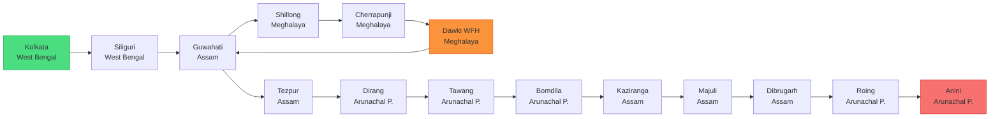

import TagPill from '../../components/TagPill.astro'

export const stateColor = {
  WB: "#22c55e",
  AS: "#3b82f6",
  ML: "#a855f7",
  AP: "#ef4444",
}

> This trip is part of my broader [travel wishlist](/posts/travel-wishlist).

---

## Index

1. [Overview & Route](#overview--route)
2. [Scram 440 — Fuel Planning](#scram-440--fuel-planning)
3. [Permits & Documents](#permits--documents)
4. [Best Time to Go](#best-time-to-go)
5. [Phase 1 — Travel: Kolkata → Meghalaya](#phase-1--travel-kolkata--meghalaya)
6. [Phase 2 — WFH Base: Meghalaya Research](#phase-2--wfh-base-meghalaya-research)
7. [Phase 3 — Travel: Tawang, Kaziranga & Anini](#phase-3--travel-tawang-kaziranga--anini)
8. [Logistics & Tips](#logistics--tips)
9. [Packing List](#packing-list)

---

## Overview & Route

**Bike:** Royal Enfield Scram 440
**Starting point:** Kolkata

**States covered:** <TagPill tag="West Bengal" size="small" /> <TagPill tag="Assam" size="small" /> <TagPill tag="Meghalaya" size="small" /> <TagPill tag="Arunachal Pradesh" size="small" />

**Key stops:** [Shillong](https://maps.google.com/?q=Shillong,+Meghalaya) · [Cherrapunji](https://maps.google.com/?q=Cherrapunji,+Meghalaya) · [Dawki](https://maps.google.com/?q=Dawki,+Meghalaya) · [Sela Pass](https://maps.google.com/?q=Sela+Pass,+Arunachal+Pradesh) (4,170m) · [Tawang](https://maps.google.com/?q=Tawang,+Arunachal+Pradesh) · [Kaziranga](https://maps.google.com/?q=Kaziranga+National+Park,+Assam) · [Majuli](https://maps.google.com/?q=Majuli+Island,+Assam) · [Anini](https://maps.app.goo.gl/pcS1ioGvEHsQsh39A)

**Total distance:** ~5,500 km | **Total days:** ~28

**Leave structure:**

| Block | Duration | Mode |
|---|---|---|
| Phase 1 | ~7 days (incl. weekends) | Leave + weekends |
| Phase 2 | ~5 days | Work from home (Meghalaya) |
| Phase 3 | ~15 days (incl. weekends) | Leave + weekends |

### Route Diagram

> 🗺️ **[Open Full Route on Google Maps →](https://www.google.com/maps/dir/Kolkata,+West+Bengal/Siliguri,+West+Bengal/Guwahati,+Assam/Shillong,+Meghalaya/Cherrapunji,+Meghalaya/Dawki,+Meghalaya/Tezpur,+Assam/Bomdila,+Arunachal+Pradesh/Tawang,+Arunachal+Pradesh/Kaziranga+National+Park,+Assam/Jorhat,+Assam/Majuli,+Assam/Dibrugarh,+Assam/Roing,+Arunachal+Pradesh/Anini,+Arunachal+Pradesh/)** — 15 stops across West Bengal · Assam · Meghalaya · Arunachal Pradesh · ~5,500 km

---

## Scram 440 — Fuel Planning

**Royal Enfield Scram 440 specs:**

| Spec | Value |
|---|---|
| Engine | 443cc single-cylinder |
| Fuel tank | 13L |
| Reserve | ~2.5L |
| ARAI mileage | ~35 km/L (claimed) |
| Real-world highway (loaded, luggage) | ~26–30 km/L |
| Real-world hilly terrain | ~20–24 km/L |
| Extreme rough off-road (Roing–Anini) | ~16–20 km/L |

**Effective safe range** (refuel when ~2.5L reserve remains):

| Terrain | Est. mileage | Safe range before refuel |
|---|---|---|
| Flat NH highway | 28 km/L | 290–300 km |
| Hilly roads (Meghalaya/W. Arunachal) | 22 km/L | 225–240 km |
| Rough mountain (Roing–Anini) | 18 km/L | 185–200 km |

**Segment-by-segment fuel plan:**

| Segment | Distance | Terrain | Fuel stops needed | Critical notes |
|---|---|---|---|---|
| Kolkata → Siliguri | 570 km | Flat NH | Raiganj (~350 km) | Fill Kolkata + Raiganj |
| Siliguri → Guwahati | 430 km | Flat | Bongaigaon (~310 km) | Fill Siliguri + Bongaigaon |
| Guwahati → Shillong | 100 km | Hilly | None needed | Fill at Jorabat (last Assam pump before ML) |
| Shillong → Cherrapunji | 55 km | Hilly | None | Fill Police Bazaar, Shillong |
| Cherrapunji → Dawki | 85 km | Hilly | Pynursla (~35 km) | Fill Sohra before leaving |
| Dawki → Guwahati | 180 km | Hilly→flat | Jowai (~60 km) | Fill Dawki |
| Guwahati → Tezpur | 180 km | Flat | None needed | Easy |
| Tezpur → Dirang | 200 km | Flat→mountain | **Bhalukpong** (ILP entry, ~60 km) | **Fill at Bhalukpong (last plains pump)**, top-up Bomdila |
| Dirang → Tawang | 140 km | High mountain | **None on route** | **Fill full at Bomdila/Dirang. No pump until Tawang.** |
| Tawang → Bomdila | 165 km | Mountain | None on route | Tawang govt pump unreliable — fill if available, plan for worst |
| Bomdila → Kaziranga | 360 km | Mountain→flat | Tezpur (~230 km) | Fill Bomdila + Tezpur |
| Kaziranga → Dibrugarh | 150 km | Flat | None needed | Easy |
| Dibrugarh → Roing | 165 km | Flat→hilly | None needed | **Fill full at Roing — last reliable pump** |
| **Roing → Anini** | **228 km** | **Extreme rough** | **Hunli (~100 km, unreliable)** | **Fill Roing + carry 5L jerry can. Do not rely on Hunli or Anini pump.** |
| Anini → Dibrugarh | 393 km | Rough→flat | Hunli (if available) + Roing | Leave Anini with max fuel |

---

## Permits & Documents

| Permit | Required for | How to get |
|---|---|---|
| Inner Line Permit (ILP) | All of Arunachal Pradesh | Online: [arunachalilp.in](https://arunachalilp.in) or at Bhalukpong / Balipara checkposts |
| Special Permit | Bum La Pass only | DC office, Tawang town (takes 1 day, ₹100) |

**Documents to carry (all original + 3 photocopies):**
- Aadhaar / Voter ID
- Driving licence
- Vehicle RC book + insurance + PUC
- 6 passport photos (ILP, permits, hotels)
- ILP printout (carry always in AP)

---

## Best Time to Go

**October–November** is the sweet spot:
- Post-monsoon: roads dry, green landscape, waterfalls still flowing
- Sela Pass: open (Sela Tunnel also available since March 2024)
- Kaziranga: safaris running (opens ~Oct 15)
- Anini road: stable before pre-winter rains
- Meghalaya WFH bases: dry, cool, ideal working conditions

**Avoid June–September:** monsoon. Meghalaya roads dangerous, Sela Pass closes, Anini road washes out.

**November riding note for Tawang/Sela:** Pack for sub-zero morning temperatures. Sela Pass can be −5°C to −10°C at dawn in November. Riding gloves, thermal layers, and a windproof jacket over a down jacket are mandatory.

---

## Phase 1 — Travel: Kolkata → Meghalaya

### Day 1 — [Kolkata](https://maps.google.com/?q=Kolkata,+West+Bengal) *(West Bengal)* → [Siliguri](https://maps.google.com/?q=Siliguri,+West+Bengal) *(West Bengal)*

**Distance:** 570 km | **Road:** NH12 | **Riding:** 9–10 hours

  <strong>⛽ Scram 440 Fuel Plan</strong> — Fill at Kolkata (start). Fill at <strong>Raiganj/Dalkhola (~370 km)</strong>. Arrive Siliguri with ~50 km reserve. Range each leg: ~290 km flat highway on 13L.

- **6:00 AM:** Depart Kolkata, NH12 via Dankuni Expressway.
- **8:30 AM:** Bardhaman (~180 km) — tea + paratha at a highway dhaba.
- **12:00 PM:** Raiganj / Dalkhola area (~370 km) — **fill fuel here.** Lunch stop. Assam–West Bengal plains stretch.
- **4:30 PM:** Enter Siliguri. Mahananda Wildlife Sanctuary flanks the final approach.
- **5:30 PM:** Check in near Sevoke Road / Hill Cart Road. Hotel Chancellor, Hotel Sinclairs, or budget guest houses.
- **Evening:** Siliguri's Hill Cart Road for dinner — momos, Bengali fish curry.

---

### Day 2 — [Siliguri](https://maps.google.com/?q=Siliguri,+West+Bengal) *(West Bengal)* → [Guwahati](https://maps.google.com/?q=Guwahati,+Assam) *(Assam)*

**Distance:** 430 km | **Road:** NH27 | **Riding:** 7–8 hours

  <strong>🗺️ State Border Crossing:</strong> West Bengal → Assam near <strong>Golakganj / Dhubri</strong> (~310 km from Siliguri on NH27). Signs and checkposts confirm the crossing.

  <strong>⛽ Scram 440 Fuel Plan</strong> — Fill Siliguri. Fill at <strong>Bongaigaon (~310 km, Assam)</strong>. Arrive Guwahati comfortably.

- **6:00 AM:** Depart Siliguri. NH27 through the Dooars: tea gardens, forested hills, elephant crossings.
- **8:30 AM:** Cooch Behar (~80 km). Optional 30-min detour to the Cooch Behar Palace.
- **11:30 AM:** Cross into Assam. Brahmaputra plains open up.
- **1:00 PM:** Bongaigaon — **fill fuel.** Lunch at a local dhaba (Assamese thali: rice, dal, mustard fish).
- **5:30 PM:** Arrive Guwahati, south bank of the Brahmaputra.
- **Evening:** Brahmaputra riverfront (Uzan Bazar ghat). Sunset over the widest stretch of river you'll see anywhere in India.

---

### Day 3 — [Guwahati](https://maps.google.com/?q=Guwahati,+Assam) *(Assam)* — City Exploration

  <strong>📋 Action today:</strong> Apply for ILP online at <a href="https://arunachalilp.in">arunachalilp.in</a> — takes 1–2 days to process. You'll need it from Day 15 onwards. Upload Aadhaar scan.

- **7:00 AM:** [Kamakhya Temple](https://maps.google.com/?q=Kamakhya+Temple,+Guwahati,+Assam). One of 51 Shakti Peethas, Nilachal Hill. Go early for shorter queue. Allow 2 hours.
- **10:00 AM:** [Umananda Island](https://maps.google.com/?q=Umananda+Island,+Guwahati,+Assam) — ferry from Kachari Ghat (15 min). Shiva temple, golden langur monkeys.
- **12:00 PM:** Lunch at Paradise Restaurant (Police Bazaar area) or Anand Bhavan for Assamese food.
- **2:00 PM:** Assam State Museum — NE India archaeology and tribal culture. 1.5 hours.
- **4:00 PM:** Brahmaputra cruise from Fancy Bazar ghat.
- **Dinner:** Gam's Restaurant or street food at Pan Bazaar (lakhi pitha, khar fish curry).

---

### Day 4 — [Guwahati](https://maps.google.com/?q=Guwahati,+Assam) *(Assam)* → [Shillong](https://maps.google.com/?q=Shillong,+Meghalaya) *(Meghalaya)*

**Distance:** 100 km | **Road:** NH6 | **Riding:** 3–4 hours

  <strong>🗺️ State Border Crossing:</strong> Assam → Meghalaya at <strong>Jorabat</strong> (~12 km south of Guwahati on NH6). You'll notice the road immediately starting to climb into the Khasi Hills.

  <strong>⛽ Scram 440 Fuel Plan</strong> — Fill at <strong>Jorabat or Guwahati outskirts</strong> (last Assam pumps before Meghalaya hills). Shillong has pumps, but prices are slightly higher in Meghalaya. Range: only 100 km, no concern.

- **8:00 AM:** Depart Guwahati on NH6.
- **10:00 AM:** **[Umiam Lake](https://maps.google.com/?q=Umiam+Lake,+Meghalaya) (Barapani)** — 15 km before Shillong. Pine-forested reservoir, stunning viewpoint. 30 min stop.
- **11:00 AM:** Arrive Shillong. Check in near Police Bazaar area.
- **2:30 PM:** Police Bazaar on foot — Khasi shawls, bamboo crafts, smoked meat. Try jadoh rice with pork at a local stall.
- **5:00 PM:** Ward's Lake. Peaceful 30-min walk, boating available.
- **7:00 PM:** Café culture — Dylan's Café (live music possible), ML05 Café in Laitumkhrah.

---

### Day 5 — [Shillong](https://maps.google.com/?q=Shillong,+Meghalaya) *(Meghalaya)* — Full Day Exploration

- **6:30 AM:** **[Shillong Peak](https://maps.google.com/?q=Shillong+Peak,+Meghalaya)** (1,965m) — highest point in the city. Narrow bike road to the IAF-controlled summit viewpoint. Panoramic views before the morning cloud rolls in.
- **9:00 AM:** **[Elephant Falls](https://maps.google.com/?q=Elephant+Falls,+Shillong,+Meghalaya)** (12 km) — three-tier waterfall, well-maintained steps. Entry ₹20.
- **11:00 AM:** **[Don Bosco Museum](https://maps.google.com/?q=Don+Bosco+Museum,+Shillong,+Meghalaya)** — 7 floors on NE India cultures. Best museum in the region. Allow 2 hours.
- **2:00 PM:** Lunch near Police Bazaar. Smoked pork with sticky rice.
- **4:00 PM:** **[Laitlum Canyon](https://maps.google.com/?q=Laitlum+Canyon,+Meghalaya)** (24 km) — "End of the Hills." Deep V-shaped valleys, cloud-wrapped ridges, small cliff villages. Sunset here is extraordinary.

---

### Day 6 — [Shillong](https://maps.google.com/?q=Shillong,+Meghalaya) *(Meghalaya)* → [Cherrapunji/Sohra](https://maps.google.com/?q=Cherrapunji,+Meghalaya) *(Meghalaya)*

**Distance:** 55 km | **Road:** via Mawkdok | **Riding:** 2 hours

  <strong>⛽ Scram 440 Fuel Plan</strong> — Fill at Police Bazaar, Shillong before leaving. One pump at Mawkdok area midway. Sohra market has a pump. 55 km is trivial.

- **8:00 AM:** Depart Shillong on winding hill road.
- **9:00 AM:** **[Mawkdok Dympep Valley](https://maps.google.com/?q=Mawkdok+Dympep+Valley,+Meghalaya)** — gorge disappears below you, clouds below the cliff edge. 20 min stop.
- **10:00 AM:** Arrive Sohra (Cherrapunji). Check in at Cherrapunjee Holiday Resort or Polo Orchid Resort (both overlook the gorge). Budget: NG Eco Homestay.
- **12:00 PM:** **[Nohkalikai Falls](https://maps.google.com/?q=Nohkalikai+Falls,+Cherrapunji,+Meghalaya)** (340m drop, tallest plunge waterfall in India). Walk to the cliff edge.
- **1:30 PM:** **[Seven Sisters Falls](https://maps.google.com/?q=Nohsngithiang+Falls,+Cherrapunji,+Meghalaya)** — 7 streams down the same limestone cliff. Entry ₹20.
- **3:00 PM:** **[Eco Park](https://maps.google.com/?q=Eco+Park,+Cherrapunji,+Meghalaya)** — cliff-edge park overlooking Bangladesh plains and waterfalls.
- **4:30 PM:** **[Mawsmai Cave](https://maps.google.com/?q=Mawsmai+Cave,+Cherrapunji,+Meghalaya)** — 150m lit limestone cave. Entry ₹20.
- **Dinner:** Orange Roots or Jiva Grill in Sohra.

---

### Day 7 — [Cherrapunji](https://maps.google.com/?q=Cherrapunji,+Meghalaya) *(Meghalaya)* — Waterfalls & Caves

- **7:00 AM:** **[Wei Sawdong Falls](https://maps.google.com/?q=Wei+Sawdong+Falls,+Cherrapunji,+Meghalaya)** — 3-tier hidden waterfall, 30-min forest trek. Aquamarine pools. Swim if warm enough. Start early.
- **10:00 AM:** Breakfast, then **[Arwah Cave](https://maps.google.com/?q=Arwah+Cave,+Cherrapunji,+Meghalaya)** — fossil-embedded limestone passages, 65–70 million year old marine fossils. Entry ₹30.
- **1:00 PM:** Lunch at guesthouse.
- **2:30 PM:** **[Garden of Caves](https://maps.google.com/?q=Garden+of+Caves,+Cherrapunji,+Meghalaya)** — caves + waterfalls trail in the gorge. Entry ₹20.
- **4:00 PM:** **[Dainthlen Falls](https://maps.google.com/?q=Dainthlen+Falls,+Cherrapunji,+Meghalaya)** — rocky gorge waterfall with a Khasi serpent legend. Short walk from road.
- **Evening:** Plan tomorrow's root bridge trek. Download offline trail map for Tyrna–Nongriat. Lay out gear: carry 2L water, snacks, phone fully charged, light daypack.

---

## Phase 2 — WFH Base: Meghalaya Research

### WFH Location Analysis

Three potential bases evaluated for WFH suitability:

  <strong>💡 Recommendation:</strong> Use <strong>Shillong or Cherrapunji</strong> as your WFH base if you need guaranteed stable connectivity. Move to <strong>Dawki/Shnongpdeng on weekends</strong> when no calls/serious work is needed. The riverside experience is worth it — just plan your meetings around being in Dawki town rather than the camp.

#### Option A — Shillong *(Best connectivity)*

**Altitude:** 1,495–1,965m | **Climate type:** Subtropical highland (Cwb)

**Weather during WFH window (Oct–Nov):**

| | October | November |
|---|---|---|
| Max temp | 21.9°C | 19.3°C |
| Min temp | 14.2°C | 10.4°C |
| Rainfall | 197 mm | 24.7 mm — essentially dry |
| Rainy days | 8.4 days | 1.5 days |
| Sunshine hrs/day | 5.7 | 7.2 |
| Humidity (17:30) | 90% | 88% |

**Connectivity:**

| Provider | Signal | Speed | WFH suitability |
|---|---|---|---|
| **Jio** | 4G/5G in city areas (Police Bazaar, Laitumkhrah, Mawlai) | 20–80 Mbps | ✅ Video calls fine |
| **Airtel** | 4G throughout city | 15–50 Mbps | ✅ Video calls fine |
| **BSNL** | 4G, city-wide | 5–20 Mbps | ✅ Backup, slower |
| **Vi (Vodafone-Idea)** | 4G, patchy | 5–15 Mbps | ⚠️ Not recommended as primary |
| **Broadband** | Airtel Fiber + BSNL available at hotels | 50–200 Mbps | ✅ Best option if hotel has it |

**WiFi at stays:** Hotel Polo Towers, Centre Point, and most mid-range hotels have WiFi. Quality varies — confirm with hotel and ask for a room on an upper floor near the router.

**WFH verdict:** Shillong is a city with proper infrastructure. Multiple co-working cafés exist (Café Shillong Heritage, Dylan's, various others with tables). Best choice if your role involves daily video calls. Power cuts are rare and brief.

---

#### Option B — Cherrapunji/Sohra *(Good connectivity, scenic)*

**Altitude:** 1,430m | **Climate type:** Subtropical highland (Cwb)

**Weather during WFH window (Oct–Nov):**

| | October | November |
|---|---|---|
| Max temp | 24.0°C | 21.8°C |
| Min temp | 15.3°C | 11.4°C |
| Rainfall | 461 mm | 49.3 mm — mostly dry |
| Rainy days | 7.6 days | 1.6 days |
| Sunshine hrs/day | n/a | n/a |
| **Note** | Still some rain | **Post-monsoon dry season begins** |

> **Important:** Cherrapunji receives extremely high monsoon rainfall (average 11,777 mm/year). But October and November are the dry season — Oct rainfall drops to 461mm (about 15% of the annual total), and November falls to 49mm. Misty mornings are common even in dry season as cloud formations build off the escarpment.

**Connectivity:**

| Provider | Signal | Speed | WFH suitability |
|---|---|---|---|
| **Jio** | 4G in Sohra town | 10–30 Mbps | ✅ Adequate for most tasks |
| **Airtel** | 4G in Sohra town, patchy at cliff viewpoints | 10–25 Mbps | ✅ Adequate |
| **BSNL** | 4G, often most reliable in smaller towns | 5–15 Mbps | ✅ Good fallback |
| **At viewpoints / outside town** | 1–2 bars Jio | Variable | ⚠️ Don't rely for calls |

**WiFi at stays:** Cherrapunjee Holiday Resort and Polo Orchid Resort have WiFi. Speeds quoted as 10–25 Mbps in guest reviews. Connection quality drops during peak tourist season.

**Power:** Stable in Sohra town. Occasional load-shedding (30–60 min), manageable with a power bank. All resorts have generator backup.

**WFH verdict:** Good enough for a WFH week if your role allows async work and occasional video calls. **Avoid scheduling video calls in the morning** — mist reduces morale and light quality, though connectivity is unaffected. Afternoons are clearest.

---

#### Option C — Dawki / Shnongpdeng *(Scenic but connectivity limited)*

**Altitude:** ~200m (much lower — Umngot river valley) | **Climate type:** Tropical/subtropical lowland

**Weather during WFH window (Oct–Nov):**

| | October | November |
|---|---|---|
| Max temp | ~27–30°C (warm, lowland valley) | ~24–28°C |
| Min temp | ~18–20°C | ~15–18°C |
| Rainfall | Low — post-monsoon dry season | Very dry |
| Condition | Warm, humid, mostly sunny | Warm, clear, ideal |

> Dawki is significantly warmer than Shillong/Cherrapunji because it's at only ~200m altitude vs 1,400–1,500m. In November, expect comfortable T-shirt temperatures during the day — beautiful riding and outdoor working conditions.

**Connectivity:**

| Location | Provider | Signal | Notes |
|---|---|---|---|
| **Dawki town** | Jio | 4G, 2–3 bars | Usable for calls, sometimes drops |
| **Dawki town** | Airtel | 4G, 2–3 bars | Similar to Jio |
| **Dawki town** | BSNL | 4G | Often best in small towns — government offices depend on it |
| **Shnongpdeng riverside** | Jio | 1–3 bars, intermittent | Works for WhatsApp, email; video calls drop |
| **Shnongpdeng riverside** | Airtel | 1–2 bars | Patchy |
| **Shnongpdeng riverside** | BSNL | 2–3 bars | Most reliable at camp |
| **Mawlynnong village** | Jio/Airtel | 2–3 bars | Workable for light tasks |

**Hotspot speed (Jio in Dawki town):** Typically 5–15 Mbps download, 2–8 Mbps upload. Adequate for email, Slack/Teams text, and occasional calls but video calls may stutter.

**WiFi at stays:** Shnongpdeng campsites do not offer reliable WiFi. Some homestays in Dawki town have basic WiFi (~5 Mbps). Confirm before booking.

**Power:** Riverside camps run on generator or solar. Power available during generator hours (usually 6–10 PM). Charging during work hours requires carrying fully charged power banks (20,000 mAh essential).

  <strong>⚠️ Dawki WFH Warning:</strong> Do not schedule video calls or important client meetings from Shnongpdeng camp. Use Dawki town (3–4 km away) for anything requiring reliable signal. Work from camp only during async/offline hours, then ride to town for calls and uploads.

**WFH verdict:** Possible but requires planning around connectivity gaps. Best strategy: **stay in a Dawki town homestay (not riverside camp)** for weekdays, use Shnongpdeng only on weekends when offline.

---

### Recommended WFH Plan (Days 8–12)

| Day | Activity | WFH base | Connectivity |
|---|---|---|---|
| Day 8 (weekend) | Double Decker Root Bridge trek | Cherrapunji | Offline day — no calls needed |
| Day 9 (weekend) | Cherrapunji → Mawlynnong → Dawki ride | Transit | Brief connectivity gap |
| Day 10 (Mon) | WFH — use Dawki town stay | **Dawki town** | Jio/Airtel 4G in town |
| Day 11 (Tue) | WFH + evening Krang Suri Falls | **Dawki town** | Jio/Airtel 4G |
| Day 12 (Wed) | WFH — half day, then explore | **Dawki town** | Jio/Airtel 4G |

> **If your WFH window is longer or you have more video calls:** Consider spending Days 8–10 in **Shillong** (WFH from hotel/café with excellent connectivity) and then making Dawki/Shnongpdeng a pure weekend escape.

---

### Day 8 — [Double Decker Root Bridge](https://maps.google.com/?q=Double+Decker+Living+Root+Bridge,+Nongriat,+Meghalaya) Trek *([Cherrapunji](https://maps.google.com/?q=Cherrapunji,+Meghalaya), Meghalaya)*

**Full day off — most physically demanding day**

- **6:00 AM:** Drive 20 km to [Tyrna village](https://maps.google.com/?q=Tyrna+Village,+Cherrapunji,+Meghalaya). Park bike safely.
- **6:30 AM:** Descend 3,500 stone steps through jungle. Dense rainforest, suspension bridges over streams.
- **9:00 AM:** **[Single Root Bridge](https://maps.google.com/?q=Single+Living+Root+Bridge,+Cherrapunji,+Meghalaya)** en route. Rubber fig roots trained across a stream, load-bearing after generations of growth.
- **10:45 AM:** **[Double Decker Living Root Bridge](https://maps.google.com/?q=Double+Decker+Living+Root+Bridge,+Nongriat,+Meghalaya)**, Nongriat village. Two bridges stacked, the upper one 150+ years old. Walk across. Entry ₹50.
- **12:00 PM:** Natural pools below Nongriat. Turquoise freshwater. Swim, rest.
- **2:00 PM:** Climb back. 3,500 steps upward — serious effort. Break every 500 steps.
- **4:00 PM:** Reach Tyrna. Drink something sweet immediately.
- **Evening:** Return to Cherrapunji. Early sleep.

---

### Day 9 — [Cherrapunji](https://maps.google.com/?q=Cherrapunji,+Meghalaya) *(Meghalaya)* → [Mawlynnong](https://maps.google.com/?q=Mawlynnong,+Meghalaya) *(Meghalaya)* → [Dawki](https://maps.google.com/?q=Dawki,+Meghalaya) *(Meghalaya)*

**Distance:** 85 km | **Road:** Cherrapunji → Pynursla → Mawlynnong → Dawki | **Riding:** 4–5 hours

  <strong>⛽ Scram 440 Fuel Plan</strong> — Fill at Sohra market before leaving. One pump at <strong>Pynursla (~35 km)</strong>. Pump available in <strong>Dawki town</strong>. Total 85 km — no concern, but fill Sohra for maximum range.

- **8:00 AM:** Depart Cherrapunji toward Pynursla.
- **10:30 AM:** **[Mawlynnong Village](https://maps.google.com/?q=Mawlynnong,+Meghalaya)** — Asia's cleanest village (awarded 2003). Walk the bamboo-dustbin streets, visit **[Riwai Living Root Bridge](https://maps.google.com/?q=Riwai+Living+Root+Bridge,+Meghalaya)** (5-min walk), climb the **bamboo skywalk** for Bangladesh views. Entry ₹20.
- **1:00 PM:** Lunch in Mawlynnong.
- **2:00 PM:** Continue to **Dawki**. The final descent is steep and winding — the Umngot river appears in flashes through the trees below.
- **3:00 PM:** Arrive **[Shnongpdeng](https://maps.google.com/?q=Shnongpdeng,+Dawki,+Meghalaya) / [Dawki](https://maps.google.com/?q=Dawki,+Meghalaya)**. Check in at riverside camp or Dawki town homestay.
- **4:30 PM:** **[Boat on the Umngot River](https://maps.google.com/?q=Umngot+River,+Dawki,+Meghalaya)** — transparent water, visible riverbed 5m below. Boats appear to float on air.
- **Evening:** Riverside. Campfire. Bangladesh hills across the water.

---

### Days 10–12 — WFH from [Dawki](https://maps.google.com/?q=Dawki,+Meghalaya) *(Meghalaya)*

Refer to [WFH Location Analysis](#wfh-location-analysis) above for connectivity and weather details.

**Workday structure (Days 10–12):**
- 7:00 AM: Walk along the river before starting work.
- 9:00 AM: Set up in Dawki town homestay / cafeteria area for work. Use Jio hotspot (primary), BSNL hotspot (backup). Keep phone plugged in.
- 6:00 PM: Work done. Ride 3–4 km to Shnongpdeng for the evening.

**After-work options:**
- **Day 10 evening:** Cliff jumping at Shnongpdeng (guided, ₹300).
- **Day 11:** Half-day off for **[Krang Suri Falls](https://maps.google.com/?q=Krang+Suri+Falls,+Meghalaya)** (80 km, 1.5 hrs each way). Turquoise waterfall pool, entry ₹50. Go weekday morning for no crowds.
- **Day 12 evening:** **Dawki border crossing area** (2 km) — India-Bangladesh gate, international trade trucks.

---

## Phase 3 — Travel: Tawang, Kaziranga & Anini

### Day 13 — [Dawki](https://maps.google.com/?q=Dawki,+Meghalaya) *(Meghalaya)* → [Guwahati](https://maps.google.com/?q=Guwahati,+Assam) *(Assam)*

**Distance:** 180 km | **Road:** Dawki → Amlarem → Jowai → Guwahati | **Riding:** 5–6 hours

  <strong>🗺️ State Border Crossing:</strong> Meghalaya → Assam at <strong>Badarpur/Lailad area</strong> on the Jowai–Guwahati stretch. You'll notice the landscape flattening into Assam's Brahmaputra plains.

  <strong>⛽ Scram 440 Fuel Plan</strong> — Fill at Dawki before leaving. Fill at <strong>Jowai (~60 km)</strong>. Guwahati has plenty of pumps. Total: 180 km, two fills comfortable.

- **7:00 AM:** Depart Dawki. Route via Amlarem — forested, very light traffic.
- **9:00 AM:** **[Phe Phe Falls](https://maps.google.com/?q=Phe+Phe+Falls,+Amlarem,+Meghalaya)** optional detour near Amlarem — hidden 3-tier falls through jungle walk. Worth it if not previously visited.
- **11:00 AM:** [Jowai](https://maps.google.com/?q=Jowai,+Meghalaya) (West Jaintia Hills HQ) — **fuel stop.** 30-min market explore.
- **2:30 PM:** Arrive Guwahati. Check in.
- **Afternoon:** Cash withdrawal (ATMs reliable here — last good ATM stop before Tawang). Stock up on supplies.

---

### Day 14 — [Guwahati](https://maps.google.com/?q=Guwahati,+Assam) *(Assam)* → [Tezpur](https://maps.google.com/?q=Tezpur,+Assam) *(Assam)*

**Distance:** 180 km | **Road:** NH15/NH13 | **Riding:** 3.5–4 hours

  <strong>⛽ Scram 440 Fuel Plan</strong> — Fill Guwahati before departing. Tezpur has multiple pumps. 180 km flat — no concern.

- **8:00 AM:** Depart Guwahati on NH15. Flat Assam plains, fast road.
- **12:00 PM:** Arrive **Tezpur** — gateway to Arunachal Pradesh, on the Brahmaputra's south bank.
- **1:00 PM:** Lunch in town.
- **2:30 PM:** **[Agnigarh Hill](https://maps.google.com/?q=Agnigarh+Hill,+Tezpur,+Assam)** — hilltop with Brahmaputra valley views and Mahabharata legend (Usha and Aniruddha).
- **3:30 PM:** **[Da Parbatia ruins](https://maps.google.com/?q=Da+Parbatia,+Tezpur,+Assam)** — 5th-century Gupta-period temple doorway. One of the oldest sculptural pieces in Assam.
- **5:30 PM:** **[Nameri National Park](https://maps.google.com/?q=Nameri+National+Park,+Assam)** vicinity (15 km away). Buffer zone birdwatching at dusk.
- **Evening:** Check in at Hotel Luit or Hotel Sripuria.

---

### Day 15 — [Tezpur](https://maps.google.com/?q=Tezpur,+Assam) *(Assam)* → [Dirang](https://maps.google.com/?q=Dirang,+Arunachal+Pradesh) *(Arunachal Pradesh)*

**Distance:** ~200 km | **Road:** NH13 | **Riding:** 6–7 hours | **Arunachal entry today**

  <strong>🗺️ State Border Crossing:</strong> Assam → Arunachal Pradesh at <strong>Bhalukpong</strong> (~60 km from Tezpur on NH13). ILP checkpost here — present your Inner Line Permit. Police register your bike number and name. Allow 20–30 min.

  <strong>⛽ Scram 440 Fuel Plan</strong> — Fill Tezpur (full tank). <strong>Fill again at Bhalukpong</strong> — this is the last plains-level pump before serious mountain roads begin. Fill once more at <strong>Bomdila (~80 km after Bhalukpong)</strong> — critical. Dirang (~45 km after Bomdila) may have a small pump; treat it as a bonus, not a guarantee.

- **6:30 AM:** Early start from Tezpur.
- **8:30 AM:** **[Bhalukpong](https://maps.google.com/?q=Bhalukpong,+Arunachal+Pradesh)** — ILP check. **Fill fuel here.** Kameng River flows alongside.
- **10:00 AM – 12:00 PM:** Climb through Arunachal foothills. Road cut into hillside, increasingly dramatic views.
- **12:00 PM:** **[Bomdila](https://maps.google.com/?q=Bomdila,+Arunachal+Pradesh)** (2,415m) — **fill fuel.** Three monasteries here (visit Upper or Middle Gontse Gang, 30 min). Apple orchards in season.
- **2:00 PM:** Lunch in Bomdila market. Momos, thukpa, pork.
- **3:30 PM:** Continue to **[Dirang](https://maps.google.com/?q=Dirang,+Arunachal+Pradesh)** (1,450m). Valley descent into the Dirang Chu river valley.
- **5:00 PM:** Arrive Dirang. Check in.
- **5:30 PM:** **[Dirang Hot Spring](https://maps.google.com/?q=Dirang+Hot+Spring,+Arunachal+Pradesh)** (2 km from town) — sulphurous natural hot water spring.
- **Evening:** Walk to **[Dirang Dzong](https://maps.google.com/?q=Dirang+Dzong,+Arunachal+Pradesh)** — old stone fort village. Traditional Monpa stone-and-timber construction.

---

### Day 16 — [Dirang](https://maps.google.com/?q=Dirang,+Arunachal+Pradesh) *(Arunachal Pradesh)* → [Sela Pass](https://maps.google.com/?q=Sela+Pass,+Arunachal+Pradesh) → [Tawang](https://maps.google.com/?q=Tawang,+Arunachal+Pradesh) *(Arunachal Pradesh)*

**Distance:** ~140 km | **Road:** NH13 | **Riding:** 5–6 hours | **Maximum altitude day**

  <strong>⚠️ Critical Fuel Warning:</strong> Fill completely at <strong>Bomdila or Dirang</strong> before this day. There is <strong>no petrol pump between Dirang and Tawang (140 km)</strong>. Sela Pass has nothing; Jang has no reliable pump. The government pump at Tawang is often out of stock or has long queues. The Scram 440 at ~20 km/L in mountain terrain uses ~7L for this 140 km stretch — you have ~6L remaining from a full 13L tank. Adequate, but carry a <strong>2L spare</strong> to be safe.

- **7:00 AM:** Depart Dirang before dawn. Start early — morning light at Sela is worth the effort.
- **7:30 AM:** **[Sangti Valley](https://maps.google.com/?q=Sangti+Valley,+Dirang,+Arunachal+Pradesh)** (12 km from Dirang) — open flat valley, black-necked cranes in winter (Oct–Mar). Brief stop.
- **9:00 AM:** Road begins aggressive climb toward Sela.
- **10:30 AM:** **[Sela Pass](https://maps.google.com/?q=Sela+Pass,+Arunachal+Pradesh)** (4,170m / 13,680 ft). Summit marked by prayer flags and Sela Lake.
  - **[Sela Lake](https://maps.google.com/?q=Sela+Lake,+Arunachal+Pradesh):** Large alpine lake beside the road, often partially iced from late October.
 Turquoise-brown water, surrounded by lunar-brown tundra. No vegetation above the treeline.
  - Temperature at the pass: **−5°C to +5°C in October/November**. Wind chill makes it feel colder. Wear all your layers.
  - The pass was named after **Sela** — a Monpa girl who helped Indian soldier Jaswant Singh hold off the Chinese Army for 72 hours alone in 1962.
  - **Sela Tunnel** (inaugurated March 2024): passes 400m below the summit at 3,000m altitude. Take the old road going up to Tawang (for the view), use the tunnel on return.
- **11:30 AM:** Begin descent from Sela into rhododendron forest then temperate broadleaf.
- **12:30 PM:** **[Jaswant Garh War Memorial](https://maps.google.com/?q=Jaswantgarh+War+Memorial,+Arunachal+Pradesh)** — memorial to Jaswant Singh Rawat who held his position here in 1962. The army maintains his room as if he is still on duty.
- **1:00 PM:** **[Jang town](https://maps.google.com/?q=Jang,+Tawang,+Arunachal+Pradesh)** — lunch. Simple momo + rice restaurants.
- **1:30 PM:** **[Nuranang Falls](https://maps.google.com/?q=Nuranang+Falls,+Jang,+Arunachal+Pradesh) (Jang Falls)** — 2 km east of Jang. Named after Noora, the second Monpa girl from the 1962 story. Wide curtain waterfall over a rocky gorge.
- **3:00 PM:** Arrive **Tawang** (2,669m). Check in at Hotel Tawang Heights or Hotel Sangay.
- **Evening:** Tawang market — Tibetan crafts, thangka paintings, prayer wheels, local honey, yak wool.
- **Dinner:** Momo, thukpa. Any local kitchen.

> **Apply today** for the Bum La Pass special permit at Tawang DC office (₹100, requires photo + ILP copy, takes 1 day). Go in person before 4 PM.

---

### Day 17 — [Tawang](https://maps.google.com/?q=Tawang,+Arunachal+Pradesh) *(Arunachal Pradesh)* — Monastery & Memorials

- **7:00 AM:** **[Tawang Monastery](https://maps.google.com/?q=Tawang+Monastery,+Arunachal+Pradesh) (Galden Namgey Lhatse)** — largest in India, 2nd largest in the world after Potala (Lhasa). Founded 1681. Houses 500 monks. 8m gold-painted Buddha in the main hall. 400-year-old manuscripts in the library. Allow 2–3 hours. Go early for empty courtyards.
- **10:00 AM:** **[Urgelling Monastery](https://maps.google.com/?q=Urgelling+Monastery,+Tawang,+Arunachal+Pradesh)** — birthplace of the 6th Dalai Lama. Smaller, quieter, more intimate.
- **12:00 PM:** **[Tawang War Memorial](https://maps.google.com/?q=Tawang+War+Memorial,+Arunachal+Pradesh)** — 2,420 Indian soldiers of the 1962 war. Inscribed names on the walls. Sound and light show at dusk.
- **2:00 PM:** Lunch in Tawang market.
- **3:30 PM:** **[PT Tso Lake](https://maps.google.com/?q=Pankang+Teng+Tso,+Tawang,+Arunachal+Pradesh) (Pankang Teng Tso)** — 17 km from Tawang, ~4,000m. Alpine lake, army road. Carry ILP.
- **Evening:** Sound & Light show at the War Memorial at dusk.

---

### Day 18 — [Tawang](https://maps.google.com/?q=Tawang,+Arunachal+Pradesh) *(Arunachal Pradesh)* — [Madhuri Lake](https://maps.google.com/?q=Sangetsar+Tso,+Tawang,+Arunachal+Pradesh) & [Bum La Pass](https://maps.google.com/?q=Bum+La+Pass,+Tawang,+Arunachal+Pradesh)

**Two options depending on permit status:**

**If Bum La permit received:**
- **6:00 AM:** Depart with registered guide to **[Bum La Pass](https://maps.google.com/?q=Bum+La+Pass,+Tawang,+Arunachal+Pradesh)** (4,793m, India-China border). 40 km rough military road. Chinese bunkers visible 200m across the LAC. Indian Army personnel at the gate.
- **1:00 PM:** Return to Tawang for lunch.
- **3:00 PM:** **Madhuri Lake (Sangetsar Tso)** — 35 km from Tawang. Alpine lake at 4,000m, ringed by snow peaks, yaks grazing.

**If no Bum La permit:**
- **8:00 AM:** Ride to **[Madhuri Lake](https://maps.google.com/?q=Sangetsar+Tso,+Tawang,+Arunachal+Pradesh) (Sangetsar Tso)**. Two hours riding each way on mountain roads.
- **Midday:** At the lake. Silent, cold, high. One of the most beautiful places on this entire journey.
- **Afternoon:** Optional: **[Zemithang valley](https://maps.google.com/?q=Zemithang,+Tawang,+Arunachal+Pradesh)** (80 km from Tawang, remote Monpa villages near Bhutan border).

---

### Day 19 — [Tawang](https://maps.google.com/?q=Tawang,+Arunachal+Pradesh) *(Arunachal Pradesh)* → [Bomdila](https://maps.google.com/?q=Bomdila,+Arunachal+Pradesh) *(Arunachal Pradesh)* — Return

**Distance:** 165 km | Via Sela Tunnel on return | **Riding:** 5–6 hours

  <strong>⛽ Scram 440 Fuel Plan</strong> — Fill at Tawang government pump (queue early, may be dry — fill whatever is available). Take the <strong>Sela Tunnel</strong> on the way back (saves 10 km, warmer and faster than the open pass road). Fill at <strong>Bomdila</strong> on arrival.

- **7:00 AM:** Depart Tawang. Final look at the monastery valley in morning light.
- **9:30 AM:** Sela Tunnel approach. Take the tunnel on return (1,555m + 980m twin-tube system at 3,000m altitude, opened March 2024).
- **12:30 PM:** Dirang. Tea stop.
- **2:30 PM:** Bomdila. **Fill fuel.** Check in.
- **Evening:** Bomdila Monastery (Lower Gontse Gang) — best of the three monasteries, valley views of the Kameng foothills.

---

### Day 20 — [Bomdila](https://maps.google.com/?q=Bomdila,+Arunachal+Pradesh) *(Arunachal Pradesh)* → [Kaziranga](https://maps.google.com/?q=Kaziranga+National+Park,+Assam) *(Assam)*

**Distance:** ~360 km total | **Riding:** 7–8 hours

  <strong>🗺️ State Border Crossing:</strong> Arunachal Pradesh → Assam at <strong>Bhalukpong</strong> (same point as entry on Day 15). Show ILP at exit checkpoint.

  <strong>⛽ Scram 440 Fuel Plan</strong> — Fill Bomdila before departing. Fill at <strong>Tezpur (~130 km from Bomdila)</strong>. Kaziranga area has pumps at Bokakhat (~5 km from park gate).

- **6:00 AM:** Depart Bomdila. Descend through Bhalukpong to Assam plains.
- **9:00 AM:** Exit Arunachal at Bhalukpong.
- **12:00 PM:** Tezpur — **fuel stop** + lunch.
- **3:00 PM:** Arrive **Kaziranga** (Kohora gate area). Check in at Iora Resort, Infinity Kaziranga, or similar.
- **Afternoon:** Book morning jeep safari at the front desk. Central Range is best for rhinos.
- **Evening:** Walk the road near the park boundary at dusk. Elephants sometimes cross.

---

### Day 21 — [Kaziranga National Park](https://maps.google.com/?q=Kaziranga+National+Park,+Assam) *(Assam)*

**Two safaris — UNESCO World Heritage Site**

**Weather (October–November, Assam plains):**
- October: 28–32°C day, 18–22°C night, humidity moderate
- November: 23–27°C day, 12–16°C night, humidity drops — clearest skies

- **5:30 AM:** **Morning jeep safari — Central Range** (Kohora). Open grasslands, jhils, tall elephant grass. One-horned rhinos (2,400+ in the park), wild water buffalo, swamp deer, Indian elephants, fishing cats. Best chance of tiger at dawn.
- **9:00 AM:** Return. Breakfast.
- **10:30 AM:** **Eastern Range (Agaratoli)** — fewer tourists, more elephants, open grassland.
- **3:30 PM:** **Western Range (Bagori)** — large buffalo herds, sunset golden light over the grasslands.
- **Evening:** Rest. This park has the highest density of rhinos in the world in 430 km². Let that settle.

> **Note:** Kaziranga is closed during monsoon (roughly June–October 15). Confirm the exact opening date before planning. Best season: October 15–April.

---

### Day 22 — [Kaziranga](https://maps.google.com/?q=Kaziranga+National+Park,+Assam) *(Assam)* → [Majuli Island](https://maps.google.com/?q=Majuli+Island,+Assam) *(Assam)*

**Distance:** ~95 km to Nimatighat + ferry | **Riding:** 2 hours + ferry

- **8:00 AM:** Ride east on NH27 to Jorhat (100 km).
- **10:00 AM:** Continue to **[Nimatighat](https://maps.google.com/?q=Nimatighat,+Jorhat,+Assam)** (17 km from Jorhat).
- **12:00 PM:** Board ferry to **[Majuli](https://maps.google.com/?q=Majuli+Island,+Assam)** — world's largest river island. Bike loaded onto flat-bottomed ferry. 1–1.5 hr crossing. The Brahmaputra at this point is overwhelming in scale.
- **1:30 PM:** Land on Majuli. Check in at a guesthouse in Garamur or Kamalabari.
- **2:30 PM:** **[Kamalabari Satra](https://maps.google.com/?q=Kamalabari+Satra,+Majuli,+Assam)** — Vaishnavite monastery, Sattriya dance practice, ancient masked dance props.
- **5:00 PM:** Rent a cycle and ride through villages. Flat, green, water everywhere. Egrets in rice fields.
- **Evening:** Attend evening prayer at any satra — drumming, call-and-response singing.

---

### Day 23 — [Majuli](https://maps.google.com/?q=Majuli+Island,+Assam) *(Assam)* → [Jorhat](https://maps.google.com/?q=Jorhat,+Assam) → [Dibrugarh](https://maps.google.com/?q=Dibrugarh,+Assam) *(Assam)*

**Distance (Jorhat → Dibrugarh):** 55 km | **Riding:** 1.5 hours

- **7:00 AM:** Sunrise over the Brahmaputra from any riverbank.
- **9:00 AM:** **[Auniati Satra](https://maps.google.com/?q=Auniati+Satra,+Majuli,+Assam)** — largest satra on Majuli, museum of Ahom-era artefacts, royal jewellery, manuscripts.
- **11:00 AM:** Head to Nimatighat. Noon ferry back.
- **1:00 PM:** Off ferry. Continue east to Dibrugarh.
- **3:00 PM:** Arrive Dibrugarh. Check in at Hotel Gateway or Hotel Aroma.
- **Afternoon prep:**
  - Withdraw cash — last reliable ATM.
  - Full fuel tank.
  - 5L jerry can filled.
  - Download offline maps: entire Arunachal Pradesh, especially Roing–Anini.
  - Emergency food supplies for 2 days: biscuits, dry fruits, instant noodles, energy bars.
  - Confirm Anini Circuit House booking (contact Dibang Valley DC office in advance).

---

### Day 24 — [Dibrugarh](https://maps.google.com/?q=Dibrugarh,+Assam) *(Assam)* → [Roing](https://maps.google.com/?q=Roing,+Arunachal+Pradesh) *(Arunachal Pradesh)*

**Distance:** ~165 km | **Road:** NH315 + Bogibeel Bridge | **Riding:** 4–5 hours

  <strong>🗺️ State Border Crossing:</strong> Assam → Arunachal Pradesh at the <strong>Roing/Sadiya area</strong>. Cross the Brahmaputra at <strong>Bogibeel Bridge</strong> (India's longest rail-road bridge, 4.94 km, opened 2018) — then proceed to Roing checkpost. ILP required.

  <strong>⛽ Scram 440 Fuel Plan</strong> — Fill at Dibrugarh before leaving (full tank). <strong>Fill completely at Roing</strong> — this is the last reliable petrol pump before Anini (228 km of rough mountain road). After this, the next certain pump is back at Roing on return.

- **7:00 AM:** Depart Dibrugarh. Cross **[Bogibeel Bridge](https://maps.google.com/?q=Bogibeel+Bridge,+Assam)** over the Brahmaputra (the bridge is an engineering marvel — 4.94 km, opened 2018, strategic military route).
- **12:00 PM:** Arrive **Roing** (Lower Dibang Valley district HQ). **Fill fuel completely** — both tank and jerry can.
- **1:00 PM:** Lunch in Roing market.
- **2:00 PM:** **[Mehao Lake](https://maps.google.com/?q=Mehao+Lake,+Roing,+Arunachal+Pradesh)** (25 km from Roing) — beautiful forest lake in Mehao Wildlife Sanctuary. Gayal, tigers, rare birds.
- **5:00 PM:** Return to Roing. Check in at Government Circuit House or local guesthouse.
- **Evening:** Talk to locals / Circuit House staff about **current road conditions on the Roing–Anini road** (landslides, washed sections, military convoy schedules). This information is current and critical.
- Withdraw cash. **No ATM in Anini.**

---

### Day 25 — [Roing](https://maps.google.com/?q=Roing,+Arunachal+Pradesh) *(Arunachal Pradesh)* → [Anini](https://maps.app.goo.gl/pcS1ioGvEHsQsh39A) *(Arunachal Pradesh)*

**Distance:** 228 km | **Road:** Extremely rough mountain track | **Riding:** 8–14 hours

  <strong>⚠️ Hardest day of the trip.</strong> The Roing–Anini road climbs through the Dibang Valley into one of the most remote corners of India. No mobile network from Hunli (~100 km) to Anini. Road conditions change with every season — landslides, washed-out bridges, deep river crossings after rain. Do this only with the Scram 440 and some off-road riding experience. Do not attempt in wet season (June–Sept). Start before 6 AM and do not ride after dark.  
  Full tank (13L) + 5L jerry can = 18L. At 18 km/L rough terrain: <strong>324 km range</strong> — sufficient for the 228 km to Anini and the first ~100 km of the return.

**Weather (Anini, Oct–Nov):**

| | October | November |
|---|---|---|
| Altitude | 1,968m | 1,968m |
| Est. max temp | 14–18°C | 10–14°C |
| Est. min temp | 5–10°C | 0–5°C |
| Rainfall | Moderate, some rain | Decreasing — mostly dry |
| Road conditions | Stable post-monsoon | Best window before winter |
| Snow risk | None in valley | Possible on higher passes |

- **5:30 AM:** Depart Roing before dawn. Goal: reach Anini before dark.
- **8:00 AM:** **[Hunli](https://maps.google.com/?q=Hunli,+Arunachal+Pradesh)** (~100 km) — last small settlement. Ask about road conditions ahead. Basic food if available. **Fill fuel here if a pump exists** (don't count on it — ask in Roing the night before).
- **Beyond Hunli:** No mobile network. Tell someone at Roing your plan and ETA.
- **Road:** Follows the **Dibang River** — one of India's most powerful rivers. Raw Himalayan terrain, bamboo forests, river crossings on variable bridge structures.
- **2:00–5:00 PM:** Arrive **Anini** (1,968m) — district HQ of Dibang Valley. Population ~4,500. Plateau between the Dri and Mathun rivers. Home of the **Idu Mishmi** tribe (own language, animist-Buddhist traditions, almost no outside influence).
- **Evening:** Check in at **Circuit House** (book ahead through Dibang Valley DC office). Caretaker may cook. Otherwise use your supplies.
- The **Dibang Wildlife Sanctuary** begins just north of town.

---

### Day 26 — [Anini](https://maps.app.goo.gl/pcS1ioGvEHsQsh39A) *(Arunachal Pradesh)* — Exploration

**Weather in Anini (November): 10–14°C day, 0–5°C night. Clear mornings, frost possible. Bring thermal layers for night.**

  <strong>📡 Network in Anini:</strong> BSNL may have weak signal in town (2 bars). Jio and Airtel: essentially none. Manage expectations — this is genuinely off-grid. Inform family/office before Day 25 that you will be unreachable for 2–3 days. Emergency contact: Dibang Valley DC office, Anini (+91-3801-222001 approx — verify).

- **7:00 AM:** Walk to the **[Dri River](https://maps.google.com/?q=Dri+River,+Anini,+Arunachal+Pradesh)** — glacier-fed, milky blue, roaring. Traditional **cane bridges** span it at certain points — some centuries old, still functional.
- **9:00 AM:** Visit **Idu Mishmi households** near the Circuit House if caretaker introduces you. Traditional bamboo home, central hearth, woven mats. Their language (Midu dialect) is spoken by fewer than 5,000 people on Earth.
- **Midday:** The town's daily rhythm — government offices open at 10, market stalls with basics, army presence visible.
- **2:00 PM:** Walk north toward **[Dibang Wildlife Sanctuary](https://maps.google.com/?q=Dibang+Wildlife+Sanctuary,+Anini,+Arunachal+Pradesh)** boundary. Red panda, Mishmi takin, musk deer, Asiatic black bear inhabit the sanctuary. Birdlife: Sclater's monal (one of the rarest pheasants in the world), Blyth's tragopan. You won't see large animals on a casual walk, but the habitat is extraordinary.
- **Evening:** Sit at the edge of the plateau. Mountains rising to 5,000m on every side. No noise. This is why you came.

---

### Day 27 — [Anini](https://maps.app.goo.gl/pcS1ioGvEHsQsh39A) *(Arunachal Pradesh)* → [Roing](https://maps.google.com/?q=Roing,+Arunachal+Pradesh) → [Dibrugarh](https://maps.google.com/?q=Dibrugarh,+Assam) *(Assam)*

**Distance:** ~393 km total | **Riding:** 10–14 hours

  <strong>🗺️ State Border Crossing:</strong> Arunachal Pradesh → Assam at <strong>Roing/Sadiya area</strong> on return. Show ILP at exit.

  <strong>⛽ Scram 440 Fuel Plan</strong> — Leave Anini with maximum fuel available (Anini pump if working, else your remaining 13L + any jerry can reserve). Fill at <strong>Hunli if pump exists</strong>. <strong>Fill completely at Roing</strong>. Dibrugarh: easy.

- **5:00 AM:** Start before dawn. Same road, now familiar.
- **9:30–11:00 AM:** Hunli. Tea. Fill if pump has fuel.
- **2:00–4:00 PM:** Reach Roing. **Fill fuel + food.** Relief of civilization.
- **4:00 PM:** Decision: stay Roing (closer, safe) or push to Dibrugarh (better facilities, more options).
- If pushing: ~3 more hours across Bogibeel Bridge to Dibrugarh.
- **Evening:** Hot shower. Real food. Charge everything.

---

### Day 28 — Head Home

**Options:**

**Option A — Ride to Guwahati, overnight train:**
Dibrugarh → Guwahati (~490 km, 8–9 hrs). Take Kamrup Express or Saraighat Express overnight to Kolkata (arrives next morning). Bike in guard van (book in advance at Dibrugarh station).

**Option B — Fly from Dibrugarh:**
Mohanbari Airport (Dibrugarh) has direct flights to Kolkata. Arrange bike transport separately (DTDC / packers and movers).

**Option C — Ride home:**
Dibrugarh → Siliguri (~480 km, Day 28) + Siliguri → Kolkata (~570 km, Day 29).

---

## Logistics & Tips

### Fuel Summary Table

| Critical pump | Distance from | Notes |
|---|---|---|
| Jorabat (last Assam pump) | ~12 km before Meghalaya border | Fill before entering Meghalaya hills |
| Sohra/Cherrapunji market | In town | Fill before Dawki stretch |
| Bhalukpong (AP entry) | 60 km from Tezpur | Fill here — last plains pump |
| Bomdila | 80 km from Bhalukpong | Fill here — no pump until Tawang (140 km) |
| Tawang govt pump | In town | Unreliable — queue early or plan without it |
| Roing | 165 km from Dibrugarh | **Fill full + jerry can — last pump before Anini (228 km)** |

### Mobile Network by Region

| Area | Jio | Airtel | BSNL | Notes |
|---|---|---|---|---|
| Kolkata / West Bengal | ✅ 4G/5G | ✅ 4G/5G | ✅ | No issues |
| Siliguri / NH12 | ✅ 4G | ✅ 4G | ✅ | Good coverage |
| Assam (Guwahati, NH27) | ✅ 4G | ✅ 4G | ✅ | Excellent |
| Shillong city | ✅ 4G/5G | ✅ 4G | ✅ | Excellent for WFH |
| Cherrapunji (in town) | ✅ 4G | ✅ 4G | ✅ | Good |
| Dawki town | ✅ 4G (2–3 bars) | ✅ (2–3 bars) | ✅ | Adequate for WFH in town |
| Shnongpdeng riverside | ⚠️ 1–3 bars | ⚠️ 1–2 bars | ✅ better | Use for async only |
| Bomdila / Dirang | ✅ improving | ✅ | ✅ | Patchy outside towns |
| Tawang | ⚠️ limited | ⚠️ limited | ✅ best option | BSNL is primary in Tawang |
| Roing | ✅ 4G | ✅ 4G | ✅ | Functional |
| Hunli – Anini road | ❌ | ❌ | ❌ | **No network at all** |
| Anini | ⚠️ 0–2 bars | ❌ | ⚠️ weak | BSNL has weakest signal in town |

### ATMs

| Last ATM before remote stretch | For | Notes |
|---|---|---|
| Guwahati | Entire AP trip | Best bank choices |
| Bomdila | Tawang 2-day stay | Tawang has 1–2 ATMs, not always stocked |
| Roing | Anini | **No ATM in Anini** |

---

## Packing List

<strong>🏍️ Bike Essentials</strong>

- [ ] Valid RC book, insurance certificate, PUC
- [ ] Driving licence (original + photocopy)
- [ ] Basic toolkit: tyre levers, puncture repair kit, chain lube, 10mm spanner, cable ties, duct tape
- [ ] Spare inner tube (matching tyre size)
- [ ] Tow rope
- [ ] **5L jerry can for fuel** (critical for Anini stretch)
- [ ] Bungee cords and luggage net

<strong>🪖 Riding Gear</strong>

- [ ] Full-face helmet (IS certified)
- [ ] Riding jacket with armour (waterproof outer or with rain cover)
- [ ] Riding gloves — light pair (Meghalaya) + waterproof/insulated pair (Sela Pass, Tawang)
- [ ] Riding boots or ankle-protecting shoes
- [ ] Knee/shin guards
- [ ] High-visibility vest for low-light conditions
- [ ] **Thermal riding gloves** — essential for Sela Pass (−5°C to −10°C in Oct/Nov)

<strong>👕 Clothing</strong>

- [ ] 3–4 sets base layers
- [ ] **1 full thermal set** (Sela Pass / Tawang / Anini nights)
- [ ] 1 heavy fleece or down jacket
- [ ] 1 windproof outer shell
- [ ] Waterproof rain pants
- [ ] 1 quick-dry towel

<strong>📄 Documents</strong>

- [ ] Aadhaar / Voter ID — original + 3 photocopies
- [ ] 6 passport photos (ILP, Bum La permit, hotels)
- [ ] ILP printout (Arunachal Pradesh — keep 2 copies)
- [ ] Bum La Pass special permit (if applicable)
- [ ] Hotel booking printouts (offline)
- [ ] Emergency contacts list (offline, printed)

<strong>💻 Tech & Connectivity</strong>

- [ ] **Jio SIM** (primary) — best 4G/5G coverage in Assam/Meghalaya
- [ ] **BSNL SIM** (backup) — most reliable in remote AP, Tawang, Anini
- [ ] Airtel SIM (tertiary) — useful in Meghalaya
- [ ] 20,000 mAh power bank (2x recommended for multi-day remote stretches)
- [ ] USB-C bike charger
- [ ] **Offline Google Maps** downloaded: full Assam, Meghalaya, Arunachal Pradesh
- [ ] Laptop + charger (for WFH)
- [ ] Portable hotspot (not strictly needed but useful in Dawki camp)

<strong>🏥 Health & Safety</strong>

- [ ] First aid kit: bandages, antiseptic, paracetamol, ORS, blister plasters
- [ ] **Altitude sickness tablets (Diamox)** — consult doctor before. Sela Pass is 4,170m; acclimatize in Bomdila/Dirang before pushing higher.
- [ ] Ibuprofen / muscle relaxants (for long riding days)
- [ ] Water purification tablets
- [ ] All prescription medicines for full duration + 5 extra days
- [ ] Insect repellent (Meghalaya forests)

<strong>🍱 Food & Emergency Supplies</strong>

- [ ] 2L water bottle (minimum)
- [ ] 3-day emergency rations: biscuits, dry fruits, mixed nuts, energy bars, instant noodles, ready-to-eat pouches
- [ ] Small portable stove + lighter (for Anini nights)
- [ ] Electrolyte sachets (long riding days in heat)

---

## Places Quick Map Reference

<strong>🗺️ Full Route & States</strong>

| | Link |
|---|---|
| **Full 15-stop route map** | [Open in Google Maps](https://www.google.com/maps/dir/Kolkata,+West+Bengal/Siliguri,+West+Bengal/Guwahati,+Assam/Shillong,+Meghalaya/Cherrapunji,+Meghalaya/Dawki,+Meghalaya/Tezpur,+Assam/Bomdila,+Arunachal+Pradesh/Tawang,+Arunachal+Pradesh/Kaziranga+National+Park,+Assam/Jorhat,+Assam/Majuli,+Assam/Dibrugarh,+Assam/Roing,+Arunachal+Pradesh/Anini,+Arunachal+Pradesh/) |
| Kolkata | [Map](https://maps.google.com/?q=Kolkata,+West+Bengal) |
| Siliguri | [Map](https://maps.google.com/?q=Siliguri,+West+Bengal) |
| Guwahati | [Map](https://maps.google.com/?q=Guwahati,+Assam) |
| Shillong | [Map](https://maps.google.com/?q=Shillong,+Meghalaya) |
| Cherrapunji (Sohra) | [Map](https://maps.google.com/?q=Cherrapunji,+Meghalaya) |
| Dawki / Shnongpdeng | [Map](https://maps.google.com/?q=Dawki,+Meghalaya) |
| Tezpur | [Map](https://maps.google.com/?q=Tezpur,+Assam) |
| Bhalukpong (AP entry) | [Map](https://maps.google.com/?q=Bhalukpong,+Arunachal+Pradesh) |
| Bomdila | [Map](https://maps.google.com/?q=Bomdila,+Arunachal+Pradesh) |
| Dirang | [Map](https://maps.google.com/?q=Dirang,+Arunachal+Pradesh) |
| Sela Pass | [Map](https://maps.google.com/?q=Sela+Pass,+Arunachal+Pradesh) |
| Tawang | [Map](https://maps.google.com/?q=Tawang,+Arunachal+Pradesh) |
| Kaziranga National Park | [Map](https://maps.google.com/?q=Kaziranga+National+Park,+Assam) |
| Jorhat | [Map](https://maps.google.com/?q=Jorhat,+Assam) |
| Majuli Island | [Map](https://maps.google.com/?q=Majuli+Island,+Assam) |
| Dibrugarh | [Map](https://maps.google.com/?q=Dibrugarh,+Assam) |
| Roing | [Map](https://maps.google.com/?q=Roing,+Arunachal+Pradesh) |
| Anini | [Map](https://maps.app.goo.gl/pcS1ioGvEHsQsh39A) |

<strong>📍 Assam — Places</strong>

| Place | Map |
|---|---|
| Kamakhya Temple, Guwahati | [Map](https://maps.google.com/?q=Kamakhya+Temple,+Guwahati,+Assam) |
| Umananda Island, Guwahati | [Map](https://maps.google.com/?q=Umananda+Island,+Guwahati,+Assam) |
| Assam State Museum | [Map](https://maps.google.com/?q=Assam+State+Museum,+Guwahati) |
| Agnigarh Hill, Tezpur | [Map](https://maps.google.com/?q=Agnigarh+Hill,+Tezpur,+Assam) |
| Da Parbatia ruins, Tezpur | [Map](https://maps.google.com/?q=Da+Parbatia,+Tezpur,+Assam) |
| Nameri National Park | [Map](https://maps.google.com/?q=Nameri+National+Park,+Assam) |
| Kaziranga — Central Range (Kohora) | [Map](https://maps.google.com/?q=Kohora,+Kaziranga,+Assam) |
| Kaziranga — Eastern Range (Agaratoli) | [Map](https://maps.google.com/?q=Agaratoli+Range,+Kaziranga,+Assam) |
| Kaziranga — Western Range (Bagori) | [Map](https://maps.google.com/?q=Bagori+Range,+Kaziranga,+Assam) |
| Nimatighat (Majuli ferry) | [Map](https://maps.google.com/?q=Nimatighat,+Jorhat,+Assam) |
| Kamalabari Satra, Majuli | [Map](https://maps.google.com/?q=Kamalabari+Satra,+Majuli,+Assam) |
| Auniati Satra, Majuli | [Map](https://maps.google.com/?q=Auniati+Satra,+Majuli,+Assam) |
| Bogibeel Bridge | [Map](https://maps.google.com/?q=Bogibeel+Bridge,+Assam) |

<strong>📍 Meghalaya — Places</strong>

| Place | Map |
|---|---|
| Umiam Lake (Barapani) | [Map](https://maps.google.com/?q=Umiam+Lake,+Meghalaya) |
| Shillong Peak | [Map](https://maps.google.com/?q=Shillong+Peak,+Meghalaya) |
| Elephant Falls | [Map](https://maps.google.com/?q=Elephant+Falls,+Shillong,+Meghalaya) |
| Don Bosco Museum | [Map](https://maps.google.com/?q=Don+Bosco+Museum,+Shillong,+Meghalaya) |
| Ward's Lake | [Map](https://maps.google.com/?q=Ward%27s+Lake,+Shillong,+Meghalaya) |
| Laitlum Canyon | [Map](https://maps.google.com/?q=Laitlum+Canyon,+Meghalaya) |
| Mawkdok Dympep Valley | [Map](https://maps.google.com/?q=Mawkdok+Dympep+Valley,+Meghalaya) |
| Nohkalikai Falls | [Map](https://maps.google.com/?q=Nohkalikai+Falls,+Cherrapunji,+Meghalaya) |
| Seven Sisters Falls (Nohsngithiang) | [Map](https://maps.google.com/?q=Nohsngithiang+Falls,+Cherrapunji,+Meghalaya) |
| Eco Park, Cherrapunji | [Map](https://maps.google.com/?q=Eco+Park,+Cherrapunji,+Meghalaya) |
| Mawsmai Cave | [Map](https://maps.google.com/?q=Mawsmai+Cave,+Cherrapunji,+Meghalaya) |
| Arwah Cave | [Map](https://maps.google.com/?q=Arwah+Cave,+Cherrapunji,+Meghalaya) |
| Wei Sawdong Falls | [Map](https://maps.google.com/?q=Wei+Sawdong+Falls,+Cherrapunji,+Meghalaya) |
| Dainthlen Falls | [Map](https://maps.google.com/?q=Dainthlen+Falls,+Cherrapunji,+Meghalaya) |
| Garden of Caves | [Map](https://maps.google.com/?q=Garden+of+Caves,+Cherrapunji,+Meghalaya) |
| Tyrna Village (root bridge trailhead) | [Map](https://maps.google.com/?q=Tyrna+Village,+Cherrapunji,+Meghalaya) |
| Double Decker Living Root Bridge, Nongriat | [Map](https://maps.google.com/?q=Double+Decker+Living+Root+Bridge,+Nongriat,+Meghalaya) |
| Single Root Bridge | [Map](https://maps.google.com/?q=Single+Living+Root+Bridge,+Cherrapunji,+Meghalaya) |
| Mawlynnong Village | [Map](https://maps.google.com/?q=Mawlynnong,+Meghalaya) |
| Riwai Living Root Bridge | [Map](https://maps.google.com/?q=Riwai+Living+Root+Bridge,+Meghalaya) |
| Shnongpdeng | [Map](https://maps.google.com/?q=Shnongpdeng,+Dawki,+Meghalaya) |
| Umngot River, Dawki | [Map](https://maps.google.com/?q=Umngot+River,+Dawki,+Meghalaya) |
| Krang Suri Falls | [Map](https://maps.google.com/?q=Krang+Suri+Falls,+Meghalaya) |
| Phe Phe Falls | [Map](https://maps.google.com/?q=Phe+Phe+Falls,+Amlarem,+Meghalaya) |
| Jowai | [Map](https://maps.google.com/?q=Jowai,+Meghalaya) |

<strong>📍 Arunachal Pradesh — Places</strong>

| Place | Map |
|---|---|
| Sangti Valley | [Map](https://maps.google.com/?q=Sangti+Valley,+Dirang,+Arunachal+Pradesh) |
| Dirang Hot Spring | [Map](https://maps.google.com/?q=Dirang+Hot+Spring,+Arunachal+Pradesh) |
| Dirang Dzong | [Map](https://maps.google.com/?q=Dirang+Dzong,+Arunachal+Pradesh) |
| Sela Pass (4,170m) | [Map](https://maps.google.com/?q=Sela+Pass,+Arunachal+Pradesh) |
| Sela Lake | [Map](https://maps.google.com/?q=Sela+Lake,+Arunachal+Pradesh) |
| Sela Tunnel | [Map](https://maps.google.com/?q=Sela+Tunnel,+Arunachal+Pradesh) |
| Jaswant Garh War Memorial | [Map](https://maps.google.com/?q=Jaswantgarh+War+Memorial,+Arunachal+Pradesh) |
| Nuranang Falls (Jang Falls) | [Map](https://maps.google.com/?q=Nuranang+Falls,+Jang,+Arunachal+Pradesh) |
| Jang Town | [Map](https://maps.google.com/?q=Jang,+Tawang,+Arunachal+Pradesh) |
| Tawang Monastery | [Map](https://maps.google.com/?q=Tawang+Monastery,+Arunachal+Pradesh) |
| Urgelling Monastery | [Map](https://maps.google.com/?q=Urgelling+Monastery,+Tawang,+Arunachal+Pradesh) |
| Tawang War Memorial | [Map](https://maps.google.com/?q=Tawang+War+Memorial,+Arunachal+Pradesh) |
| PT Tso Lake (Pankang Teng Tso) | [Map](https://maps.google.com/?q=Pankang+Teng+Tso,+Tawang,+Arunachal+Pradesh) |
| Madhuri Lake (Sangetsar Tso) | [Map](https://maps.google.com/?q=Sangetsar+Tso,+Tawang,+Arunachal+Pradesh) |
| Bum La Pass (India-China LAC) | [Map](https://maps.google.com/?q=Bum+La+Pass,+Tawang,+Arunachal+Pradesh) |
| Zemithang Valley | [Map](https://maps.google.com/?q=Zemithang,+Tawang,+Arunachal+Pradesh) |
| Mehao Lake, Roing | [Map](https://maps.google.com/?q=Mehao+Lake,+Roing,+Arunachal+Pradesh) |
| Hunli | [Map](https://maps.google.com/?q=Hunli,+Arunachal+Pradesh) |
| Anini | [Map](https://maps.app.goo.gl/pcS1ioGvEHsQsh39A) |
| Dri River, Anini | [Map](https://maps.google.com/?q=Dri+River,+Anini,+Arunachal+Pradesh) |
| Dibang Wildlife Sanctuary | [Map](https://maps.google.com/?q=Dibang+Wildlife+Sanctuary,+Anini,+Arunachal+Pradesh) |

