There is something satisfying about taking a wide panoramic photo and then being able to *look around* inside it — dragging, pinching, and tilting your phone as though you are standing at the very spot the photo was taken. This post is a technical breakdown of exactly how that works in the `PanoramaViewer` component I built for this site.

We will cover:

1. The high-level architecture and lifecycle
2. The 3D rendering mathematics — coordinate systems, projections, texture mapping
3. The geometry — how flat images wrap onto spheres and cylinders
4. The perspective camera model — projection matrices, FOV, and clipping
5. The interaction model — drag, momentum physics, zoom
6. The device motion mode — sensor fusion, quaternion algebra, calibration, SLERP
7. Synchronization — how drag and gyro coexist without conflicts
8. Failure modes and graceful degradation

---

## 1. Architecture & Lifecycle

The viewer is an Astro component (`PanoramaViewer.astro`) that accepts an image source and renders it inside a WebGL canvas using Three.js.

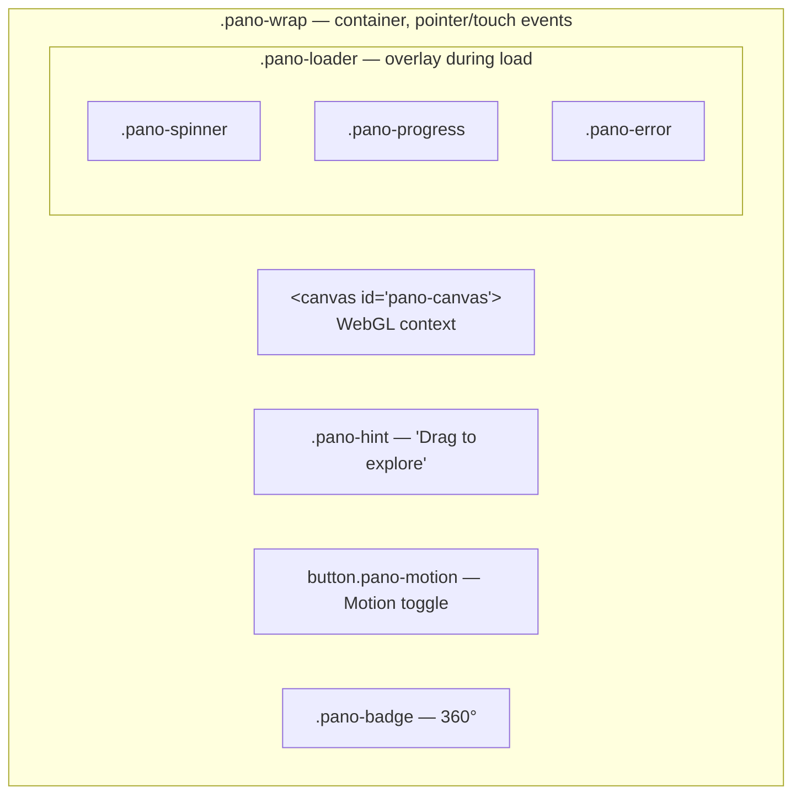

### Lifecycle

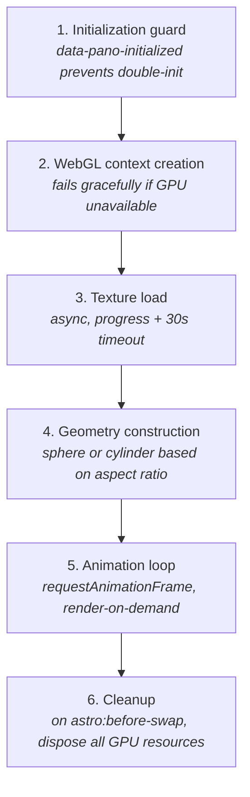

The component hooks into two Astro lifecycle events:
- `astro:page-load` — re-run setup after View Transitions navigation
- `astro:before-swap` — dispose GPU resources before the DOM is replaced

---

## 2. The 3D Rendering Mathematics

### 2.1 Coordinate Systems

Three distinct coordinate systems interact in this viewer:

**WebGL / Three.js world space:**
```
        +Y (up)
         │
         │
         │
         └──── +X (right)
        /
       /
      +Z (toward viewer)
```

This is a right-handed coordinate system. The camera starts at the origin looking down -Z.

**Spherical coordinates (view state):**
```
lon (λ) = horizontal angle from initial heading, in degrees
lat (φ) = vertical angle from horizon, in degrees

Mapping to Cartesian (for understanding, not used directly):
  x = r · cos(φ) · sin(λ)
  y = r · sin(φ)
  z = r · cos(φ) · cos(λ)
```

**Device orientation (sensor frame):**
```
        +Z (up, toward sky when phone flat on table)
         │
         │
         └──── +X (right edge of phone)
        /
       /
      +Y (toward top of phone)
```

The transformation between these three systems is the central mathematical challenge of the viewer.

### 2.2 The Equirectangular Projection

An equirectangular (plate carrée) image uses a direct mapping between geographic coordinates and pixel positions:

$$
u = \frac{\lambda + \pi}{2\pi}, \quad v = \frac{\pi/2 - \phi}{\pi}
$$

Where:
- $u, v \in [0, 1]$ are normalized texture coordinates
- $\lambda \in [-\pi, \pi]$ is longitude
- $\phi \in [-\pi/2, \pi/2]$ is latitude

This mapping preserves neither area nor angle (it is neither equal-area nor conformal). It introduces severe distortion at the poles, where a single pixel row maps to an entire circle of latitude. This is why we clamp the vertical look angle to 85° — beyond that, the pole singularity makes the texture visually meaningless.

### 2.3 UV Mapping on a Sphere

Three.js's `SphereGeometry` generates UV coordinates that follow the equirectangular convention:

For a vertex at spherical position $(\theta, \phi)$ where $\theta$ is the polar angle from +Y and $\phi$ is the azimuthal angle:

$$
u = \frac{\phi}{2\pi}, \quad v = 1 - \frac{\theta}{\pi}
$$

This means the texture's left edge maps to $\phi = 0$, right edge to $\phi = 2\pi$, top to $\theta = 0$ (north pole), bottom to $\theta = \pi$ (south pole).

### 2.4 The BackSide Mirror Problem

When rendering on `BackSide`, the triangle winding order reverses. For an observer inside the sphere looking outward, the U-axis appears flipped — text reads backwards, left and right are swapped.

The geometric reason: consider a triangle with vertices $A, B, C$ wound counter-clockwise as seen from outside. From inside, the same vertices appear clockwise. Three.js handles the culling correctly with `BackSide`, but the UV interpolation still follows the original winding, producing a horizontal mirror.

The fix:

```javascript
tex.wrapS = RepeatWrapping;  // enable wrapping modes
tex.repeat.x = -1;           // negate U → horizontal flip
```

Setting `repeat.x = -1` inverts the texture coordinate along S (horizontal), effectively un-mirroring the image. `RepeatWrapping` is required because negative repeat values cause coordinates to exceed the [0,1] range.

---

## 3. Geometry Construction

### 3.1 Sphere Geometry (Equirectangular Panoramas)

For images with aspect ratio ≤ 3:1, we construct a sphere. The key insight is handling **partial** spheres — images that don't cover the full 360° × 180°.

**Full sphere** (2:1 ratio, e.g., 8000×4000 px):

$$
\theta_{start} = 0, \quad \theta_{length} = \pi
$$

**Partial sphere** (ratio between 1.5:1 and 3:1):

The vertical angular coverage is proportional to how much of the "ideal" 2:1 height the image provides:

```javascript
const fullHeight = imgW / 2;  // pixel height for a full 180° sphere
```

Why `imgW / 2`? A full equirectangular image covers 360° horizontally and 180° vertically. If the width represents 360°, then the height that would represent 180° is exactly half the width (since $180° / 360° = 1/2$).

```javascript
const thetaLength = Math.min(Math.PI, (imgH / fullHeight) * Math.PI);
```

This is the vertical arc in radians. The `Math.min(π, ...)` guard prevents exceeding a hemisphere if the image is taller than 2:1.

```javascript
const thetaStart = (Math.PI - thetaLength) / 2;
```

We centre the partial sphere vertically. If we have 120° of vertical coverage, the band runs from 30° to 150° (measured from the north pole), placing the horizon at the centre.

**Geometry parameters explained:**

```javascript
new SphereGeometry(
  500,           // radius — arbitrary; only rotation matters
  60,            // widthSegments — 6° per segment at equator
  40,            // heightSegments — ~4.5° per segment vertically
  0,             // phiStart — begin at 0° longitude
  Math.PI * 2,  // phiLength — full 360° sweep
  thetaStart,   // thetaStart — top edge polar angle
  thetaLength   // thetaLength — vertical arc
);
```

The **segment counts** determine tessellation quality. At 60 horizontal segments, each quad subtends 6° — small enough that the polygonal silhouette is invisible at any reasonable FOV (the minimum vertex-to-vertex distance at radius 500 is $2 \times 500 \times \sin(3°) \approx 52$ units, far smaller than any visible pixel).

### 3.2 Cylinder Geometry (Strip Panoramas)

For aspect ratios > 3:1, spherical mapping fails — an image that is 10:1 would waste most sphere surface on empty polar caps. Instead, we use a cylinder.

**Height derivation:**

The cylinder's circumference equals the angular coverage of the image (360° horizontal). The height must preserve the image's aspect ratio when the texture wraps around:

$$
C = 2\pi r = 2\pi \times 500 \approx 3141.59 \text{ units}
$$

$$
h = C \times \frac{H_{img}}{W_{img}}
$$

For a 9000×1000 image (9:1 ratio): $h = 3141.59 \times \frac{1000}{9000} \approx 349$ units.

This means the cylinder's height-to-circumference ratio matches the image's height-to-width ratio, ensuring each pixel maps to an equal-area quad on the cylinder surface.

**Vertical look clamping for cylinders:**

```javascript
const vertAngleDeg = (imgH / imgW) * 360;
// For 9:1 image: vertAngleDeg = 40°

LAT_MAX = Math.min(85, vertAngleDeg / 2 - 5);
// LAT_MAX = min(85, 15) = 15°
```

The `- 5` margin prevents the camera from seeing past the cylinder's open edges, which would show the void (black background).

**FOV adjustment for strip panoramas:**

```javascript
fov = Math.min(FOV_MAX, Math.max(FOV_MIN, vertAngleDeg * 0.9));
```

If the cylinder only covers 40° vertically, we set the initial FOV to 36° — filling the viewport without exposing the edges. This creates an immediate "peephole" effect that feels intentional.

### 3.3 Why Radius = 500?

The choice of radius is arbitrary because the camera never moves — it only rotates. Perspective division in the projection matrix cancels out the radius:

$$
\text{Projected size} \propto \frac{r}{r} = 1
$$

Any radius works, but very small values (e.g., 1) can cause floating-point precision issues with the near/far clipping planes, and very large values waste depth buffer precision. 500 is a pragmatic middle ground.

---

## 4. The Perspective Camera Model

### 4.1 The Projection Matrix

Three.js's `PerspectiveCamera` constructs a perspective projection matrix:

$$
M_{proj} = \begin{bmatrix}
\frac{1}{\text{aspect} \cdot \tan(\text{fov}/2)} & 0 & 0 & 0 \\
0 & \frac{1}{\tan(\text{fov}/2)} & 0 & 0 \\
0 & 0 & -\frac{f+n}{f-n} & -\frac{2fn}{f-n} \\
0 & 0 & -1 & 0
\end{bmatrix}
$$

Where:
- $n = 0.1$ (near plane)
- $f = 1000$ (far plane)
- $\text{fov} = 90°$ initially (in radians for the matrix)
- $\text{aspect} = \text{width} / \text{height}$ of the canvas

### 4.2 FOV and Perceived Zoom

The relationship between FOV and magnification:

$$
\text{magnification} = \frac{1}{\tan(\text{fov}/2)}
$$

| FOV | Magnification | Equivalent lens (35mm) |
|-----|---------------|----------------------|
| 110° | 0.57× | ~12mm ultra-wide |
| 90° | 1.0× | ~18mm wide |
| 60° | 1.73× | ~35mm normal |
| 30° | 3.73× | ~75mm telephoto |

The viewer's FOV range (30°–110°) provides roughly a 6.5× zoom range.

### 4.3 Camera Rotation — Euler Angles

The camera rotation is encoded as Euler angles with order `"YXZ"`:

```javascript
camera.rotation.order = "YXZ";
camera.rotation.set(lat * DEG2RAD, -lon * DEG2RAD, 0, "YXZ");
```

Decomposed into rotation matrices:

$$
R = R_Y(-\lambda) \cdot R_X(\phi) \cdot R_Z(0)
$$

$$
R_Y(-\lambda) = \begin{bmatrix}
\cos\lambda & 0 & -\sin\lambda \\
0 & 1 & 0 \\
\sin\lambda & 0 & \cos\lambda
\end{bmatrix}
$$

$$
R_X(\phi) = \begin{bmatrix}
1 & 0 & 0 \\
0 & \cos\phi & -\sin\phi \\
0 & \sin\phi & \cos\phi
\end{bmatrix}
$$

The YXZ order means: **first rotate around Y (yaw), then around the new X (pitch)**. This is crucial — if we applied pitch first (XYZ order), then yaw would rotate around the world Y axis rather than the camera's local Y axis, causing unintuitive behaviour when looking up/down.

### 4.4 Why Negate lon?

The negation in `-lon * DEG2RAD` compensates for the left-hand vs. right-hand rotation convention. Dragging right increments `lon` (turn right), but in Three.js's right-handed system, a positive Y rotation turns the camera left. The negation corrects this.

---

## 5. Interaction Model

### 5.1 Pointer-to-Angle Conversion

The critical formula for converting pixel drag to angular rotation:

```javascript
const fovScale = fov / 90;
const dx = (e.clientX - pointerX) * DRAG_SENSITIVITY * fovScale;
```

**Why fovScale?** Consider what one pixel represents at different zoom levels:

At `fov = 90°`, the viewport spans 90° vertically. If the canvas is 800px tall, one pixel ≈ 0.1125°.

At `fov = 30°`, one pixel ≈ 0.0375° — three times finer.

Without `fovScale`, dragging would feel three times faster when zoomed in, making precise control impossible. The correction:

$$
\Delta\theta = \Delta\text{px} \times S \times \frac{\text{fov}}{90°}
$$

Where $S = 0.105$ is the base sensitivity constant.

### 5.2 Momentum Physics

The momentum system models a simple friction-decayed velocity:

**On drag (each `pointermove`):**
```javascript
velocityX = -dx;  // instantaneous velocity = displacement this frame
velocityY = dy;
lon += velocityX;
lat += velocityY;
```

**After release (each animation frame):**
```javascript
velocityX *= FRICTION;  // FRICTION = 0.924
velocityY *= FRICTION;
lon += velocityX;
lat += velocityY;
```

This is a discrete-time first-order system. The velocity at frame $n$ after release:

$$
v_n = v_0 \times f^n
$$

Where $f = 0.924$. Solving for the number of frames to reach fraction $p$ of initial velocity:

$$
n = \frac{\ln(p)}{\ln(f)} = \frac{\ln(p)}{\ln(0.924)}
$$

| Decay to | Frames | Time at 60fps |
|----------|--------|--------------|
| 50% | 8.8 | 146ms |
| 10% | 29.1 | 485ms |
| 1% | 58.2 | 970ms |

**Minimum velocity threshold:**

```javascript
if (Math.abs(velocityX) > MIN_VELOCITY || Math.abs(velocityY) > MIN_VELOCITY) {
  // continue momentum
} else {
  // velocity is imperceptible; stop updating
}
```

`MIN_VELOCITY = 0.01°/frame` corresponds to 0.6°/sec — far below perceptual threshold. This prevents the animation loop from making unnecessary render calls when the panorama has effectively stopped.

### 5.3 Pinch Zoom Mathematics

Pinch distance between two fingers:

$$
d = \sqrt{(\Delta x)^2 + (\Delta y)^2} = \text{Math.hypot}(x_1 - x_2, y_1 - y_2)
$$

Change in FOV proportional to change in distance:

$$
\Delta\text{fov} = (d_{prev} - d_{curr}) \times 0.1
$$

When fingers move apart ($d_{curr} > d_{prev}$), $\Delta\text{fov}$ is negative → FOV decreases → zoom in. This matches the natural mental model of "spreading to magnify."

### 5.4 Multi-Pointer Tracking

The viewer tracks all active pointers in a `Set<number>`:

```javascript
const activePointers = new Set<number>();
```

This solves several edge cases:
- **Second finger down during drag** — transitions to pinch mode, suppresses pan
- **One finger lifted during pinch** — smoothly transitions back to single-finger drag
- **Stray pointercancel events** — clean removal without corrupting state

The `isPinching` flag prevents the `pointermove` handler from treating two-finger gestures as drag:

```javascript
el.addEventListener("pointermove", (e) => {
  if (activePointers.size === 0 || isPinching) return;
  // ... drag logic only runs for single-pointer
});
```

---

## 6. Device Motion Mode — The Full Picture

### 6.1 Sensor Hardware and the API

Modern smartphones contain:
- **Accelerometer** — measures gravity + linear acceleration (3-axis)
- **Gyroscope** — measures angular velocity (3-axis)
- **Magnetometer** — measures magnetic field direction (3-axis, optional)

The browser's sensor fusion algorithm (typically a complementary or Kalman filter) combines these to produce the `DeviceOrientationEvent` with three Euler angles: `alpha`, `beta`, `gamma`.

**Important limitations:**
- `alpha` (compass) is relative to magnetic north — noisy near metal
- `beta` has a discontinuity at ±180° (phone flipped upside down)
- `gamma` is limited to ±90° — cannot distinguish 45° and 135° tilt
- Update rate is typically 60Hz on iOS, variable (16–100Hz) on Android

### 6.2 The Device Orientation Convention

The W3C spec defines the device coordinate system:

```
Phone held in portrait, screen facing user:

        +Y (top edge)
         │
         │
         ●──── +X (right edge)
        /
       +Z (out of screen, toward user)
```

The **Earth frame** for alpha/beta/gamma:
- `alpha = 0°`: phone pointing north
- `beta = 0°`: phone flat on table
- `gamma = 0°`: phone not tilted left/right

The Euler rotation order defined by the spec is **Z-X'-Y''** (intrinsic rotations):
1. Rotate by `alpha` around Earth's Z axis (compass heading)
2. Rotate by `beta` around the new device X axis (front-back tilt)
3. Rotate by `gamma` around the new device Y axis (left-right tilt)

### 6.3 Converting Device Euler to Three.js Quaternion

This is the most mathematically dense part of the viewer. Let us trace through `setQuaternionFromDeviceOrientation` step by step.

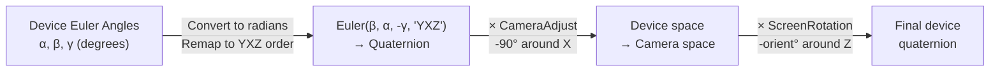

**Step 1: Euler → Quaternion in device frame**

```javascript
motionEuler.set(beta, alpha, -gamma, "YXZ");
target.setFromEuler(motionEuler);
```

Wait — the spec says Z-X'-Y'', but we are using `"YXZ"`? And the angles are reordered?

This is because Three.js uses **extrinsic** (fixed-axis) rotation for its Euler class, while the device spec uses **intrinsic** (body-axis) rotations. The equivalence:

$$
R_{intrinsic}(Z, X', Y'') = R_{extrinsic}(Y, X, Z)
$$

Reversing the order converts intrinsic to extrinsic. And in Three.js Euler notation:
- Component 1 (X slot) → `beta` (X rotation)
- Component 2 (Y slot) → `alpha` (Y rotation)
- Component 3 (Z slot) → `-gamma` (Z rotation, negated due to axis convention)

The negation of gamma accounts for the difference between the W3C right-hand rotation around Y and Three.js's convention.

**Step 2: Camera adjustment quaternion**

```javascript
target.multiply(motionCameraAdjustment);
// motionCameraAdjustment = new Quaternion(-Math.sqrt(0.5), 0, 0, Math.sqrt(0.5))
```

This quaternion represents a **-90° rotation around the X axis**. In quaternion form:

$$
q = \cos(-45°) + \sin(-45°) \cdot \hat{i} = \frac{\sqrt{2}}{2} + (-\frac{\sqrt{2}}{2}) \cdot \hat{i}
$$

In Three.js `Quaternion(x, y, z, w)` format: $(-\sqrt{0.5}, 0, 0, \sqrt{0.5})$.

**Why -90° around X?** The device orientation API assumes the "default" device posture is flat on a table (screen up, Z pointing to sky). In this posture, the camera should look at the horizon (forward along -Z in camera space). 

A phone lying flat has its screen-normal (+Z_device) pointing up (+Y_world). We need to rotate so that "device Z = up" becomes "camera -Z = forward". A -90° pitch around X does exactly this:

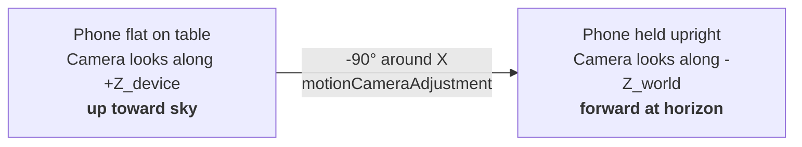

**Step 3: Screen orientation compensation**

```javascript
target.multiply(motionScreenQuaternion.setFromAxisAngle(motionZAxis, -orient));
```

When the device rotates from portrait to landscape, the screen pixels rotate but the gyroscope doesn't know about this. The `screen.orientation.angle` (0, 90, 180, 270) tells us how much the rendering has rotated, and we apply an equal-and-opposite Z rotation:

- Portrait: `orient = 0°` → no correction
- Landscape (left): `orient = 90°` → rotate -90° around Z
- Upside down: `orient = 180°` → rotate -180° around Z
- Landscape (right): `orient = 270°` → rotate -270° around Z

### 6.4 The Correction Quaternion — Calibration

The device orientation gives us an **absolute** orientation (relative to magnetic north + gravity). But the user might have their phone pointing east while looking north in the panorama. We need a mapping from device space to view space.

**Calibration formula:**

$$
q_{correction} = q_{camera} \cdot q_{device}^{-1}
$$

Where:
- $q_{camera}$ = current camera quaternion (where user is currently looking)
- $q_{device}$ = current device quaternion (where the phone is currently pointing)
- $q_{device}^{-1}$ = inverse (conjugate for unit quaternions)

**Application each frame:**

$$
q_{target} = q_{correction} \cdot q_{device,new}
$$

**Proof that this works:**

At calibration time, $q_{device,new} = q_{device}$:

$$
q_{target} = q_{camera} \cdot q_{device}^{-1} \cdot q_{device} = q_{camera} \cdot I = q_{camera}
$$

The target equals the current camera — no movement occurs. Correct.

Now if the device rotates by some $\Delta q$ (so $q_{device,new} = q_{device} \cdot \Delta q$):

$$
q_{target} = q_{camera} \cdot q_{device}^{-1} \cdot q_{device} \cdot \Delta q = q_{camera} \cdot \Delta q
$$

The camera rotates by $\Delta q$ — the same rotation as the device. Correct.

This is why the correction quaternion is a **full 3-axis** offset. A simpler yaw-only correction would fail when the phone tilts — pitch/roll offsets would accumulate as error.

### 6.5 Recalibration Triggers

The correction quaternion is recomputed whenever `hasMotionTarget` is cleared:

```javascript
function resetMotionOrigin() {
  hasMotionTarget = false;  // next orientation event will recalibrate
  velocityX = 0;
  velocityY = 0;
}
```

Recalibration happens after three scenarios:

```mermaid
sequenceDiagram
    participant User
    participant Pointer as Pointer Events
    participant Gyro as Device Orientation
    participant Cam as Camera

    Note over User,Cam: Scenario 1 — Drag during motion mode
    User->>Pointer: pointerdown + pointermove
    Pointer->>Cam: Update lon/lat (Euler path)
    Note over Gyro: SLERP suppressed (activePointers > 0)
    User->>Pointer: pointerup
    Pointer->>Gyro: resetMotionOrigin() — clear hasMotionTarget
    Gyro->>Gyro: Next event: recalibrate correction quaternion
    Gyro->>Cam: SLERP resumes from new baseline

    Note over User,Cam: Scenario 2 — Pinch ends
    User->>Pointer: touchend (fewer than 2 fingers)
    Pointer->>Gyro: resetMotionOrigin()
    Note over Gyro: cachedScreenAngle unlocked
    Gyro->>Gyro: Next event: recalibrate
    Gyro->>Cam: SLERP resumes seamlessly

    Note over User,Cam: Scenario 3 — Motion mode toggled on
    User->>Gyro: Button click → motionEnabled = true
    Gyro->>Gyro: resetMotionOrigin() — fresh calibration
    Gyro->>Gyro: First event: set correction = camera × device⁻¹
    Gyro->>Cam: SLERP begins
```

On the next `deviceorientation` event after `hasMotionTarget = false`:

```javascript
if (!hasMotionTarget) {
  motionCorrectionQuaternion
    .copy(camera.quaternion)
    .multiply(motionDeviceQuaternion.clone().invert());
}
```

This makes the new device position correspond to the current view — seamless transitions with no visible jump.

### 6.6 SLERP — Spherical Linear Interpolation

**The problem with linear interpolation (LERP) on quaternions:**

Quaternions represent rotations on the unit hypersphere $S^3$ in 4D space. Linear interpolation in 4D does not follow the shortest path on the sphere — it "cuts through" the interior, producing non-unit quaternions (which must be renormalized) and non-constant angular velocity.

**SLERP definition:**

For unit quaternions $q_0$ and $q_1$ with angle $\Omega$ between them:

$$
\text{slerp}(q_0, q_1, t) = \frac{\sin((1-t)\Omega)}{\sin\Omega} q_0 + \frac{\sin(t\Omega)}{\sin\Omega} q_1
$$

Where:

$$
\Omega = \arccos(q_0 \cdot q_1)
$$

The dot product $q_0 \cdot q_1$ is the 4D inner product. When the quaternions are close ($\Omega \approx 0$), SLERP degenerates numerically — Three.js falls back to NLERP (normalize-after-lerp) in this case.

**Exponential smoothing via repeated SLERP:**

The viewer applies SLERP with a fixed $t = 0.18$ every frame:

```javascript
camera.quaternion.slerp(motionTargetQuaternion, 0.18);
```

This is **not** a one-shot interpolation from start to end. It is an exponential chase filter:

$$
q_{n+1} = \text{slerp}(q_n, q_{target}, t)
$$

The angular distance decreases geometrically each frame:

$$
\Omega_n = (1 - t)^n \cdot \Omega_0
$$

At $t = 0.18$:
- After 1 frame: 82% of original distance remains
- After 4 frames: 45% remains (~67ms perceived lag)
- After 12 frames: 9.2% remains (~200ms to near-convergence)
- After 30 frames: 0.2% remains (effectively arrived)

**The convergence threshold:**

```javascript
if (1 - Math.abs(camera.quaternion.dot(motionTargetQuaternion)) > 0.000001) {
  camera.quaternion.slerp(motionTargetQuaternion, MOTION_SMOOTHING);
}
```

The expression $1 - |q_1 \cdot q_2|$ measures angular distance. For unit quaternions:

$$
|q_1 \cdot q_2| = \cos(\Omega / 2)
$$

So $1 - |q_1 \cdot q_2| > 0.000001$ corresponds to:

$$
\Omega > 2\arccos(1 - 0.000001) \approx 0.16°
$$

Below this threshold, we skip the SLERP and consider the camera "arrived" — preventing infinite micro-updates that waste GPU cycles.

### 6.7 syncLonLatFromCamera()

After the camera is rotated by SLERP (in quaternion space), we must sync back to the `lon/lat` representation so that:
- The momentum system has correct values if the user suddenly drags
- Vertical clamping can be applied
- The manual rotation path (`camera.rotation.set(...)`) starts from the right position

```javascript
function syncLonLatFromCamera() {
  motionEuler.setFromQuaternion(camera.quaternion, "YXZ");
  lon = -motionEuler.y / DEG2RAD;
  lat = Math.max(-LAT_MAX, Math.min(LAT_MAX, motionEuler.x / DEG2RAD));
}
```

This decomposes the camera quaternion back into Euler angles using the same "YXZ" order, then extracts `lon` and `lat`. The clamping on `lat` ensures the vertical limits are respected even when the gyroscope reports an orientation beyond the allowed range.

---

## 7. Synchronization — How Drag and Gyro Coexist

The interaction between manual drag and gyroscope-driven motion is the most subtle engineering challenge. Here is the complete state machine:

### 7.1 States

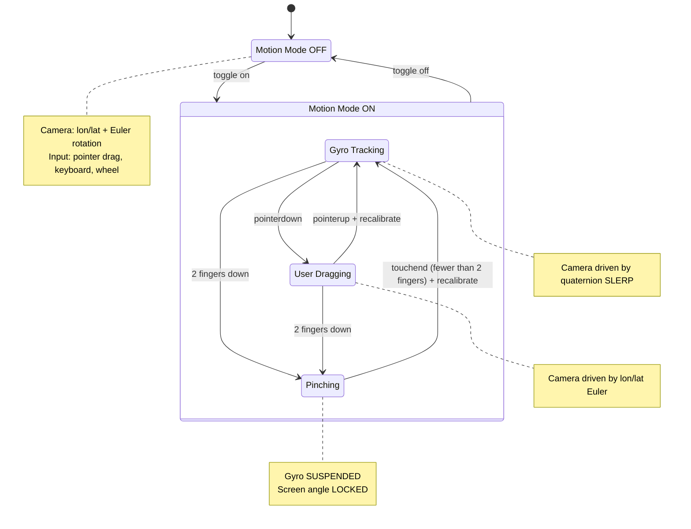

### 7.2 Dual Representation Problem

The camera orientation is stored in two forms simultaneously:
1. **Euler angles** (`lon`, `lat`) — used during manual control
2. **Quaternion** (`camera.quaternion`) — used during gyro tracking

These must stay synchronized. The rules:

| Action | Updates | Syncs to |
|--------|---------|----------|
| Pointer drag | `lon`, `lat` → camera Euler | (quaternion computed internally by Three.js) |
| Gyro event | `motionTargetQuaternion` | After SLERP: `syncLonLatFromCamera()` |
| Keyboard | `lon`, `lat` → camera Euler | (quaternion computed internally) |

The `manualViewDirty` flag ensures that `camera.rotation.set()` is only called when the Euler values have changed (not when gyro SLERP is active):

```javascript
if (moved || needsRender) {
  if (manualViewDirty) {
    camera.rotation.set(lat * DEG2RAD, -lon * DEG2RAD, 0, "YXZ");
    manualViewDirty = false;
  }
  renderer.render(scene, camera);
}
```

During gyro tracking, `manualViewDirty` is false — the camera quaternion is set directly by SLERP without going through the Euler path. This prevents the two systems from fighting.

### 7.3 The "Drag During Gyro" Problem

If the user drags while motion is active:

1. `pointermove` fires → `lon/lat` update → `manualViewDirty = true`
2. Camera is rotated via Euler path
3. Meanwhile, `deviceorientation` events keep firing → `motionTargetQuaternion` updates
4. In the animation loop, SLERP would fight with the manual rotation

**Solution:** The SLERP only runs when `activePointers.size === 0`:

```javascript
if (motionEnabled && activePointers.size === 0 && !isPinching && hasMotionTarget) {
  camera.quaternion.slerp(motionTargetQuaternion, MOTION_SMOOTHING);
}
```

On `pointerup`, `resetMotionOrigin()` clears `hasMotionTarget`. The next `deviceorientation` event recalibrates — the new correction maps the device's current orientation to wherever the user dragged to. No jump occurs.

### 7.4 The Pinch-During-Gyro Problem

A pinch gesture involves two fingers and often causes the user to inadvertently rotate the device. Without protection, this causes:

1. Device rotates slightly as fingers move
2. Gyro fires orientation event
3. Camera jumps to follow device
4. User perceives zoom + unwanted rotation = disorienting

**Three-layer protection:**

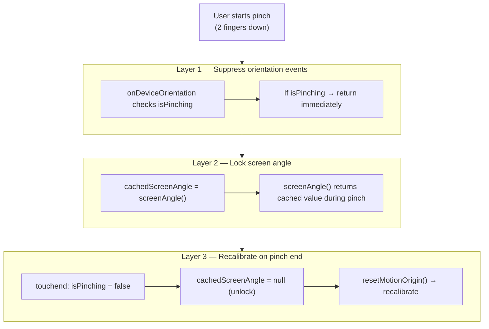

**Layer 1 — Suppress orientation events during pinch:**
```javascript
function onDeviceOrientation(e) {
  if (isPinching) return;  // drop the event entirely
  // ...
}
```

**Layer 2 — Lock screen angle during pinch:**
```javascript
el.addEventListener("touchstart", (e) => {
  if (e.touches.length === 2) {
    cachedScreenAngle = screenAngle();  // freeze current value
  }
});
```

The `screenAngle()` function returns the cached value during pinch:
```javascript
function screenAngle() {
  if (cachedScreenAngle !== null) return cachedScreenAngle;
  return screen.orientation?.angle ?? window.orientation ?? 0;
}
```

This prevents a rotation axis shift mid-gesture if the browser reports an orientation change (e.g., threshold between portrait and landscape is crossed during the pinch).

**Layer 3 — Recalibrate on pinch end:**
```javascript
el.addEventListener("touchend", (e) => {
  if (e.touches.length < 2 && isPinching) {
    isPinching = false;
    cachedScreenAngle = null;  // unlock
    if (motionEnabled) resetMotionOrigin();  // recalibrate
  }
});
```

### 7.5 The "Finger Transition" Problem

When a pinch ends and one finger remains, the `pointermove` handler would see a huge delta between the current finger position and where `pointerX/Y` were last set (by the initial `pointerdown`). This causes a violent pan jump.

**Fix: Re-sync pointer position to remaining finger:**
```javascript
if (e.touches.length === 1) {
  pointerX = e.touches[0].clientX;
  pointerY = e.touches[0].clientY;
}
```

### 7.6 Momentum vs. SLERP Priority

When motion mode is active and the user flicks (drag-release with velocity), both momentum and SLERP want to control the camera. The order of operations in `animate()`:

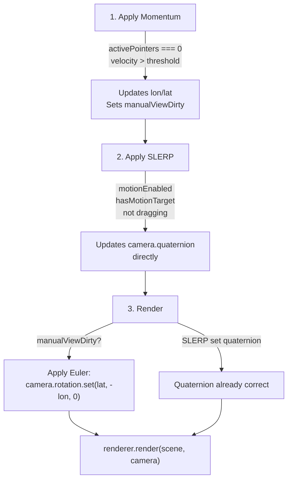

But after a drag+release, `resetMotionOrigin()` clears `hasMotionTarget`. So SLERP is skipped until the next orientation event triggers recalibration. During this gap (typically 1 frame at 60Hz), momentum runs freely. Then the first recalibrated SLERP smoothly takes over, incorporating the momentum-shifted position as the new baseline.

---

## 8. Failure Modes and Graceful Degradation

### 8.1 WebGL Context Creation Failure

**Cause:** GPU driver crash, too many active WebGL contexts (browsers limit to ~8-16), extremely old hardware, or GPU blocklisted by the browser.

**Detection:**
```javascript
try {
  renderer = new WebGLRenderer({ canvas, antialias: false, alpha: false });
} catch (e) {
  // GPU unavailable
}
```

**Recovery:**
- Hide the spinner (no point waiting for something that cannot render)
- Show an explicit error message: *"WebGL is not available. Your browser or device may not support 3D rendering, or GPU resources are exhausted. Try closing other tabs or restarting your browser."*
- Exit the setup function entirely — no animation loop, no event listeners, no memory leaked

### 8.2 Texture Load Failure

**Possible causes:**
- Network offline
- File moved or deleted (404)
- CORS rejection (cross-origin image without appropriate headers)
- File too large for available memory

**Detection:** Three.js's `TextureLoader.load` error callback:

```javascript
texLoader.load(src, onSuccess, onProgress, (err) => {
  // Determine specific failure cause
  if (!navigator.onLine) {
    message = "You appear to be offline.";
  } else if (loadTimedOut) {
    message = "Loading timed out.";
  } else {
    message = "Failed to load panorama. The file may be missing or inaccessible.";
  }
});
```

**Recovery:**
- Hide spinner and progress text
- Show specific error message in red
- No rendering loop starts — component stays in error state

### 8.3 Texture Load Timeout

**Cause:** Slow connection + large image (16K panoramas can be 15-30MB).

**Detection:** 30-second timer that fires independently of the load callbacks:

```javascript
const LOAD_TIMEOUT_MS = 30000;
const loadTimer = setTimeout(() => {
  loadTimedOut = true;
  errorEl.textContent = "Loading is taking longer than expected.";
}, LOAD_TIMEOUT_MS);
```

**Behaviour:** The timeout does NOT cancel the load — it only shows a warning. If the image eventually loads, `clearTimeout(loadTimer)` runs in the success callback and the viewer proceeds normally. This handles the case where the connection is merely slow, not dead.

### 8.4 Device Orientation Permission Denied

On iOS 13+, `DeviceOrientationEvent` requires explicit permission:

```javascript
const MotionEvent = window.DeviceOrientationEvent as DeviceOrientationEventWithPermission;
if (MotionEvent?.requestPermission) {
  const permission = await MotionEvent.requestPermission();
  if (permission !== "granted") return;  // silently bail
}
```

**Behaviour:** If the user denies permission, the motion button simply doesn't activate. No error shown — the manual drag/keyboard controls remain fully functional.

### 8.5 Missing Gyroscope Hardware

**Detection:**
```javascript
if ("DeviceOrientationEvent" in window && window.matchMedia("(pointer: coarse)").matches) {
  motionButton.hidden = false;  // show button
}
```

Two conditions must be met:
1. The API exists (`"DeviceOrientationEvent" in window`)
2. The device has a coarse pointer (touchscreen) — desktop browsers expose the API but have no gyroscope

If either condition fails, the motion button stays `hidden` — the user never sees a feature that wouldn't work.

### 8.6 Null/Invalid Sensor Data

Sensor events can fire with null values (e.g., magnetometer not ready):

```javascript
function onDeviceOrientation(e) {
  if (e.alpha === null || e.beta === null || e.gamma === null) return;
  // ...
}
```

This guard prevents NaN from propagating into the quaternion math. A single NaN in a quaternion corrupts all subsequent SLERP computations (NaN is infectious in floating-point arithmetic).

### 8.7 Tab Visibility Pause

**Problem:** When the tab is hidden, `requestAnimationFrame` stops firing on most browsers. When it resumes, accumulated `deviceorientation` events could cause a sudden jump.

**Solution:**
```javascript
const onVisChange = () => {
  paused = document.hidden;
  if (!paused) needsRender = true;
};
```

When the tab becomes visible again, `needsRender = true` triggers a single render. The SLERP naturally smooths any accumulated orientation difference — the camera glides to the new device orientation over ~200ms rather than jumping.

### 8.8 Astro View Transition Cleanup

**Problem:** Astro's View Transitions replace the DOM but don't automatically clean up WebGL contexts, event listeners, or GPU memory.

**Solution:**
```javascript
const cleanup = () => {
  destroyed = true;  // stops animation loop
  ro.disconnect();   // ResizeObserver
  window.removeEventListener("keydown", onKeyDown);
  window.removeEventListener("keyup", onKeyUp);
  document.removeEventListener("visibilitychange", onVisChange);
  motionButton?.removeEventListener("click", onMotionButtonClick);
  window.removeEventListener("deviceorientation", onDeviceOrientation, true);
  scene.traverse((obj) => {
    if (obj instanceof Mesh) {
      obj.geometry.dispose();       // free GPU vertex buffers
      if (obj.material.map) obj.material.map.dispose();  // free texture VRAM
      obj.material.dispose();       // free material uniform buffers
    }
  });
  renderer.dispose();  // release WebGL context
};
document.addEventListener("astro:before-swap", cleanup, { once: true });
```

The `destroyed = true` flag ensures the `requestAnimationFrame` loop exits immediately:
```javascript
function animate() {
  if (destroyed) return;  // no further frames scheduled
  requestAnimationFrame(animate);
  // ...
}
```

### 8.9 Double-Initialization Prevention

**Problem:** With View Transitions, the `astro:page-load` event fires on the same page if the user navigates back. The component script would run again, creating a second WebGL context on the same canvas.

**Solution:**
```javascript
if (el.dataset.panoInitialized === "true") return;
el.dataset.panoInitialized = "true";
```

The data attribute persists in the DOM across script re-executions within the same page lifecycle, preventing duplicate setup.

### 8.10 Pixel Ratio Clamping

**Problem:** High-DPI devices (3×, 4×) would create enormous framebuffers (e.g., 4K × 4K canvas), consuming excessive GPU memory and thermal budget.

**Solution:**
```javascript
renderer.setPixelRatio(Math.min(window.devicePixelRatio, 2));
```

Clamping at 2× ensures sharp rendering on most devices while preventing the pathological 4× case. The visual difference between 2× and 3× is imperceptible for a panorama texture (the texture resolution is the limiting factor, not the canvas resolution).

---

## 9. Render-on-Demand Architecture

The animation loop runs at the display refresh rate but only issues GPU draw calls when necessary:

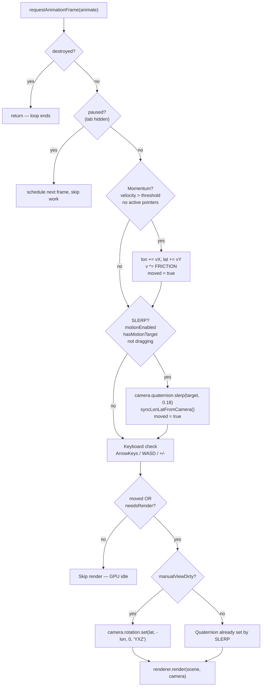

The `needsRender` flag is set by external events (resize, zoom, initial load) that don't flow through the momentum/SLERP/keyboard paths. This ensures a render happens even when the camera didn't move but the viewport changed.

**GPU power savings:** On a static view (no interaction, motion off), zero `gl.drawArrays` calls are made. The `requestAnimationFrame` callback still runs (for input polling), but costs only a few microseconds of CPU time. The GPU is effectively idle.

---

## Summary

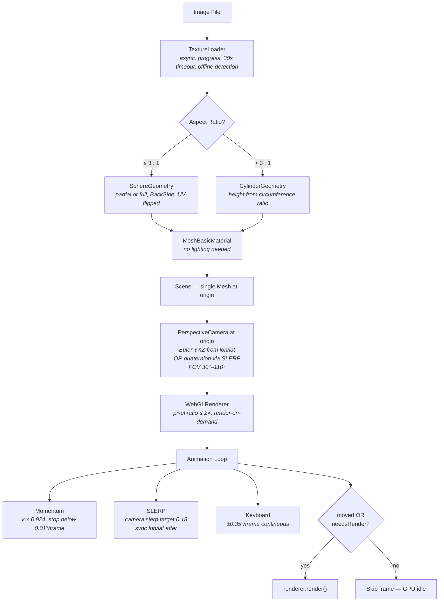

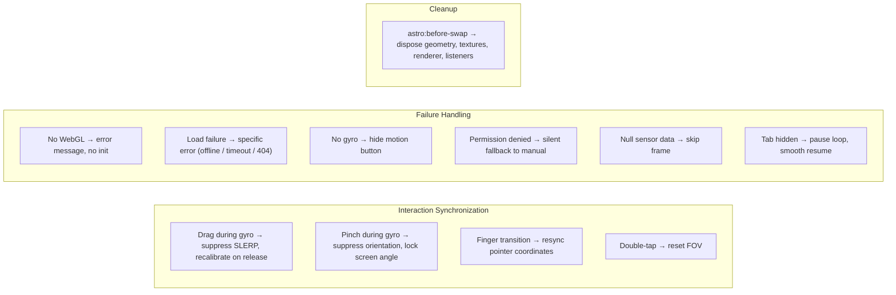

The geometry is deceptively simple — a sphere or cylinder with an image on the inside. The real engineering is in the synchronization layer: making quaternion-space gyro tracking coexist peacefully with Euler-space manual control, handling the dozen edge cases where these two systems could conflict, and failing gracefully when hardware or network conditions are not ideal.
