## The hybrid Git branching model that combines trunk-based speed with release-grade stability.

---

## Table of Contents

1. [Core Philosophy](#1-core-philosophy)
2. [How It Differs from Pure TBD and GitFlow](#2-how-it-differs-from-pure-tbd-and-gitflow)
3. [Pros and Cons](#3-pros-and-cons)
4. [When to Follow This Model?](#4-when-to-follow-this-model)
5. [Branching Strategy Walkthrough](#5-branching-strategy-walkthrough)
6. [Release Mechanism](#6-release-mechanism)
7. [Bug Fixes for Old Releases](#7-bug-fixes-for-old-releases)
8. [Avoiding Git Conflicts](#8-avoiding-git-conflicts)
9. [Merge vs Rebase — When to Use Which at Every Merge Point](#9-merge-vs-rebase--when-to-use-which-at-every-merge-point)
10. [Managing Long Framework Version Upgrades](#10-managing-long-framework-version-upgrades)
11. [Q&A — TBD + Release Branch Scenarios](#11-qa--tbd--release-branch-scenarios)
    1. [What if a feature needs changes right after it was merged into `main`?](#1-what-if-a-feature-needs-changes-right-after-it-was-merged-into-main)
    2. [Where do bug fix branches come from during release hardening?](#2-where-do-bug-fix-branches-come-from-during-release-hardening)
    3. [How are patch fixes / patch releases maintained?](#3-how-are-patch-fixes--patch-releases-maintained)
    4. [Where is a patch release actually deployed from?](#4-where-is-a-patch-release-actually-deployed-from)
    5. [If a release branch passes QA with zero fixes, do we still merge it back into `main`?](#5-if-a-release-branch-passes-qa-with-zero-fixes-do-we-still-merge-it-back-into-main)
    6. [What is the difference between `release/vX.X` and `hotfix/vX.X.X` branches?](#6-what-is-the-difference-between-releasevxx-and-hotfixvxx-branches)
    7. [Why is there no `develop` branch?](#7-why-is-there-no-develop-branch)
    8. [When to do a Major, Minor, or Patch release?](#8-when-to-do-a-major-minor-or-patch-release)
    9. [Can multiple release branches coexist?](#9-can-multiple-release-branches-coexist)
    10. [What happens to `main` while a release branch is being hardened?](#10-what-happens-to-main-while-a-release-branch-is-being-hardened)

---

## 1. Core Philosophy

### The Problem This Model Solves

Pure Trunk-Based Development (TBD) assumes `main` is always deployable — every commit can go to production. That works beautifully for SaaS products with Continuous Deployment. But many teams need a **hardening phase** (QA, UAT, compliance sign-off) before shipping. They need a gate, but they do not want the heavyweight overhead of GitFlow's permanent `develop` branch and its "Merge Hell."

Conversely, GitFlow's long-lived feature branches and dual `main`/`develop` structure create friction with CI/CD pipelines — as Atlassian's own documentation acknowledges, GitFlow can be **challenging to use with CI/CD** because its fundamental structure prioritizes scheduled releases over continuous delivery.

### The Model: TBD + Release Branch

- **Single trunk:** `main` is the only permanent branch. There is **no `develop` branch**.
- **Short-lived feature branches:** Developers create branches that live for hours (max 1–2 days). They merge back to `main` via Pull Requests with squash or regular merge.
- **Feature Flags:** Incomplete features are merged behind toggles so they cannot affect users.
- **Release branches on demand:** When it is time to ship, a `release/vX.X` branch is cut from `main`. This branch is used exclusively for hardening — bug fixes, documentation, version bumps. No new features enter it.
- **Merge back:** After the release ships, the release branch is merged back into `main` to capture any fixes made during hardening.

> **In one sentence:** Develop on the trunk, stabilize on a release branch, deploy from the release branch.

---

## 2. How It Differs from Pure TBD and GitFlow

| Aspect | Pure TBD | TBD + Release Branch | GitFlow |
|---|---|---|---|
| **Permanent branches** | `main` only | `main` only | `main` + `develop` |
| **Feature branches** | Hours (< 24h) | Hours (< 24h) | Days, weeks, months |
| **Release mechanism** | Tag on `main`, deploy immediately | Cut `release/vX.X` from `main`, harden, then deploy | Cut `release/vX.X` from `develop`, harden, merge to `main` |
| **Where features merge to** | `main` | `main` | `develop` |
| **Hotfix source** | Direct commit on `main` | Branch from `release/vX.X` or `main` | Branch from `main` |
| **CI/CD compatibility** | Excellent | Very Good | Challenging |
| **QA/Hardening phase** | None — trunk is always green | Yes — on the release branch | Yes — on the release branch |
| **Merge complexity** | Minimal | Low | High ("Merge Hell") |
| **Feature Flags needed?** | Yes | Yes | No |
| **Old version support** | Not supported | Support branches from tags | Support branches from tags |

### Why GitFlow Struggles with CI/CD

The Gemini chat in context highlights several reasons GitFlow is considered "anti-CI/CD":

1. **Long-lived branches prevent Continuous Integration.** If code sits on a feature branch for weeks, it is not being continuously integrated — it is "Isolation Integration."
2. **Complex "Merge Hell."** Multiple long-lived branches (`develop`, `feature`, `release`, `hotfix`, `main`) create massive merge diffs at the end of a release cycle.
3. **Redundant testing environments.** Each branch type needs its own CI pipeline and environment parity — a significant DevOps burden.
4. **Delayed feedback loops.** A bug introduced in a feature branch may not surface until the `release` branch is created — days or weeks later.
5. **Incompatible with "Deploy on Green."** Even if all tests pass on `develop`, the code must wait for a formal release window, a merge to `release`, and another merge to `main`.

TBD + Release Branch eliminates most of these issues: features integrate into `main` continuously (satisfying CI), and the release branch is only a short-lived stabilization gate (not a long-lived development line).

---

## 3. Pros and Cons

### Pros

- **CI/CD Friendly:** `main` receives code multiple times a day. Your CI pipeline has one permanent target to test against — no juggling between `develop` and `main`.
- **Fast Feedback:** Every commit to `main` is tested immediately against the latest state of the codebase. Bugs are caught within hours of being written.
- **Controlled Releases:** The release branch provides a formal hardening phase without requiring a permanent `develop` branch. Ideal for teams with QA gates or compliance requirements.
- **Low Merge Complexity:** Since there is no `develop` branch, you eliminate the "syncing nightmare" — the need to constantly merge between `main`, `develop`, `release`, and `hotfix` branches.
- **Clear Source of Truth:** `main` is always the single source of truth for development. There is no ambiguity about which branch represents "the latest code."
- **DORA Metrics:** Retains most of the DORA (DevOps Research and Assessment) benefits of pure TBD — lead time, deployment frequency, and change failure rate remain strong.

### Cons

- **Feature Flags Required:** Just like pure TBD, incomplete features must be hidden behind toggles. If feature flags are not cleaned up, they become technical debt.
- **Release Branch Discipline:** The team must be disciplined about what goes into the release branch (bug fixes only) and what stays on `main` (new features). Blurring this line turns the release branch into a second trunk.
- **Concurrent Release Complexity:** If you need to maintain multiple live versions simultaneously (e.g., v1.x and v2.x), you need support branches — adding overhead similar to GitFlow.
- **Seniority Required:** Like pure TBD, developers must be comfortable with small, frequent commits, feature flags, and keeping the trunk green.

---

## 4. When to Follow This Model?

### Choose TBD + Release Branch if:

- You want **Continuous Integration** but cannot do **Continuous Deployment** (e.g., you need a QA gate, a compliance sign-off, or a scheduled release window).
- Your team is experienced and comfortable with short-lived branches, but your **release process requires stabilization** before shipping.
- You are building a product with a **regular release cadence** (bi-weekly, monthly) and need a "hardening sprint" before each release.
- You want the **simplicity of TBD** (single trunk, no `develop` branch) but need a **safety net for production** (the release branch).
- You are working on **mobile apps** or **on-premises software** where you cannot continuously deploy and need to bake a specific version.
- You want to avoid the **"Merge Hell"** and **CI/CD friction** of GitFlow without going to fully automated Continuous Deployment.

### Do NOT choose this model if:

- You can do **Continuous Deployment** — use pure TBD with tags on `main`. The release branch is unnecessary overhead.
- You have **junior-heavy teams** who need the safety of isolated feature branches — consider GitFlow.
- You must maintain **many concurrent versions** (5+ active versions) — the support branch overhead may push you toward a full GitFlow or release-train model.

---

## 5. Branching Strategy Walkthrough

End-to-end examples using Mermaid diagrams, covering feature development, release cycles, hotfixes, and legacy version support.

---

### Step 1 — Feature Work (Short-Lived Branch → Main)

Developers work on short-lived branches (hours, max 1–2 days). Incomplete features are hidden behind feature flags. All code merges to `main` — there is no `develop` branch.

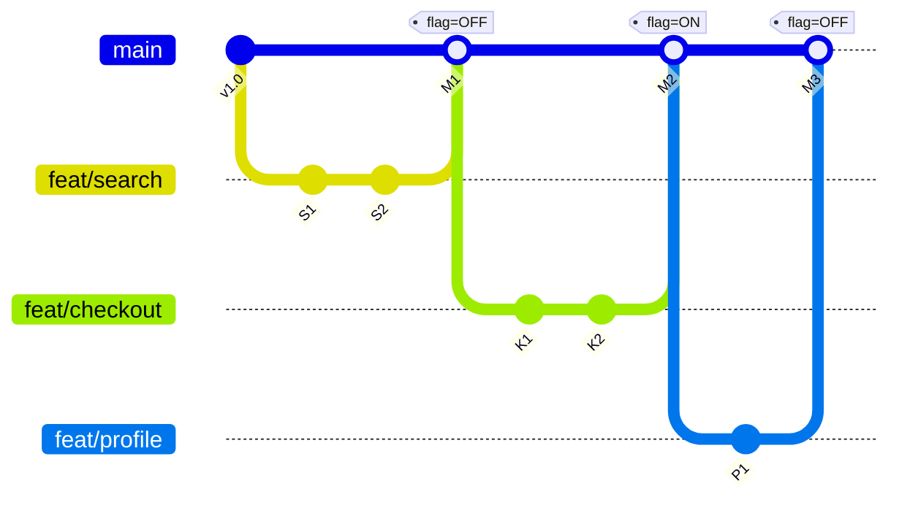

Every feature lands on `main` via a Pull Request. The trunk is always the latest integrated state of the codebase.

### Step 2 — Release Cycle (Main → Release Branch → Deploy)

When the team decides to ship, a **release branch** is cut from `main`. The release branch enters a **hardening phase** — only bug fixes, documentation updates, and version bumps are allowed. Meanwhile, `main` continues to receive new feature work.

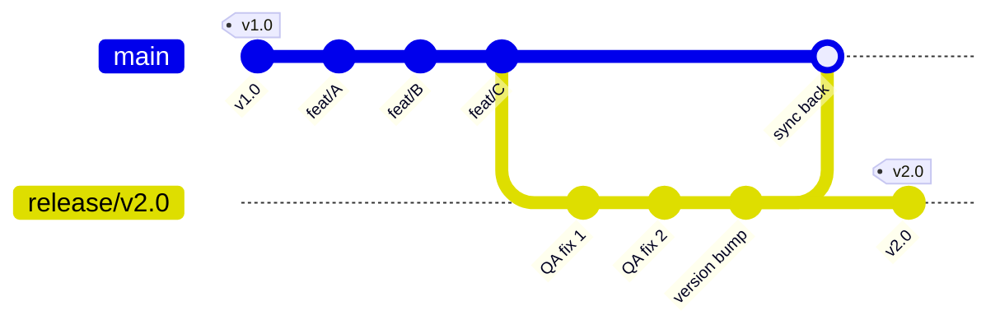

After the release ships:
1. The release branch is **merged back into `main`** to capture any bug fixes made during hardening.
2. The tag `v2.0` is applied to the final commit on the release branch.
3. CI/CD deploys from the **tagged commit on the release branch**.
4. The release branch is then deleted (or kept for reference).

> **Key difference from GitFlow:** The release branch is cut from `main`, not from `develop`. There is no `develop` branch. Features and release hardening both flow through `main` as their ultimate destination.

### Step 3 — Hotfix (Bug in the Current Live Release)

If a critical bug is found in production while the release branch is still active, the fix is applied **on the release branch** and then merged back into `main`.

If the release branch has already been deleted (the release shipped and the team moved on), the hotfix is committed **directly to `main`** (pure TBD style) or on a short-lived hotfix branch from `main`.

#### Hotfix While Release Branch Is Active

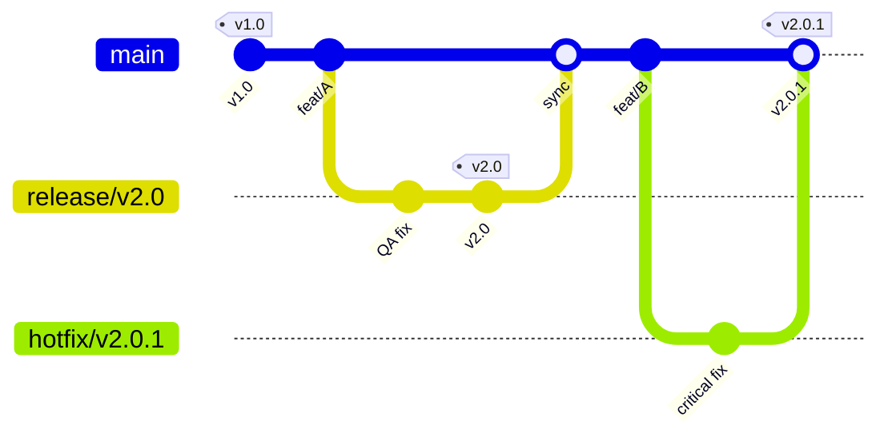

#### Hotfix After Release Branch Is Deleted

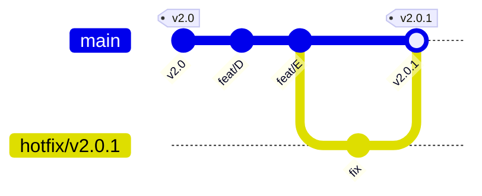

The hotfix branch is cut from the `v2.0` tag (the exact code running in production), not from the tip of `main` (which has new features). The fix is merged into `main` and tagged.

### Step 4 — Old Version Support (Support Branch)

If a client reports a bug in `v1.0` while `main` is at `v3.0`, create a **support branch** from the old tag. This is identical to the GitFlow support branch mechanism.

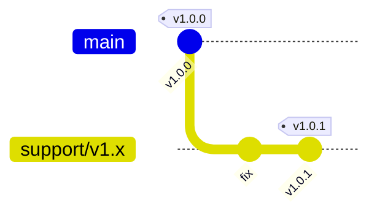

If the bug also affects the current version, cherry-pick the fix into `main`:

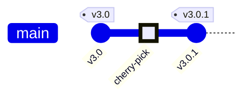

### Full Picture — All Branch Types Across Time

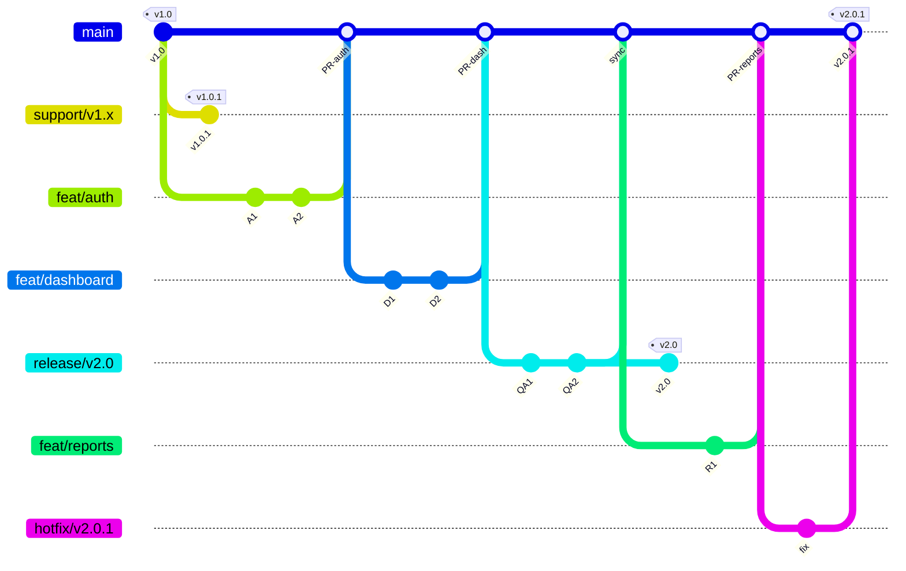

**Reading the diagram:**

1. **Support Branch** (top) — Legacy `v1.0` gets a patch (`v1.0.1`) on its own isolated branch.
2. **Feature Branches → Main** — `feat/auth` and `feat/dashboard` are short-lived branches that merge directly into `main` via PRs. No `develop` branch intermediary.
3. **Release Branch** — When enough features accumulate, `release/v2.0` is cut from `main`. Only QA fixes go here. After hardening, it is tagged and deployed, then merged back into `main`.
4. **Main** — The single trunk. Continues receiving new features (`feat/reports`) even while the release branch is being hardened.
5. **Hotfix Branch** — A critical bug in `v2.0` is fixed on a hotfix branch and merged into `main`.

> **Key takeaway:** Code flows in one direction — from feature branches → `main` → release branch → production. The release branch is a short-lived "snapshot" of `main` that gets stabilized, not a permanent development line.

---

## 6. Release Mechanism

### The Release Workflow

#### Stage 1: Continuous Integration on `main`

Features merge into `main` throughout the sprint via short-lived branches. `main` is always the latest integrated state of the codebase. CI runs on every commit.

#### Stage 2: Cut the Release Branch

When the team decides the current state of `main` has enough features for a release, a release branch is created:

```bash
git checkout -b release/v2.0 main
```

- **Feature Freeze:** From this moment, no new features enter the release branch. `main` continues to receive new feature work for the *next* release.
- **Purpose:** The release branch is a stabilization snapshot — only bug fixes, version bumps, changelog updates, and documentation changes are allowed.

#### Stage 3: Hardening (QA & UAT)

The release branch is deployed to a staging or UAT environment.

- QA engineers perform regression and acceptance testing.
- If bugs are found, they are fixed on short-lived bugfix branches off the release branch (or committed directly if the team prefers).
- Fixes are periodically merged back into `main` so they are not lost.

#### Stage 4: Tag and Deploy

Once the release branch is signed off:

- A **version tag** (e.g., `v2.0.0`) is applied to the final commit on the release branch.
- CI/CD deploys from the **tagged commit on the release branch**.

#### Stage 5: Merge Back into Main

The release branch is merged back into `main`:

```bash
git checkout main && git merge --no-ff release/v2.0
```

This ensures that any bug fixes, version bumps, or changelog edits made during hardening are captured in `main`'s history. Without this merge, those changes would be lost.

#### Stage 6: Cleanup

The release branch is deleted. It served its purpose — a temporary stabilization lane.

### Comparison with Pure TBD and GitFlow Release Mechanics

| Aspect | Pure TBD | TBD + Release Branch | GitFlow |
|---|---|---|---|
| **Release Timing** | Continuous (every commit) | Batched (sprint cadence) | Batched (sprint cadence) |
| **Release Trigger** | Tag on `main` | Cut `release/vX.X` from `main` | Cut `release/vX.X` from `develop` |
| **QA Phase** | None — automated tests only | On the release branch | On the release branch |
| **Deploy Source** | `main` (tagged commit) | Release branch (tagged commit) | `main` (after merge from release) |
| **Branches Active During Release** | 1 (`main`) | 2 (`main` + release branch) | 3+ (`main` + `develop` + release branch) |
| **New Features During QA** | Continue on `main` | Continue on `main` | Continue on `develop` |
| **Hotfixes During QA** | Direct commit on `main` | Fix on release branch | Fix on hotfix branch from `main` |

### When This Mechanism Is Most Effective

- **Mobile Apps:** You cannot "undo" a release once users download it. The hardening phase on the release branch provides a safety net.
- **Regulated Industries:** When you need a documented QA sign-off before each release — the release branch provides a clear audit trail.
- **Sprint-Based Teams:** Teams on a 2-week cadence can cut a release branch on Sprint Day 8, harden for 2 days, and ship on Sprint Day 10.
- **Teams Migrating from GitFlow:** If you want to simplify GitFlow, deleting the `develop` branch and moving to TBD + Release Branch is the lowest-risk step.

---

## 7. Bug Fixes for Old Releases

### Approach 1: Hotfix for the Current Live Version

If the bug is in the version that was just released and the release branch is already deleted:

1. **Branch from the release tag:** `git checkout -b hotfix/v2.0.1 v2.0.0`
2. **Fix:** Apply the code fix and verify it.
3. **Merge into `main`** and tag as `v2.0.1`.
4. **Deploy** from the tagged commit on `main`.

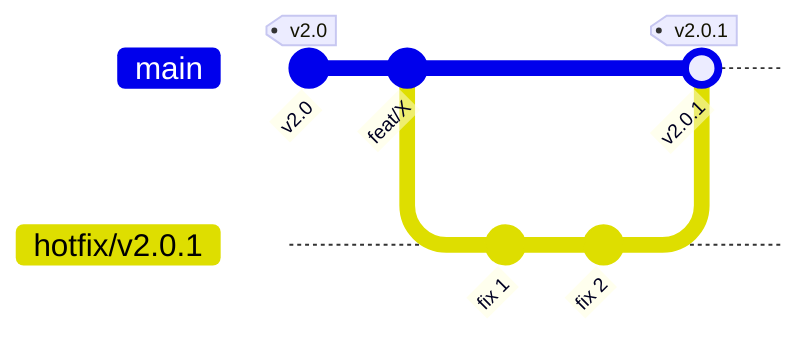

If the release branch is still active (hardening is ongoing), the fix goes on the **release branch** instead — see [Q&A #2](#2-where-do-bug-fix-branches-come-from-during-release-hardening).

### Approach 2: Support Branch for Much Older Versions

If `main` has moved to `v3.0` and a client needs a fix for `v1.0`:

1. **Create a support branch from the old tag:** `git checkout -b support/v1.x v1.0.0`
2. **Fix** the bug on the support branch.
3. **Tag** as `v1.0.1` and deploy from the support branch.
4. **Cherry-pick** the fix into `main` if the bug also exists in the current version.


### Comparison of Fix Strategies

| Scenario | Strategy | Branch From | Merge Into | Deploy From |
|---|---|---|---|---|
| Bug in the current live version (release branch active) | Bugfix on release branch | `release/vX.X` | Release branch + `main` | Release branch |
| Bug in the current live version (release branch deleted) | Hotfix branch | Release tag on `main` | `main` | `main` |
| Bug in a much older version | Support branch | Old version tag | `support/vX.x` only | `support/vX.x` |
| Bug found during QA (not live) | Fix on release branch | `release/vX.X` | Release branch | Not deployed yet |

### Key Maintenance Tips

- **Cherry-Picking:** If a bug exists in both the old and current versions, use `git cherry-pick [commit-hash]` to apply the exact fix without merging unrelated code.
- **Deprecation Policy:** Define how many old versions you support. Maintaining 10 concurrent support branches leads to "Maintenance Exhaustion."
- **Regression Testing:** Always run the full test suite against the patched branch — not just the test for the fix. Patches applied under pressure are the most likely to introduce new issues.

---

## 8. Avoiding Git Conflicts

Because this model uses short-lived branches and a single trunk, conflicts are inherently less frequent than in GitFlow. But they can still happen — especially around the release branch.

### Strategy 1: Keep Branches Short-Lived (The Golden Rule)

The number-one conflict-prevention strategy is the same as pure TBD: **merge early, merge often**.

- **Max branch lifespan:** 24 hours. If a feature takes longer, break it into smaller pieces and merge behind a feature flag.
- **Why:** A branch that lives for 4 hours touches 3 files. A branch that lives for 4 days touches 30 files. The "conflict surface area" grows exponentially.

### Strategy 2: Sync the Release Branch Frequently

The release branch is the most conflict-prone area in this model. While you are hardening `release/v2.0`, new features keep landing on `main`.

- **Merge `main` into the release branch periodically?** — **No.** This defeats the purpose of a stable release branch. You would be pulling in untested features.
- **Merge the release branch into `main` periodically?** — **Yes.** Periodically merge bug fixes from the release branch back into `main`. This prevents a massive "sync back" merge at the end.

```bash
# While release/v2.0 is being hardened
git checkout main && git merge release/v2.0
```

### Strategy 3: Prefer Rebase for Feature Branches

When your short-lived feature branch needs the latest `main` code:

```bash
git pull --rebase origin main
```

This replays your commits on top of the latest `main`, resolving conflicts one commit at a time instead of in a single giant diff.

### Strategy 4: Atomic Commits and Small PRs

- **One logical change per commit.** If a commit does "renamed the function AND changed the config AND fixed a typo," it is doing too much.
- **One concern per PR.** A PR that modifies both the auth module and the payment module is guaranteed to conflict with someone else.

### Strategy 5: Use `.gitattributes` and Pre-commit Hooks

Prevent "false conflicts" caused by formatting differences:

- **`.gitattributes`** to enforce line endings (`LF` or `CRLF`).
- **Pre-commit hooks** (Husky, lint-staged) to auto-format code before it is committed.

### Strategy 6: Draft PRs for Visibility

Open a **Draft Pull Request** as soon as you start a feature branch. Even if the code is not ready, teammates can see which files you are working on. Platforms like GitHub show conflict warnings on PRs in real-time.

### Summary Checklist

| Action | Frequency | Purpose |
|---|---|---|
| Merge feature branches to `main` | Multiple times daily | Keep the trunk current. |
| Rebase feature branches on `main` | Before pushing | Linear history, small conflicts. |
| Merge release branch fixes back to `main` | Every few days | Prevent "big bang" sync at release end. |
| Open Draft PRs | Immediately when starting | File-level conflict visibility. |
| Commits | Hourly | Small, logical "save points." |

---

## 9. Merge vs Rebase — When to Use Which at Every Merge Point

### The Core Principle

| Operation | What It Does | Golden Rule |
|---|---|---|
| **Rebase** | Replays your commits on top of the target branch's latest state. Rewrites commit history. | Use on **private/local** branches only. Never rebase a shared branch. |
| **Merge** | Creates a new "merge commit" that ties two histories together. Preserves both histories. | Use when integrating into a **shared/protected** branch. |

> **The One Rule: Rebase _down_, Merge _up_.**
> Pull changes *down* into your private branch with rebase. Push changes *up* into a shared branch with merge.

---

### Every Merge Point in TBD + Release Branch

#### 1. Keeping Your Feature Branch Updated (↓ main → feature)

- **Use: Rebase**
- **Command:** `git pull --rebase origin main`
- **Why:** Your branch lives for hours. Rebasing replays your few commits on top of the latest `main`, keeping a linear history and surfacing conflicts one commit at a time.

#### 2. Merging a Feature into Main (↑ feature → main)

- **Use: Squash Merge (preferred) or Merge**
- **Command:** Handled via the PR — select **"Squash and Merge"** on GitHub / Azure DevOps.
- **Why:** Squash merge collapses your branch into a single commit on `main`, keeping the trunk history clean and easy to bisect. A regular `--no-ff` merge is acceptable if you want to preserve granular commit history.

#### 3. Cutting a Release Branch from Main

- **Use: Branch (no merge or rebase)**
- **Command:** `git checkout -b release/v2.0 main`
- **Why:** This is a branch creation, not a merge. Just cut the branch and begin the feature freeze.

#### 4. Bug Fixes on the Release Branch (↓ release → main)

- **Use: Merge**
- **Command:** `git checkout main && git merge release/v2.0`
- **Why:** Bug fixes made during hardening must flow back into `main` so they are not lost. A merge commit clearly records the sync point. Do this periodically — not just at the end.

#### 5. Final Release Merge Back into Main (↓ release → main)

- **Use: Merge (No Fast-Forward)**
- **Command:** `git checkout main && git merge --no-ff release/v2.0`
- **Why:** The `--no-ff` merge commit acts as a permanent record of the sync point. This is the final "catch-all" merge that captures any remaining bug fixes, version bumps, or changelog edits.

#### 6. Hotfix Branch into Main (↑ hotfix → main)

- **Use: Merge (No Fast-Forward)**
- **Command:** `git checkout main && git merge --no-ff hotfix/v2.0.1`
- **Why:** You need a visible record that a hotfix was applied. The merge commit serves as the audit trail.

#### 7. Hotfix Backport into an Active Release Branch

- **Use: Cherry-Pick**
- **Command:** `git checkout release/v2.0 && git cherry-pick [commit-hash]`
- **Why:** If a hotfix is applied to `main` while a release branch is active, cherry-pick the specific fix commit into the release branch. A full merge from `main` would pull in new features that should not be in the release.

#### 8. Fix for a Legacy Support Branch

- **Use: Cherry-Pick (not merge, not rebase)**
- **Command:** `git checkout support/v1.x && git cherry-pick [commit-hash]`
- **Why:** The legacy branch and `main` have diverged too far for a merge. Cherry-pick applies only the exact fix commit.

---

### Quick Reference Table

| Merge Point | Direction | Operation | Why |
|---|---|---|---|
| Update feature from main | ↓ into your branch | **Rebase** | Small conflicts, linear history |
| Feature → Main | ↑ into trunk | **Squash Merge** | Clean single-commit history |
| Release → Main (periodic sync) | ↓ backport fixes | **Merge** | Captures hardening fixes |
| Release → Main (final sync) | ↓ final backport | **Merge (`--no-ff`)** | Permanent sync record |
| Hotfix → Main | ↑ into trunk | **Merge (`--no-ff`)** | Visible hotfix record |
| Hotfix → Active Release Branch | ↓ isolated patch | **Cherry-Pick** | Avoids pulling in new features |
| Fix → Legacy Support Branch | ↓ isolated patch | **Cherry-Pick** | Avoids dragging in unrelated code |

---

## 10. Managing Long Framework Version Upgrades

A major framework upgrade (e.g., .NET 6 → 8, Angular 14 → 18) is challenging in any branching model. In TBD + Release Branch, the strategy leverages the strengths of the single-trunk model.

### Pattern 1: Feature Flags + Incremental Migration (Recommended)

This is the most TBD-native approach. Break the upgrade into small, independently mergeable chunks. Each chunk is merged to `main` behind a feature flag.

- **Step 1:** Create a "Migration Epic" and split it into small tasks: upgrade build tools, upgrade core libraries, migrate shared components, update API calls, etc.
- **Step 2:** Each task gets its own short-lived branch. Merge into `main` behind a feature flag so the old code path remains active.
- **Step 3:** Once all tasks are merged and tested, flip the feature flag to enable the new framework.
- **Step 4:** Remove the old code and the feature flag in a cleanup branch.

**Benefits:**
- No long-lived upgrade branch.
- No "big bang" merge.
- The upgrade is continuously integrated and tested.

**Drawback:**
- Requires careful abstraction so old and new code can coexist. Not always feasible for deep framework changes.

### Pattern 2: Branch by Abstraction

Wrap framework-specific features (HTTP clients, auth providers, state management) in your own interfaces. Upgrade the underlying implementation on feature branches while keeping the interface stable.

- **The Strategy:** Create adapter/wrapper services for framework-specific APIs. Swap the implementation behind the adapter without changing any consumer code.
- **The Benefit:** The swap from old to new framework becomes a single-line change per adapter.

### Pattern 3: The "Dual-Track" Upgrade Branch

When the upgrade is too large for incremental migration (e.g., a complete rewrite of the build pipeline):

1. **Create an upgrade branch:** `chore/framework-upgrade`
2. **Merge `main` into the upgrade branch daily.** This is the critical discipline — you absorb new feature code and fix breaking changes as they arrive, rather than facing 1,000 errors on merge day.
3. **The "Big Flip":** Once the upgrade branch is stable, freeze `main` briefly, merge the upgrade in, and have everyone rebase their active feature branches.

> **Key difference from GitFlow:** In GitFlow, you would merge `develop` into the upgrade branch. Here, you merge `main` — and since `main` is the only trunk, the merge surface is identical.

### Pattern 4: The "Strangler Fig" Pattern

For massive rewrites (e.g., monolith to microservices):

- Route a percentage of traffic to the new framework version.
- Gradually migrate features until the old version handles zero traffic.
- Decommission the old version.

### Comparison of Upgrade Strategies

| Strategy | Conflict Risk | Speed | Best For |
|---|---|---|---|
| Feature Flags + Incremental | 🟢 Low | Moderate | Standard upgrades with clear module boundaries |
| Branch by Abstraction | 🟢 Low | Slow | Deep framework API changes |
| Dual-Track (daily merge) | 🟡 Medium | Moderate | Large-scale build/tooling upgrades |
| Strangler Fig | 🟢 Low | Very Slow | Full rewrites, architecture migrations |

---

## 11. Q&A — TBD + Release Branch Scenarios

### 1. What if a feature needs changes right after it was merged into `main`?

Create a **new short-lived branch** from `main` and treat the change as a new piece of work:

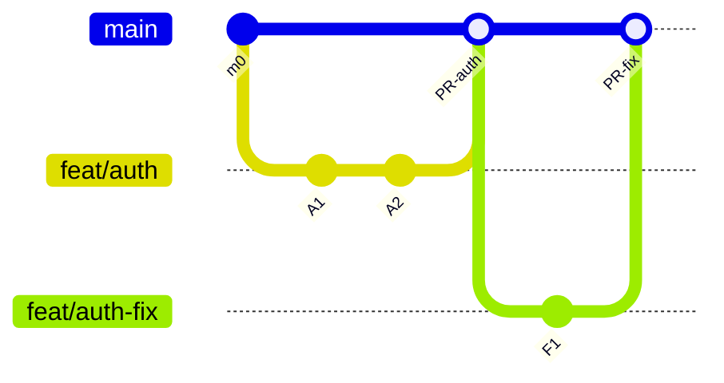

You do **not** reopen or continue the old branch. The old merge commit is already part of `main`'s history. Branch from `main` (which now contains your feature), make the fix, open a new PR, and merge.

If a release branch has already been cut and this feature is part of that release, the fix goes on the **release branch**:

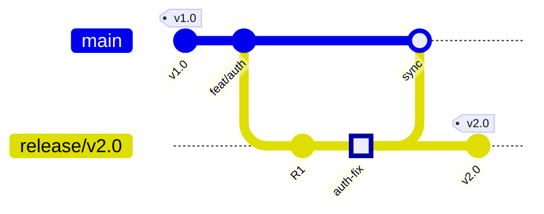

If it has already shipped to production, it becomes a **hotfix** — branch from `main` (or the release tag), fix, merge back to `main`, and tag as a patch release.

---

### 2. Where do bug fix branches come from during release hardening?

Bug fix branches during QA are created **from the release branch** — not from `main`:

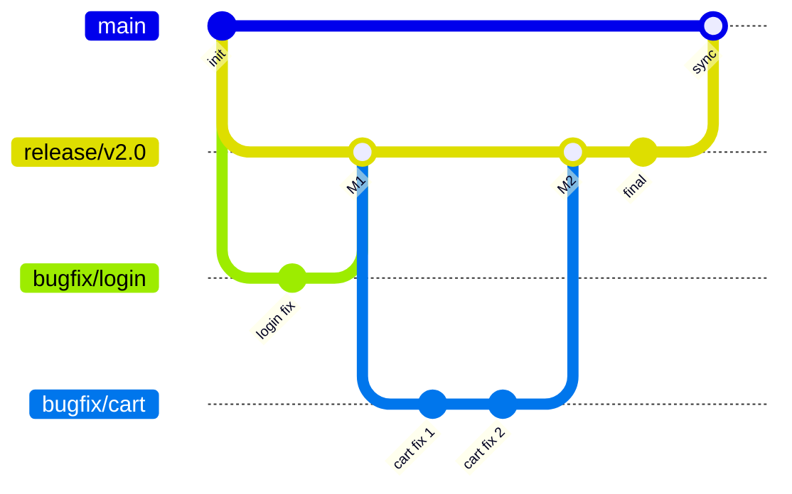

**Key rules:**

- **Branch from:** `release/v2.0`
- **Merge back to:** `release/v2.0` (via PR, with review)
- **Never branch from `main`** for release bugs — `main` already has new features for the next release that should not contaminate the hardening branch.
- **Sync periodically:** Merge `release/v2.0` into `main` so bug fixes are not lost.

---

### 3. How are patch fixes / patch releases maintained?

A **patch release** (e.g., `v2.0.1`) is a targeted fix for a version already in production.

#### Patching the Current Live Version

If `main` has moved ahead with new features since the release:

1. **Branch from the release tag:** `git checkout -b hotfix/v2.0.1 v2.0.0`
2. **Fix, test, review** on the hotfix branch.
3. **Merge into `main`** and tag as `v2.0.1`.

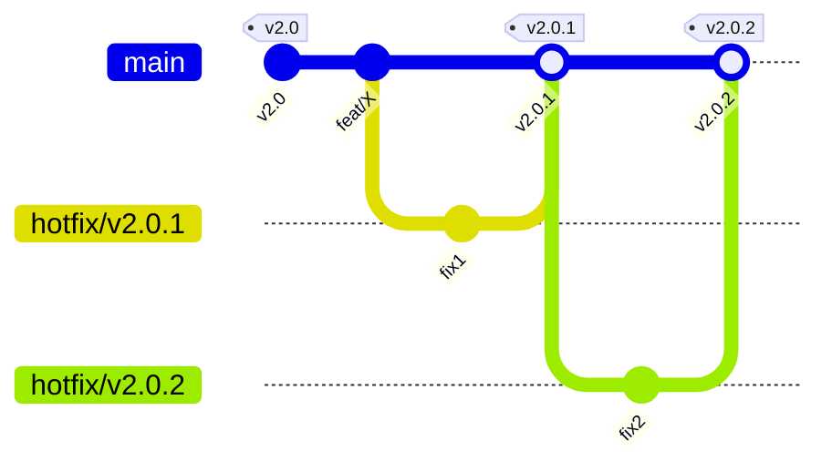

Each patch is an independent, short-lived branch. They can follow one after another — `v2.0.1`, `v2.0.2`, etc.

#### Patching an Older Version

If `main` has moved to `v3.0` but a client runs `v2.0`, use a **support branch**:

1. **Create:** `git checkout -b support/v2.x v2.0.0`
2. **Fix** on the support branch.
3. **Tag** as `v2.0.1` and deploy from the support branch.
4. **Cherry-pick** the fix into `main` if the bug also exists in the current version.

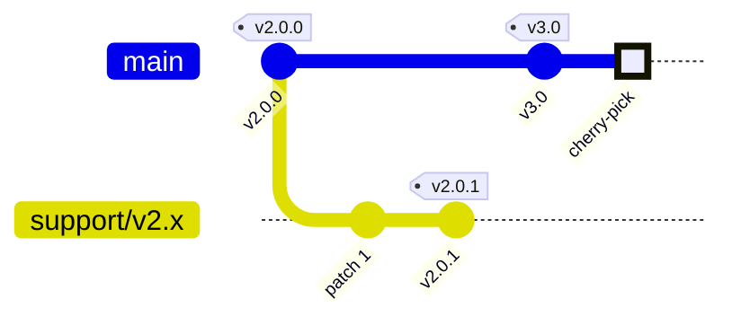

#### Key Rules

- **One patch = one hotfix branch.** Do not bundle unrelated fixes.
- **Always merge back into `main`.** Every hotfix must reach `main` so it is not lost in the next release.
- **Tag immediately.** The tag is the single source of truth for "what is deployed."

---

### 4. Where is a patch release actually deployed from?

The hotfix branch is **never** the deployment source. Deployment always happens from the **receiving branch** after the merge.

#### Current Version Patch → Deployed from `main`

1. `hotfix/v2.0.1` merges into `main`.
2. Tag `v2.0.1` is applied to the merge commit on `main`.
3. CI/CD deploys from the tagged commit on `main`.

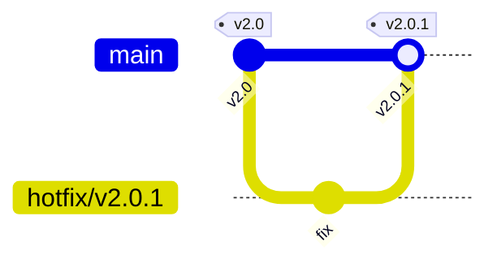

#### Older Version Patch → Deployed from `support/vX.x`

1. `patch/v2.0.1` merges into `support/v2.x`.
2. Tag `v2.0.1` is applied on `support/v2.x`.
3. CI/CD deploys from the tagged commit on `support/v2.x`.

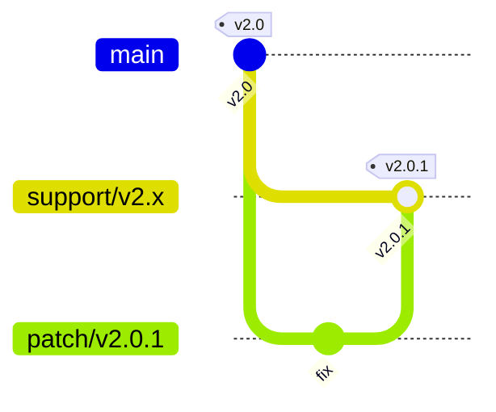

#### Why not deploy from `main` for an older version?

`main` has moved to `v3.0`. It contains code that did not exist in `v2.0`. Deploying from `main` would ship `v3.0` code to a client expecting a `v2.0` patch.

#### Summary

| Scenario | Hotfix merges into | Deployed from | Tag applied on |
|---|---|---|---|
| Bug in the current live version | `main` | `main` | `main` |
| Bug in an older version | `support/vX.x` | `support/vX.x` | `support/vX.x` |

---

### 5. If a release branch passes QA with zero fixes, do we still merge it back into `main`?

**Yes — the merge back into `main` is mandatory regardless of whether any bug fixes were made.**

Even if zero bugs were found, the release branch may still differ from `main`:

1. **Version bumps and changelog updates** were committed on the release branch.
2. **New feature commits landed on `main`** after the release branch was cut. The merge back creates a sync point that ties the two histories together.
3. **Future hotfixes** will be merged into `main`. If the release branch was never merged back, `main`'s history diverges, making future operations messier.

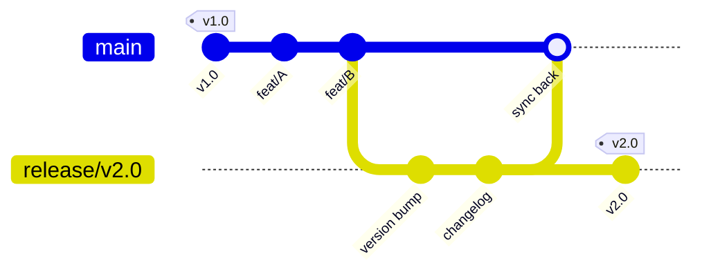

> **Key point:** The merge back into `main` keeps the histories aligned. It happens every time — zero fixes or fifty, it makes no difference to the process.

---

### 6. What is the difference between `release/vX.X` and `hotfix/vX.X.X` branches?

They look similar — both lead to a deployable version — but they serve fundamentally different purposes.

#### At a Glance

| Aspect | `release/v2.0` | `hotfix/v2.0.1` |
|---|---|---|
| **Purpose** | Ship a planned set of features | Fix a critical bug in production |
| **Branches from** | `main` | Release tag (e.g., `v2.0`) or `main` |
| **Contains** | QA hardening fixes + version bumps | A single, surgical fix |
| **Lifespan** | Days to a week (QA cycle) | Hours to a day (emergency) |
| **New features allowed?** | No (feature freeze) | No |
| **Merges into** | `main` (sync back) | `main` |
| **Version bump** | Minor or Major (`v2.0`, `v3.0`) | Patch only (`v2.0.1`) |
| **Trigger** | Planned sprint/release cycle | Unplanned — production incident |

#### Where They Sit in the Timeline

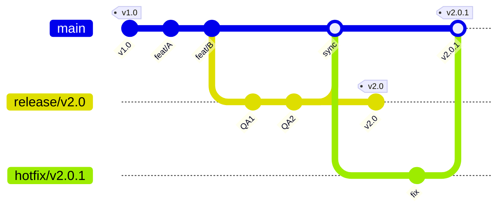

> **Think of it this way:** A release branch is a *planned departure* — you pack your bags, go through security, and board the plane. A hotfix branch is an *emergency landing* — something went wrong mid-flight, and you fix it as fast as possible.

---

### 7. Why is there no `develop` branch?

The `develop` branch in GitFlow exists to serve as a "staging area" between feature branches and `main`. In TBD + Release Branch, **`main` itself serves that purpose**.

#### What `develop` Does in GitFlow vs. How TBD + RB Handles It

| GitFlow `develop` Purpose | TBD + RB Equivalent |
|---|---|
| Integration target for feature branches | `main` — features merge directly into the trunk |
| "What will ship in the next release" | `main` — the release branch is cut from `main` when ready |
| Source for release branches | `main` — release branches are cut from `main` |
| Receives hotfix backports | `main` — hotfixes merge into `main` |
| CI/CD deploys to staging | `main` — CI deploys to staging from `main`; production deploys from the release branch tag |

#### What Would Go Wrong If You Added `develop`?

1. **Double the merge work.** Every feature would merge to `develop`, then `develop` would need to be synced with `main` at release time. This is the exact "syncing nightmare" that makes GitFlow challenging with CI/CD.
2. **Confusion about truth.** With two permanent branches, teams constantly debate which branch represents "the latest code" — the Gemini chat highlights this as "Confusion on what is production-ready."
3. **Slower feedback.** Code merged into `develop` is one step further from production than code merged into `main`. This adds latency to the feedback loop.

#### The Analogy

In GitFlow, `develop` is a "waiting room" where features sit until a release is cut. In TBD + Release Branch, features go directly to the "main hall" (`main`). When it is time to ship, a snapshot is taken (the release branch). The waiting room is unnecessary.

> **Key point:** `main` in TBD + RB does the job of both `main` and `develop` in GitFlow. It is both the integration target and the source for releases. The release branch provides the stabilization gate that `develop` never could — because `develop` is a permanent moving target, while a release branch is a frozen snapshot.

---

### 8. When to do a Major, Minor, or Patch release?

The version number follows **Semantic Versioning (SemVer)**: `MAJOR.MINOR.PATCH` (e.g., `v2.4.1`).

#### The Three Version Bumps

| Version Part | Bumped When | Signal to Consumers | Example |
|---|---|---|---|
| **MAJOR** (`X.0.0`) | **Breaking changes** — APIs, behaviors, or contracts change in non-backward-compatible ways | "You will need to update your code" | `v1.0.0` → `v2.0.0` |
| **MINOR** (`0.X.0`) | **New features** that are backward-compatible | "New capabilities, your existing code still works" | `v2.0.0` → `v2.1.0` |
| **PATCH** (`0.0.X`) | **Bug fixes** without new features or breaking changes | "Something was broken, now it's fixed" | `v2.1.0` → `v2.1.1` |

#### How This Maps to TBD + RB Branches

| Release Type | Branch | Source | Trigger |
|---|---|---|---|
| **Major Release** | `release/v3.0` | Cut from `main` | Breaking changes, major rewrites |
| **Minor Release** | `release/v2.1` | Cut from `main` | New features accumulated over a sprint |
| **Patch Release** | `hotfix/v2.1.1` | Cut from release tag or `main` | Critical bug in production |

#### Decision Flowchart

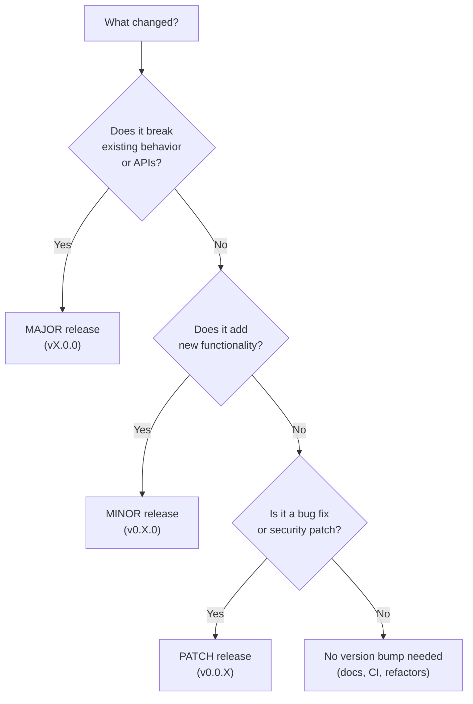

#### Common Mistakes

- **Bumping MAJOR for every release.** If nothing is breaking, it should be MINOR. Overusing MAJOR erodes consumer trust.
- **Shipping new features in a PATCH.** A patch should be safe to apply blindly.
- **Forgetting to bump at all.** Deploying without updating the version makes it impossible to track what is running.

#### Pre-Release Tags

During QA hardening on a release branch:

| Tag | Meaning |
|---|---|
| `v2.1.0-alpha.1` | Early build, active development on the release branch |
| `v2.1.0-beta.1` | Feature-complete, undergoing QA |
| `v2.1.0-rc.1` | Release Candidate — believed final, pending sign-off |
| `v2.1.0` | Stable, production-ready |

---

### 9. Can multiple release branches coexist?

**Yes, but it is uncommon and adds complexity.** In practice, most teams using TBD + Release Branch have at most **two** branches active at the same time:

1. `release/v2.0` — currently being hardened.
2. `release/v2.1` — cut from `main` because the team moved fast and a new batch of features is ready while v2.0 is still in QA.

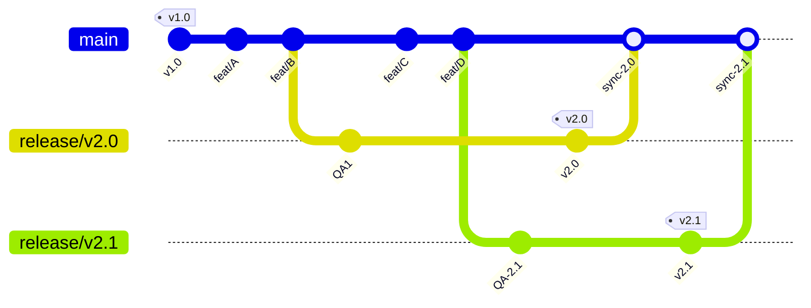

#### Rules for Concurrent Release Branches

- **Each release branch is independent.** Do not merge one release branch into another.
- **Bug fixes:** If a bug exists in both `release/v2.0` and `release/v2.1`, cherry-pick the fix into both branches.
- **Merge back order:** Merge the older release branch into `main` first, then the newer one. This ensures `main` accumulates changes chronologically.
- **Avoid if possible.** Concurrent release branches add complexity. If your QA cycle is short (2–3 days), wait for `v2.0` to ship before cutting `v2.1`.

---

### 10. What happens to `main` while a release branch is being hardened?

**`main` continues to receive new feature work as normal.** This is one of the biggest advantages of TBD + Release Branch over GitFlow.

In GitFlow, cutting a release branch from `develop` means `develop` is partially frozen — the team is split between QA work on the release branch and new feature work on `develop`, and the `develop` branch sometimes gets "stuck" waiting for the release to sync back.

In TBD + Release Branch:

```mermaid
gitGraph
   commit id: "v1.0" tag: "v1.0"
   commit id: "feat/A"
   commit id: "feat/B"
   branch release/v2.0
   commit id: "QA fix 1"
   checkout main
   commit id: "feat/C"
   commit id: "feat/D"
   commit id: "feat/E"
   checkout release/v2.0
   commit id: "QA fix 2"
   commit id: "v2.0" tag: "v2.0"
   checkout main
   merge release/v2.0 id: "sync back"
```

- `main` never stops. Features `C`, `D`, and `E` are merged while the release branch is being hardened.
- The release branch is isolated — it only receives bug fixes. It does **not** receive the new features.
- After the release ships, the release branch is merged back into `main`. Any bug fixes made during hardening are captured. The new features on `main` are untouched.

#### What if a bug fix on the release branch conflicts with a new feature on `main`?

This is the only conflict risk in this model. When the release branch is merged back into `main`, a fix on the release branch may conflict with new code on `main`. The resolution is straightforward:

1. The merge will flag the conflict.
2. The developer resolves it by keeping both the bug fix logic and the new feature logic.
3. This is typically a small, localized conflict because the release branch only contains targeted fixes, not sweeping changes.

> **Key point:** `main` is never blocked by the release process. Development velocity is maintained even during QA hardening. This is the primary advantage over GitFlow, where the `develop` → `release` → `main` pipeline can create bottlenecks.
