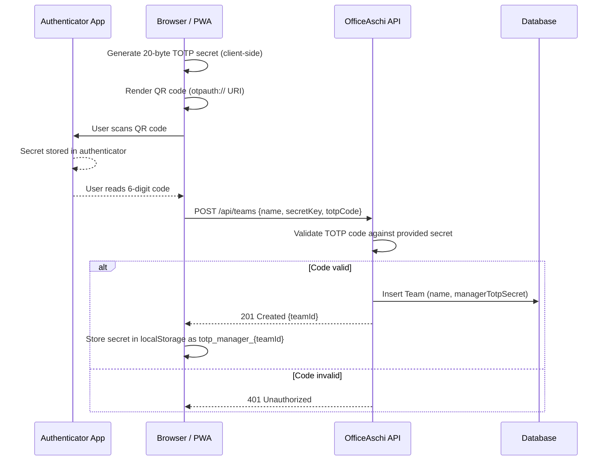
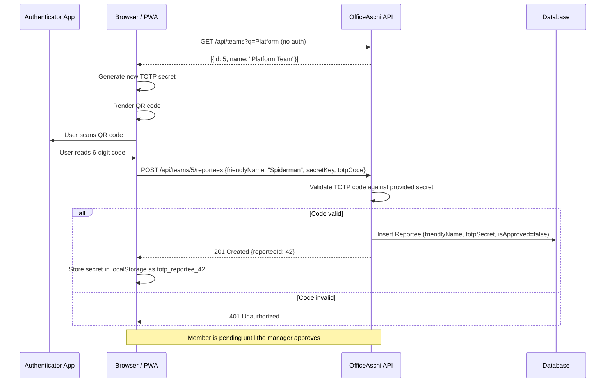
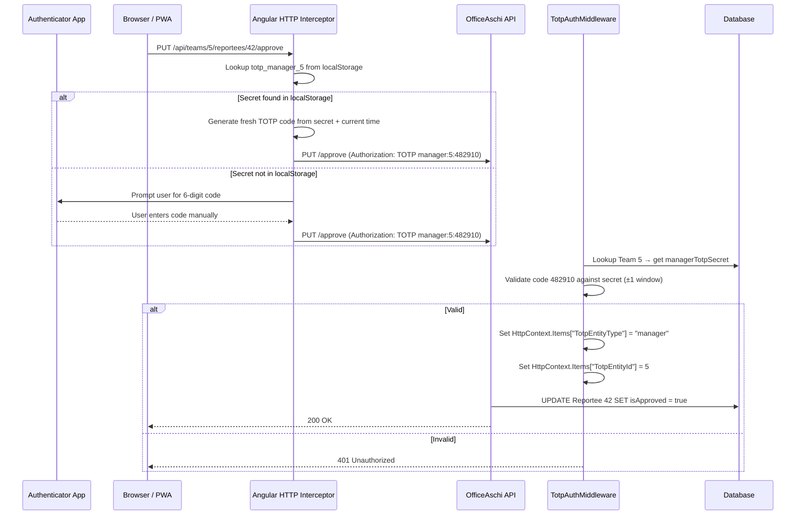
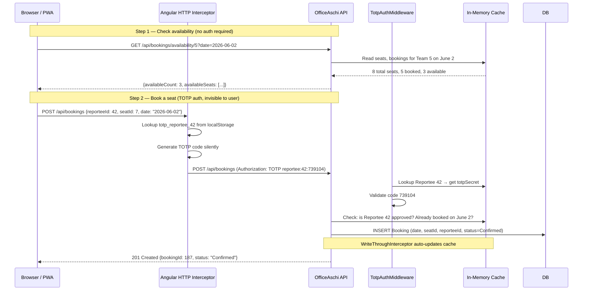
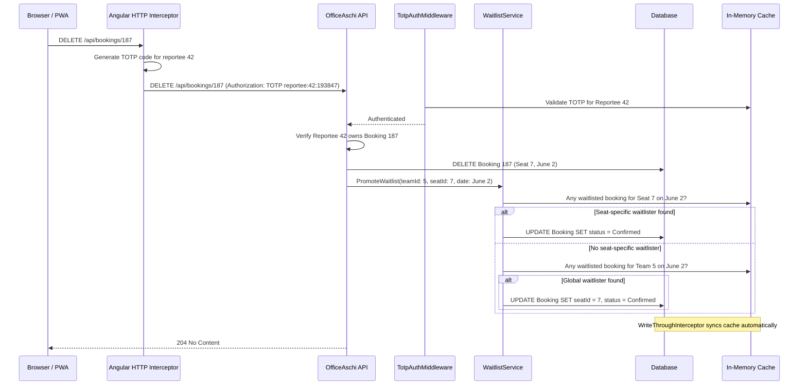
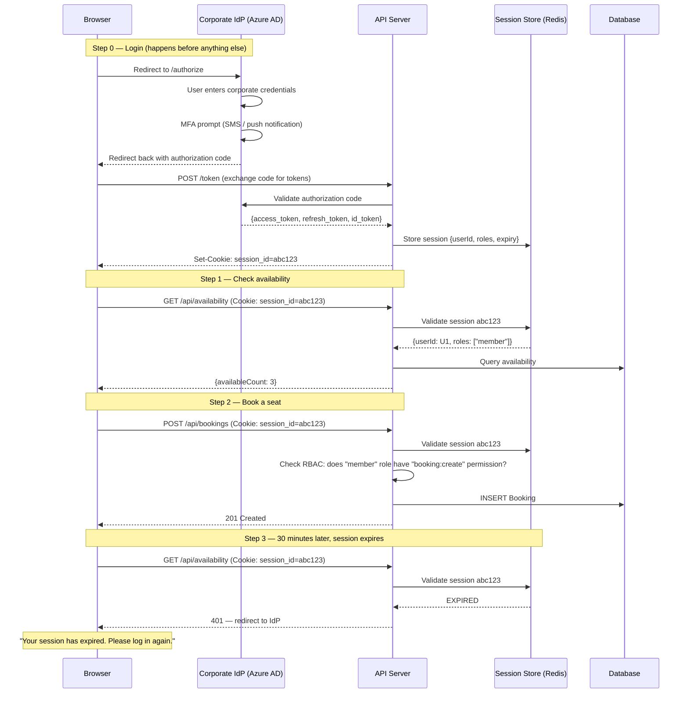

## When the team needed an office seat booking app in days, not months, we threw out the IdP integration, the session store, and the RBAC matrix — and replaced them all with a single TOTP secret per user.

---

## Table of Contents

1. [The Context — Why This App Existed](#1-the-context--why-this-app-existed)
2. [The Authentication Problem](#2-the-authentication-problem)
3. [Why Identity Provider Integration Was Off the Table](#3-why-identity-provider-integration-was-off-the-table)
4. [TOTP as a Primary Identity Mechanism](#4-totp-as-a-primary-identity-mechanism)
5. [The Implementation — How It Actually Works](#5-the-implementation--how-it-actually-works)
6. [Workflow Demo — End-to-End Flows](#6-workflow-demo--end-to-end-flows)
7. [Why Unauthorized Reads Are a Non-Issue](#7-why-unauthorized-reads-are-a-non-issue)
8. [Why RBAC Is Overkill Here](#8-why-rbac-is-overkill-here)
9. [Why Sessions and Token Management Are Overkill](#9-why-sessions-and-token-management-are-overkill)
10. [The User Experience — Seamless and Hassle-Free](#10-the-user-experience--seamless-and-hassle-free)
11. [Trade-offs and Honest Limitations](#11-trade-offs-and-honest-limitations)
12. [Takeaways](#12-takeaways)

---

## 1. The Context — Why This App Existed

The situation was straightforward. Our organization was going through a major office infrastructure move. Teams were transitioning to a new workspace with limited seating — not everyone could come in every day, and the desks that were available needed to be coordinated. People needed a way to say "I'm coming to the office on Thursday" and see who else would be there.

The tool we built — **OfficeAschi** — is a full-stack seat booking system. Teams create shared seat pools, members join, and individuals book desks for specific days. There is a waitlist that automatically promotes people when cancellations happen. Simple enough.

But the critical constraint was **time**. This wasn't a product with a roadmap. It was a utility built to solve a problem that existed *right now*, for a known group of people, for a few months. The office move would complete, permanent desk assignments would happen, and this tool would be retired.

That constraint changed every design decision.

---

## 2. The Authentication Problem

Every web application needs to answer two questions:

1. **Authentication:** *Who are you?*
2. **Authorization:** *What are you allowed to do?*

For most applications, the answer involves an identity provider (Azure AD, Okta, Auth0), OAuth 2.0 flows, JWT tokens, refresh token rotation, session stores, RBAC policies, and a security review that takes longer than the development itself.

For a disposable internal tool with a lifespan of a few months, this is an enormous amount of overhead for the value it delivers. The question is: what is the *minimum viable authentication* that is secure enough for what we are actually protecting?

To answer that, you have to ask: **what are we actually protecting?**

---

## 3. Why Identity Provider Integration Was Off the Table

The natural instinct for an internal enterprise tool is to integrate with the corporate identity provider. SSO, SAML, OIDC — pick your acronym. It gives you verified employee identities out of the box. It is the "correct" approach. And it was completely impractical in our situation.

**The team was already stretched thin.** Most of the engineering organization was consumed by the urgency of the physical office infrastructure move itself. The people who manage IdP configurations, app registrations, and security reviews were the same people coordinating network setups, VPN configurations, and access card provisioning for the new building. Asking them to prioritize an Azure AD app registration and OIDC configuration for a tool that would be decommissioned in three months was not a reasonable ask.

**The integration itself is non-trivial.** Even when the IdP team is available, registering an application, configuring redirect URIs, handling token refresh, managing CORS for the token endpoint, dealing with consent flows, and testing the entire flow across browsers and the mobile PWA takes days of back-and-forth. For a permanent product, that investment pays off. For a tool with a known expiry date, it is pure overhead.

**The approval process has its own timeline.** Enterprise IdP integrations come with security reviews, data classification assessments, and compliance sign-offs. These processes exist for good reasons, but they operate on their own schedule — one that does not accommodate "we need this by Friday."

**IdP integration would force the app behind a VPN.** The moment you wire up a corporate identity provider, the application is handling enterprise identity tokens — OAuth access tokens, ID tokens with employee email addresses and group memberships. That is enterprise data flowing through the system, and security policy would rightly demand that any application handling such data be accessible only from within the corporate network or behind a VPN. This directly undermines the tool's core purpose. People need to check seat availability and book desks from their personal phones on the commute, from home Wi-Fi while planning their week, from anywhere — not just from a managed device on a corporate network. Locking the app behind a VPN turns a 5-second interaction into a "connect to VPN, wait, authenticate, navigate back to what you were doing" ordeal. The hassle-free UX that makes adoption effortless would be gone.

**A person's real identity is not even needed.** In this system, identity only matters within the scope of a single team — your teammates need to know who booked which desk, and that is it. A nickname, a funny alias, any friendly identifier that your team recognizes is perfectly sufficient. There is no reason to pull in a verified corporate email address or employee ID when "Hari from Platform" or "Spiderman" works just as well. The TOTP approach naturally supports this — when a member joins a team, they provide a `friendlyName`, not a verified identity. The system never needs to know *who you really are*, only that you are the same person who set up that TOTP secret. This further eliminates the need for an IdP: you do not need to prove you are `hari.har@corp.example.com` to book desk 4B on Thursday.

The pragmatic choice was to find an authentication mechanism that:
- Required zero external dependencies
- Needed no infrastructure beyond the application itself
- Could be set up by end users in under a minute
- Was secure enough for the sensitivity level of the data being protected

TOTP checked every box.

---

## 4. TOTP as a Primary Identity Mechanism

TOTP (Time-based One-Time Password) is almost universally used as a **second** factor — the 6-digit code you enter *after* your password. The insight in this design is that there is nothing inherent in the TOTP protocol that limits it to being a second factor. It is simply a mechanism that proves you possess a specific secret. If the secret *is* your identity, then TOTP *is* your authentication.

Here is how it works in OfficeAschi:

- There are **no usernames**. There are **no passwords**. There is **no user table**.
- When a manager creates a team, they generate a TOTP secret (client-side), scan it into their authenticator app (Google Authenticator, Authy, etc.), and prove they can produce a valid code. The server stores the secret.
- When a team member joins, they do the same: generate a secret, scan the QR code, verify a code. Their secret is stored against their membership record.
- Every subsequent action that requires identity (booking a seat, approving a member, cancelling a booking) requires a fresh TOTP code in the request header.

The TOTP secret **is** the credential. The authenticator app **is** the identity store. There is no separate identity layer to manage, no password to forget, no session to expire, no token to refresh.

```
Authorization: TOTP reportee:42:839271
              ──── ──────── ── ──────
              scheme  type   id  code
```

Every request is independently verified. The server looks up the secret for entity `42`, computes the expected TOTP code for the current 30-second window (with ±1 window tolerance for clock skew), and either accepts or rejects the request. No state is carried between requests.

---

## 5. The Implementation — How It Actually Works

### Secret Generation — Client-Side Only

The server never generates secrets. The Angular frontend uses the `otpauth` library to produce a 20-byte Base32 secret:

```typescript
// ClientApp/src/app/totp/totp.service.ts
generateSecret(): string {
  const secret = new OTPAuth.Secret({ size: 20 });
  return secret.base32;
}
```

This is displayed as a QR code (`otpauth://` URI) for the user to scan with any standard authenticator app. The user then enters the 6-digit code to prove their app is configured correctly. The secret and verification code are sent together in the registration request.

### Server-Side Validation

The server validates TOTP codes using Otp.NET with standard RFC 6238 parameters — 30-second step, 6 digits, and a ±1 window for clock tolerance:

```csharp
// Services/TotpService.cs
public bool ValidateTotp(string base32Secret, string totpCode)
{
    var secretBytes = Base32Encoding.ToBytes(base32Secret);
    var totp = new Totp(secretBytes, step: 30, totpSize: 6);
    return totp.VerifyTotp(totpCode, out _,
        new VerificationWindow(previous: 1, future: 1));
}
```

There is no session created after validation. No JWT issued. No cookie set. The code is verified, the action is performed, and the request ends.

### The Middleware

A custom `TotpAuthMiddleware` intercepts requests to endpoints decorated with a `[TotpAuth]` attribute:

1. Parse the `Authorization` header: `TOTP {type}:{id}:{code}`
2. Look up the corresponding secret from the database (manager secret from the `Teams` table, reportee secret from the `Reportees` table)
3. Validate the code via `TotpService.ValidateTotp`
4. On success, stash the entity type and ID in `HttpContext.Items` for the controller to use
5. On failure, return `401 Unauthorized`

Controllers then use those stashed values to check that the authenticated entity actually has permission for the specific action — for example, that the manager approving a member is the manager of *that* team.

### The Interceptor — Seamless Client-Side Auth

This is where the user experience becomes invisible. An Angular HTTP interceptor automatically attaches TOTP codes to outgoing requests:

```typescript
// ClientApp/src/app/totp/totp.interceptor.ts
export const totpInterceptor: HttpInterceptorFn = (req, next) => {
  // 1. Check if this request needs TOTP auth (via HttpContext tokens)
  // 2. Look up the secret from localStorage
  // 3. If found: generate a fresh code silently, attach the header
  // 4. If not found: prompt the user to enter a code manually
  // ...
};
```

If the user's TOTP secret is stored in `localStorage` (which it is, after setup), the interceptor generates a fresh 6-digit code using the same `otpauth` library and attaches it to the `Authorization` header. **The user never sees this happen.** From their perspective, they click "Book Seat" and it just works. There is no login screen, no "enter your code" prompt, no authentication ceremony of any kind during normal use.

If the secret is *not* in `localStorage` (new device, cleared storage), a dialog prompts them to enter a code from their authenticator app manually. This is the fallback, not the primary flow.

---

## 6. Workflow Demo — End-to-End Flows

The diagrams below trace the full lifecycle of the system — from team creation to daily seat booking — showing exactly where TOTP enters (and where it does not).

### Manager Creates a Team

The manager's TOTP secret is born entirely on the client. The server never generates it — it only receives and stores it after the manager proves they can produce a valid code.



Notice that no session or token is returned in the `201` response. The secret in `localStorage` *is* the credential going forward.

### Member Joins a Team

The same pattern repeats: the member generates their own independent secret, proves it, and the server stores it. Each member has a distinct TOTP secret — there is no shared team credential.



The `friendlyName` can be anything — a nickname, a joke, whatever the team recognizes. No corporate identity required.

### Manager Approves a Member

This is the first flow where the TOTP middleware activates. The manager's stored secret is used silently by the HTTP interceptor.



The key observation: in the happy path (secret in `localStorage`), the user clicks one button. There is no login, no prompt, no delay. The interceptor silently handles everything.

### Booking a Seat — The Daily Workflow

This is the flow that happens most frequently. A member checks availability (no auth), then books a seat (TOTP auth, invisible).



From the user's perspective, this entire sequence is: open app, see 3 seats available, tap "Book", done. Two taps. Zero authentication prompts.

### Cancellation and Waitlist Promotion

When a booking is cancelled, the system automatically promotes the next person on the waitlist — demonstrating the write-through cache and the stateless auth working together.



### Contrast — What the Same Booking Would Look Like with Traditional Auth

For comparison, here is the same "book a seat" action in a system using an IdP with OAuth 2.0 and session-based auth:



The difference is stark. The OfficeAschi flow has **zero redirects, zero prompts, and zero expiry interruptions** during normal use. The traditional flow adds an IdP redirect, an MFA prompt, a session store dependency, and periodic "session expired" interruptions — all to protect data that could be written on a whiteboard.

---

## 7. Why Unauthorized Reads Are a Non-Issue

Most authentication systems exist to protect *confidential* data. Medical records, financial transactions, personal communications — information that should only be visible to authorized parties.

The data in OfficeAschi is fundamentally different. The information stored is:

- Which teams exist
- Which seats are available
- Who has booked which desk on which day
- Who is on the waitlist

This is **broadcast information by design**. The entire point of the application is to make this data visible. A person checks the app to see: "Is Sarah coming to the office on Wednesday? Are there seats left on Thursday?" The data exists to be read by anyone in the organization.

Restricting read access would actually *defeat the purpose of the tool*. If you can't see whether desks are available without authenticating, you can't make an informed decision about when to come in.

This is why every GET endpoint in OfficeAschi is **completely unauthenticated**:

| Endpoint | Method | Auth Required |
|---|---|---|
| `GET /api/teams` | Search/list teams | None |
| `GET /api/teams/{id}` | Team details | None |
| `GET /api/teams/{teamId}/seats` | List seats | None |
| `GET /api/teams/{teamId}/reportees` | List members | None |
| `GET /api/bookings/availability/{teamId}?date=` | Day availability | None |
| `GET /api/Seats?date=` | All seats with occupancy | None |
| `POST /api/bookings` | Book a seat | **TOTP** |
| `DELETE /api/bookings/{id}` | Cancel a booking | **TOTP** |
| `PUT /api/.../approve` | Approve a member | **TOTP** |
| `DELETE /api/teams/{id}` | Delete a team | **TOTP** |

Authentication is required only for **write operations** — actions that change state on behalf of a specific person. You need to prove you are the person booking the seat, not the person looking at the schedule.

This is a critical architectural insight: **the sensitivity of the data determines the level of authentication required, not the existence of the data.** "Who is sitting where on Tuesday" is not sensitive information in a workplace context. It is the kind of thing that would be written on a whiteboard in the break room. Protecting it behind an IdP integration would be security theater — adding friction for users while protecting nothing of value.

---

## 8. Why RBAC Is Overkill Here

Role-Based Access Control is a powerful model. You define roles (Admin, Manager, Editor, Viewer), assign permissions to roles, assign roles to users, and the system enforces what each user can do. For a complex enterprise application with dozens of resource types and nuanced permission boundaries, RBAC is essential.

OfficeAschi has exactly **two** meaningful permission levels:

1. **Manager (Team Owner):** Can add/remove seats, approve/deny member requests, delete the team
2. **Reportee (Member):** Can book and cancel their own seats

That is it. There is no admin role. There is no viewer role (everyone can view, unauthenticated). There is no concept of a member who can book but not cancel, or a manager who can approve members but not delete seats. The permission model is flat and binary.

In a system this simple, RBAC introduces complexity with no benefit:

- A **role table** in the database storing two rows ("manager", "reportee")
- A **user-role mapping** table
- An **authorization policy** framework with role checks on every endpoint
- The cognitive overhead of "which role do I need for this action?"

Instead, OfficeAschi embeds the permission model directly in the TOTP scheme. The `Authorization` header declares the entity type:

- `TOTP manager:{teamId}:{code}` — I am proving I am the manager of this team
- `TOTP reportee:{reporteeId}:{code}` — I am proving I am this specific team member

The controller then does a simple check: "Is this the manager of the team being modified?" or "Is this the reportee who owns this booking?" No role resolution. No permission matrix. No policy engine. Just a direct identity-to-action mapping.

This works because the permission model is not just simple — it is **inherently scoped**. A manager's authority is limited to their own team. A reportee's authority is limited to their own bookings. There is no cross-team permission, no delegation, no inheritance. The "role" is the relationship itself (manager-of-team, member-of-team), and the TOTP secret proves that relationship.

For a system with this shape, RBAC would be like using a CNC machine to cut a piece of paper. It can do it. It is an impressive tool. But scissors are faster, cheaper, and entirely sufficient.

---

## 9. Why Sessions and Token Management Are Overkill

The conventional web authentication flow looks like this:

1. User authenticates (password, SSO, etc.)
2. Server issues a session token (or JWT)
3. Token is stored client-side (cookie, localStorage)
4. Token is sent with every request
5. Server validates the token, extracts the user identity
6. Token expires after some duration
7. Refresh token is used to obtain a new access token
8. Server maintains a session store (or token blacklist for JWTs)
9. Logout invalidates the session/token

This flow exists to solve a specific problem: **authentication is expensive** (password hashing, IdP round-trips), so you do it once and then carry a lightweight proof of that authentication across subsequent requests.

OfficeAschi does not have this problem. TOTP validation is **computationally trivial** — it is a single HMAC-SHA1 computation followed by a comparison. There is no password to hash (bcrypt at 10 rounds takes ~100ms). There is no IdP round-trip (network latency). There is no database lookup for a session record (the TOTP secret is already in an in-memory cache). The entire validation takes microseconds.

When authentication is this cheap, there is no reason to cache its result in a session. Every request can be independently authenticated at negligible cost. This gives you a fully **stateless** authentication model with significant architectural benefits:

**No session store.** No Redis instance, no database table, no in-memory dictionary mapping session IDs to user identities. One fewer infrastructure dependency. One fewer thing to fail, scale, or secure.

**No token expiry logic.** JWTs need expiry times, refresh tokens, and the entire dance of token rotation. TOTP codes expire naturally every 30 seconds by design — it is built into the protocol. You get time-bounded authentication for free.

**No logout endpoint.** There is no session to invalidate. If a user wants to "log out" on a device, they delete the secret from `localStorage`. If they want to revoke access entirely, the manager removes them from the team, which deletes their TOTP secret from the database. Any future code they generate is useless because the server no longer has a matching secret.

**No CSRF vulnerability.** CSRF attacks exploit the fact that browsers automatically attach cookies (including session cookies) to requests. OfficeAschi uses a custom `Authorization` header, not cookies. Browsers do not automatically attach custom headers, so CSRF is structurally impossible.

**Horizontal scaling is trivial.** With session-based auth, you need sticky sessions or a shared session store so that any server instance can validate any user's session. With stateless TOTP validation, any server instance with access to the database (or the in-memory cache) can independently validate any request. There is no affinity requirement.

The trade-off is that the client needs to either store the TOTP secret locally or prompt the user for a code on every action. OfficeAschi solves this by storing the secret in `localStorage` and having the HTTP interceptor generate codes silently. The user pays the "authentication cost" once (scanning the QR code during setup) and never again.

---

## 10. The User Experience — Seamless and Hassle-Free

The proof of any authentication design is in the user experience. A system can be architecturally elegant and still be painful to use. Here is what the OfficeAschi flow actually feels like from the user's perspective:

### First-Time Setup (Once, Takes 60 Seconds)

1. Open the app
2. Search for your team (or create one)
3. Click "Join Team"
4. The app shows a QR code
5. Scan it with Google Authenticator (or any TOTP app)
6. Enter the 6-digit code to verify
7. Done

That is the entire onboarding. No account creation form. No email verification. No password policy ("must contain uppercase, lowercase, number, special character, and a haiku"). No "verify your email" step. No "set up your profile." Scan, verify, done.

### Daily Use (Invisible Auth)

After setup, the TOTP secret lives in `localStorage`. The HTTP interceptor generates fresh codes on every request. From the user's perspective:

1. Open the app
2. See available seats
3. Click "Book"
4. Seat is booked

There is no login screen. There is no "session expired, please log in again." There is no "your token has been refreshed." The authentication is completely invisible. The user clicks a button, the interceptor silently computes a 6-digit code from the stored secret and the current time, attaches it to the request, and the server validates it. The user never knows authentication happened.

### Device Transfer

If someone switches phones or clears their browser, they still have the authenticator app with the secret. The app detects the missing `localStorage` entry and shows a one-time prompt: "Enter the code from your authenticator app." They enter it, the secret is re-stored, and invisible auth resumes.

### Comparison to Traditional Auth

| Aspect | Traditional (IdP + Sessions) | OfficeAschi (TOTP-Primary) |
|---|---|---|
| Onboarding | Register, verify email, set password, configure MFA, maybe IdP consent | Scan QR code, enter one code |
| Daily login | Enter credentials (or SSO redirect), wait for token | None (invisible) |
| Session expiry | "Your session has expired" interruption | Never happens |
| Password reset | Email flow, security questions, waiting | Not applicable |
| Forgot credentials | IT helpdesk ticket | Re-enter code from authenticator app |
| Logout required? | Yes (security hygiene) | No (no session to persist) |

For a tool that people check once or twice a day to book a desk, the difference between "open app and click book" versus "open app, get redirected to SSO, wait for redirect back, click book" is the difference between adoption and abandonment.

---

## 11. Trade-offs and Honest Limitations

This design is not universally applicable. It works for OfficeAschi because of specific contextual factors. Here is where it would break down:

**Sensitive data.** If the data were confidential (salary information, medical records, personal communications), unauthenticated reads would be unacceptable. TOTP-primary auth would still need to be supplemented with read-level access control.

**Long-lived systems.** For a system running for years, the lack of centralized identity management becomes a liability. You cannot audit who has access without querying every team's member list. You cannot enforce organization-wide policies (like revoking access when someone leaves the company) without manual intervention on every team.

**Secret compromise.** If someone's TOTP secret is stolen (e.g., `localStorage` on a shared computer, screenshot of the QR code), the attacker has full access to that identity. There is no second factor, no password, no email verification to fall back on. The mitigation is that the manager can remove the compromised member and they can re-join with a new secret — but detection depends on the user noticing unauthorized bookings.

**No central audit trail of identity.** There is no "User X performed Action Y at Time Z" in the traditional sense. There is "Reportee ID 42 cancelled booking 187," but Reportee 42 is just a friendly name and a TOTP secret — not a verified corporate identity. For compliance-heavy environments, this is insufficient.

**Authenticator app dependency.** Every user needs a TOTP authenticator app on their phone. For a tech-savvy team, this is a non-issue. For a workforce that includes people who have never installed an app, it introduces friction.

These are real limitations. They are also **irrelevant** for OfficeAschi's specific context: a short-lived internal tool, for a known group of tech workers, protecting low-sensitivity broadcast data, with a hard expiry date. The design fits the problem. Applying it to a different problem would require re-evaluating every one of these trade-offs.

---

## 12. Takeaways

The architecture of OfficeAschi is not a pattern to blindly replicate. It is a case study in **matching the authentication investment to the actual sensitivity and lifespan of the system**. The core principles:

- **Authenticate writes, not reads**, when the data is inherently public. If the information is meant to be broadcast, protecting it behind a login wall adds friction without adding security.

- **TOTP is not just a second factor.** It is a general-purpose mechanism for proving possession of a secret. When the system's identity model is simple enough, TOTP alone can serve as the primary authentication scheme.

- **Sessions exist to amortize expensive authentication.** When authentication is computationally trivial (a single HMAC computation), there is no cost to amortize. Stateless per-request validation is simpler, more scalable, and eliminates entire categories of vulnerabilities (CSRF, session fixation, token theft).

- **RBAC is a tool, not a requirement.** When your permission model has two levels and no cross-cutting concerns, a direct identity-to-action check is clearer and simpler than a role-permission matrix.

- **The best architecture is the one that ships.** A theoretically superior design that takes three months to integrate with the IdP, pass security review, and handle edge cases delivers zero value to the team that needs to book desks *this week*. Engineering is about trade-offs, and time-to-value is a legitimate factor in the trade-off analysis.

- **Design for the lifespan.** A system meant to run for three months has different architectural requirements than one meant to run for three years. Over-engineering a disposable tool is waste. Under-engineering a permanent platform is debt. The skill is in reading the context correctly.

| Design Decision | Traditional Approach | OfficeAschi Approach | Why |
|---|---|---|---|
| Identity | IdP (Azure AD, Okta) | TOTP secret per user | No IdP team availability, no infra needed |
| Authentication | OAuth 2.0 / OIDC | TOTP code per request | Zero external dependencies |
| Session | JWT + refresh tokens | None (stateless) | TOTP validation is cheap enough to repeat |
| Authorization | RBAC with role/permission tables | Entity-type check in header | Only two permission levels exist |
| Read access | Authenticated | Unauthenticated | Data is meant to be broadcast |
| Password reset | Email flow + IT helpdesk | Re-enter code from authenticator | No password exists to reset |
| Revocation | Disable account in IdP | Manager removes member | Secret is deleted from DB |

OfficeAschi is not a model for how to build authentication in general. It is a model for how to think about authentication *in context* — to ask "what am I actually protecting, for how long, and at what cost?" before reaching for the enterprise playbook.
